# 设计模式概述


如果把修习软件开发当做武功修炼的话，那么可以分为招式和内功。  
## 招式
* Java、C#、C++、Golang、Rust等编程语言；
* Eclipse、Visual Studio、Goland、Vim等开发工具；
* Struts、Hibernate、JBPM、Gin、Istio、gRPC等框架技术；

## 内功
* 数据结构
* 算法
* 设计模式
* 架构设计
* 软件工程

> 注意：招式可以很快学会，但是内功的修炼需要更长的时间

软件设计模式(Design Pattern)是一套被反复使用、多数人知晓的、经过分类编目的、代码设计经验的总结，使用设计模式是为了可重用代码、让代码更容易被他人理解并且保证代码可靠性。

## 软件设计模式的种类
GoF提出的设计模式有23个，包括    
1. 创建型(Creational)模式：如何创建对象；
2. 结构型(Structural )模式：如何实现类或对象的组合；
3. 行为型(Behavioral)模式：类或对象怎样交互以及怎样分配职责。

有一个“简单工厂模式”不属于GoF 23种设计模式，但大部分的设计模式书籍都会对它进行专门的介绍。  
> 设计模式目前种类： GoF的23种   + “简单工厂模式” = 24种。  


## 软件设计模式的作用
那么对于初学者来说，学习设计模式将有助于更加深入地理解面向对象思想, 让你知道：  
1. 如何将代码分散在几个不同的类中？
2. 为什么要有“接口”？
3. 何谓针对抽象编程？
4. 何时不应该使用继承？
5. 如何不修改源代码增加新功能？
6. 更好地阅读和理解现有类库与其他系统中的源代码。  

学习设计模式会让你早点脱离面向对象编程的“菜鸟期”。  

## 如何学好设计模式  
设计模式的基础是：多态。  
初学者：积累案例，不要盲目的背类图。  
初级开发人员：多思考，多梳理，归纳总结，尊重事物的认知规律，注意临界点的突破，不要浮躁。  
中级开发人员：合适的开发环境，寻找合适的设计模式来解决问题。  
多应用，对经典则组合设计模式的大量，自由的运用。要不断的追求。  

## 设计模式总览表
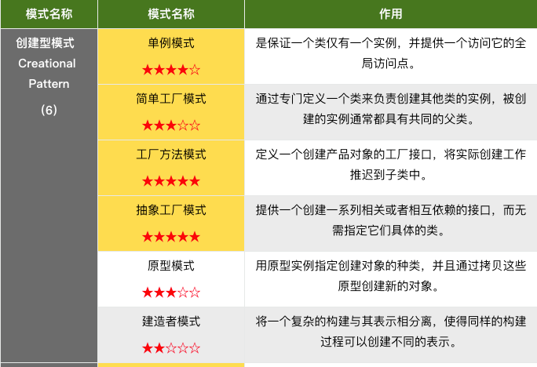
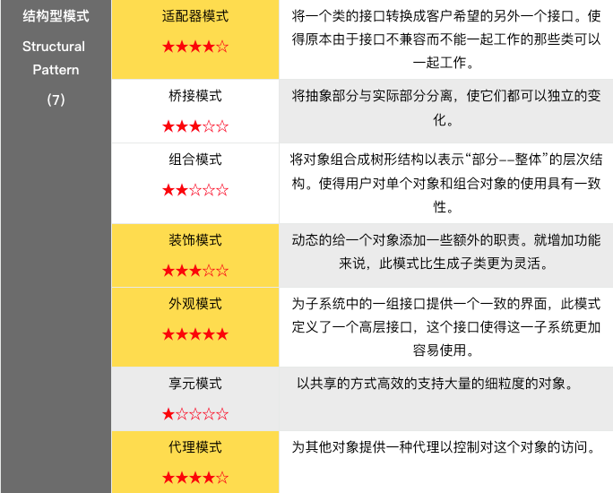


# 面向对象设计原则
对于面向对象软件系统的设计而言，在支持可维护性的同时，提高系统的可复用性是一个至关重要的问题，如何同时提高一个软件系统的可维护性和可复用性是面向对象
设计需要解决的核心问题之一。在面向对象设计中，可维护性的复用是以设计原则为基础的。每一个原则都蕴含一些面向对象设计的思想，可以从不同的角度提升一个软
件结构的设计水平。


面向对象设计原则为支持可维护性复用而诞生，这些原则蕴含在很多设计模式中，它们是从许多设计方案中总结出的指导性原则。面向对象设计原则也是我们用于评价一
个设计模式的使用效果的重要指标之一。

> 原则的目的： 高内聚，低耦合  

## 面向对象设计原则表
|名称|                  定义                  |
|:---:|:------------------------------------:|
|单一职责原则|类的职责单一，对外只提供一种功能，而引起类变化的原因都应该只有一个。|
|开闭原则|类的改动是通过增加代码进行的，而不是修改源代码。|
|里氏代换原则|任何抽象类（interface接口）出现的地方都可以用他的实现类进行替换，实际就是虚拟机制，语言级别实现面向对象功能。|
|依赖倒转原则|依赖于抽象(接口)，不要依赖具体的实现(类)，也就是针对接口编程。|
|接口隔离原则|不应该强迫用户的程序依赖他们不需要的接口方法。一个接口应该只提供一种对外功能，不应该把所有操作都封装到一个接口中去。|
|合成复用原则|如果使用继承，会导致父类的任何变换都可能影响到子类的行为。如果使用对象组合，就降低了这种依赖关系。对于继承和组合，优先使用组合。|
|迪米特法则|一个对象应当对其他对象尽可能少的了解，从而降低各个对象之间的耦合，提高系统的可维护性。例如在一个程序中，各个模块之间相互调用时，通常会提供一个统一的接口来实现。这样其他模块不需要了解另外一个模块的内部实现细节，这样当一个模块内部的实现发生改变时，不会影响其他模块的使用。（黑盒原理）|

# 创建型模式
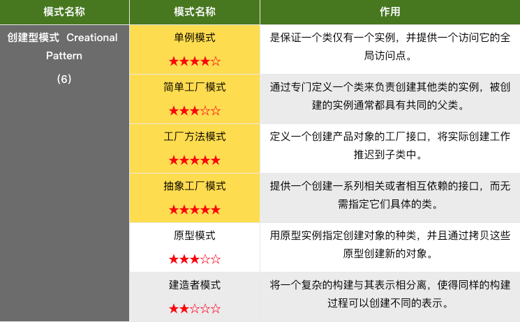
## 简单工厂模式
业务逻辑层只会和工厂模块进行依赖，这样业务逻辑层将不再关心Fruit类是具体怎么创建基础对象的。  
工厂类和产品类 是 1:N的关系


标准的设计模式类图如下  
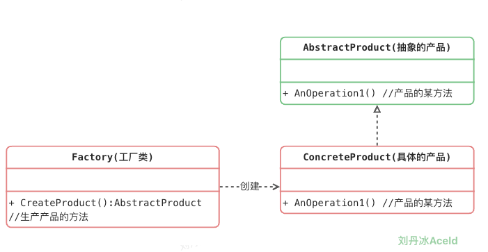

### 简单工厂方法模式的优缺点
优点：
1. 实现了对象创建和使用的分离。
2. 不需要记住具体类名，记住参数即可，减少使用者记忆量。

缺点：
1. 对工厂类职责过重，一旦不能工作，系统受到影响。
2. 增加系统中类的个数，复杂度和理解度增加。
3. 违反“开闭原则”，添加新产品需要修改工厂逻辑，工厂越来越复杂。

适用场景：
1.  工厂类负责创建的对象比较少，由于创建的对象较少，不会造成工厂方法中的业务逻辑太过复杂。
2. 客户端只知道传入工厂类的参数，对于如何创建对象并不关心。


## 工厂方法模式
### 标准的设计模式类图  
工厂类和产品类 是 1:1的关系
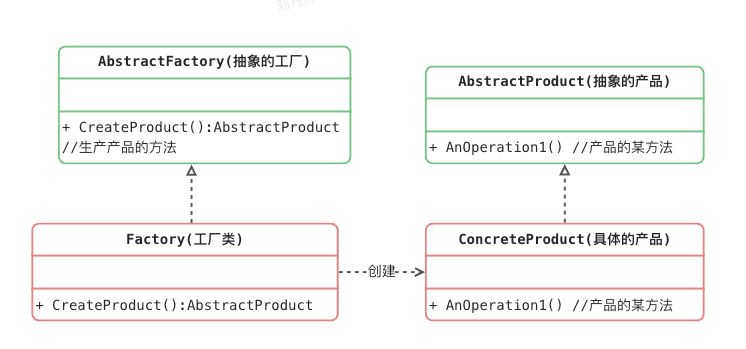

### 工厂方法模式的实现  
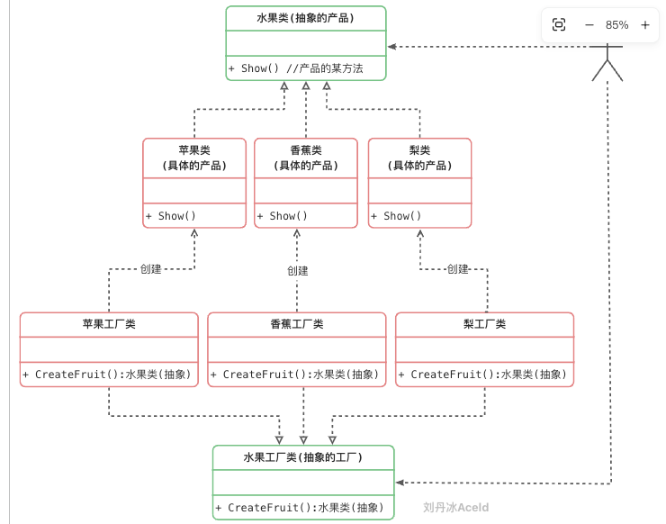

### 工厂方法模式的优缺点
优点：
1. 不需要记住具体类名，甚至连具体参数都不用记忆。
2. 实现了对象创建和使用的分离。
3. 系统的可扩展性也就变得非常好，无需修改接口和原类。
   4.对于新产品的创建，符合开闭原则。

缺点：
1. 增加系统中类的个数，复杂度和理解度增加。
2. 增加了系统的抽象性和理解难度。

适用场景：
1. 客户端不知道它所需要的对象的类。
2. 抽象工厂类通过其子类来指定创建哪个对象。

## 抽象工厂方法模式
工厂方法模式通过引入工厂等级结构，解决了简单工厂模式中工厂类职责太重的问题，但由于工厂方法模式中的每个工厂只生产一类产品，可能会导致系统中存在大量的
工厂类，势必会增加系统的开销。因此，可以考虑将一些相关的产品组成一个“产品族”，由同一个工厂来统一生产，这就是本文将要学习的抽象工厂模式的基本思想。

抽象工厂是将多个对象创建方法集中到一起，好比生产电脑主板，需要cpu,内存，显卡 等，主板这个产品所依赖的产品族是固定的，生产厂商在在生产主板的时候，需要
提前吧支持的接口定义好。  


### 抽象工厂模式的角色和职责
抽象工厂（Abstract Factory）角色：它声明了一组用于创建一族产品的方法，每一个方法对应一种产品。
具体工厂（Concrete Factory）角色：它实现了在抽象工厂中声明的创建产品的方法，生成一组具体产品，这些产品构成了一个产品族，每一个产品都位于某个产品等级结构中。
抽象产品（Abstract Product）角色：它为每种产品声明接口，在抽象产品中声明了产品所具有的业务方法。
具体产品（Concrete Product）角色：它定义具体工厂生产的具体产品对象，实现抽象产品接口中声明的业务方法。  

### 标准的设计模式类图
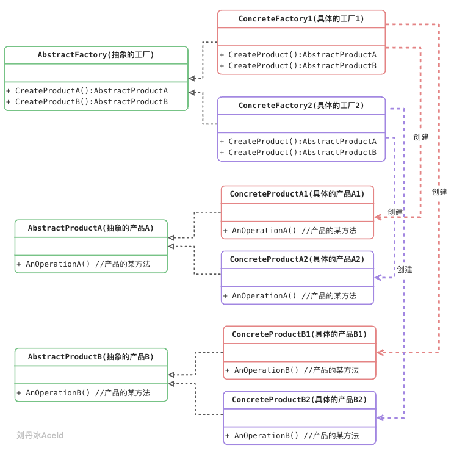

### 抽象工厂模式的优缺点
优点：
1.  拥有工厂方法模式的优点
2. 当一个产品族中的多个对象被设计成一起工作时，它能够保证客户端始终只使用同一个产品族中的对象。
3. 增加新的产品族很方便，无须修改已有系统，符合“开闭原则”。

缺点：
1. 增加新的产品等级结构麻烦，需要对原有系统进行较大的修改，甚至需要修改抽象层代码，这显然会带来较大的不便，违背了“开闭原则”。

### 适用场景
1. 系统中有多于一个的产品族。而每次只使用其中某一产品族。可以通过配置文件等方式来使得用户可以动态改变产品族，也可以很方便地增加新的产品族。
2. 产品等级结构稳定。设计完成之后，不会向系统中增加新的产品等级结构或者删除已有的产品等级结构。

## 简单工厂/工厂/抽象工厂模式总结  
### 简单工厂模式：一个工厂负责创建所有产品
违反“开闭原则”，添加新产品需要修改工厂逻辑，工厂越来越复杂
###  工厂方法模式：一个工厂创建一个产品
* 系统的可扩展性也就变得非常好，无需修改接口和原类
*  增加系统中类的个数，复杂度和理解度增加（一个具体产品就需要对应一个具体工厂）
### 抽象方法模式：一个工厂创建一系列（一个产品族）的产品
* 增加新的产品族很方便，无须修改已有系统，符合“开闭原则”
* 增加新的产品等级结构麻烦，需要对原有系统进行较大的修改，违背了“开闭原则”
* 相当于在工厂方法模式的基础下进行了折中
  * 对于产品族来说遵循了开闭原则
  * 对于产品等级结构来说没有遵循开闭原则
  * 如果产品结构等级稳定，那么就相当于完全遵循开闭原则

# 结构型模式
## 代理模式
Proxy模式又叫做代理模式，是构造型的设计模式之一，它可以为其他对象提供一种代理（Proxy）以控制对这个对象的访问。

所谓代理，是指具有与代理元（被代理的对象）具有相同的接口的类，客户端必须通过代理与被代理的目标类交互，而代理一般在交互的过程中（交互前后），进行某些特别的处理。

### 标准类图
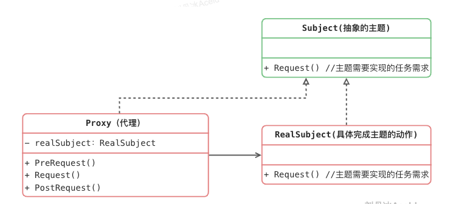  
subject（抽象主题角色）：真实主题与代理主题的共同接口。  
RealSubject（真实主题角色）：定义了代理角色所代表的真实对象。  
Proxy（代理主题角色）：含有对真实主题角色的引用，代理角色通常在将客户端调用传递给真是主题对象之前或者之后执行某些操作，而不是单纯返回真实的对象。

### 代理模式的优缺点
优点：
1. 能够协调调用者和被调用者，在一定程度上降低了系统的耦合度。
2. 客户端可以针对抽象主题角色进行编程，增加和更换代理类无须修改源代码，符合开闭原则，系统具有较好的灵活性和可扩展性。

缺点：
1. 代理实现较为复杂。

## 装饰模式
装饰模式(Decorator Pattern)：动态地给一个对象增加一些额外的职责，就增加对象功能来说，装饰模式比生成子类实现更为灵活。装饰模式是一种对象结构型模式。

### 标准的类图
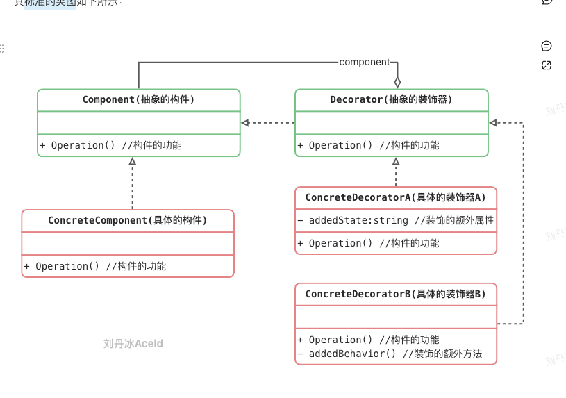
Component（抽象构件）：它是具体构件和抽象装饰类的共同父类，声明了在具体构件中实现的业务方法，它的引入可以使客户端以一致的方式处理未被装饰的对象以及装饰之后的对象，实现客户端的透明操作。

ConcreteComponent（具体构件）：它是抽象构件类的子类，用于定义具体的构件对象，实现了在抽象构件中声明的方法，装饰器可以给它增加额外的职责（方法）。


### 装饰模式的优缺点
优点：
1. 对于扩展一个对象的功能，装饰模式比继承更加灵活性，不会导致类的个数急剧增加。
2. 可以通过一种动态的方式来扩展一个对象的功能，从而实现不同的行为。
3. 可以对一个对象进行多次装饰。
4. 具体构件类与具体装饰类可以独立变化，用户可以根据需要增加新的具体构件类和具体装饰类，原有类库代码无须改变，符合“开闭原则”。

缺点：
1. 使用装饰模式进行系统设计时将产生很多小对象，大量小对象的产生势必会占用更多的系统资源，影响程序的性能。
2. 装饰模式提供了一种比继承更加灵活机动的解决方案，但同时也意味着比继承更加易于出错，排错也很困难，对于多次装饰的对象，调试时寻找错误可能需要逐级排查，较为繁琐。

### 适用场景
1. 动态、透明的方式给单个对象添加职责。
2. 当不能采用继承的方式对系统进行扩展或者采用继承不利于系统扩展和维护时可以使用装饰模式。  

### 代理模式和装饰器模式的区别
装饰器模式关注于在一个对象上动态的添加方法，然而代理模式关注于控制对对象的访问。换句话说，用代理模式，代理类（proxy class）可以对它的客户隐藏一个
对象的具体信息。 因此，当使用代理模式的时候，我们常常在一个代理类中创建一个对象的实例。并且，当我们使用装饰器模式的时候，我们通常的做法是将原始对象作
为一个参数传给装饰者的构造器。

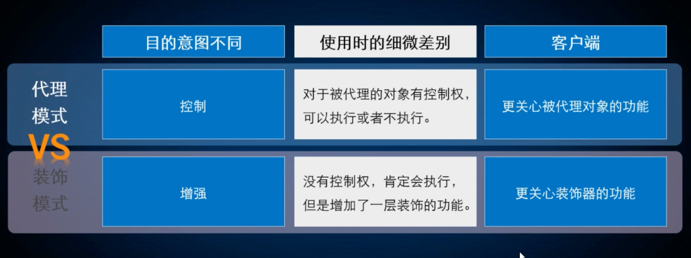

### 举个例子
尼古拉斯凯奇主演的《战争之王》不知道大家看过没有。记得里面有个场景，凯奇买了一架武装直升机，这时FBI带人抓捕，凯奇将直升机和导弹分开就合法了。
直升机就是那个封装特别好的类，能够长距离飞行。想用武装直升机，就在上面加导弹。想用救援直升机就在上面加医生。想用武装救援直升机，就在上面即加导弹又加医生。

```go
package main

import "fmt"

/**
 * @Description: 飞行器接口，有fly函数
 */
type Aircraft interface {
   fly()
   landing()
}

/**
 * @Description: 直升机类，拥有正常飞行、降落功能
 */
type Helicopter struct {
}

func (h *Helicopter) fly() {
   fmt.Println("我是普通直升机")
}

func (h *Helicopter) landing() {
   fmt.Println("我有降落功能")
}

/**
 * @Description: 武装直升机
 */
type WeaponAircraft struct {
   Aircraft
}

/**
 * @Description: 给直升机增加武装功能
 * @receiver a
 */
func (a *WeaponAircraft) fly() {
   a.Aircraft.fly()
   fmt.Println("增加武装功能")
}

/**
 * @Description: 救援直升机
 */
type RescueAircraft struct {
   Aircraft
}

/**
 * @Description: 给直升机增加救援功能
 * @receiver r
 */
func (r *RescueAircraft) fly() {
   r.Aircraft.fly()
   fmt.Println("增加救援功能")
}

func main() {
   //普通直升机
   fmt.Println("------------普通直升机")
   helicopter := &Helicopter{}
   helicopter.fly()
   helicopter.landing()

   //武装直升机
   fmt.Println("------------武装直升机")
   weaponAircraft := &WeaponAircraft{
      Aircraft: helicopter,
   }
   weaponAircraft.fly()

   //救援直升机
   fmt.Println("------------救援直升机")
   rescueAircraft := &RescueAircraft{
      Aircraft: helicopter,
   }
   rescueAircraft.fly()

   //武装救援直升机
   fmt.Println("------------武装救援直升机")
   weaponRescueAircraft := &RescueAircraft{
      Aircraft: weaponAircraft,
   }
   weaponRescueAircraft.fly()
}

```
> 装饰器模式两两间不同组合为增强原对象的功能，代理模式更加关注原对象的功能

## 适配器模式
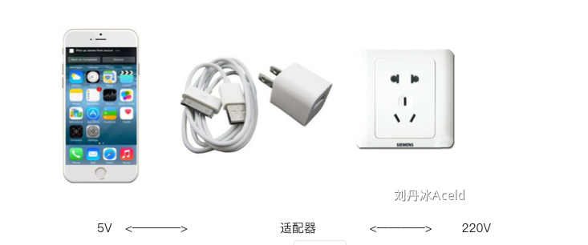
将一个类的接口转换成客户希望的另外一个接口。使得原本由于接口不兼容而不能一起工作的那些类可以一起工作。 

### 标准类图
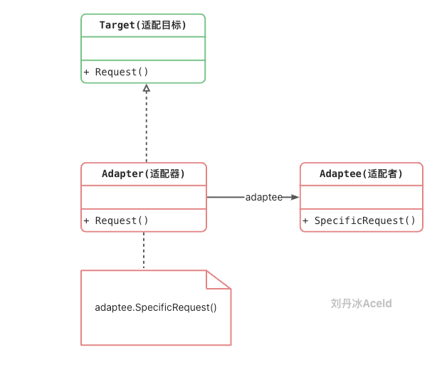
Target（目标抽象类）：目标抽象类定义客户所需接口，可以是一个抽象类或接口，也可以是具体类。  
Adapter（适配器类）：适配器可以调用另一个接口，作为一个转换器，对Adaptee和Target进行适配，适配器类是适配器模式的核心，在对象适配器中，它通过继承Target并关联一个Adaptee对象使二者产生联系。  
Adaptee（适配者类）：适配者即被适配的角色，它定义了一个已经存在的接口，这个接口需要适配，适配者类一般是一个具体类，包含了客户希望使用的业务方法，在某些情况下可能没有适配者类的源代码。  

根据对象适配器模式结构图，在对象适配器中，客户端需要调用request()方法，而适配者类Adaptee没有该方法，但是它所提供的specificRequest()方法却是客
户端所需要的。为了使客户端能够使用适配者类，需要提供一个包装类Adapter，即适配器类。这个包装类包装了一个适配者的实例，从而将客户端与适配者衔接起来，
在适配器的request()方法中调用适配者的specificRequest()方法。因为适配器类与适配者类是关联关系（也可称之为委派关系），所以这种适配器模式称为对象
适配器模式。

### 适配器模式优缺点
优点：
1. 将目标类和适配者类解耦，通过引入一个适配器类来重用现有的适配者类，无须修改原有结构。
2. 增加了类的透明性和复用性，将具体的业务实现过程封装在适配者类中，对于客户端类而言是透明的，而且提高了适配者的复用性，同一个适配者类可以在多个不同的系统中复用。
3. 灵活性和扩展性都非常好，可以很方便地更换适配器，也可以在不修改原有代码的基础上增加新的适配器类，完全符合“开闭原则”。

### 适应场景
1. 系统需要使用一些现有的类，而这些类的接口（如方法名）不符合系统的需要，甚至没有这些类的源代码。
2. 想创建一个可以重复使用的类，用于与一些彼此之间没有太大关联的一些类，包括一些可能在将来引进的类一起工作。

缺点:
适配器中置换适配者类的某些方法比较麻烦。


## 外观模式
根据迪米特法则，如果两个类不必彼此直接通信，那么这两个类就不应当发生直接的相互作用。

Facade模式也叫外观模式，是由GoF提出的23种设计模式中的一种。Facade模式为一组具有类似功能的类群，比如类库，子系统等等，提供一个一致的简单的界面。这个一致的简单的界面被称作facade。

### 标准类图
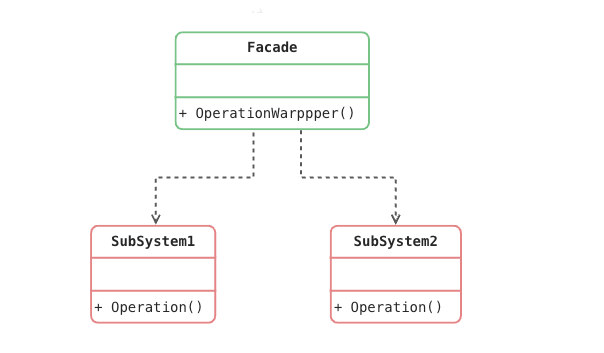
Façade(外观角色)：为调用方, 定义简单的调用接口。  
SubSystem(子系统角色)：功能提供者。指提供功能的类群（模块或子系统）。

### 举个例子
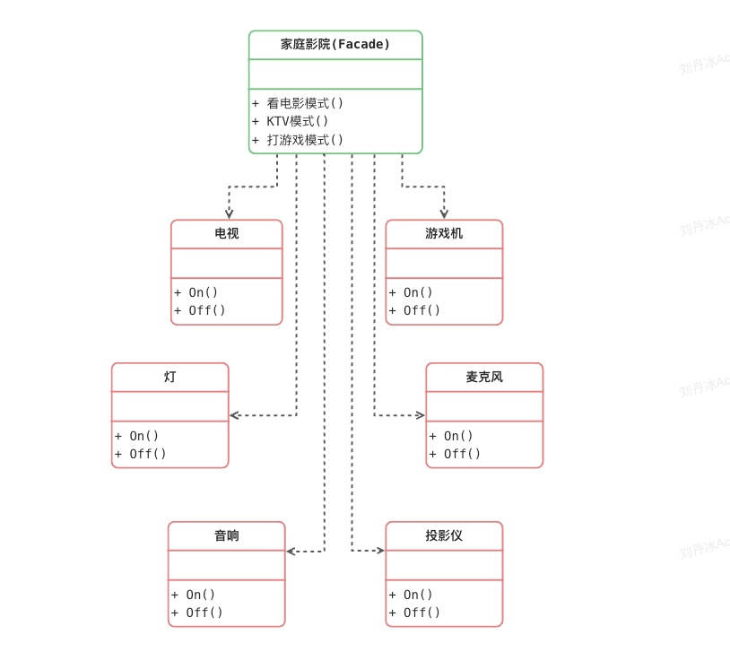

### 外观模式的优缺点
优点：
1. 它对客户端屏蔽了子系统组件，减少了客户端所需处理的对象数目，并使得子系统使用起来更加容易。通过引入外观模式，客户端代码将变得很简单，与之关联的对象也很少。
2. 它实现了子系统与客户端之间的松耦合关系，这使得子系统的变化不会影响到调用它的客户端，只需要调整外观类即可。
3. 一个子系统的修改对其他子系统没有任何影响。
缺点：
4. 不能很好地限制客户端直接使用子系统类，如果对客户端访问子系统类做太多的限制则减少了可变性和灵活 性。
5. 如果设计不当，增加新的子系统可能需要修改外观类的源代码，违背了开闭原则。

### 适用场景
1. 复杂系统需要简单入口使用。
2. 客户端程序与多个子系统之间存在很大的依赖性。
3. 在层次化结构中，可以使用外观模式定义系统中每一层的入口，层与层之间不直接产生联系，而通过外观类建立联系，降低层之间的耦合度。

# 行为型模式
行为型模式是用来对类或对象怎样交互和怎样分配职责进行描述，本章主要介绍“命令模式”、“观察者模式”、“策略模式”、“模板方法模式”等。
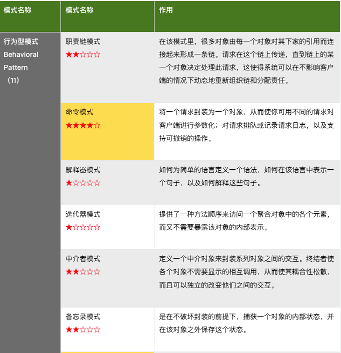
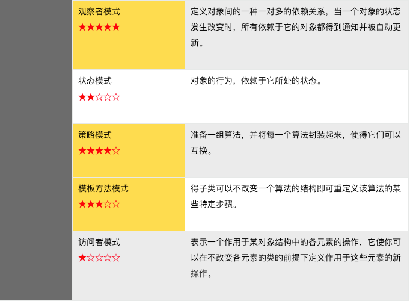

## 模板方法模式
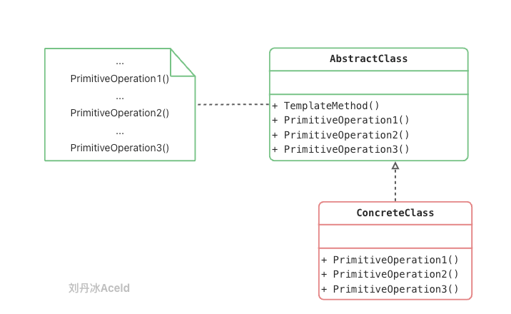
AbstractClass（抽象类）：在抽象类中定义了一系列基本操作(PrimitiveOperations)，这些基本操作可以是具体的，也可以是抽象的，每一个基本操作对应算法的一个步骤，在其子类中可以重定义或实现这些步骤。同时，在抽象类中实现了一个模板方法(Template Method)，用于定义一个算法的框架，模板方法不仅可以调用在抽象类中实现的基本方法，也可以调用在抽象类的子类中实现的基本方法，还可以调用其他对象中的方法。

ConcreteClass（具体子类）：它是抽象类的子类，用于实现在父类中声明的抽象基本操作以完成子类特定算法的步骤，也可以覆盖在父类中已经实现的具体基本操作。

### 模板方法的优缺点 
优点：
1. 在父类中形式化地定义一个算法，而由它的子类来实现细节的处理，在子类实现详细的处理算法时并不会改变算法中步骤的执行次序。
2. 模板方法模式是一种代码复用技术，它在类库设计中尤为重要，它提取了类库中的公共行为，将公共行为放在父类中，而通过其子类来实现不同的行为，它鼓励我们恰当使用继承来实现代码复用。
3. 可实现一种反向控制结构，通过子类覆盖父类的钩子方法来决定某一特定步骤是否需要执行。
4. 在模板方法模式中可以通过子类来覆盖父类的基本方法，不同的子类可以提供基本方法的不同实现，更换和增加新的子类很方便，符合单一职责原则和开闭原则。

缺点：
需要为每一个基本方法的不同实现提供一个子类，如果父类中可变的基本方法太多，将会导致类的个数增加，系统更加庞大，设计也更加抽象。

### 适用场景
1. 具有统一的操作步骤或操作过程;
2. 具有不同的操作细节;
3. 存在多个具有同样操作步骤的应用场景，但某些具体的操作细节却各不相同;
在抽象类中统一操作步骤，并规定好接口；让子类实现接口。这样可以把各个具体的子类和操作步骤解耦合。


## 命令模式
将一个请求封装为一个对象，从而让我们可用不同的请求对客户进行参数化；对请求排队或者记录请求日志，以及支持可撤销的操作。命令模式是一种对象行为型模式，其别名为动作(Action)模式或事务(Transaction)模式。
命令模式可以将请求发送者和接收者完全解耦，发送者与接收者之间没有直接引用关系，发送请求的对象只需要知道如何发送请求，而不必知道如何完成请求。

### 标准类图
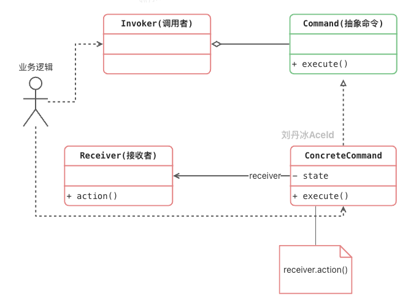
Command（抽象命令类）：抽象命令类一般是一个抽象类或接口，在其中声明了用于执行请求的execute()等方法，通过这些方法可以调用请求接收者的相关操作。  
ConcreteCommand（具体命令类）：具体命令类是抽象命令类的子类，实现了在抽象命令类中声明的方法，它对应具体的接收者对象，将接收者对象的动作绑定其中。在实现execute()方法时，将调用接收者对象的相关操作(Action)。  
Invoker（调用者）：调用者即请求发送者，它通过命令对象来执行请求。一个调用者并不需要在设计时确定其接收者，因此它只与抽象命令类之间存在关联关系。在程序运行时可以将一个具体命令对象注入其中，再调用具体命令对象的execute()方法，从而实现间接调用请求接收者的相关操作。  
Receiver（接收者）：接收者执行与请求相关的操作，它具体实现对请求的业务处理。  

### 举个例子
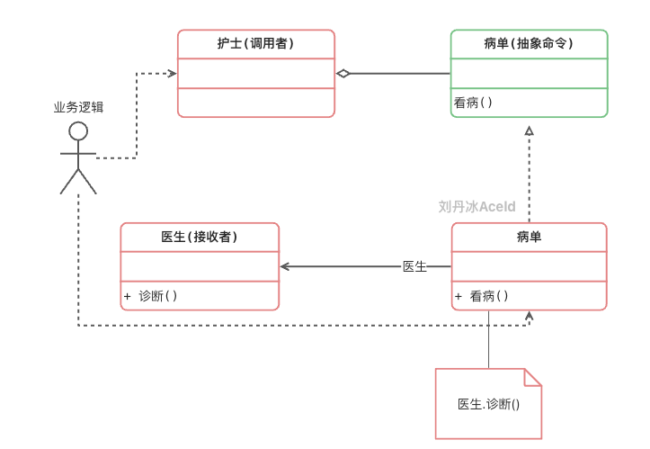

### 命令模式的优缺点
优点：
1. 降低系统的耦合度。由于请求者与接收者之间不存在直接引用，因此请求者与接收者之间实现完全解耦，相同的请求者可以对应不同的接收者，同样，相同的接收者也可以供不同的请求者使用，两者之间具有良好的独立性。
2. 新的命令可以很容易地加入到系统中。由于增加新的具体命令类不会影响到其他类，因此增加新的具体命令类很容易，无须修改原有系统源代码，甚至客户类代码，满足“开闭原则”的要求。
3. 可以比较容易地设计一个命令队列或宏命令（组合命令）。
缺点：
使用命令模式可能会导致某些系统有过多的具体命令类。因为针对每一个对请求接收者的调用操作都需要设计一个具体命令类，因此在某些系统中可能需要提供大量的具体命令类，这将影响命令模式的使用。

### 适用场景
1. 系统需要将请求调用者和请求接收者解耦，使得调用者和接收者不直接交互。请求调用者无须知道接收者的存在，也无须知道接收者是谁，接收者也无须关心何时被调用。
2. 系统需要在不同的时间指定请求、将请求排队和执行请求。一个命令对象和请求的初始调用者可以有不同的生命期，换言之，最初的请求发出者可能已经不在了，而命令对象本身仍然是活动的，可以通过该命令对象去调用请求接收者，而无须关心请求调用者的存在性，可以通过请求日志文件等机制来具体实现。
3. 系统需要将一组操作组合在一起形成宏命令。

## 策略模式
### 标准类图
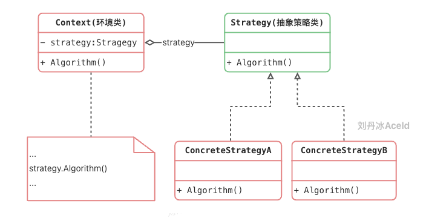
Context（环境类）：环境类是使用算法的角色，它在解决某个问题（即实现某个方法）时可以采用多种策略。在环境类中维持一个对抽象策略类的引用实例，用于定义所采用的策略。  
Strategy（抽象策略类）：它为所支持的算法声明了抽象方法，是所有策略类的父类，它可以是抽象类或具体类，也可以是接口。环境类通过抽象策略类中声明的方法在运行时调用具体策略类中实现的算法。  
ConcreteStrategy（具体策略类）：它实现了在抽象策略类中声明的算法，在运行时，具体策略类将覆盖在环境类中定义的抽象策略类对象，使用一种具体的算法实现某个业务处理。  

### 举个例子
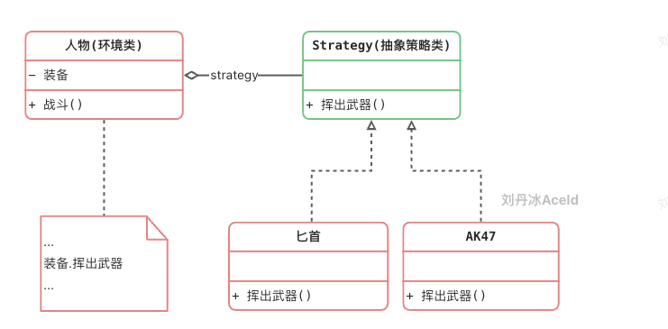

### 策略模式的优缺点
优点：
1. 策略模式提供了对“开闭原则”的完美支持，用户可以在不修改原有系统的基础上选择算法或行为，也可以灵活地增加新的算法或行为。
2. 使用策略模式可以避免多重条件选择语句。多重条件选择语句不易维护，它把采取哪一种算法或行为的逻辑与算法或行为本身的实现逻辑混合在一起，将它们全部硬编码(Hard Coding)在一个庞大的多重条件选择语句中，比直接继承环境类的办法还要原始和落后。
3. 策略模式提供了一种算法的复用机制。由于将算法单独提取出来封装在策略类中，因此不同的环境类可以方便地复用这些策略类。

缺点：
1. 客户端必须知道所有的策略类，并自行决定使用哪一个策略类。这就意味着客户端必须理解这些算法的区别，以便适时选择恰当的算法。换言之，策略模式只适用于客户端知道所有的算法或行为的情况。
2. 策略模式将造成系统产生很多具体策略类，任何细小的变化都将导致系统要增加一个新的具体策略类。

### 适用场景
准备一组算法，并将每一个算法封装起来，使得它们可以互换。

## 观察者模式
观察者模式是用于建立一种对象与对象之间的依赖关系，一个对象发生改变时将自动通知其他对象，其他对象将相应作出反应。在观察者模式中，发生改变的对象称为观
察目标，而被通知的对象称为观察者，一个观察目标可以对应多个观察者，而且这些观察者之间可以没有任何相互联系，可以根据需要增加和删除观察者，使得系统更易于扩展。

### 标准类图
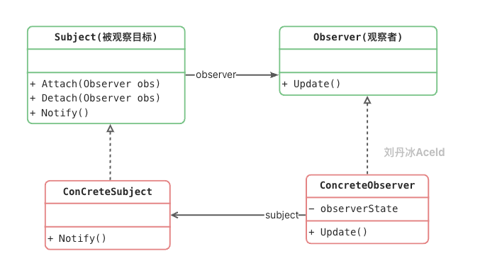

Subject（被观察者或目标，抽象主题）：被观察的对象。当需要被观察的状态发生变化时，需要通知队列中所有观察者对象。Subject需要维持（添加，删除，通知）一个观察者对象的队列列表。  
ConcreteSubject（具体被观察者或目标，具体主题）：被观察者的具体实现。包含一些基本的属性状态及其他操作。  
Observer（观察者）：接口或抽象类。当Subject的状态发生变化时，Observer对象将通过一个callback函数得到通知。  
ConcreteObserver（具体观察者）：观察者的具体实现。得到通知后将完成一些具体的业务逻辑处理。   

### 观察者模式的优缺点
优点：
1. 观察者模式可以实现表示层和数据逻辑层的分离，定义了稳定的消息更新传递机制，并抽象了更新接口，使得可以有各种各样不同的表示层充当具体观察者角色。
2. 观察者模式在观察目标和观察者之间建立一个抽象的耦合。观察目标只需要维持一个抽象观察者的集合，无须了解其具体观察者。由于观察目标和观察者没有紧密地耦合在一起，因此它们可以属于不同的抽象化层次。
3. 观察者模式支持广播通信，观察目标会向所有已注册的观察者对象发送通知，简化了一对多系统设计的难度。
4. 观察者模式满足“开闭原则”的要求，增加新的具体观察者无须修改原有系统代码，在具体观察者与观察目标之间不存在关联关系的情况下，增加新的观察目标也很方便。

缺点：
1. 如果一个观察目标对象有很多直接和间接观察者，将所有的观察者都通知到会花费很多时间。
2. 如果在观察者和观察目标之间存在循环依赖，观察目标会触发它们之间进行循环调用，可能导致系统崩溃。
3. 观察者模式没有相应的机制让观察者知道所观察的目标对象是怎么发生变化的，而仅仅只是知道观察目标发生了变化。

### 适用场景
1. 一个抽象模型有两个方面，其中一个方面依赖于另一个方面，将这两个方面封装在独立的对象中使它们可以各自独立地改变和复用。
2. 一个对象的改变将导致一个或多个其他对象也发生改变，而并不知道具体有多少对象将发生改变，也不知道这些对象是谁。
3. 需要在系统中创建一个触发链，A对象的行为将影响B对象，B对象的行为将影响C对象……，可以使用观察者模式创建一种链式触发机制。


# 转载
[Easy 搞定 Golang设计模式](https://www.yuque.com/aceld/lfhu8y/pebesh)