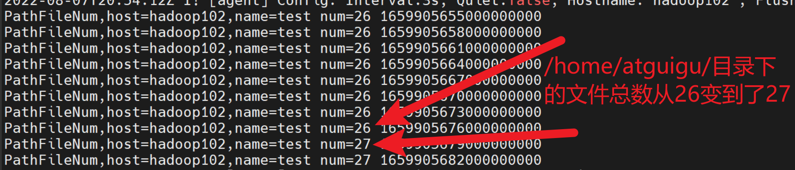
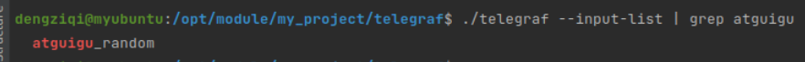

尚硅谷大数据技术之Telegraf

---
title: telegraf

categories:
- cloud

tags:
- 云监控
- 指标采集
---
# 认识Telegraf

## 什么是Telegraf

Telegraf是一个基于插件的开源指标采集工具。本身是为InfluxDB（一款时序数据库）量身打造的数据收集器，但是它过于优秀，能够将抓取的数据写到很多地方，尤其在时序数据库领域，很多时序数据库都能够与它配合使用。通常，它每隔一段时间抓取一批指标数据（比如机器的CPU使用情况，磁盘的IO，网络情况，MySQL服务端的的会话数等等）并将他们发送到时序数据库、消息队列中或者自定义导出到某个地方。供下游的应用处理（比如报警）。Telegraf也能够对外提供一个服务，等待客户端推送数据。

它与logstash类似，只不过logstash是收集日志的。telegraf是收集指标的。

## Telegraf的能力与社区

截至文档撰写时，它在github上已有11.7k stars。

{width="5.768055555555556in"
height="2.3194444444444446in"}

而且官方还提供了300多个可选的插件，另外Telegraf是易于拓展的，如果官方的插件无法满足你的需求，你随时可以在Telegraf的基础上写出自己的插件。

# 安装部署Telegraf

访问下载页面：<https://portal.influxdata.com/downloads/>

右边的Platform是你对应的系统，选择与你的平台相对应的，下载的网址会自动更改。

{width="5.768055555555556in"
height="2.5819444444444444in"}

这里要去你去写一个yum文件，页面上给出的命令有点问题，需要改成下面这样，红色处是我们的修改

cat \<\<EOF \| sudo tee /etc/yum.repos.d/influxdata.repo

\[influxdata\]

name = InfluxData Repository - Stable

baseurl = https://repos.influxdata.com/stable/\\\$basearch/main

enabled = 1

gpgcheck = 1

gpgkey = https://repos.influxdata.com/influxdb.key

EOF

这段代码运行完，在/etc/yum.repose.d/目录下会变出来一个influxdata.repo文件。里面的内容就是你代码上的中间部分。

{width="5.768055555555556in"
height="1.4680555555555554in"}

然后，使用yum在线安装。

sudo yum install telegraf

使用systemctl查看一下telegraf是否安装成功。

systemctl status telegraf

{width="5.768055555555556in"
height="0.7673611111111112in"}

如图所示，安装成功。

# 示例1：Telegraf快速入门（单输入单输出工作流）

## 编写Telegraf配置文件

创建一个目录，专门放telegraf的配置文件。

mkdir /opt/module/telegraf_conf

创建配置文件example01.conf。

vim example01.conf

并键入以下内容。

\[agent\]

interval = \"3s\"

\[\[inputs.cpu\]\]

percpu = true

totalcpu = true

collect_cpu_time = false

report_active = false

core_tags = false

\[\[outputs.file\]\]

files = \[\"stdout\"\]

## 运行Telegraf程序

使用下述命令启动telegraf，观察控制台的情况。s

telegraf \--config ./example01.conf

如图所示：控制台出现了以下输出。

{width="5.768055555555556in"
height="1.3743055555555554in"}

## 知识点讲解

### 配置文件的含义

example01.conf配置文件涉及到3个配置块。

\[ agent \]
这里面是一些涉及全局的配置。此处我们设置interval=\"3s\"，意思是让配置文件中的所有input插件每隔3秒去采集一次指标。interval的默认值是10秒。

\[\[ inputs.cpu \]\]
这是一个input输入组件，这里的配置是说我们导出的指标会包含每一个CPU核的使用情况，而且还包含所有CPU总的使用情况。

\[\[ outputs.file \]\]
这是一个output输出组件，这里我们用了一个名为file的输出组件，不过files参数设为了
stdout
（标准输出）也就是控制台，这样程序运行起来我们应该可以看到数据打印在控制台上。

### 控制台输出内容

**进程设置与插件加载信息**

首先控制台会输出一段日志内容，这里面包含了我们一个Telegraf进程的描述信息。s

{width="5.768055555555556in"
height="0.8729166666666667in"}

1.  当前Telegraf的版本号为1.23.2

2.  加载的input插件列表（目前就1个）：cpu

3.  加载的aggregator插件列表（目前没有）

4.  加载的processors插件列表（目前没有）

5.  加载的output插件列表（目前就1个）：file

6.  Tags
    enable，开启了全局的标签集，全局的指标数据都会加上host=hadoop102这个标签

7.  agent Config，全局配置

    a)  Interval : 3s，所有的input组件每3s采集一次指标数据，

    b)  Quiet：false，不使用安静模式运行。

    c)  Hostname：\"hadoop102\"，机器名称hadoop102

    d)  Flush Interval：10s
        所有的output组件每10s输出一次指标数据。所以，telegraf运行后，你应该每隔10秒，看到控制台上有一批输出。

**数据输出**

在Telegraf的配置内容输出完毕后，我们可以看到一堆密密麻麻的数据。你会发现它不像json，也不像csv。这其实是Telegraf内置的数据结构，叫做InfluxDB行协议。后面会专门讲解这种数据结构。

{width="5.768055555555556in"
height="1.2479166666666666in"}

### 我们声明了一个什么样的工作流

最后说一下我们的配置文件在Telegraf中起到了什么效果。

如下图所示，exampl01.conf文件声明了一个仅有一个输入插件和一个输出插件的工作流。当然，Telegraf的组件和概念还有很多，随着课程的深入，这张图也会丰富起来。

{width="5.768055555555556in"
height="1.9916666666666667in"}

# 示例2：启用处理插件

这一节，我们通过一个更复杂的示例，来学习Telegraf中的processor（处理）插件是如何使用的。

## 编写Telegraf配置文件

接下来，我们在example01.conf的基础上稍作改进，编写一个新的配置文件example02.conf。

cp example01.conf example02.conf

编辑example02.conf文件。

vim example02.conf

键入以下内容（红色部分是我们相对example01.conf新增的内容）

\[agent\]

interval = \"3s\"

flush_interval = \"5s\"

\[global_tags\]

user=\"atguigu\"

\[\[inputs.cpu\]\]

percpu = true

totalcpu = true

collect_cpu_time = false

report_active = false

core_tags = false

\[\[processors.converter\]\]

\[processors.converter.tags\]

measurement = \[\"cpu\"\]

\[\[outputs.file\]\]

files = \[\"stdout\"\]

## 运行Telegraf程序

执行下面的命令，开启一个配置文件为example02.conf的telegraf进程

telegraf \--conf ./example02.conf

控制台能够正常输出，说明一切正常。

{width="5.768055555555556in"
height="2.047222222222222in"}

## 看看和示例1的输出有什么不同

### 加载的插件不同

通过比较两次运行telegraf控制台输出的头部信息。我们可以发现example02.conf文件让我们的telegraf程序多加载了一个converter（转换器）插件。

{width="5.768055555555556in"
height="0.8569444444444444in"}

### 数据的输出发生了变化

截至目前，我们还没有讲解Telegraf内部的数据格式。不过我们可以暂时只关注两个示例输出数据的头部。

如下图所示：

{width="5.768055555555556in"
height="1.7958333333333334in"}

一条数据的头部由两部分构成。

measurement（测量名称）。此处，我们使用CPU
input插件来测量CPU的使用情况，所以测量的名称就叫做cpu是很合适的。

tags（标签集）。因为telegraf是InfluxData公司为InfluxDB开发指标收集组件，这里的tags其实是为了InfluxDB建立索引的方便。关于索引的详细只是后面会说到。

{width="4.886973972003499in"
height="1.5838834208223973in"}

比较上图的数据可以发现，在我们加了一个processor插件后，数据的格式发生的改变。原本标签集上的内容被拿来替换了measurement（指标名称）。这也体现了processor插件操作、转换、处理数据的功能。

3.  **示例2的工作流**

综上，我们可以总结一下示例2对应的工作流。如下图所示：

{width="5.768055555555556in"
height="2.8055555555555554in"}

1个Input组件，1个Processor组件，1个Output组件。

# 学会使用插件文档

通过上面的两个示例，我们可以发现，3个插件（1个input，1个processor，1个output）的配置文件，各自有各自的写法。那么作为使用者的你，怎么知道每个配件应该怎么去写配置呢？

这必须借助文档！

接来下，我们尝试通过官方文档来了解刚才Processor插件的用法。s

## 如何使用插件文档

### 不同版本的Telegraf支持的插件不同

首先注意，如果你正在使用Telegraf的1.23版本，那么你看插件文档的时候，也应该去看1.23版本的文档。这是因为Go语言开发的项目，会把整个项目涉及的东西编译到一个单独的二进制可执行文件中。

而且这个可执行文件里面写的全部都是本地码（native-code），不需要专门的Go语言执行环境，操作系统环境直接可以让它运行起来。

介于此，Telegraf的插件和框架核心代码是编译在一块的，它们都在一个可执行文件中。

{width="4.52830271216098in"
height="1.5881233595800526in"}

因此v1.23中特有的插件，前面的版本就不会有，除非把旧版本的Telegraf源码下下来，然后把想要的插件源码写进去再重新编译。

注意！上面说的是Telegraf的内置插件，Telegraf还为我们留了一个exec
Input插件，通过这个插件，我们可以和外部的捕捉指标数据的插件进行集成，后面的课程涉及详细的案例。

### Telegraf插件目录

首先，在Telegraf的官方文档上，有一栏叫做Plugin
directory（插件目录），在这里，你可以看到对应Telegraf版本上所有可用的插件。

下面给出的链接，是Telegraf v1.23的插件目录。

<https://docs.influxdata.com/telegraf/v1.23/plugins/>

{width="5.768055555555556in"
height="3.6354166666666665in"}

### 插件过滤

页面的顶部是一组过滤器，你可以勾选想要查看的插件类别，这样页面下方的插件列表就会短很多，方便你快速找到目标。

{width="5.768055555555556in"
height="3.134027777777778in"}

此处，点击Processor选项，这样页面的下方就只剩27个组件供我们浏览了。

### 找到相应插件的帮助文档

将页面向下滚动，我们可以看到一个插件列表，这些就是我们过滤出来的插件。

{width="5.768055555555556in"
height="3.6743055555555557in"}

其中第二个卡片，就是我们示例2中使用的Converter插件。如下图所示，卡片上会有一些帮助信息。点击右上角的view按钮，可以看到更加详细的使用说明。

{width="5.768055555555556in"
height="2.0993055555555555in"}

首先，你可以看到完整的插件配置可以包含那些选项。

{width="5.768055555555556in"
height="3.4131944444444446in"}

最重要的是，插件的作者通常会给你列出几个示例，方便你理解插件的工作方式。

{width="5.768055555555556in"
height="2.797222222222222in"}

## 在示例配置中也可以获取有帮助的信息

上述是通过官网查看插件的使用方式。另外，你还可以使用telegraf命令来查看一个插件的示例配置。

下面的命令可以打印Telegraf中所有内置插件的示例配置。

telegraf config

不过打印到控制台的用处不大。将它导出到文件中用编辑器搜索查看才是正确实践。

telegraf config \> tmp.conf

如图所示，使用vim编辑器打开后，直接用正则表达式找你想要的插件。里面包含这个插件所有可用的配置项，以及各个配置项的说明。但是没有结合数据的使用案例。

{width="5.768055555555556in"
height="2.8694444444444445in"}

# Telegraf内部数据结构（InfluxDB行协议）

Telegraf的内部数据结构叫做InfluxDB行协议。如下图所示：

{width="5.768055555555556in"
height="0.6673611111111111in"}

Telegraf本身是InfluxData公司专门为InfluxDB开发的数据采集器。上面这种数据格式是InfluxDB数据库使用的，只要数据符合上面这种格式，就能通过InfluxDB的API将数据导入数据库。所以，自家的插件当然支持自家的生态了，InfluxDB

接下来介绍一下它的几个构成部分。

## measurement（测量名称）

随着后面的学习，你会逐渐深入理解这个概念。目前，你可以将它理解为关系型数据库中的一张表。

必需

测量的名称。每个数据点都必须声明自己是哪个测量里面的 ，不可省略。

大小写敏感

不可以下划线 \_ 开头

## Tag Set（标签集）

标签应该用在一些值的范围有限的，不太会变动的属性上。比如传感器的类型和id等等。在InfluxDB中一个Tag相当于一个索引。给数据点加上Tag有利于将来对数据进行检索。但是如果索引太多了，就会减慢数据的插入速度。

可选

键值关系使用 = 表示

多个键值对之间使用英文逗号 , 分隔

标签的键和值都区分大小写

标签的键不能以下划线 \_ 开头

键的数据类型：字符串

值的数据类型：字符串

## Field Set（字段集）

必需

一个数据点上所有的字段键值对，键是字段名，值是数据点的值。

一个数据点至少要有一个字段。

字段集的键是大小写敏感的。

字段

键的数据类型：字符串

值的数据类型：浮点数 \| 整数 \| 无符号整数 \| 字符串 \| 布尔值

## Timestamp（时间戳）

可选

数据点的Unix时间戳，每个数据点都可以指定自己的时间戳。

如果时间戳没有指定。那么InfluxDB就使用当前系统的时间戳。

数据类型：Unix timestamp

如果你的数据里的时间戳不是以纳秒为单位的，那么需要在数据写入时指定时间戳的精度。

## 空格

行协议中的空格决定了InfluxDB如何解释数据点。第一个未转义的空格将测量值&Tag
Set （标签集）与 Field Set（字段集） 分开。第二个未转义空格将Field
Set（字段级）和时间戳分开。

{width="5.768055555555556in"
height="1.5326388888888889in"}

## 协议中的数据类型及其格式

### Float（浮点数）

IEEE-754标准的64位浮点数。这是默认的数据类型。

示例：字段级值类型为浮点数的行协议

myMeasurement fieldKey=1.0

myMeasurement fieldKey=1

myMeasurement fieldKey=-1.234456e+78

### Integer（整数）

有符号64位整数。需要在数字的尾部加上一个小写数字 i 。

  -----------------------------------------------------------------------
  整数最小值                          整数最大值
  ----------------------------------- -----------------------------------
  -9223372036854775808i               9223372036854775807i

  -----------------------------------------------------------------------

示例：字段值类型为有整数的

### UInteger（无符号整数）

无符号64位整数。需要在数字的尾部加上一个小写数字 u 。

  -----------------------------------------------------------------------
  无符号整数最小值                    无符号整数最大值
  ----------------------------------- -----------------------------------
  0u                                  18446744073709551615u

  -----------------------------------------------------------------------

示例：字段值类型为无符号整数的航协议

myMeasurement fieldKey=1u

myMeasurement fieldKey=12485903u

### String（字符串）

普通文本字符串，长度不能超过64KB

示例：

\# String measurement name, field key, and field value

myMeasurement fieldKey=\"this is a string\"

### Boolean（布尔值）

true或者false。

示例：

  -----------------------------------------------------------------------
  布尔值                              支持的语法
  ----------------------------------- -----------------------------------
  True                                t, T, true, True, TRUE

  False                               f, F, false, False, FALSE
  -----------------------------------------------------------------------

示例：

myMeasurement fieldKey=true

myMeasurement fieldKey=false

myMeasurement fieldKey=t

myMeasurement fieldKey=f

myMeasurement fieldKey=TRUE

myMeasurement fieldKey=FALSE

不要对布尔值使用引号，否则会被解释为字符串

### Unix Timestamp（Unix 时间戳）

如果你写时间戳，

myMeasurementName fieldKey=\"fieldValue\" 1556813561098000000

## 注释

以井号 \# 开头的一行会被当做注释。

示例：

\# 这是一行数据

myMeasurement fieldKey=\"string value\" 1556813561098000000

# Telegraf命令行的使用

Telegraf安装好之后，就可以使用telegraf命令了。

用法：

telegraf \[ 命令 \]

telegraf \[ 选项 \]

## 命令

  -----------------------------------------------------------------------
  命令      描述
  --------- -------------------------------------------------------------
  config    将完整的示例配置打印到标准输出（stdout 控制台）

  version   将版本号打印到标准输出（stdout 控制台）
  -----------------------------------------------------------------------

## 选项

  -------------------------------------------------------------------------------------------------------------------------------------------------------------------------------------
  参数                               描述
  ---------------------------------- --------------------------------------------------------------------------------------------------------------------------------------------------
  \--aggregator-filter \<filter\>    筛选要启用聚合器，分隔符为

  \--config \<file\>                 要加载的配置文件

  \--config-directory\<directory\>   包含其他配置文件的目录。其中的配置文件名需要以.conf收尾

  \--deprecation-list                打印所有已弃用的插件或插件选项。

  \--watch-config                    在本地的配置文件更改时，重启Telegraf进程，监听方式使用的是文件系统的通知或者轮询文件。\--watch-config功能默认是关闭的。

  \--plugin-directory \<directory\>  插件目录，会以递归的方式搜索这个目录，来找到可用的插件，找到的插件会被加载。插件文件的后缀是.so

  \--debug                           启动debug级别的日志文件

  \--input-filter \<filter\>         过滤要启用的输入插件，分隔符为 : 。

  \--input-list                      打印可用的输入插件

  \--output-filter                   过滤要启用的输出插件，分隔符为 : 。

  \--output-list                     打印可用的输出插件

  \--pidfile \<file\>                要将pid写入到哪个文件。

  \--pprof-addr \<address\>          pprof地址，默认情况下禁用。pprof是Go中分析程序运行性的工具，它能够提供各种性能数据。比如，内存分配情况的采样信息、对上内存的使用情况采样信息等。

  \--processor-filter \<filter\>     筛选要启用的filter插件，插件之间使用 : 分隔。

  \--quiet                           在安静模式下运行

  \--section-filter \<filter\>       这个参数和config命令一起使用才有意义。过滤要打印的配置段（agent，global_tags，outputs，processors，aggregators和inputs）。配置段之间用 : 分隔。

  \--sample-config                   打印完整的示例配置（和config命令的作用一样）

  \--once                            收集一次指标，写出，然后退出进程。

  \--test                            收集一次指标并打印一次，然后退出进程。

  \--test-wait                       telegraf进程在test或once模式下，进行一次input所需要的秒数。

  \--usage \<plugin\>                打印插件的用法。（比如：telegraf \--usage mysql）

  \--version                         打印Telegraf的版本号
  -------------------------------------------------------------------------------------------------------------------------------------------------------------------------------------

## 示例：Telegraf命令行用法

### 生成Telegraf的配置文件

使用config命令，打印输出配置配置文件（也可以使用\--sample-config参数），将输出重定向到一个文件中。

telegraf config \> telegraf.conf

### 生成仅定义了CPU输入和InfluxDB输出的配置文件

telegraf \--input-filter cpu \--output-filter influxdb config

### 运行单个的Telegraf配置文件并打印到控制台

使用test模式，output插件不会被启用。

telegraf \--config example01.conf \--test

{width="5.768055555555556in"
height="1.2319444444444445in"}

### 运行一个配置文件中的所有插件

telegraf \--config telegraf.conf

### 运行一个包含CPU和内存输入插件以及InfluxDB输出插件的Telegraf实例

telegraf \--input-filter cpu:mem \--output-filter influxdb

### 运行Telegraf时开启pprof

telegraf \--config telegraf.conf \--pprof-addr localhost:6060

运行上述代码后，可在浏览器访问hadoop102:6060来观察进程运行的性能信息。

{width="5.768055555555556in"
height="2.3201388888888888in"}

# 示例3：使用远程配置

Telegraf的\--cofnig参数还能指定一个URL，让telegraf通过网络远程获取配置文件。

## 使用python自带的http.server快速搭建静态文件服务

cd 到我们放配置文件的目录 /opt/module/telegraf_conf
使用下面的命令，快速开启一个静态文件服务。

python3 -m http.server

默认情况下，它监听8000端口，并允许外部访问。

{width="5.768055555555556in"
height="0.3972222222222222in"}

## 运行Telegraf

接下来，我们可以尝试使用这个服务来获取配置文件。

使用下面的命令运行Telegraf

telegraf \--config <http://hadoop102:8080/example01.conf>

可以看到，我们成功获取了配置文件，而且数据也能够正常输出。

{width="5.768055555555556in"
height="1.7354166666666666in"}

但是这种方式不能监听配置的变化。

# 配置文件参数

## Agent配置

+-----------------------+------------+--------------------------------+
| 配置名                | 直译       | 解释                           |
+=======================+============+:===============================+
| interval              | 间隔       | 所有                           |
|                       |            | 的input组件采集数据的间隔时间  |
+-----------------------+------------+--------------------------------+
| round_interval        | 间隔取整   | 将采集的间隔时                 |
|                       |            | 间取整。比如，如果interval设置 |
|                       |            | 为10s，但我们在1分02秒启动了te |
|                       |            | legraf服务，那么采集的时间会取 |
|                       |            | 整到1分10秒，1分20秒，1分30秒  |
+-----------------------+------------+--------------------------------+
| metric_batch_size     | 指标       | telegraf一批次                 |
|                       | 批大小     | 从output组件向外发送数据的大小 |
|                       |            | ，网络不稳定时可以减小此参数。 |
+-----------------------+------------+--------------------------------+
| metric_buffer_limit   | 指标       | tele                           |
|                       | 缓冲区     | graf会为每个output插件创建一个 |
|                       |            | 缓冲区，来缓存指标数据，并在ou |
|                       |            | tput成功将数据发送后，将成功发 |
|                       |            | 送的数据从缓冲区删除。所以，me |
|                       |            | triac_buffer_limit参数应该至少 |
|                       |            | 是metric_batch_size参数的两倍  |
+-----------------------+------------+--------------------------------+
| collection_jetter     | 采集抖动   | 这个参数会                     |
|                       |            | 在采集的时间点上加一个随机的抖 |
|                       |            | 动，这样可以避免很多插件同时查 |
|                       |            | 询一些消耗资源的指标，从而对被 |
|                       |            | 观测的系统产生不可忽视的影响。 |
+-----------------------+------------+--------------------------------+
| flush_interval        | 刷新间隔   | 所有output的输出               |
|                       |            | 间隔，这个参数不应该设的比int  |
|                       |            | erval（所有input组件的采集间隔 |
|                       |            | ）小。最大的实际发送间隔将会是 |
+-----------------------+------------+--------------------------------+
| flush_jitter          | 刷新抖动   | 对output的输出时间加上一个随   |
|                       |            | 机的抖动，这主要是为了避免大量 |
|                       |            | 的Telegraf实例在同样的时间同时 |
|                       |            | 执行写入操作，出现较大的写入峰 |
|                       |            | 值。比如，flush_jitter设为5s， |
|                       |            | flush_interval设为10s意味着会  |
|                       |            | 在10\~15秒的时候进行一次输出。 |
+-----------------------+------------+--------------------------------+
| precision             | 精度       | 精度配置确定从输入插件         |
|                       |            | 接收的点中保留多少时间戳精度。 |
|                       |            | 所有传入的时间戳都被阶段为给定 |
|                       |            | 的精度。然后Telegraf用零填充截 |
|                       |            | 断的时间戳以创建纳秒时间戳，输 |
|                       |            | 出插件将以纳秒为单位发出时间戳 |
|                       |            | 。有效的精度为ns，us，ms和s。  |
|                       |            |                                |
|                       |            | 例如：如果精                   |
|                       |            | 度设置为ms，则纳秒时间戳14800  |
|                       |            | 00000123456789将被截断为148000 |
|                       |            | 0000123毫秒精度，然后用0填充以 |
|                       |            | 生成新的，不太精确的纳秒时间戳 |
|                       |            | 1480000000123000000。输出插件  |
|                       |            | 不会进一步更改时间戳。如果是服 |
|                       |            | 务型的输出插件会忽略这个设置。 |
+-----------------------+------------+--------------------------------+
| logfile               | 日志文件   | 自定义的日志名称，             |
+-----------------------+------------+--------------------------------+
| debug                 | 调试       | 使用debug模式运行Telegraf      |
+-----------------------+------------+--------------------------------+
| quiet                 | 安静       | 安静地                         |
|                       |            | 运行Telegraf，只会提示错误信息 |
+-----------------------+------------+--------------------------------+
| logtarget             | 日志目标   | 该配置用来空值日志             |
|                       |            | 的目标。它可以是\"file\"，\"s  |
|                       |            | tderr\"之一，如果是在Windows系 |
|                       |            | 统上，它还可以设为\"eventlog\" |
|                       |            | 。设置为\"file\"时，输入文件由 |
|                       |            | logfile 配置项决定。           |
+-----------------------+------------+--------------------------------+
| logfile               | 日志文件   | 指定logtarget指定为\"fi        |
|                       |            | le\"时的日志文件名。如果设置为 |
|                       |            | 空，那么日志会输出到stderr上。 |
+-----------------------+------------+--------------------------------+
| logf                  | 日         | 日志轮转间隔，多长时间         |
| ile_rotation_interval | 志轮转间隔 | 开启一个新的日志文件，如果设置 |
|                       |            | 为0，那么就不按时间进行轮转。  |
+-----------------------+------------+--------------------------------+
| logf                  | 日         | 当正在使用的日志文件           |
| ile_rotation_max_size | 志轮转大小 | 的大小超过该值时，开启一个新的 |
|                       |            | 日志文件。当设置为0，表示不按  |
|                       |            | 照日志文件的大小进行日志轮转。 |
+-----------------------+------------+--------------------------------+
| logfile_              | 最大       | 最大的日志归档数量，每一       |
| rotation_max_archives | 轮转存档数 | 次日志轮转发生时，都会产生一个 |
|                       |            | 新的正在使用的日志文件，和一个 |
|                       |            | 归档（旧的不再使用的日志文件） |
+-----------------------+------------+--------------------------------+
| log_with_timezone     | 日志时区   | 设置日志记录要使用的时区，或   |
|                       |            | 者设为\"local\"即为本地时间。  |
+-----------------------+------------+--------------------------------+
| hostname              | 主机名     | 覆盖默认的主机名，             |
|                       |            | 如果不设该值，那么os.Hostname( |
|                       |            | )的返回值。（o                 |
|                       |            | s.Hostname）是Go语言标准库中的 |
|                       |            | 方法，可以获取当前机器的名称。 |
+-----------------------+------------+--------------------------------+
| omit_hostname         | 忽略主机名 | telegraf                       |
|                       |            | 输出的指标数据中，有一个默认的 |
+-----------------------+------------+--------------------------------+

## Input 输入插件通用配置

+-------------+---------+---------------------------------------------+
| 配置名      | 直译    | 解释                                        |
+=============+=========+=============================================+
| alias       | 别名    | 给一个input插件实例进行命名。               |
+-------------+---------+---------------------------------------------+
| interval    | 间隔    | 单                                          |
|             |         | 个Input组件收集指标的间隔时间，插件中的int  |
|             |         | erval配置比全局的interval配置的优先级要高。 |
+-------------+---------+---------------------------------------------+
| precision   | 精度    | 单个Input组件的时间精度，覆盖\[agent\       |
|             |         | ]中的配置。精度配置确定从输出插件接收的点中 |
|             |         | 保留多少时间戳精度。所有传入的时间戳都被阶  |
|             |         | 段为给定的精度。然后Telegraf用零填充截断的  |
|             |         | 时间戳以创建纳秒时间戳，输出插件将以纳秒为  |
|             |         | 单位发出时间戳。有效的精度为ns，us，ms和s。 |
|             |         |                                             |
|             |         | 例如：                                      |
|             |         | 如果精度设置为ms，则纳秒时间戳1480000000123 |
|             |         | 456789将被截断为1480000000123毫秒精度，然后 |
|             |         | 用0填充以生成新的，不太精确的纳秒时间戳1480 |
|             |         | 000000123000000。输出插件不会进一步更改时间 |
|             |         | 戳。如果是服务型的输出插件会忽略这个设置。  |
+-------------+---------+---------------------------------------------+
| collec      | 采      | 单个Input组件的采集抖动                     |
| tion_jitter | 集抖动  |                                             |
+-------------+---------+---------------------------------------------+
| na          | 重命名  | 覆盖原来的指标名称，默认值为input组件的名称 |
| me_override |         |                                             |
+-------------+---------+---------------------------------------------+
| name_prefix | 名      | 指定要附加到度量值名称的前缀                |
|             | 称前缀  |                                             |
+-------------+---------+---------------------------------------------+
| name_suffix | 名      | 指定要附加到度量值名称的后缀                |
|             | 称后缀  |                                             |
+-------------+---------+---------------------------------------------+
| tags        | 标签集  | 给当前input数据添加新的标签集。             |
+-------------+---------+---------------------------------------------+

## Output 输出插件通用配置

  -----------------------------------------------------------------------------------------------------
  配置名                直译             解释
  --------------------- ---------------- --------------------------------------------------------------
  alias                 别名             给一个output插件起一个别名

  flush_interval        刷新间隔         单个output插件的输出间隔（覆盖全局配置）

  flush_jitter          刷新抖动         单个output插件的输出时间抖动（覆盖全局配置）

  metric_batch_size     指标批次大小     一次最多发送多少条数据（会覆盖全局配置）

  metric_buffer_limit   指标缓冲区上限   未发送数据的缓冲区（会覆盖全局配置）

  name_override         重命名           覆盖原来的指标名称，默认值为output的名称（我怀疑官网说错了）

  name_prefix           名称前缀         指标名称的前缀

  name_suffix           名称后缀         指标名称的后缀
  -----------------------------------------------------------------------------------------------------

## Aggregator 聚合插件通用配置

  -----------------------------------------------------------------------------------------------------------------------------
  配置名          直译       解释
  --------------- ---------- --------------------------------------------------------------------------------------------------
  alias           别名       给一个Aggregator插件的实例命名

  period          期间       聚合器对从now-period 到now 之间的数据进行聚合。

  delay           延迟       聚合时进行一个小的延迟，防止在对时间戳为1000的数据进行聚合时，上游还在正在发送时间戳为1000的数据

  grace           宽限       迟到多久的数据可以进入下一个聚合周期。

  drop_original   删除源     默认为false，如果设置为true，袁术的指标数据就会从流水线上删除，不会发给下游的output插件

  name_override   名称覆盖   给数据的指标名称重新命名

  name_prefix     名称前缀   给指标名称加一个前缀

  name_suffix     名称后缀   给指标名称加一个后缀

  tags            标记       添加额外的标签集
  -----------------------------------------------------------------------------------------------------------------------------

## Processor 处理插件通用配置

  -----------------------------------------------------------------------------------------------------------------------------------------
  配置名        直译     解释
  ------------- -------- ------------------------------------------------------------------------------------------------------------------
  alias         别名     给Processor插件的示例起一个名字

  order         顺序     这是处理器的执行顺序，如果没有制定，那么执行器的顺序就是随机的。注意！不是按照配置文件的先后顺序来的，而是随机。
  -----------------------------------------------------------------------------------------------------------------------------------------

## Metric filtering 指标过滤器通用配置

指标过滤器的配置可以卸载input，output

  -------------------------------------------------------------------------------------------------------------------------
  配置名         直译       解释
  -------------- ---------- -----------------------------------------------------------------------------------------------
  namepass       名称通过   一个glob模式的字符串数组，仅有measurement名称与这个配置的参数能匹配的指标数据可以进入此插件。

  namedrop       名称删除   一个glob模式的字符串数组，能匹配上measurement的数据直接删除。

  fieldpass      字段通过   一个glob模式的字符串数组，只有能匹配上的字段才能通过

  fielddrop      字段删除   一个glob模式的字符串数组，如果匹配上了就删除这个资源。

  tagpass        标签通过   一个glob模式的字符串数组，tag能匹配上的数据才能通过

  tagdrop        标签删除   一个glob模式的字符串数组，tag能匹配上的数据会被删除

  taginclude     标签包含   一个glob模式的字符串数据，能匹配到其中一个的整条数据才能通过。

  tagexclude     标签不含   tageinclude的反函数
  -------------------------------------------------------------------------------------------------------------------------

注意！由于YOML的解析方式，过滤器参数必须在插件定义的末尾来进行定义，负责后续的插件配置项将被截石位
tagpass或者tagdrop的一部分。

## Glob用法（参考资料）

> glob起源于Unix上的bash shell。我们知道的bash
> shell中的一个功能强大的命令，rm-rf /\* 其中 \*
> 就是glob风格的模式匹配，通常
> glob最常用的地方就是匹配文件名称。它在某些方面与正则表达式相同，但是他们各自有着不同的语法和约定。
>
> 详细内容可以参考:
> [https://github.com/whinc/whinc.github.io/issues/18]{.underline}

以下是表达式的说明。

### 基础语法

相比正则表达式大量的元字符，glob模式中元字符极少，所以掌握起来很快，glob默认不匹配隐藏文件（以点
. 开头的文件或目录），下面是glob的语法

  -----------------------------------------------------------------------------------------------------
  **通配符**            **描述**                         **示例**    **匹配**           **不匹配**
  --------------------- -------------------------------- ----------- ------------------ ---------------
  \*                    匹配0个或多个字符，包含空串      Law\*       Law, Laws和Lawer   La, aw

  ?                     匹配1个字符                      ?at         cat, bat           at

  \[abc\]               匹配括号内字符集合中的单个字符   \[cb\]at    cat, bat           at, bcat

  \[a-z\]               匹配括号内字符范围中的单个字符   \[a-z\]at   aat, bat, zat      at, bcat, Bat

  \[\^abc\]或\[!abc\]   匹配括号内字符集合中的单个字符   \[cb\]at    cat, bat           at, bcat

  \[\^a-z\]或\[!a-z\]   匹配括号内字符范围中的单个字符   \[a-z\]at   aat, bat, zat      at, bcat, Bat
  -----------------------------------------------------------------------------------------------------

在bash命令行中 \[!abc\]需要转义成\[\\!abc\]

### 扩展语法

除了基础语法外，bash还支持glob的一些扩展语法，主要包含三种。

Brace Expansion

globstar

extglob

> 三种拓展语法的定义和描述如下：

+--------------+----------+---------------+-----------+--------------+
| **通配符**   | **描述** | **示例**      | **匹配**  | **不匹配**   |
+:=============+:=========+:==============+:==========+:=============+
| {x, y, \...} | Brace    | a.            | a.png,    |              |
|              | Exp      | {png,jp{,e}g} |           |              |
|              | ansion， |               | a.jpg,    |              |
|              | 展开花括 |               |           |              |
|              | 号内容， |               | a.jpeg    |              |
|              | 支持展开 |               |           |              |
|              | 嵌套括号 |               |           |              |
+--------------+----------+---------------+-----------+--------------+
| \*\*         | gl       | src/\*\*      | s         | sr           |
|              | obstar， |               | rc/a.js,  | c/.hide/a.js |
|              | 匹配所有 |               |           |              |
|              | 文件和任 |               | src       |              |
|              | 意层目录 |               | /b/a.js,  |              |
|              | ，如果\* |               |           |              |
|              | \*后面紧 |               | src/b/    |              |
|              | 接着/则  |               |           |              |
|              | 只匹配目 |               |           |              |
|              | 录，不含 |               |           |              |
|              | 隐藏目录 |               |           |              |
+--------------+----------+---------------+-----------+--------------+
| ?(p          | 匹配0次  | a.?(txt\|bin) | a.,       | a            |
| attern-list) | 或1次给  |               |           |              |
|              | 定的模式 |               | a.txt,    |              |
|              |          |               |           |              |
|              |          |               | a.bin     |              |
+--------------+----------+---------------+-----------+--------------+
| \*(p         | 匹配0次  | a             | a.,       | a            |
| attern-list) | 或多次给 | .\*(txt\|bin) |           |              |
|              | 定的模式 |               | a.txt,    |              |
|              |          |               |           |              |
|              |          |               | a.bin,    |              |
|              |          |               |           |              |
|              |          |               | a.txtbin  |              |
+--------------+----------+---------------+-----------+--------------+
| +(p          | 匹配1次  | a.+(txt\|bin) | a.txt,    | a., a        |
| attern-list) | 或多次给 |               |           |              |
|              | 定的模式 |               | a.bin,    |              |
|              |          |               |           |              |
|              |          |               | a.txtbin  |              |
+--------------+----------+---------------+-----------+--------------+
| @(p          | 匹配给   | a.@(txt\|bin) | a.txt,    | a.,          |
| attern-list) | 定的模式 |               |           |              |
|              |          |               | a.bin     |  a.txtbin    |
+--------------+----------+---------------+-----------+--------------+
| !(p          | 匹配非给 | a.!(txt\|bin) | a.,       | a.txt,       |
| attern-list) | 定的模式 |               |           |              |
|              |          |               | a.txtbin  |  a.bin       |
+--------------+----------+---------------+-----------+--------------+

pattern-list是一组以 \| 作分隔符的模式集合，例如 abc \| a?c \| ac\*

### 与regexp的差异

glob
模式主要用于匹配文件路径，当然也可以用于匹配字符串，不过在匹配字符串的能力上比
regexp 要弱很多。由于 glob 模式和 regexp
存在相同的元字符，但是含义却不同，容易导致混淆，为了避免混淆，下面将
glob 模式转换成对应的 regexp 表示，以便区分他们的异同点。

  -----------------------------------------------------------------------
  **glob**         **regexp**          **精确的 regexp**
  ---------------- ------------------- ----------------------------------
  \*               .\*                 \^(?!\\.)\[\^\\/\]\*?\$

  ?                .                   \^(?!\\.)\[\^\\/\]\$

  \[a-z\]          \[a-z\]             \^\[a-z\]\$
  -----------------------------------------------------------------------

glob匹配的是整个字符串，而regexp默认匹配的是子串，regexp如果要匹配整个字符串需显式指定\^
和 \$。正则表达式中的(?!\\.)，其表示不匹配隐藏文件。

# Telegraf架构

## 责任链设计模式

Telegraf是典型的Pipeline（流水线或者管道）架构，这种架构使用了责任链设计模式的思想。

{width="4.851562773403325in"
height="3.0320811461067367in"}

简单来说，这种设计模式的关键点就在"链"这个字上，代码的功能被拆分成一个一个独立的组件，而且能够根据需求，灵活地进行组合。

设计模式是针对代码来说的，在这里，我们还是把关注点放到Telegraf的Pipeline架构上。

## Pipeline架构

Telegraf将输出的处理流程抽象为由多个插件组成的流水线。插件和插件之间用管道相连（可以理解为一个先进先出的队列）。这种架构至少能体现出两种优势。

- 插件和插件之间实现了松耦合，下一个插件可以不用管上一个插件的内部逻辑是怎么实现的。他们只要按照约定好的格式传递数据就行。

- 流程配置化，谁和谁组合的决定可以推迟到运行时决定，而不是开发人员必须在开发时就把各种处理流程写死，相当于交给了用户一堆积木。

通常的pipeline架构，除了要配置插件和组合顺序外，还会包括一层上下文配置，所以最终的常见Pipeline架构是如下图所示的。

{width="5.768055555555556in"
height="1.961111111111111in"}

## Telegraf的实现

### 架构角度 {#架构角度 .标题4}

Telegraf内部设计了4种类型的插件。它们必须按照特定的顺序进行组合。

1.  输入插件

2.  处理插件

3.  聚合插件

4.  输出插件

而且输出插件、处理插件、聚合插件、输出插件之间，框架是如何控制他们传值的，这一点也有特别的约定。

{width="5.768055555555556in"
height="1.7763888888888888in"}

- 所有的input插件会将数据放入同一个管道。

- 所有的processor插件会按先后顺序传递数据（在配置文件中必须显示地指定顺序，否则Processor之间会以随机顺序组合）

- Aggregator前的管道会把数据复制给所有的Aggregator插件，不过Telegraf还为插件们设计了指标过滤器，插件可以选择性地接收部分数据。

- Output前的管道也会将数据复制给所有的output组件，不过同样可以使用过滤器组件选择性地接收。

### 性能角度 {#性能角度 .标题4}

Telegraf使用Go语言开发，如果你使用的都是内部组件，那么每个插件都是一个独立的goroutine（协程、用户线程、轻量级线程）

# 示例4：综合性示例

在这个示例中，我们会尝试将上文所讲的概念全部串起来写一个案例。它会有2个输入、2个处理插件、2个聚合插件。并最终以\--test模式运行Telegraf

## 编写Telegraf配置文件

创建example04.conf文件

vim example04.conf

键入以下内容。

\[agent\]

interval = \"3s\"

flush_interval = \"5s\"

\[global_tags\]

who = \"atguigu\"

\[\[inputs.cpu\]\]

percpu = true

totalcpu = true

collect_cpu_time = false

report_active = false

core_tags = false

\[\[inputs.mem\]\]

\# no config

\[\[processors.converter\]\]

order = 0

\[processors.converter.tags\]

measurement = \[\"cpu\"\]

\[\[processors.date\]\]

order = 1

tag_key = \"month\"

date_format = \"1\"

\[\[aggregators.valuecounter\]\]

period = \"30s\"

namepass = \[\"cpu0\",\"cpu1\"\]

fields = \[\"usage_idle\"\]

\[\[aggregators.minmax\]\]

period = \"30s\"

namepass = \[\"mem\"\]

\[\[outputs.file\]\]

files = \[\"stdout\"\]

## 配置解释

- global_tags：全局标签，属于上下文配置，整个Telegraf的工作流都会加上一个tag

- processors.date：将数据的时间戳抽出来转换为一个tag，这里的dateformat需要传一个GoLang的参考时间格式。

Year: \"2006\" \"06\"

Month: \"Jan\" \"January\" \"01\" \"1\"

Day of the week: \"Mon\" \"Monday\"

Day of the month: \"2\" \"\_2\" \"02\"

Day of the year: \"\_\_2\" \"002\"

Hour: \"15\" \"3\" \"03\" (PM or AM)

Minute: \"4\" \"04\"

Second: \"5\" \"05\"

AM/PM mark: \"PM\"

- aggregators.valuecounter，聚合插件，值计数器，统计最近30秒的值的个数。只有测量名称为cpu0和cpu1的数据会进入这个插件。

- aggregators.minmax，聚合插件，最大最小值，统计最近30秒字段的值的最大最小值，只有测量名称为mem的数据会进入。

## 运行Telegraf程序

使用下面的命令运行Telegraf。

telegraf \--config ./example03.conf \--test

### 观察运行信息

加载了

- 2个输出插件

- 2个处理插件

- 2个聚合插件

- 0个输出插件（test模式不加载输出插件）

{width="5.768055555555556in"
height="0.8930555555555556in"}

### 观察数据变化

如图所示，可以看到绿色框里的是未聚合的原始数据。

红色框里面的是聚合后的数据。

{width="5.768055555555556in"
height="2.917361111111111in"}

- 聚合后的mem测量，每个field都有了对应的_min和_max字段，表示最近30S的最大值和最小值。

- 聚合后的cpu1和cpu0测量，原本的usage_idle字段变成了usage_idle_98.xxxx=1i，意思是最近30秒，usage_idle值为98.xxx的数据只有一条。所以这个例子并不合适，valuecount应该用在值的范围有限的字符串类型的数据上，比如请求的状态码。

## 工作流图示

{width="5.768055555555556in"
height="2.147222222222222in"}

# 示例5：配置文件与环境变量

Telegraf的配置文件是支持取值语法的。

## 编写配置文件

复制example01.conf到example05.conf

cp example01.conf example05.conf

键入以下内容

\[agent\]

interval = \"3s\"

\[global_tags\]

user = \"\${USER}\"

\[\[inputs.cpu\]\]

percpu = true

totalcpu = true

collect_cpu_time = false

report_active = false

core_tags = false

\[\[outputs.file\]\]

files = \[\"stdout\"\]

## Telegraf默认的变量声明文件

/etc/default/telegraf
是Telegraf的默认变量声明文件，你也可以直接在这个文件中声明变量。但优先级不如环境变量高。

vim /etc/default/telegraf

添加以下内容

USER=atguigu

保存退出。

## 运行Telegraf程序

使用下面的命令运行telegraf程序

telegraf \--config ./example05.conf

## 观察数据输出

多了user=atguigu标签

{width="7.258962160979878in"
height="1.5167979002624672in"}

## 在命令行中声明变量

这样也相当于环境变量中有一个USER变量，其值为dengziqi。

USER=dengziqi

## 运行Telegraf程序

使用下面的程序再次运行Telegraf程序

telegraf \--config example05.conf \--test

## 观察数据输出

user的值变成了dengziqi

{width="5.810570866141732in"
height="1.0536668853893263in"}

# 集成官方未提供的外部插件

## 用python写一个查看文件数的input插件（exec版）

### 编写python脚本

可以自己找个地方集中存放python脚本。当前，为了方便，我们还是将python脚本放到/opt/module/telegraf_conf目录下。

在这个目录下创建我们的第一个python文件1.py。

vim dir_num_input_exec.py

键入以下内容。

import glob

import sys

import time

\# 获取给定目录下的文件数

\# 定义输出的 模板字符串

template = \"PathFileNum,name=test num={num} {timestamp}\"

\# 获取传入的第一个参数

path = sys.argv\[1\]

\# 使用glob进行文件匹配，得到匹配到文件数量

path_file_num = glob.glob(path).\_\_len\_\_()

\# 套用模板

data = template.format(num=path_file_num)

print(data)

sys.exit(0)

**程序讲解**

sys.args\[1\] 获取命令行的第一个参数，在这里是我们要监控的路径

glob.glob(path).\_\_len\_\_( )
python提供的glob库，使用这个库可以匹配操作系统上的文件，比如/home/atguigu/\*.log，就能得到/home/atguigu/目录下，所有以.log结尾的文件的列表，接着调用\_\_len\_\_(
)方法，就能得到这个列表的长度。

template.format(
)，这行代码最终的返回值，就是符合Telegraf格式的数据了。在我们的程序里。会返回如下的数据。我们没有在字符串里声明时间戳，这是因为Telegraf会自动帮我们补上。

PathFileNum,host=hadoop102,name=test num=0

print(data)，打印，也就是将数据输出到stdout（标准输出）

sys.exit(0)，对操作系统而言，以0为状态退出表示程序成功运行，过程中没有遇到异常。这里我们用代码将它显示声明了，其实不写也可以。通常，在面对不可靠场景时需要将它显示声明。比如，接口返回的数据不是我想要的，这个时候程序其实是正常退出的，但是我想将这种情况标记为异常，那么你可以写一个条件语句，后面写sys.exit(1)就行了。

### 编写Telegraf配置文件

创建example_dir_num_input_exec.conf。

vim example_dir_num_input_exec.conf

键入以下内容。

\[agent\]

interval=\"3s\"

flush_interval=\"5s\"

\[\[inputs.exec\]\]

commands = \[\"python3 /opt/module/telegraf_conf/dir_num_input_exec.py
/home/atguigu/\*\"\]

data_format = \"influx\"

\[\[outputs.file\]\]

files = \[\"stdout\"\]

**配置解释：**

这里主要解释commands，我们最终传入的参数是
/home/atguigu/\*，也就是统计/home/atguigu/目录下，所有文件的数量。

### 运行Telegraf

运行下面的命令，并观察控制台输出。

telegraf \--config example_dir_num_input_exec.conf

可以发现，我们的Output组件已经输出了我们想要的数据，而且为我们补上了时间戳。

{width="5.768055555555556in"
height="1.3034722222222221in"}

现在，可以尝试在/home/atguigu/路径下创建一个文件，观察数据的变化。

### 创建文件，观察数据变化

在Telegraf正在运行的情况下，另起一个终端，执行下述命令，在/home/atguigu/路径下创建一个文件。

touch /home/atguigu/haha

回到原先的控制台，可以看到数据已经发生变化。而且观察时间戳可以发现，指标数据是每3秒统计一次的。

{width="5.768055555555556in"
height="1.2354166666666666in"}

完成！

## 用python写一个查看文件数的input插件（execd版）

上文说过exec和execd的区别，一个是到时间就调用一次，一个是将外部程序作为守护进程管理。现在，我们使用Python写一个execd版的。

### 编写python脚本

还是在/opt/module/telegraf_conf目录下，创建dir_num_input_execd.py文件。s

vim dir_num_input_execd.py

键入以下内容。

import glob

import sys

\# 定义输出的 模板字符串

template = \"PathFileNum,name=test num={num}\"

\# 获取传入的第一个参数

path = sys.argv\[1\]

\# 获取命令行参数，这个参数应当是一个路径

for \_ in sys.stdin:

\# 使用glob进行文件匹配，得到匹配到文件数量

path_file_num = glob.glob(path).\_\_len\_\_()

\# 构造数据

data = template.format(num=path_file_num)

\# 标准输出数据

print(data)

\# 一定要手动刷掉缓冲区

\# 除了使用sys库，你还可以在print()函数中将flush参数设为True

sys.stdout.flush()

**程序讲解：**

for \_ in
sys.stdin：这其实是一个死循环，sys.stdin其实是可以阻塞程序的。程序会一直等待标准输入有内容了，才会继续向下运行。不过这里的标准输入是谁给的呢？后面会仔细讲解。

sys.stdout.flush( )：手动刷掉缓冲区，当你使用print(
)函数打印字符串时，字符串并不会直接出现在控制台上，而是会先进入缓冲区。等到缓冲区满，或者程序退出时，字符串才会打印到控制台上。我们之前写exec版的时候print(
)之后用不着手动刷写缓冲区，因为程序执行完后会直接退出，退出时自动把缓冲区刷写。但是execd版的程序是要作为守护进程一直运行的，如果想要立刻得到数据就必须手动刷写缓冲区。

### 编写Telegraf配置文件

创建example_dir_num_input_execd.conf文件。

vim example_dir_num_input_execd.conf

键入以下内容。

\[agent\]

interval = \"3s\"

flush_interval = \"5s\"

\[\[inputs.execd\]\]

command =
\[\"python3\",\"/opt/module/telegraf_conf/dir_num_input_execd.py\",
\"/home/atguigu/\*\"\]

data_format = \"influx\"

signal = \"STDIN\"

\[\[outputs.file\]\]

files = \[\"stdout\"\]

**配置解释：**

command：这个配置和exec插件中的commands不是一个风格，execd中的command虽然也是一个数组，但它其实是用，分隔开了一条完整的命令。在运行时，逗号会被空格取代，数组中的字符串最终会拼成一条完整的命令。

signal：字面意思，信号。是execd插件中一个非常巧妙的设计。execd会在采集时间到的时候向守护进程发送一个信号。这里将signal设为STDIN（标准输入），含义就是Telegraf会在每次采集时间到的时候，向python进程的标准输入发送一个信号。这也就是前面python脚本中，写for
\_ in sys.stdin
的意义。这也做是为了让python进程能够知道，到该采集指标的时候了。Telegraf上的interval配置就能作用与Python进程。否则，就需要自己写time.sleep(
)和读取参数的操作。

### 运行Telegraf

运行下面的命令，并观察控制台输出。

telegraf \--config example_dir_num_input_execd.conf

可以看到，程序成功观测到了/home/atguigu/目录下的文件数量。

{width="5.768055555555556in"
height="1.4006944444444445in"}

### 创建文件，观察数据变化

同样，在Telegraf程序正在运行的情况下，我们新建另一个终端。使用touch命令新建一个文件，并回头观察Telegraf中指标数据的变化。

touch /home/atguigu/haha2

数据变化，说明execd版的输入插件也能成功运作。

{width="5.768055555555556in"
height="1.0152777777777777in"}

## 用python写一个外部处理插件（execd版）

Telegraf还有一个processors.execd的插件。注意，exec没有提供处理插件。这个插件允许我们把Telegraf中的数据拿出来做一些花式转换。这里，我们做一个最简单的，就是给每条数据的最前面加上atguigu，这样相当于改了每条数据的measurement（测量名称）

### 编写python脚本

/opt/module/telegraf_conf目录下，创建add_atguigu_processor.py文件。

vim add_atguigu_processor.py

键入以下内容：

import sys

\# 循环获取标准输入

for line in sys.stdin:

\# 给输入前面加点东西接着输出

print(\"atguigu\"+line,end=\"\",flush=True)

**程序解释：**

for line in
sys.stdin：循环等待标准输入，上游的processor或者input插件会将指标数据以标准输出的方式写到当前python程序里，我们只需按行读取就好了。s

print(\"atguigu\"+line,end=\"\",flush=True)：给输入的内容前面加上一个atguigu：

### 编写Telegraf配置文件

拷贝一份example01.conf，命名为example_processor_python.conf

cp example01.conf example_processor_python.conf

键入以下内容，红色部分是相对example01.conf新加的内容。

\[agent\]

interval = \"3s\"

flush_interval = \"5s\"

\[\[inputs.cpu\]\]

percpu = true

totalcpu = true

collect_cpu_time = false

report_active = false

core_tags = false

\[\[processors.execd\]\]

command =
\[\"python3\",\"/opt/module/telegraf_conf/add_atguigu_processor.py\"\]

\[\[outputs.file\]\]

files = \[\"stdout\"\]

### 运行Telegraf，观察数据变化

使用下面的命令，运行Telegraf程序。观察控制台数据输出

telegraf \--config ./example_processor_python.conf

原先的数据输出每条以cpu打头，现在则是atguigucpu。

{width="5.768055555555556in"
height="0.9034722222222222in"}

任务完成！

# 用Go语言在框架基础上实现插件

本课程使用Ubuntu-22.04 LTS（并且安装了桌面环境）进行Linux开发。

## 搭建Go Lang开发环境

我们使用的Telegraf v 1.23是用Go Lang
18以上的版本开发的。请大家搭建环境时注意版本问题。

### 下载Go Lang 18.5开发包

> 访问官网<https://golang.google.cn/dl/> ，下载找到go.18.5
> 的开发包下载链接。

{width="5.768055555555556in"
height="3.167361111111111in"}

你也可以直接用下面的命令下载它。

wget https://golang.google.cn/dl/go1.18.5.linux-amd64.tar.gz

{width="5.768055555555556in"
height="0.48333333333333334in"}

### 解压到目标路径

运行下面的命令，将压缩包解压到制定路径。

tar -zxvf go1.18.5.linux-amd64.tar.gz -C /opt/module/

{width="5.768055555555556in"
height="0.6868055555555556in"}

### 配置环境变量

需要将Go的bin路径配置到环境变量中去。

sudo vim /etc/profile.d/my_env.sh

配置环境变量。

{width="4.999825021872266in"
height="0.9233967629046369in"}

GOPATH是Go放依赖库的地方。

记得source一下，使其生效。

source /etc/profile.d/my_env.sh

### 下载安装GoLand IDE

### 下载 {#下载 .标题4}

本课程使用GoLand作为Go语言的IDE。

访问JetBrains的官方网站
<https://www.jetbrains.com/go/download/#section=linux>
，找到Linux版，点击下载按钮

{width="5.768055555555556in"
height="1.9972222222222222in"}

浏览器这个时候会自动下载，等着就好了。下载好的安装包就是一个tar.gz压缩包。

### 解压 {#解压 .标题4}

将下载好后的压缩包，解压到目标路径。

tar -zxvf goland-2022.2.tar.gz -C /opt/module/

为了启动方便，可以把bin路径配到环境变量里。

sudo vim /etc/profile.d/my_env.sh

别忘了source一下。

source /opt/module/profile.d/my_env.sh

### 运行GoLand {#运行goland .标题4}

第一次运行需要激活，请自行处理，教程里不做介绍。

使用下面的命令，启动GoLand。

GoLand.sh

能顺利看到页面，说明GoLand安装成功。

{width="5.382271434820647in"
height="4.0622987751531054in"}

## 准备项目

### git clone Telegraf源码时指定版本

注意，我们目前使用的是v1.23.3的发行版，对于二次开发来说，原则上应以1.23.3发布时的源码作为起点。所以这里在clone时可以用-b来指定对应的版本号。

git clone -b v1.23.3 https://github.com/influxdata/telegraf.git

clone完成后，目录下会多出一个telegraf子目录。

{width="5.768055555555556in"
height="0.6840277777777778in"}

### 使用GoLand打开项目

1.  点击open

{width="5.768055555555556in"
height="1.7840277777777778in"}

8.  找到clone下来的源码路径，点击ok，进入项目。

{width="5.768055555555556in"
height="2.954861111111111in"}

9.  进入项目后，GoLand需要对项目下的文件进行索引和依赖分析。时间会久一些。可以等待右下方的进度条跑完。

### 对GoLand项目进行配置

这一节讲解一下比较重要的配置。

点击File \> Settings进入设置页面。

{width="5.768055555555556in"
height="1.8576388888888888in"}

### GOPATH {#gopath .标题4}

{width="5.768055555555556in"
height="1.8320002187226596in"}

如果你是用的Go 1.11后的版本，在开启Go
Module模式的前提下GOPATH就是一个放项目依赖的地方。我们之前在环境变量里配过一次。现在GoLand可以扫描到这个环境变量。

另外，你也可以为当前项目单独设一个GOPATH放依赖，不过本教程中不做配置。

### Go Modules & Environment {#go-modules-environment .标题4}

Go自1.11退出Go
Module包管理工具后，就一直推荐这种方式来进行包管理。当前，在项目范围内，GoLand默认是帮我们开启的，不用动。但是Go下载依赖库的时候会去访问Github，由于Github在国内不能直接访问，这里需要借助GoLand设置一个项目级的环境变量。

GOPROXY=https://goproxy.cn,direct

{width="5.768055555555556in"
height="1.9090277777777778in"}

## 下载依赖

点击项目目录下的go.mod文件。

{width="5.768055555555556in"
height="2.941666666666667in"}

mod文件里面就是Telegraf项目所需的依赖，第一个require快里面全是直接依赖的库。GoLand标红表示我们目前还确实这些依赖。

打开GoLand窗口下方的Terminal。使用下面的命令，下载依赖。

go mod download -x

-x的意思是将下载过程打印到控制台。

可以看到依赖已经开始下载，下载完成后，等待GoLand重新索引文件。时间可能会比较久。

{width="5.768055555555556in"
height="1.1930555555555555in"}

依赖成功下载的标志就是go.mod文件中的依赖，颜色全变绿了。

{width="5.768055555555556in"
height="1.8756944444444446in"}

## 示例：实现一个生成随机数的Input插件

### 创建自定义插件所在的路径

首先，打开项目的/plugins/inputs/目录，这里面放的是所有的输入插件。我们创建一个子目录atguigu_random，以后这里面就是我们生成随机数插件的代码。

{width="5.768055555555556in"
height="2.4770833333333333in"}

### 在github上找input插件的模板

> 访问Telegraf在Github上的仓库（最好跳到1.23.3分支上）

<https://github.com/influxdata/telegraf/tree/v1.23.3>

拉到下面查看项目的README。我们可以看到一个开发引导，向你介绍该怎么开发插件的。此处，点击Input
Plugins

{width="5.768055555555556in"
height="2.3340277777777776in"}

> 点进来之后可以发现，具体怎么开发，人家已经列明白了。

{width="5.768055555555556in"
height="2.5506944444444444in"}

再向下拉，可以看到一个输出插件的示例代码。

{width="5.768055555555556in"
height="2.5548611111111112in"}

这样，我们就能愉快地做一个CV工程师了。

在 atguigu_random
目录下，创建atguigu_random.go文件。并将以下代码，复制粘贴到atguigu_random.go文件中。

注意，把包名从simple修改为atguigu_random。

//go:generate ../../../tools/readme_config_includer/generator

// package simple

package atguigu_random

import (

\_ \"embed\"

\"github.com/influxdata/telegraf\"

\"github.com/influxdata/telegraf/plugins/inputs\"

)

// DO NOT REMOVE THE NEXT TWO LINES! This is required to embed the
sampleConfig data.

//go:embed sample.conf

var sampleConfig string

type Simple struct {

Ok bool \`toml:\"ok\"\`

Log telegraf.Logger \`toml:\"-\"\`

}

func (\*Simple) SampleConfig() string {

return sampleConfig

}

// Init is for setup, and validating config.

func (s \*Simple) Init() error {

return nil

}

func (s \*Simple) Gather(acc telegraf.Accumulator) error {

if s.Ok {

acc.AddFields(\"state\", map\[string\]interface{}{\"value\": \"pretty
good\"}, nil)

} else {

acc.AddFields(\"state\", map\[string\]interface{}{\"value\": \"not
great\"}, nil)

}

return nil

}

func init() {

inputs.Add(\"simple\", func() telegraf.Input { return &Simple{} })

}

把自己插件的逻辑写到这个文件的函数中，我们的插件就能正常运作了。

接下来我们就一边解释一边开发我们的插件。

### 插件开发

### 头部go:generate {#头部gogenerate .标题4}

编译阶段，帮助框架自动整合帮助文档的。它会找你包下的README.md文件，然后找到其中的toml
\@sample.conf代码块，然后做一些生成文档的操作。

{width="5.259785651793526in"
height="2.7683081802274714in"}

README.md可写可不写，不会影响编译最终通过。如果你希望成为Telegraf的源码贡献者，那么是应该按照社区规范写README.md的。

### 中间不能删除的两行 {#中间不能删除的两行 .标题4}

//go:embed sample.conf

这行看样子是注释，但是它更像java里面的注解。这行代码会影响程序的编译行为。在编译阶段，包下的sample.conf文件会被读取，将其中的内容作为字符串复制给sampleConfig变量。

{width="5.768055555555556in"
height="1.1388888888888888in"}

所以，按照注释的要求，不仅这行不能删，包下还必须有sample.conf文件。

### 创建sample.conf文件 {#创建sample.conf文件 .标题4}

在atguigu_random包下创建一个sample.conf文件。

{width="2.875249343832021in"
height="0.808403324584427in"}

### 编写示例sample.conf {#编写示例sample.conf .标题4}

sample.conf里面的内容取决于你想用配置项如何决定程序的行为。

我决定给下面两个参数。

- size：每一个interval时间生成几条随机数数据。

- \[range\]：这个range是一个子配置快，在这个配置块中，可以设置我们的随机数在什么范围生成，比如\[0-10\]或者\[0-100\]。

  - min：随机数范围的最小值

  - max：随机数范围的最大值

max必须比min大。

最后，我编写的配置文件如下。

\[\[inputs.atguigu_random\]\]

size = 1

\[inputs.atguigu_random.range\]

min = 0

max = 10

{width="5.768055555555556in"
height="1.8979166666666667in"}

这列的size min max 我们都给了明确的值，这样相当于给插件设了默认值。

现在我们可以尝试

### 将插件名注册到inputs列表中 {#将插件名注册到inputs列表中 .标题4}

现在，我们插件包的结构已经基本形成，可以将自己的包注册到Telegraf的插件列表中了。

在plugins/inputs/all下面，有一个all.go文件，这个文件里记录了Telegraf所有可用的input插件。

{width="4.178187882764655in"
height="1.4814304461942258in"}

注册插件的方式，就是将自己的包import进来。在这个列表里面，增加下面的内容。

\_ \"github.com/influxdata/telegraf/plugins/inputs/atguigu_random

如果你是使用GoLand进行开发的，可能会发现在列表的底部打完包名，没过一会儿，包名就不见了。其实它应该是被调整到import列表的前面去了。这是因为go语言在设计时，希望所有人都能够写出格式一样的代码，不要为了什么花括号在行首还是行尾争吵。因此推出了go
format工具。基于此，GoLand会将import的包，按照字母顺序a-z排序，你的包可能被放到前面了。

{width="5.768055555555556in"
height="1.6923611111111112in"}

### init( ) {#init .标题4}

这个函数的逻辑基本不用动，它是用来在telegraf启动时将插件实例放到inputs列表中的。第一个参数是本插件的名字，这个建议修改。它影响telegraf
\--input-filter，日志等一系列程序行为。

第二个参数，是一个函数，叫creator，我们的函数里面直接给了一个&Simple{}，当然你也可以给这个结构体里面的内容赋值，这样相当于给了默认值。

最终的init()实现如下。

func init() {

inputs.Add(\"atguigu_random\", func() telegraf.Input { return &Simple{}
})

}

### 尝试进行编译，看有没有成功注册插件 {#尝试进行编译看有没有成功注册插件 .标题4}

Telegraf是用make工具来进行编译的。准确来说，编译还是使用了go的编译器，不过make只不过是指定了一下编译的步骤。

在项目的根目录下，使用下面的命令编译telegraf。

make all

{width="5.768055555555556in"
height="0.8784722222222222in"}

编译完成后，项目跟目录下会多出一个名为telegraf可执行文件。这个就是我们能用的telegraf命令了。

我们可以看一下telegraf现在能不能加载出我们的示例配置，如果能成功加载，说明我们的插件已经被编译到了telegraf的可执行文件中，项目不存在结构上的问题。

使用下面的命令，在input列表中找一下有没有atguigu_random

./telegraf \--input-list \| grep atguigu

{width="5.768055555555556in"
height="0.4444444444444444in"}

如果有atguigu_random，说明现在框架是认我们的插件的。

你还可以用下面的命令看一下telegraf中，能不能返回我们的配置文件。

./telegraf \--input-filter atguigu_random config

返回应当如下图所示。

{width="5.209328521434821in"
height="2.0709372265966755in"}

现在，我们可以进一步丰富插件的逻辑了。

### 配置文件的解析 {#配置文件的解析 .标题4}

配置文件的解析是Telegraf框架来帮我们完成的。我们只需要在插件中声明能够映射到配置文件内容结构体就行了。

配置文件在解析时，遇到子配置快，需要在程序中映射为一个单独的结构体。

{width="5.768055555555556in"
height="1.9409722222222223in"}

在atgiugu_random.go中

创建一个新的名为RangeConf类型。

type RangeConf struct {

Max int \`toml:\"max\"\`

Min int \`toml:\"min\"\`

}

改写模板中的Simple类型

type Simple struct {

Size int \`toml:\"size\"\`

Range \*RangeConf

Log telegraf.Logger \`toml:\"-\"\`

}

代码解释：

- 首字母大写，Go中首字母大写基本上意味着Java中的public。首字母大写的可以被外部访问。

- \`toml:\"xxx\"\`，意思是对应配置文件中的选项名，如果结构体中的参数名转为下划线命名法后能够跟配置文件对上，那么其实可以忽略。如果对不上就需要使用\`toml:\"xxx\"\`来手动映射了。

- \*RangeConf，指向RangeConf类型的指针类型，来回传递指针，防止复制结构体。

### (s \*Simple) Init( ) error校验配置的合法性 {#s-simple-init-error校验配置的合法性 .标题4}

(s \*Simple) Init( ) error
函数，并不是用来做配置文件解析的。这个函数被调用时，配置已经解析完了，这个函数内部适合做一些配置合法性校验和初始化的操作。

接下来在这个函数中，我们要做两个操作。

1.  配置合法性校验：判断Max是不是比Min大，如果不是就报错

2.  设置随机数生成器的种子：将当前的时间戳设为种子。

    最终的(s \*Simple) Init( ) error实现如下

// Init is for setup, and validating config.

func (s \*Simple) Init() error {

if s.Range.Min \>= s.Range.Max {

return errors.New(\"max should be larger than min\")

}

rand.Seed(time.Now().Unix())

return nil

}

### (s \*Simple) Gather(acc telegraf.Accumulator) error 发送数据 {#s-simple-gatheracc-telegraf.accumulator-error-发送数据 .标题4}

借助acc变量，我们可以借助AddFields方法向下游管道发送数据。AddFields接收4个参数。

- measurement，数据的测量名称

- fields，类型需是map\[string\]interface{}，key必须是string，value可以是任何类型

- tags，类型是是map\[string\]string，key和value的类型都得是string。

- t，time.Time类型，也就是时间，这个参数不是必须的，可以不传，不传就让Telegraf来自动补时间戳了。

最终的实现。

func (s \*Simple) Gather(acc telegraf.Accumulator) error {

for i := 1; i \<= s.Size; i++ {

acc.AddFields(\"atguigu_random\",

map\[string\]interface{}{\"num\": s.Range.Min +
rand.Intn(s.Range.Max-s.Range.Min)},

nil)

}

return nil

}

### 再次编译 {#再次编译 .标题4}

现在插件的逻辑已经写完了，使用下面的命令重新编译一次。

rm ./telegraf

make all

等待编译结束。

### 验证插件效果 {#验证插件效果 .标题4}

创建一个配置文件，test.conf

vim test.conf

键入以下内容：

\[\[inputs.atguigu_random\]\]

size = 5

\[inputs.atguigu_random.range\]

min = 15

max = 10

使用下面的命令来运行Telegraf

./telegraf \--config ./test.conf \--test

可以看到，插件已经能用了，它发现min比max大，并正确地抛出了异常。

{width="5.768055555555556in"
height="0.9388888888888889in"}

修改test.conf。让min比max小

\[\[inputs.atguigu_random\]\]

size = 5

\[inputs.atguigu_random.range\]

min = 10

max = 20

使用下面的命令再次运行

./telegraf \--config ./test.conf \--test

{width="5.768055555555556in"
height="2.104861111111111in"}

这次，我们的插件成功运行了！

# Telegraf与Prometheus结合使用

## 什么是Prometheus

Prometheus是一个专门为监控场景设计的服务器软件。其内部也实现了一个时序数据库。而且在当下Prometheus的热度也不低，下面简单介绍一下Prometheus的工作架构。

一般情况下，Prometheus的监控对象需要向外暴露一个接口，访问这个接口时，就能拿到程序内部的指标数据，而且这些数据应当是符合Prometheus数据格式的。

{width="5.351617454068242in"
height="2.9721905074365704in"}

但是，如果我想要查看服务器host1上某个路径下的文件数，谁来向外暴露这个数据。这样，就必须实现一个HTTP服务，这个服务去统计本地某个目录下的文件数，并向外暴露一个API，等着Prometheus来抓。实现了这类功能的组件，在Prometheus生态中，叫做Exporter。

Prometheus的官方和社区提供了大量开源的而且是开箱即用的Exporter，生态很棒。

{width="5.768055555555556in"
height="3.1493055555555554in"}

## Exporter演示

这一节，我们使用Prometheus官方提供的Node Exporter（导出主机数据），

参考官网：https://prometheus.io/docs/guides/node-exporter/

### 下载Node Exporter（暴露主机运行信息）

{width="5.768055555555556in"
height="2.1506944444444445in"}

到服务器上，使用wget命令下载之。

wget
https://github.com/prometheus/node_exporter/releases/download/v1.3.1/node_exporter-1.3.1.linux-amd64.tar.gz

### 解压到目标路径

使用下面的命令将它解压到目标路径

tar -zxvf node_exporter-1.3.1.linux-amd64.tar.gz -C /opt/module/

### 启动Node Exporter

cd到所在目录。看一下里面有什么。

cd /opt/module/node_exporter-1.3.1.linux-amd64

{width="5.768055555555556in"
height="0.725in"}

使用下面的命令直接启动node exporter

./node_exporter

### 查看指标接口中的内容

node_exporter默认监听9100端口。打开浏览器，访问
<http://hadoop102:9100/metrics>
。如下图所示，这就是我们Prometheus可以抓取的数据了。

{width="5.768055555555556in"
height="2.5479166666666666in"}

## Prometheus数据格式

出于和InfluxDB一样的原因，Exporter导出的数据格式就是Prometheus承认的，可以写入Prometheus的格式。

当下，还有一个名为OpenMetrics的协议其热度在不断上升，而这一协议正是以Prometheus数据规范为基础的。

下面简单介绍一下Prometheus的数据格式

{width="5.768055555555556in"
height="1.7680555555555555in"}

-  指标名称：指标名称是必需的，不可缺少的。

- 
  标签集：标签集是一堆键值对，键是标签的名称，值是具体的标签内容，而且值必须是字符串。指标名称和标签共同组成索引。

-  第一个空格：第一个空格将 指标名称&标签集 与 指标值 分隔开

-  值：值默认是浮点数格式。

-  第二个空格：第二个空格将 值 与 时间戳
  分隔开，但是如果省略时间戳的话，这个空格就可以省略掉。

-  时间戳：int64位的Unix时间戳，毫秒级。

## Exporter模式的缺点

Exporter模式的缺点在于，当要监控的目标很多时，管理的繁琐程度就支线上升。

假如我有一台机器上部署了很多的服务，而且都想把他们的指标抓取出来。比如，监控mysql，监控cpu、内存、磁盘等硬件资源，监控MongoDB，监控SpringBoot应用的内存使用情况等等。那么每针对一个监控目标，我都要去下载一个专门Exporter，并让它运行起来。

每一个Exporter都是一个独立的进程，上述列出来的需求就要求你要安装6个Exporter，并开放6个端口了，管理起来十分麻烦。而且在Prometheus端还需要

{width="5.768055555555556in"
height="3.5708333333333333in"}

这样，反而是Telegraf的插件模式更加友好，方便统一管理。

所以，我们是为了方便而将Telegarf和Prometheus结合起来一块用的。借助Telegraf，我们用一份配置文件就能管理多个输入组件。而且每个组件都是一个轻量级线程，开销更小。最后，Prometheus配置一个抓取目标就好了，干净利落。

{width="5.768055555555556in"
height="2.884027777777778in"}

## 示例：使用Telegraf监控cpu并暴露为Prometheus数据格式

将数据暴露为Prometheus格式，只需在配置文件中增加一个output插件。这次，我们在之前example01.conf的基础上进行修改。

### 编写配置文件

cd到目标路径下

cd /opt/module/telegraf_conf

copy一份example01.conf

cp /opt/module/telegraf_conf/example01.conf
/opt/module/telegraf_conf/example_cpu_prometheus.conf

编辑example_cpu_prometheus.conf

vim ./example_cpu_prometheus.conf

键入以下内容，红色部分是这次相对example01.conf新增的内容

\[agent\]

interval = \"3s\"

flush_interval = \"5s\"

\[\[inputs.cpu\]\]

percpu = true

totalcpu = true

collect_cpu_time = false

report_active = false

core_tags = false

\[\[outputs.file\]\]

files = \[\"stdout\"\]

\[\[outputs.prometheus_client\]\]

listen = \":9273\"

### 运行Telegraf

使用下面的命令运行telegraf程序。

telegraf \--config ./ example_cpu_prometheus.conf

### 观察插件加载信息

现在有两个输出插件，一个为file（输出到标准输出控制台），另一个是prometheus_client。

{width="5.768055555555556in"
height="0.8833333333333333in"}

### 观察控制台输出

控制台输出了密密麻麻的输出，说明input的数据可以顺利到达output。

{width="5.768055555555556in"
height="1.2486111111111111in"}

### 浏览器查看暴露的Prometheus的数据

访问 <http://hadoop102:9273/metrics> 查看暴露的Prometheus数据。

如果看到下面的页面，就成功啦。

{width="5.768055555555556in"
height="2.80625in"}

### 工作流图示

{width="5.768055555555556in"
height="2.3402777777777777in"}

### 小结

关于prometheus_client的更多配置可以参考：

[telegraf/README.md at release-1.23 · influxdata/telegraf
(github.com)](https://github.com/influxdata/telegraf/blob/release-1.23/plugins/outputs/prometheus_client/README.md)
