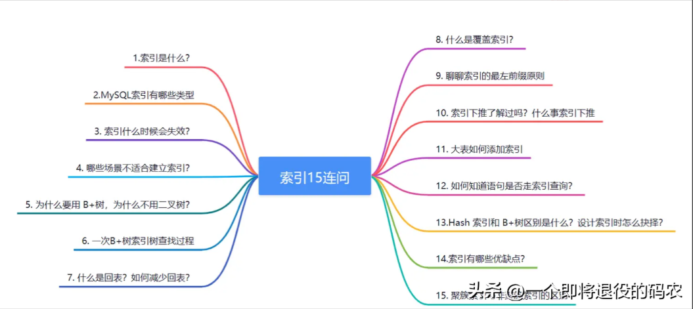
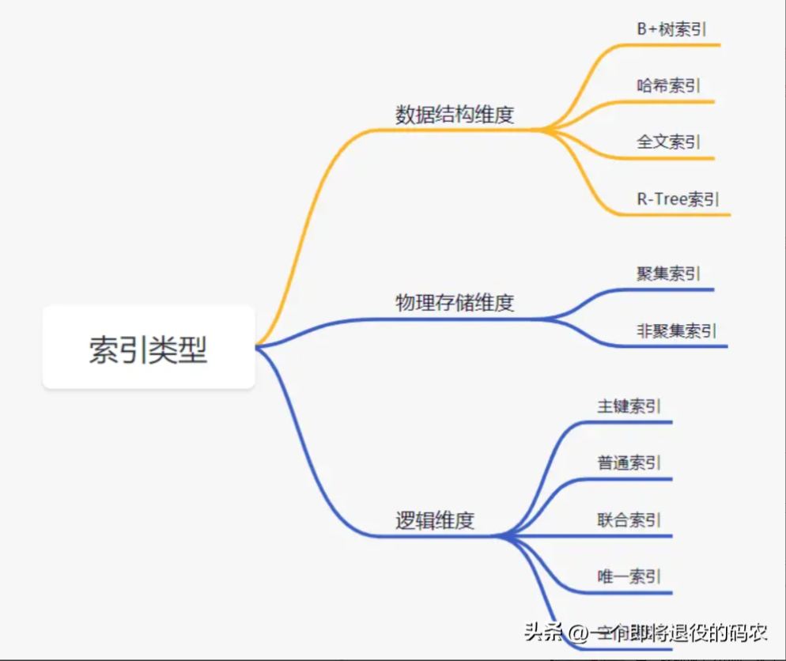

# 前言

# 1.索引是什么？
* 一种提高查询效率的数据结构
* 一般存储在磁盘文件中
* 过多索引影响插入更新性能

# 2.MySQL索引有哪些类型

## 数据结构维度
* B+树索引 所有数据存储在叶子节点，复杂度为O(logn)，适合范围查询
* 哈希索引 适合等值查询，检索效率高，一次到位
* 全文索引 MyISAM和InnoDB中都支持使用全文索引，一般在文本类型char,text,varchar类型上创建
* R-Tree索引 用来对GIS数据类型创建SPATIAL索引
## 物理存储维度
* 聚集索引 聚集索引就是以主键创建的索引，在叶子节点存储的是表中的数据。（Innodb存储引擎）
* 非聚集索引 非聚集索引就是以非主键创建的索引，在叶子节点存储的是主键和索引列。（Innodb存储引擎）
## 逻辑维度 
* 主键索引：一种特殊的唯一索引，不允许有空值。
* 普通索引：MySQL中基本索引类型，允许空值和重复值。
* 联合索引：多个字段创建的索引，使用时遵循最左前缀原则。
* 唯一索引：索引列中的值必须是唯一的，但是允许为空值。
* 空间索引：MySQL5.7之后支持空间索引，在空间索引这方面遵循OpenGIS几何数据模型规则。

# 3. 索引什么时候会失效？
* 查询条件包含or，可能导致索引失效
* 如果字段类型是字符串，where时一定用引号括起来，否则索引失效
* like通配符可能导致索引失效。
* 联合索引，查询时的条件列不是联合索引中的第一个列，索引失效。
* 在索引列上使用 mysql 的内置函数，索引失效。
* 对索引列运算（如，+、-、*、/），索引失效。
* 索引字段上使用（！= 或者 < >，not in）时，可能会导致索引失效。
* 索引字段上使用is null， is not null，可能导致索引失效。
* 左连接查询或者右连接查询查询关联的字段编码格式不一样，可能导致索引失效。
* mysql 估计使用全表扫描要比使用索引快,则不使用索引。

# 4. 哪些场景不适合建立索引？
* 数据量少的表，不适合加索引
* 更新比较频繁的字段也不适合加索引
* 区分度低的字段不适合加索引（如性别）
* where、group by、order by等后面没有使用到的字段，不需要建立索引
* 已经有冗余的索引的情况（比如已经有a,b的联合索引，不需要再单独建立a索引）

# 5. 为什么要用 B+树，为什么不用二叉树？
可以从几个维度去看这个问题，查询是否够快，效率是否稳定，存储数据多少， 以及查找磁盘次数，为什么不是二叉树，为什么不是平衡二叉树，为什么不是 B 树，
而偏偏是 B+树呢？

## 为什么不是一般二叉树？
如果二叉树特殊化为一个链表，相当于全表扫描。平衡二叉树相比于二叉查找 树来说，查找效率更稳定，总体的查找速度也更快。

## 为什么不是平衡二叉树呢？
我们知道，在内存比在磁盘的数据，查询效率快得多。如果树这种数据结构作 为索引，那我们每查找一次数据就需要从磁盘中读取一个节点，也就是我们说 的一个磁盘块，
但是平衡二叉树可是每个节点只存储一个键值和数据的，如果 是 B 树，可以存储更多的节点数据，树的高度也会降低，因此读取磁盘的次数 就降下来啦，查询效率就快啦。

# 转载
[MySQL索引15连问，扛住！
](https://www.toutiao.com/article/7225787837130588672/?app=news_article&timestamp=1684287814&use_new_style=1&req_id=20230517094334615A78C9C8B85A45BB55&group_id=7225787837130588672&wxshare_count=1&tt_from=weixin&utm_source=weixin&utm_medium=toutiao_android&utm_campaign=client_share&share_token=fddd6039-c426-40d6-ab74-2fcbcc8b0a76&source=m_redirect&wid=1684287888092)