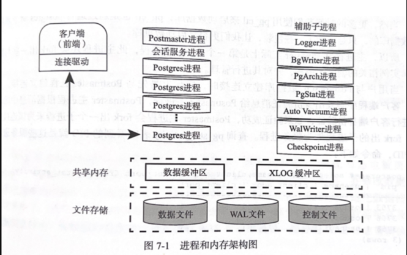

# 简介
PostgresSQL修炼之道，从小工到专家（第二版）。   


## 和mysql对比
* 支持的sql比mysql 丰富，可用用来做数仓
* 性能优化工具与度量信息丰富
* 在线DDL强，增加空值列瞬间完成，支持在线添加索引
* 从9.1开始，支持同步复制，实现数据零丢失方案

<!--more-->


# PostgresSQL的安装与配置

## 使用docker拉起
```
docker run --name mypostgres -e POSTGRES_PASSWORD=123456 -e POSTGRES_USER=postgres --restart=always -d -p 5432:5432 postgres 

```

## 配置
```
# 执行程序目录
export PATH=/usr/local/pgsql/bin:$PATH
# 共享库目录
exprot LB_LIBRARY_PATH=/usr/local/pgsql/lib
```
环境变量生效： 
1. /etc/profile 对所有用户生效
2. ~/.bashrc 对某个用户生效（linux）
3. ~/.profile 对某个用户生效（unix）

## 创建数据库实例
指定数据库数据目录的环境变量：  
export PGDATA=/home/osdba/pgdata   
创建数据库实例：  
initdb


## 基本操作
* pg_ctl start -D $PGDATA 启动数据库
* pg_ctl stop -D $PGDATA -m smrat|fast|immediate  关闭数据库，推荐fast

## 配置文件
* $PGDATA/postgresql.conf
* $PGDATA/pg_hba.conf


# psql工具 
## psql操作  
* \l 显示数据库表
* \c 切换数据库
* \d 显示数据表
* \d table 显示表定义
* \dn 显示所有schema
* \b 显示所有表空间，一个表空间对应一个目录
* \pset 格式化输出,例如：\pset border 2
* \o 将接下来的查询输出到文件‘
* \x 将行换成列输出
* \i <文件名> 执行外部文件中的sql 也可使用：psql -f <文件名>，执行文件sql

# 数据类型
* 布尔
* 数值，整数，浮点，精确小数（numeric和decimal等效），序列类型（serial,bigserial）,货币类型(money)
* character varying （varchar） 变长 最长支持1GB，声明时不带长度，表示接受任意长度；其他数据库中定长有一定的性能优势，pg里面没有差别，推荐使用text或varchar
* character (char) 定长
* bytea 二进制类型
* bit 位图

## 日期类型
* timestamp [without time zone] 日期和时间
* date 日期
* time [without time zone] 时间（一天以内的）
* interval 时间间隔

### 时间函数
* CURRENT_DATE
* CURRENT_TIME 带时区
* CURRENT_TIMESTAMP 带时区
* LOCALTIME 不带时区
* LOCALTIMESTAMP 不带时区
* extract 从日期/时间数值中抽取子域。

## 网络地址类型 （特有）
* cidr IPV4,IPV6网络地址，带子网掩码
* inet IPV4,IPV6网络地址，不带子网掩码
* macaddr 以太网MAC地址

## JSON类型 （特有）
json类型从9.3开始提供，9.4中开始提供jsonb(比json高效)  
jsonb 支持建立索引，json不支持。  
jsonb 上可以建立GIN索引，jsonb_ops(k,v都会建立索引),jsonb_path_ops（只对k建立索引）

## 数组（特有）
数组的定义就是通过在数组元素类型后面附加方括号“[]”.  方括号中可以指定数字，但是时无效的，不会限制数组的长度。 
访问数组，下标，切片


## 其它类型
* UUID ,默认没有提供生产UUID的函数，contrib的uuid-ossp模块提供了生产UUID的函数。
* pg_lsn LSN(Log Sequence Number) 记录WAL日志的位置

# 逻辑结构管理
* 数据库，一个PostgreSQL数据库服务可以管理多个数据库，应用连接到数据库只能操作当前数据库中的数据（使用DBLink可以访问其他数据库）
* 表，索引 一个数据库中有多个表多个索引
* 数据行，每张表中有多行数据


## 数据库
创建时的参数：  
* owner 数据库属于那个用户
* encoding 数据库编码，pg不支持GBK,使用UTF8支持汉字。
* tablespace 表空间
* connlimit 并发连接数，默认-1，没有限制 
> 在事务中不能删除数据库，可以修改数据库。


## 模式(Schema)
模式是数据库领域的一个基本概念，有些数据库把模式和用户合二为一了，PostgreSQL是有清晰的模式定义。  
模式可以理解为 一个命名空间或目录。 PostgreSQL中一个连接只能访问一个数据库，MySQL中一个连接可以访问多个数据库，就这一点而言，Schema等同于
MySQL中database.   
Oracle中，一个用户对应一个Schema

模式的作用：
1. 允许多个用户使用同一个数据库且用户之间不会相互干扰
2. 把数据库对象放在不同的模式下组织成逻辑，使数据库对象便于管理
3. 第三方应用可以放在不同的模式下。   

将PG作为数仓的时候，将业务侧的不同database对应不同的模式非常合适。  

公共模式（public）   默认模式


## 表
* 表的存储属性  PostgreSQL页的大小固定（通常为8KB），当存储某一行的内容超过8K就会使用TOAST(The Oversized-Attribute Storage Technique) 技术来存储行。
* 临时表 PostgreSQL支持两种，会话级的临时表，事务级的临时表
* UNLOGGED表， 不产生WAL日志，无灾在主备库直接同步，“半临时表”
* 默认值
* 约束 包括：检查约束（CHECK），非空约束，唯一约束，主键，外键约束。

### 修改表
* 增加字段
* 删除字段
* 增加约束
* 删除约束
* 修改默认值
* 删除默认值
* 修改字段数据类型
* 重命名字段
* 重命名表

## 表空间
有时我们需要把不同的表放到不同的存储介质或文件系统下。  
表空间实际上是为表指定一个存储目录。在创建数据库时可以为其指定默认的表空间。创建索引的时候可以指定表空间，这样表，索引就可以存储到表空间对应的目录下。 


## 视图
视图就是查询语句定义的虚拟表。其作用：  
1. 可使复杂的查询易于理解和使用
2. 安全原因，视图可以隐藏一些数据
3. 把一些函数返回的结果映射成视图


## 索引
索引是数据库中的一种快速查询数据的方法。索引中记录了表中的一列货多列值与其物理位置之间的对应关系。  
建立索引的好处是加快对表中记录的查找或排序，索引的代价：  
1. 增加了数据库的存储空间
2. 在插入和修改数据库时要花费较多的时间，因为索引也要随之更新。  

### PG索引分类
* BTree 最常用的索引，适合处理等值查询和范围查询
* HASH 处理简单的等值
* GiST 不是具体的索引类型，而是一种架构
* SP-GiST  空间分区GiST索引
* GIN 反转索引，处理包含多个键的值，如数组等。

### 并发创建索引
通常情况下，创建索引PostgreSQL会锁定表以防止写入，可以读，但插入，更新，删除等操作将一直阻塞，直到索引创建完毕。   
PostgreSQL 支持在不长时间阻塞更新的情况创建索引， CREATE INDEX CONCURRENTLY   
并发创建索引，建立索引的时间会变长，但不会阻塞写入。  


### 删除索引
* DROP INDEX   有依赖会报错
* DROP INDEX CASCADE 如果有依赖，如外键，一并删除
* 删除唯一索引，因为唯一索引是约束，所以需要使用修改表的方式来删除约束：ALTER TABLE table DROP CONSTRAINT index;  
   
## 用户及权限管理
PostgresSQL 角色和用户是没有区别的，用户即角色，可以把用户的权限赋给另一个用户  
CREATE ROLE 和CREATE USER 的区别在于 user是可以登录的，role不能。  

在PostgreSQL中，删除以及任意修改对象的权限都不能赋予别人，它是所有者固定的权限，不能赋予和撤销。

用户的权限分为两类：
创建用户时指定的权限，可以通过ALTER ROLE来修改： 
1. 超级用户的权限
2. 创建数据库的权限
3. 是否允许LOGIN的权限。 

另一类是由GRANT命令和REVOKE来管理的：  
1. 创建模式（SCHEMA）
2. 允许在指定的数据库中创建临时表的权限
3. 连接某个数据库的权限
4. 在模式中创建数据库对象的权限，如创建表，视图，函数等
5. 在一些表中 CRUD的权限
6. 在具体表的列上SELECT,UPDATE,INSERT
7. 对序列进行查询，使用，更新的权限
8. 创建触发器
9. 把表，索引等建到指定表空间的权限

## 事务，并发，锁
### ACID
* 原子性（A）事务必须一个整体单元的形式进行工作，对于其数据的修改，要么全都执行，要么全都不执行。 
* 一致性（C）在事务完成时，必须使所有的数据都保持在一致状态。
* 隔离性（I）事务查看数据时数据所处的状态，事务时不会查看中间状态的数据的。
* 持久性（D）事务完成后，它对于系统的影响时永久性的

### 事务隔离机制
事务情况下读数据可能出现的问题：  
1. 脏读 一个事务读取了另外一未提交事务写入的数据
2. 不可重复读 指一个事务重新读取前面读取过的数据时，发现该数据已经被另外一个已经提交的事务修改了。
3. 幻读 一个事务开始后，相同的查询条件（例如范围查询）两次读取，返回的数据不同

为解决读的问题，提出了4中隔离级别
1. 读未提交（Read Uncommitted）：这是最低的隔离级别，允许读取尚未提交的数据变更，可能会导致脏读、不可重复读和幻读。
2. 读已提交（Read Committed）：只允许读取已提交的数据，可以避免脏读，但是可能会出现不可重复读和幻读。 PostgreSQL默认级别
3. 可重复读（Repeatable Read）：在同一事务内，多次读取同一数据返回的结果是一致的，可以避免脏读和不可重复读，但是可能出现幻读。
4. 串行化（Serializable）：这是最严格的隔离级别，完全遵循ACID特性，所有的事务依次逐个执行，可以避免脏读、不可重复读和幻读。

| 隔离级别 | 脏读 | 不可以重复读 | 幻读 | 加锁读 |
|------|----|--------|--|-----|
| 读未提交 | ✓  | ✓      | ✓ | x   |
| 读已提交 | x  | ✓      | ✓ | x   |
| 可重复读 | x  | x      |  ✓| x   |
| 串行化  | x  | x      | x | ✓   |


PG中实际只有两种： 读已提交，串行化。  


## 两阶段提交
分布式系统中，事务中往往包含多台数据库上的操作，虽然单台数据库的操作能够保证原子性，多台数据库之间的原子性就需要通过两阶段提交来实现，两阶段提交
是实现分布式事务的关键。   

## 锁
### 表级锁
PostgreSQL有8中表锁，最普通的共享锁“SHARE” 和排它锁“EXCLUSIVE”   
因为多版本的原因，修改一条数据的同时允许读数据，为了处理这种情况，加了两种锁 “ACCESS SHARE”,“ACCESS EXCLUSIVE”。  
为处理表锁和行锁的关系，有了意向锁的概念，意向共享锁（ROW SHARE）和意向排它锁 (ROW EXCLUSIVE)。  
由于意向锁之间不会冲突，于是又加入了更严格的锁 SHARE UPDATE EXCLUSIVE和 SHARE ROW EXCLUSIVE。

总共有8种表锁。

### 行级锁
* 共享锁 （读锁）
* 排它锁 （写锁）

由于有多版本的实现，所以实际读取行数据时，并不会在行上执行任何锁，包括共享锁. 

显示的行级锁命令：   
SELECT ... FOR {UPDATE|SHARE} [OF table_name] [NoWAIT]

### 死锁及防范
PostgreSQL可以自动侦测到死锁，然后随机退出其中一个事务。  
持有排它锁的时间越长也就越容易导致死锁，所以在进行程序设计时要尽量短时间地持有排它锁。 


### 锁的查看
查询系统视图pg_locks. 
```
select locktype,relation::regclass as rel,virtualxid as xid,virtualtransaction as vxid2,pid,mode,granted from pg_locks;
```

# PostgreSQL核心架构
## 进程及内存结构
PostgreSQL是进程架构模型。   
MySQL是线程架构模型。  



### 主进程Postmaster 
主进程Postmaster是整个数据库实例的总控进程，负责启动和关闭数据库实例。   
客户端连接数据库时，Postmaster主进程会fork出一个字进程来为该连接服务。  
查询pg_stat_activity看到的PID是服务进程的PID    

### Logger系统日志进程介绍
postgresql.conf 中logging_collect on，主进程会启动Logger辅助进程。 

### BgWriter后台写进程
BgWriter辅助进程是把共享内存中的脏页写到磁盘上的进程。  

### WalWriter预写式日志
WAL （Write Ahead Log）预写式日志是修改数据之前必须把这些修改操作记录写到磁盘中，这样后面更新实际数据时就不需要实时地把数据持久化到文件中。  
WAL 日志保存在pg_xlog下，默认时16MB.  可以保证在宕机后，未持久化的数据都可以通过WAL日志来恢复，那些不需要的WAL日志被自动覆盖。 

### PgArch 归档进程
WAL 日志循环使用会被覆盖，PgArch归档进程会在覆盖前把WAL日志备份出来。

### AutoVacumm 自动清理
对表进行DELETE后，原有数据并不会立即删除，由于mvcc的“多版本”控制，原数据只是被标识为删除状态，只有在没有并发的其他事务读到这些旧数据时，才会
将其清除。  
这个清除工作由 AutoVacumm 辅助进程负责。 

### PgStat 统计数据收集进程
主要做数据的统计收集工作。  

### 共享内存
PostgreSQL启动后会生成一块共享内存，共享内存主要用作数据块的缓冲区，以便提高读写性能。   

### 本地内存
后台服务进程除访问共享内存以外，还会申请分配一些本地内存，以便暂存一些不需要全局存储的数据  
* 临时缓冲区
* work_mem
* maintenance_work_mem


## 存储结构
数据库存储结构，一般分为逻辑存储结构和物理存储结构。   

### 逻辑存储结构
包括表，索引，视图，函数等。   
### 物理结构


## 应用程序访问接口
不同的编程语言使用不同的驱动程序连接到PostgreSQL数据库上，总的来说驱动分为两类：   
* 使用纯语言实现的PostgreSQL驱动，如JDBC，.NET,纯go语言实现的pgx，这种方式不需要libpg库
* 通过包装PostgresSQL的C语言接口库libpg实现的驱动，比如python下的psycopg,Perl的DBD::pg模块，ODBC等。 

一般情况下，各种应用通过TCP/IP连接到PostgreSQL数据库。  
本地连接可以走 UNIX domain sockets   


