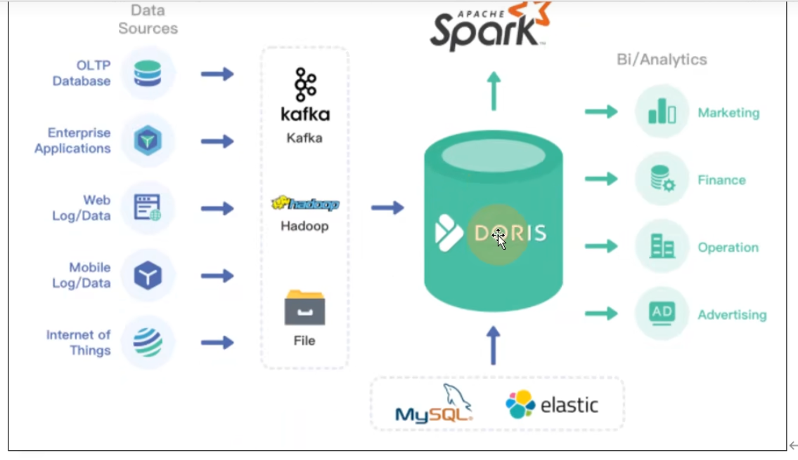
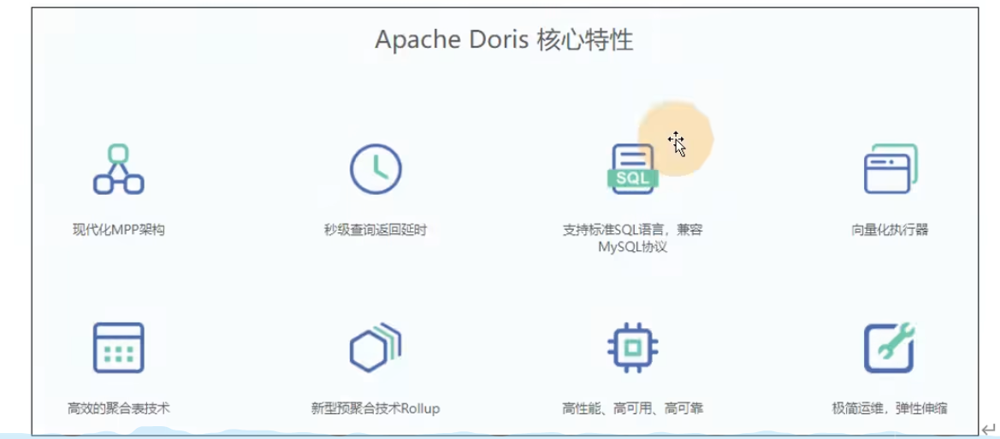
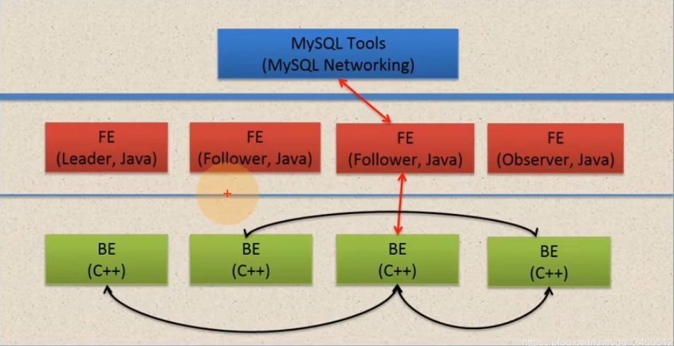

# 简介
由百度大数据部研发，之前叫百度Palo,2018年贡献到Apache社区，更名Doris  

一个现代化的MPP分析型数据库产品。 
* 亚秒级响应
* 架构非常简洁，易于运维
* 支持10PB以上的超大数据集

满足多种数据分析需求
* 固定历史报表
* 实时数据分析
* 交互式数据分析
* 探索式数据分析

特性：   

<!--more-->

# Doris 架构

Doris 的架构很简洁，只设 FE(Frontend),BE(Backend)两种角色，两个进程，不依赖于外部组件，方便部署和运维，FE和BE都可以在线扩展

## FE(Frontend)
存储，维护集群元数据；负责接收，解析查询请求，规划查询计划，调度查询执行，返回查询结果。主要有三个角色：
1. Leader和Follower: 主要是用来达到元数据的高可用，保证单节点宕机的情况下，元数据能够实时的在线恢复，而不影响整个业务。
2. Observer: 用来扩展查询节点，同时起到元数据备份的作用。如果在发现集群压力非常大的情况下，需要去扩展整个查询的能力，那么可以加observer的节点。observer不参与任何的写入，只参与读取

## BE(Backend)
负责物理数据的存储和计算；依据FE生成的物理计划，分布式地执行查询。  
数据的可靠性由BE保证，BE 会对整个数据存储多副本或者三副本；副本数可根据需求动态调整

## MySQL Client
Doris 借助MySQL协议，用户使用任意MySQL的ODBC/JDBC 以及MySQL的客户端，都可以直接访问Doris

## Broker
Broker 为一个独立的无状态进程。封装了文件系统接口，提供Doris读取远端存储系统中文件的能力，包括HDFS，S3,BOS等

# 编译与安装
文档地址： https://doris.apache.org/zh-CN/docs/gettingStarted/what-is-apache-doris   

