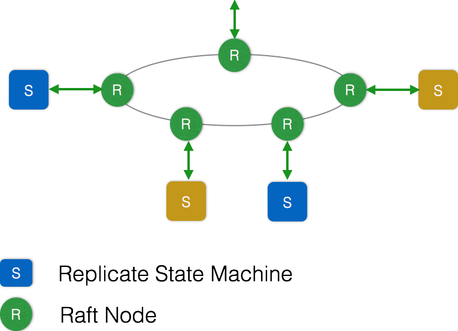

## 什么是Etcd

### 概述
etcd是CoreOS团队于2013年6月发起的开源项目，它的目标是构建一个高可用的分布式键值(key-value)数据库。etcd内部采用raft协议作为一致性算法，etcd基于Go语言实现。
<!--more-->

## 核心特性
* 将数据存储在集群中的高可用K-V存储
* 允许应用实时监听存储中的K-V的变化
* 能够容忍单点故障，能够应对网络分区

### 架构
Etcd主要分为4个部分
* HTTP Server： 用于处理用户发送的API请求以及其它etcd节点的同步与心跳信息请求。
* Store：用于处理etcd支持的各类功能的事务，包括数据索引、节点状态变更、监控与反馈、事件处理与执行等等，是etcd对用户提供的大多数API功能的具体实现
* Raft：Raft强一致性算法的具体实现，是etcd的核心。
* WAL：Write Ahead Log（预写式日志），是etcd的数据存储方式。除了在内存中存有所有数据的状态以及节点的索引以外，etcd就通过WAL进行持久化存储。WAL中，所有的数据提交前都会事先记录日志。Snapshot是为了防止数据过多而进行的状态快照；Entry表示存储的具体日志内容。
通常，一个用户的请求发送过来，会经由HTTP Server转发给Store进行具体的事务处理，如果涉及到节点的修改，则交给Raft模块进行状态的变更、日志的记录，然后再同步给别的etcd节点以确认数据提交，最后进行数据的提交，再次同步。

## 主要应用场景
### 服务发现
服务发现要解决的也是分布式系统中最常见的问题之一，即即在同一个分布式集群中的进程或服务，要如何才能找到对方并建立连接。本质上来说，服务发现就 是想要了解集群中是否有进程在监听udp或tcp端口，并且通过名字就可以查找和连接。要解决服务发现的问题，需要有下面三大支柱，缺一不可。  
* 一个强一致性、高可用的服务存储目录  
基于Raft算法的etcd天生就是这样一个强一致性高可用的服务存储目录。
* 一种注册服务和监控服务健康状态的机制。  
用户可以在etcd中注册服务，并且对注册的服务设置key TTL，定时保持服务的心跳以达到监控健康状态的效果。
* 一种查找和连接服务的机制
通过在etcd指定的主题下注册的服务也能在对应的主题下查找到。为了确保连接，我们可以在每个服务机器上都部署一个Proxy模式的etcd，这样就可以确保能访问etcd集群的服务都能互相连接。  

### 配置共享
etcd 提供watch机制，实时读取配置信息，分布式应用中会有多个程序，每个程序都需要记录一些配置信息，如mysql，redis,连接信息，如果这些信息发生变动，成千上百的容器，要去手动更改配置，将是一场噩梦，
通过etcd的watch机制去监听配置信息，实时进行改变

### 分布式锁
因为etcd使用Raft算法保持了数据的强一致性，某次操作存储到集群中的值必然是全局一致的，所以很容易实现分布式锁。锁服务有两种使用方式，一是保持独占，二是控制时序。  
* 保持独占即所有获取锁的用户最终只有一个可以得到。  
etcd为此提供了一套实现分布式锁原子操作CAS（CompareAndSwap）的API。通过设置prevExist值，可以保证在多个节点同时去创建某个目录时，只有一个成功。而创建成功的用户就可以认为是获得了锁。
* 控制时序,即所有想要获得锁的用户都会被安排执行，但是获得锁的顺序也是全局唯一的，同时决定了执行顺序。  
etcd为此也提供了一套API（自动创建有序键），对一个目录建值时指定为POST动作，这样etcd会自动在目录下生成一个当前最大的值为键，存储这个新的值（客户端编号）。同时还可以使用API按顺序列出所有当前目录下的键值。此时这些键的值就是客户端的时序，而这些键中存储的值可以是代表客户端的编号。

### 概念词汇
* Raft：etcd所采用的保证分布式系统强一致性的算法。
* Node：一个Raft状态机实例。
* Member： 一个etcd实例。它管理着一个Node，并且可以为客户端请求提供服务。
* Cluster：由多个Member构成可以协同工作的etcd集群。
* Peer：对同一个etcd集群中另外一个Member的称呼。
* Client： 向etcd集群发送HTTP请求的客户端。
* WAL：预写式日志，etcd用于持久化存储的日志格式。
* snapshot：etcd防止WAL文件过多而设置的快照，存储etcd数据状态。
* Proxy：etcd的一种模式，为etcd集群提供反向代理服务。
* Leader：Raft算法中通过竞选而产生的处理所有数据提交的节点。
* Follower：竞选失败的节点作为Raft中的从属节点，为算法提供强一致性保证。
* Candidate：当Follower超过一定时间接收不到Leader的心跳时转变为Candidate开始竞选。
* Term：某个节点成为Leader到下一次竞选时间，称为一个Term。
* Index：数据项编号。Raft中通过Term和Index来定位数据

## ETCD工作原理
ETCD使用Raft协议来维护集群内各个节点状态的一致性。简单说，ETCD集群是一个分布式系统，由多个节点相互通信构成整体对外服务，每个节点都存储了完整的数据，并且通过Raft协议保证每个节点维护的数据是一致的。

如图所示，每个ETCD节点都维护了一个状态机，并且，任意时刻至多存在一个有效的主节点。主节点处理所有来自客户端写操作，通过Raft协议保证写操作对状态机的改动会可靠的同步到其他节点。

### 选主
Raft协议是用于维护一组服务节点数据一致性的协议。这一组服务节点构成一个集群，并且有一个主节点来对外提供服务。当集群初始化，或者主节点挂掉后，面临一个选主问题。集群中每个节点，任意时刻处于Leader, Follower, Candidate这三个角色之一。选举特点如下：  

* 当集群初始化时候，每个节点都是Follower角色；  
* 集群中存在至多1个有效的主节点，通过心跳与其他节点同步数据；  
当Follower在一定时间内没有收到来自主节点的心跳，会将自己角色改变为Candidate，并发起一次选主投票；当收到包括自己在内超过半数节点赞成后，选举成功；当收到票数不足半数选举失败，或者选举超时。若本轮未选出主节点，将进行下一轮选举（出现这种情况，是由于多个节点同时选举，所有节点均为获得过半选票）。  
Candidate节点收到来自主节点的信息后，会立即终止选举过程，进入Follower角色。  
为了避免陷入选主失败循环，每个节点未收到心跳发起选举的时间是一定范围内的随机值，这样能够避免2个节点同时发起选主。

### 日志复制
所谓日志复制，是指主节点将每次操作形成日志条目，并持久化到本地磁盘，然后通过网络IO发送给其他节点。其他节点根据日志的逻辑时钟(TERM)和日志编号(INDEX)来判断是否将该日志记录持久化到本地。当主节点收到包括自己在内超过半数节点成功返回，那么认为该日志是可提交的(committed），并将日志输入到状态机，将结果返回给客户端。  

这里需要注意的是，每次选主都会形成一个唯一的TERM编号，相当于逻辑时钟。每一条日志都有全局唯一的编号。  

主节点通过网络IO向其他节点追加日志。若某节点收到日志追加的消息，首先判断该日志的TERM是否过期，以及该日志条目的INDEX是否比当前以及提交的日志的INDEX跟早。若已过期，或者比提交的日志更早，那么就拒绝追加，并返回该节点当前的已提交的日志的编号。否则，将日志追加，并返回成功。  

当主节点收到其他节点关于日志追加的回复后，若发现有拒绝，则根据该节点返回的已提交日志编号，发生其编号下一条日志。  

主节点像其他节点同步日志，还作了拥塞控制。具体地说，主节点发现日志复制的目标节点拒绝了某次日志追加消息，将进入日志探测阶段，一条一条发送日志，直到目标节点接受日志，然后进入快速复制阶段，可进行批量日志追加。

按照日志复制的逻辑，我们可以看到，集群中慢节点不影响整个集群的性能。另外一个特点是，数据只从主节点复制到Follower节点，这样大大简化了逻辑流程。

### 数据安全性
截止此刻，选主以及日志复制并不能保证节点间数据一致。试想，当一个某个节点挂掉了，一段时间后再次重启，并当选为主节点。而在其挂掉这段时间内，集群若有超过半数节点存活，集群会正常工作，那么会有日志提交。这些提交的日志无法传递给挂掉的节点。当挂掉的节点再次当选主节点，它将缺失部分已提交的日志。在这样场景下，按Raft协议，它将自己日志复制给其他节点，会将集群已经提交的日志给覆盖掉。  

其他协议解决这个问题的办法是，新当选的主节点会询问其他节点，和自己数据对比，确定出集群已提交数据，然后将缺失的数据同步过来。这个方案有明显缺陷，增加了集群恢复服务的时间（集群在选举阶段不可服务），并且增加了协议的复杂度。  
Raft解决的办法是，在选主逻辑中，对能够成为主的节点加以限制，确保选出的节点已定包含了集群已经提交的所有日志。如果新选出的主节点已经包含了集群所有提交的日志，那就不需要从和其他节点比对数据了。简化了流程，缩短了集群恢复服务的时间。

这里存在一个问题，加以这样限制之后，还能否选出主呢？答案是：只要仍然有超过半数节点存活，这样的主一定能够选出。因为已经提交的日志必然被集群中超过半数节点持久化，显然前一个主节点提交的最后一条日志也被集群中大部分节点持久化。当主节点挂掉后，集群中仍有大部分节点存活，那这存活的节点中一定存在一个节点包含了已经提交的日志了。

## 集群节点数量
etcd推荐使用奇数作为集群节点个数。因为奇数个节点和其配对的偶数个节点相比，容错能力相同，却可以少一个节点。综合考虑性能和容错能力，etcd官方文档推荐的etcd集群大小是3,5,7。由于etcd使用是Raft算法，每次写入数据需要有2N+1个节点同意可以写入数据，所以部分节点由于网络或者其他不可靠因素延迟收到数据更新，但是最终数据会保持一致，高度可靠。随着节点数目的增加，每次的写入延迟会相应的线性递增，除了节点数量会影响写入数据的延迟，如果节点跟接节点之间的网络延迟，也会导致数据的延迟写入。

* 节点数并非越多越好，过多的节点将会导致数据延迟写入。
* 节点跟节点之间的跨机房，专线之间网络延迟，也将会导致数据延迟写入。
* 受网络IO和磁盘IO的延迟
* 为了提高吞吐量，etcd通常将多个请求一次批量处理并提交Raft，
* 增加节点，读性能会提升，写性能会下降，减少节点，写性能会提升。
