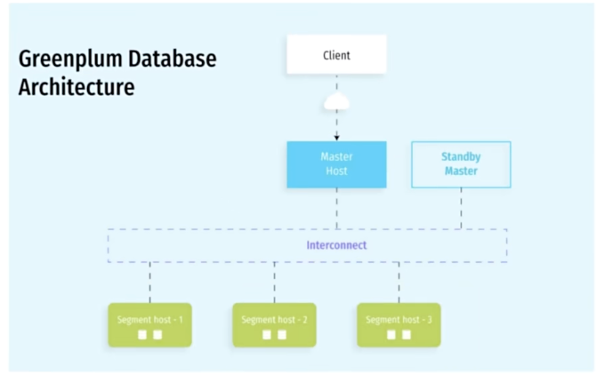
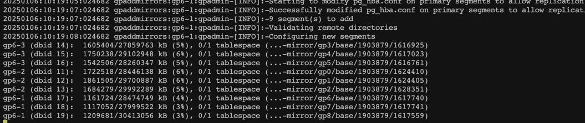
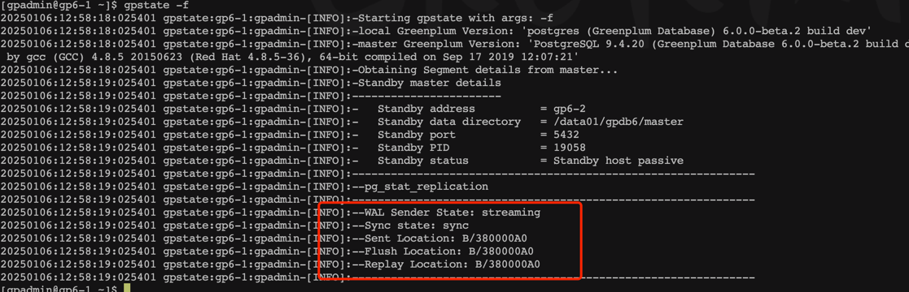
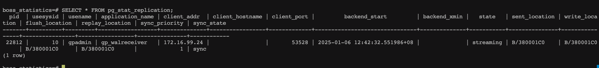
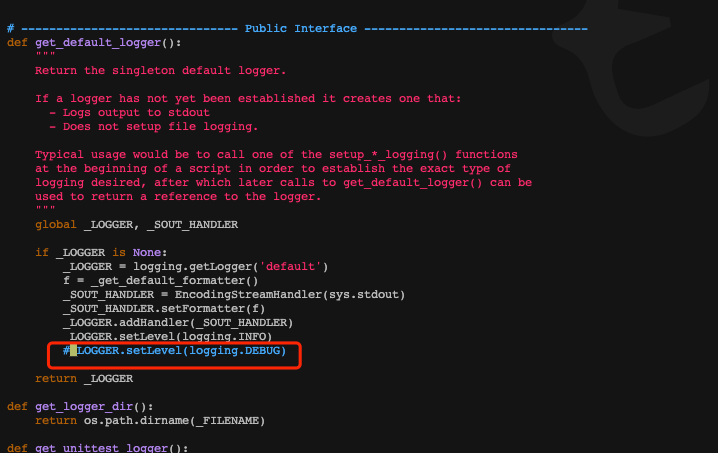

# 简介

## MPP架构
MPP(Massively Parallel Processing，大规模并行处理) 架构是一种用于处理大规模数据的计算架构，它通过将任务分配给多个处理单元并行执行，以提高处理速度和性能。  

* 分布式存储： MPP数据库通常使用分布式存储架构，将数据分散存储在多个节点上。每个节点都有自己的存储单元，这样可以提高数据的读取速度和写入速度。  
* 并行处理：MPP架构通过将任务拆分成小块，并同时在多个处理单元上执行这些任务来实现并行处理。每个处理单元负责处理数据的一个子集然后将结果合并以生成最终的输出
* 共享无状态架构：MPP系统通常采用共享无状态的架构，即每个节点之间没有共享的状态，这使得系统更容易水平扩展，因为可以简单地添加更多的节点，而不需要共享状态的复杂管理
* 负载均衡：MPP数据库通常具有负载均衡机制，确保任务在各个节点上均匀分布，避免某些节点成为性能瓶颈
* 高可用性：为了提高系统的可用性，MPP架构通常设计成具有容错和故障恢复机制。如果一个节点出现故障，系统可以继续运行下去，而不会丢失数据和中断服务

一些知名的MPP架构的数据库包括：Teradata,Greenplum,Amazon Redshift等。 
MPP架构通过将任务分布到多个节点并行执行，以及有效地利用分布式存储和处理的方式，提供了一种高性能，可伸缩的数据处理方案，是用于处理大规模数据的场景

## 什么是GreenPlum
GreenPlum是基于开源PostgreSQL的分布式数据库，采用shared-nothing架构，即主机，操作系统，内存，存储，都是每台服务器独立自我控制，不存在共享。  

GreenPlum本质上是一个关系型数据库集群，实际上是由多个独立的数据库服务组合而成的一个逻辑数据库。这种数据库采取的是MPP架构

## GreenPlum组成
   

GreenPlum数据库是由Master Server,Segment Server和Interconnect 三部分组成，Master Server和Segment Server的互联使用的是Interconnect   

GreenPlum是一个关系型数据库，由数个独立的数据服务组合成逻辑数据库，整个集群由多个数据节点（Segment Host）和控制节点（Master Host）组成。  
在典型的Shared-Nothing中，每个节点上所有的资源的CPU，内存，磁盘都是独立的，每个节点都只有全部数据的一部分，也只能使用本节点的数据资源。  
在GreenPlum中，需要存储的数据在进入到表时，将先进行数据分布的处理工作，将一个表中的数据平均分布到每个节点上，并为每个表指定一个分布列（Distribute Column），
之后便根据Hash来分布数据，基于Shared-Nothing的原则，GreenPlum这样处理可以充分发挥每个节点IO的处理能力

### Master节点
整个系统的控制中心和对外服务接入点，它负责接收用户的SQL请求，将SQL生成的查询计划进行并行处理优化，然后将查询计划分配到所有的Segment节点并进行处理，    
协调组织各个Segment节点按查询计划进行并行处理，最后获取到Segment的计算结果，再返回给客户端。  
从用户的角度看GreenPlum集群,看到的只是Master节点,无须关心集群内部的机制，所有的并行处理都是在Master控制下自动完成的。  
Master节点一般只有一个或二个

### Segment节点
是GreenPlum执行并行任务的并行计算节点，它接收Master的指令进行MPP并行计算，因此所有Segment节点的计算性总和就是整个集群的性能，通过增加Segment节点，
可以线性化的增加集群的处理性能和存储容量Segment节点可以是1～10000个节点


### Interconnect
是Master节点和Segment节点之间进行数据传输的组件，它基于千兆交换机或者万兆交换机实现数据在节点间的高速传输   
外部数据在加载到Segment时，采用并行数据流进行加载，直接加载到Segment节点，这项独特的技术是GreenPlum的专有技术，保证数据在最短的时间内加载到数据库中


## GreenPlum的优缺点
### 优点
* 数据存储 当今是个数据不断膨胀的时代，采取MPP架构的数据库系统可以对海量数据进行管理
* 高并发 GreenPlum利用强大并行处理能力提供并发支持
* 线性扩展 GreenPlum线性扩展支持为数据分析系统将来的拓展给予了技术上的保障，用户可根据实施需要进行容量和性能的扩展
* 高性价比 基于业界各种开放式平台，在普通的X86 Server上就能达到很高的性能 
* 反应速度  通过准实时，实时的数据加载方式，实现数据仓库的实时更新，进而实现动态的数据仓库（ADW）
* 高可用性 对于主节点，GreenPlum提供了Master/Stand by机制进行主节点容错，当主节点发生错误时，可以切换到StandBy节点继续服务
* 系统易用 GreenPlum基于流行的PostgreSQL之上开发，几乎所有的PostgreSQL客户端工具及PostgresSQL应用都能运行在GreenPlum平台上

### 缺点
* 主从双层架构，并非真正的扁平架构，存在性能瓶颈和SPOF单点故障
* 无法支持数据压缩状态下的DML操作，不易于数据的更新和维护
* 单个节点上的数据库没有并行和大内存使用能力，必须通过部署多个实例（segment server）来充分利用系统资源，造成使用和部署很复杂


# GreenPlum安装部署
## 安装地址
1. 官网地址 https://greenplum.org/
2. 文档地址 https://docs-cn.greenplum.org/v6/utility_guide/admin_utilities/gpinitsystem.html
3. 下载地址 https://support.broadcom.com/group/ecx/productdownloads?subfamily=VMware%20Tanzu%20Greenplum

## 环境准备
准备3个节点centos7：  
* hadoop102 (master)
* hadoop103 (segment1)
* hadoop104 (segment2)

## 安装前配置
### 检查安装依赖包
```
# 换源
rpm -ivh https://dl.fedoraproject.org/pub/epel/epel-release-latest-7.noarch.rpm

yum install -y coreutils glib2 lrzsz mpstat dstat sysstat e4fsprogs xfsprogs ntp readline-devel zlib-devel openssl-devel pam-devel libxml2-devel libxslt-devel python-devel tcl-devel gcc make smartmontools flex bison perl-devel perl-ExtUtils* openldap-devel jadetex  openjade bzip2 curl-devel curl apr-devel apr cmake3 python git iotop perf gcc-c++ dstat bzip2-devel krb5-devel libcurl-devel libevent-devel libkadm5 libyaml-devel libxml2-devel openssl-devel perl-ExtUtils-Embed python-devel sysstat python-pip xerces-c-devel
```

### 关闭SElinux
```
vim /etc/selinux/config
SELINUX=disabled
```

### 关闭防火墙 
```
systemctl stop firewalld
systemctl disable firewalld
```
### 操作系统参数配置
修改操作系统参数（/etc/sysctl.conf） 
vim /etc/sysctl.conf
```
kernel.shmal1 = 1019650
kernel.shmmax = 4176486400
＃设置系统范围内共享内存段的最大数量，默认 4096
kernel.shmmni = 4096
# See Segment Host Memory
# 主机内存
vm.overcommit_memory = 2
# See Segment Host Memory
vm.overcommit_ratio = 95
# See Port Settings 端口设定
net.ipv4.ip_local_port_range = 10000 65535
kernel.sem = 500 2048000 200 40960
kernel.sysrq = 1
kernel.core_uses_pid = 1
kernel.msgmnb = 65536
kernel.msgmax = 65536
kernel.msgmni = 2048
net.ipv4.tcp_syncookies = 1
net.ipv4.conf.default.accept_source_route = 0
net.ipv4.tcp max syn backlog = 4096
net.ipv4.conf.all.arp_filter = 1
net.core.netdev_max backlog = 10000
net.core.rmem_max = 2097152
net.core.wmem_max = 2097152
vm.swappiness = 10
vm.zone_reclaim_mode = 0
vm.dirty_expire_centisecs = 500
vm.dirty_writeback_centisecs = 100
# See System Memory
# 系统内存
vm.dirty_background_ratio = 3
vm.dirty_ratio = 10
```

#### 共享内存 （每台节点需要单独计算）
kernel.shmall=_PHYS_PAGES/2 系统可用的内存页总量的一半，可以用getconf _PHYS_PAGES 查看系统可用的内存页总量。  
```
echo $(expr $(getconf _PHYS_PAGES) / 2)
```
kernel.shmmax=kernel.shmall * PAGE_SIZE ,用getconf PAGE_SIZE获取页大小
```
echo $(expr $(getconf _PHYS_PAGES) / 2 \* $(getconf PAGE_SIZE))
```

#### 主机内存
vm.overcommit_memory 系统使用该参数来确定可以为进程分配多少内存，对于GP数据库，此参数应该设置为2。 
vm.overcommit_ratio 以为进程分配内存的百分比，其余部分留给操作系统，默认为50 ，建议设置为95

#### 端口设定
为避免在Greenplum初始化期间与其它应用程序端口冲突，指定的端口范围 net.ipv4.ip_local_port_range  
使用gpinitsystem初始化GreenPlum时，请不要在该范围内指定GreenPlum数据库端口。  

#### 系统内存
系统内存大于64G,建议一下配置：
vm.dirty_background_ratio=0  
vm.dirty_ratio=0  
vm.ditry_background_bytes=1610612736 #1.5GB   
vm.ditry_bytes=4294967296 #4GB   

系统内存<=64GB,移除vm.ditry_background_bytes,并设置以下参数：   
vm.dirty_background_ratio=3   
vm.dirty_ratio=10   


#### 系统资源限制
修改系统资源限制配置文件（/etc/security/limits.conf） ,添加以下参数：
```
* soft nofile 65536
* hard nofile 65536
* soft nproc 131072
* hard nproc 131072
```
"*" 代表所有用户。 
noproc 最大进程数。 
nofile 最大文件打开数。   

针对centos7 还需要修改 /etc/security/limits.d/20-nproc.conf
```
* soft nofile 65536
* hard nofile 65536
* soft nproc 131072
* hard nproc 131072
```

退出登录， ulimit -u 验证最大进程数，值为131072。  

#### ssh连接阀值
GreenPlum 数据库管理程序中的 gpexpand,gpinitsystem,gpaddmirrors 使用SSH连接来执行任务。在较大规模的GreenPlum集群中，程序的ssh连接数可能会超出
主机的未认证连接的最大限制，发生这种情况时，会收到以下错误：ssh_exchange_identification: Connection closed by remote host   
为避免这种情况，可以更新/etc/ssh/sshd_config 或者 /etc/sshd_config的MaxStartups和MaxSessions参数。 
```
vim /etc/ssh/sshd_config  
MasSessions 200
MaxStartups 100:30:1000
```

#### 修改字符集
检查主机的字符集，字符集必须是en_US.UTF-8   
echo $LANG

设置字符集：localectl set-locale LANG=en_US.UTF-8

#### 确保集群时钟同步
如果集群时间不一致，每台节点执行：
```
ntpdate cn.pool.ntp.org
```

## 安装GreenPlum
### 创建gpadmin组以及用户
```
groupadd gpadmin
useradd gpadmin -r -m -g gpadmin
passwd gpadmin
```
### 给gpadmin设置用户具有root权限，方便后期添加sudo执行root权限的命令
```
vim /etc/sudoers
gpadmin ALL=(ALL) NOPASSWD:ALL
```
### 配置节点间的免密登录，每台节点生成ssh key,在gpadmin下执行
```
ssh-keygen -t rsa
ssh-copy-id hadoop102
ssh-copy-id hadoop103
ssh-copy-id hadoop104
```


### 配置GreenPlum的ssh权限互通设置（在master节点配置）
```
mkdir -p /home/gpadmin/conf

vim /home/gpadmin/conf/hostlist
hadoop102
hadoop103
hadoop104


vim /home/gpadmin/conf/seg_hosts
hadoop103
hadoop104


```
### 先上传GreenPlum软件安装包，然后执行rpm安装，
```
# 上传到这个目录
mkdir -p /home/gpadmin/software

# 安装
sudo yum install •/open-source-greenplum-db-6.25.3-rhe17-x86_64.rpm

# 将安装完的程序目录赋予gpadmin
sudo chown -R gpadmin:gpadmin /usr/local/greenplum-db*
```

### 使用gpssh-exkeys 打通所有服务器（master节点操作）
```
cd /usr/local/greenplum-db-6.25.3
source /usr/local/greenplum-db-6.25.3/greenplum_path.sh

gpssh-exkeys -f /home/greenplum/conf/hostlist
```

### 环境变量配置.bashrc (所有节点gpadmin用户操作)
```
# 创建greenplum主节点数据
mkdir -p /home/gpadmin/data/master 


cat <<EOF >> /home/gpadmin/.bashrc
source /usr/local/greenplum-db/greenplum_path.sh
export PGPORT=5432
export PUSER=gpadmin
export MASTER_DATA_DIRECTORY=/home/gpadmin/data/master/gpseg-1
export PGDATABASE=gp_sydb
export LD_PRELOAD=/1ib64/libz.so.1 ps
EOF

```

source /home/gpadmin/.bashrc


### 配置GPHOME
```
vim /usr/local/greenplum-db/greenplum_path.sh
GPHOME=/usr/local/greenplum-db
```

### 创建数据文件夹
创建各个节点的数据文件夹，该步骤之后 hostlist文件包含机器下都会创建data目录，data目录下都会创建mater,primary,mirror文件夹。 
gpssh -f /home/gpadmin/conf/hostlist
=> mkdir data
=> cd data
=> mkdir master
=> mkdir primary
=> mkdir mirror

### 连通性检查（主节点gpadmin用户操作）
```
gpcheckperf -f /home/gpadmin/conf/hostlist -r N -d /tmp
```

## 初始化集群
### 创建初始化配置文件（master节点gpadmin用户操作）
1. 创建gpinitsystem_config
```
mkdir /home/gpadmin/gpconfigs

cp /usr/local/greenplum-db/docs/cli_help/gpconfigs/gpinitsystem_config  /home/gpadmin/gpconfigs/gpinitsystem_config

vim /home/gpadmin/gpconfigs/gpinitsystem_config 
# 设置主数据节点存储位置，括号里面有几个代表每台主机创建几个postgreSQL数据库实例，即segment的实例数量
declare -a DATA_DIRECTORY=(/home/gpadmin/data/primary /home/gpadmin/data/primary)
# 主节点hostname
MASTER_HOMENAME=hadoop2
# master数据目录
MASTER_DIRECTORY=/home/gpadmin/data/master  
# greenplum数据分主节点和备份节点，主节点挂掉时备份节点数据为启用
declare -a MIRROR_DATA_DIRECTORY=(/home/gpadmin/data/mirror /home/gpadmin/data/mirror)
# 默认连接的数据库名称
DATABASE_NAME=gp_sydb

```
2. 创建hostfile_gpinitsystem
```
vim  /home/gpadmin/gpconfigs/hostfile_gpinitsystem
hadoop103
hadoop104
```

### 初始化
```
gpinitsystem -c /home/gpadmin/gpconfigs/gpinitsystem_config -h /home/gpadmin/gpconfigs/hostfile_gpinitsystem
```


# GreenPlum基本操作
* gpstart 启动集群
* gpstop 停止集群
* gpstate 集群状态
* help 查看相关命令


# 常用运维操作
## 添加镜像
将镜像Segment添加到最初没有配置镜像的Greenplum数据库系统。

### 编辑配置文件sample_mirror_config
```
vim sample_mirror_config

mirror0=0:gp6-2:29000:/data01/gp-mirror/gp0
mirror1=1:gp6-2:29001:/data01/gp-mirror/gp1
mirror2=2:gp6-2:29002:/data01/gp-mirror/gp2
mirror3=3:gp6-3:29000:/data01/gp-mirror/gp3
mirror4=4:gp6-3:29001:/data01/gp-mirror/gp4
mirror5=5:gp6-3:29002:/data01/gp-mirror/gp5
mirror6=6:gp6-1:29000:/data01/gp-mirror/gp6
mirror7=7:gp6-1:29001:/data01/gp-mirror/gp7
mirror8=8:gp6-1:29002:/data01/gp-mirror/gp8

```
### 添加镜像
gpaddmirrors -i sample_mirror_config   
输出如下,等待复制完成:  



## standby节点
### 添加standy节点
```
gpinitstandby -s gp6-2 -S /data01/gpdb6/master
```
gp命令检查从节点状态：
```
gpstate -f
```


数据库层面检查数据同步状态： 
```
SELECT * FROM pg_stat_replication
```



## 删除数据库
删除一个使用gpinitsystem初始化的Greenplum数据库系统gpinitsystem。
```
gpdeletesystem -d /data01/gpdb6/master/gp-1
```
getSegmentsByHostName

# 故障处理
## Standby host DOWN
通过 gpstate -s 命令发现有错误：gpstate:prod-gp6-1:gpadmin-[WARNING]:-Standby master state           = Standby host DOWN   
Standby节点挂了   

## ERROR:  permission denied: "gp_segment_configuration" is a system catalog
测试环境master端口错误，手动修改数据。 
set allow_system_table_mods=true;   
update gp_segment_configuration set port=5432  where dbid=1;


## 开启gp命令debug日志
```
vim /opt/gpdb6/lib/python/gppylib/gplog.py
```



