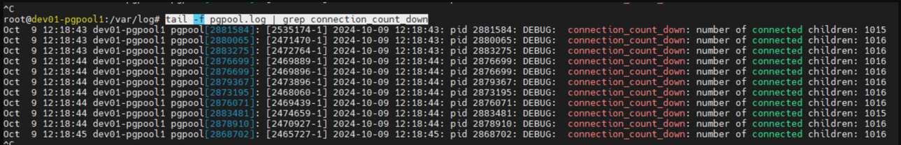
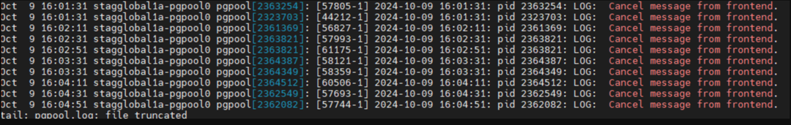
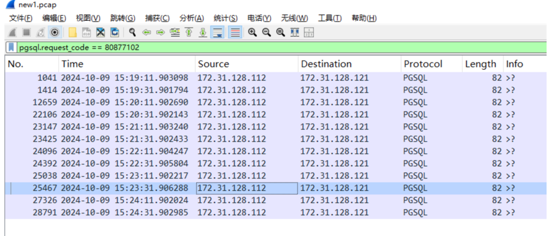
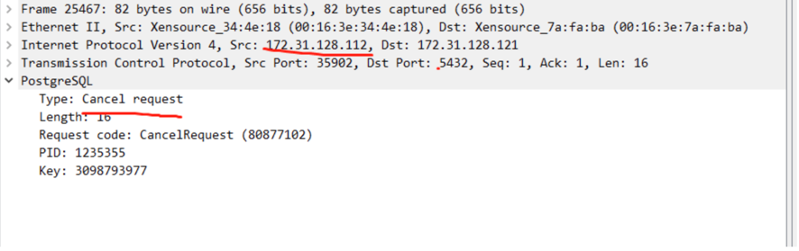
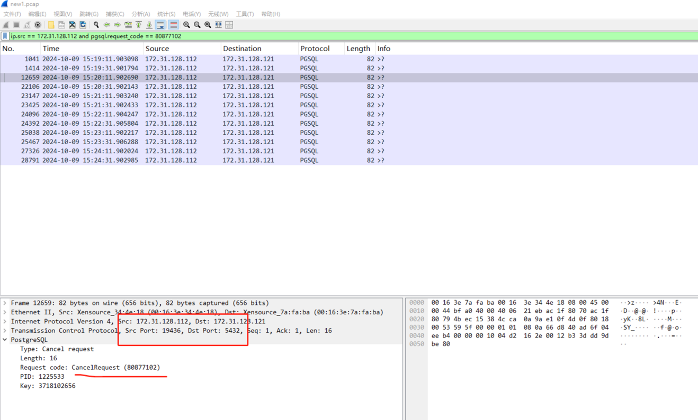
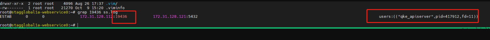

# 排查过程
pgpool4.1.4

当时查的线索，和 pgpool 修复的 commit
1. https://stackoverflow.com/questions/64615097/pgpool-ii-sorry-too-many-clients-already
2. https://git.postgresql.org/gitweb/?p=pgpool2.git;a=commitdiff;h=6d6e4cc3d7ce0cdfcf9b2b6ea3ac5dc04b366aec

20.04 和 16.04 pgpool 的源码
1. https://git.launchpad.net/ubuntu/+source/pgpool2/tree/src/protocol/child.c?h=applied/ubuntu/focal
2. https://git.launchpad.net/ubuntu/+source/pgpool2/tree/src/protocol/child.c?h=applied/ubuntu/xenial


复现步骤，以 20.04 节点测试：  
1. 首先开启 pgpool 的 debug 日志
```
vim /etc/pgpool2/pgpool.conf
log_min_messages = 'DEBUG5'
log_client_messages = 1

service pgpool2 reload

```
2. 运行 pg_cancel.py, 在 pgpool 节点上查看 pgpool 日志，当 connection_count_down: number of connected children 连接数达到 pgpool max connection 就能触发
```python
#!/usr/bin/env python
# -*- coding: utf-8 -*-

import psycopg2
import time
import threading

# PostgreSQL/Pgpool-II 配置
PGPOOL_HOST = 'dev01-pgpool1'  # pgpool 或 PostgreSQL 服务器的 IP 地址
PGPOOL_PORT = 5432              # pgpool 或 PostgreSQL 服务器的端口
DB_NAME = 'postgres'            # 数据库名称
USER = 'yunify'                 # 用户名
PASSWORD = 'cX5TpQ9K'          # 用户密码

def long_running_query(conn):
    try:
        cursor = conn.cursor()
        print "开始执行长查询..."
        # 一个模拟长时间运行的查询，例如等待 100 秒
        cursor.execute("SELECT pg_sleep(100);")
        cursor.close()
    except Exception as e:
        print "查询时发生错误: {}".format(e)

def cancel_query(conn):
    # 等待一段时间后取消查询
    time.sleep(0.5)  # 等待 5 秒
    print "尝试取消查询..."
    conn.cancel()  # 取消当前的查询

def main():
    # 连接到 Pgpool-II
    conn = psycopg2.connect(
        host=PGPOOL_HOST,    # 使用配置的 PGPOOL_HOST
        port=PGPOOL_PORT,    # 使用配置的 PGPOOL_PORT
        database=DB_NAME,    # 使用配置的 DB_NAME
        user=USER,           # 使用配置的 USER
        password=PASSWORD    # 使用配置的 PASSWORD
    )

    # 创建一个线程来执行长时间运行的查询
    query_thread = threading.Thread(target=long_running_query, args=(conn,))
    query_thread.start()

    # 创建一个线程来取消查询
    cancel_thread = threading.Thread(target=cancel_query, args=(conn,))
    cancel_thread.start()

    # 等待线程完成
    query_thread.join()
    cancel_thread.join()

    # 关闭连接
    conn.close()
    print "连接已关闭。"

if __name__ == "__main__":
    i = 0
    while True:
        main()
        i += 1
        print i

```

3. 查看日志
```
tail -f pgpool.log | grep connection_count_down
```


测试结论: 
1. 20.04 pgpool 复现 bug
2. 16.04 pgpool 无法复现


# staging global 问题排查
已经查到 pgpool 出现问题的根本原因，即有 client 发起过 cancel request 请求，剩下的就是找到是什么服务发起的 cancel request 请求。

在 proxy 节点抓包  
```
tcpdump -w dump.pcap "tcp port 5432"
```
在 pgpool 节点查看 pgpool 日志，只要发现有 Cancel message from frontend 日志表明触发了一次 cancel request 请求   
```
tail -F pgpool.log | grep "Cancel message from frontend"
```


触发之后，在 dump.pcap 中，查到发起 cancel request 的节点 ip，查到是 webservice 节点 



在 webservice 节点上，每 0.1 秒记录下连接 proxy 5432 的 TCP 连接的进程和端口号   
```
while true; do ss -antp | grep ES | grep :5432 >> ss.log; python -c "import time; time.sleep(0.1)"; done
```

多抓一段时间的包，和 webservice 上的 ss.log 里端口号印证，查出是 qke_apiserver  



1. 将 qke_apiserver 都 stop，观察 pgpool 日志，发现 "Cancel message from frontend" 日志没有了。
2. 将 qke_apiserver 再 start，观察 pgpool 日志，发现 "Cancel message from frontend" 日志再次出现。问题确认。


