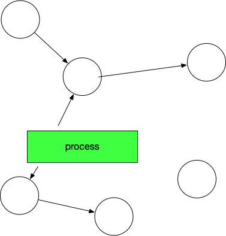
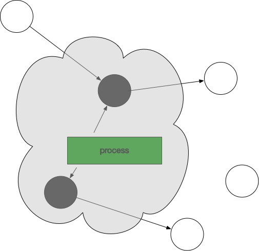
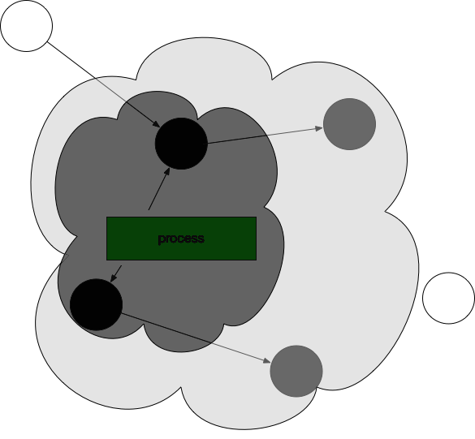
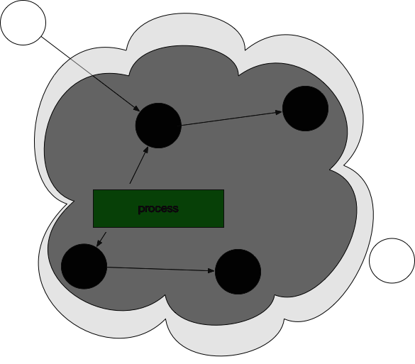
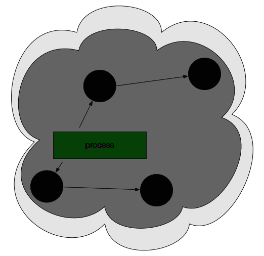
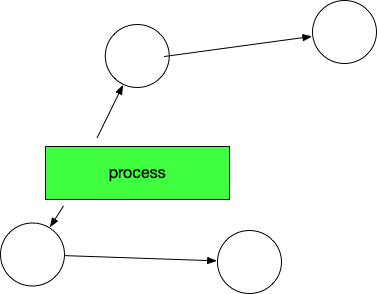
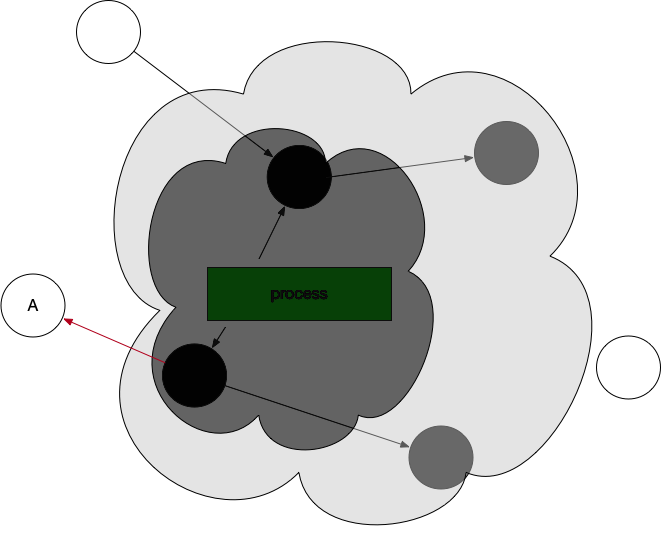
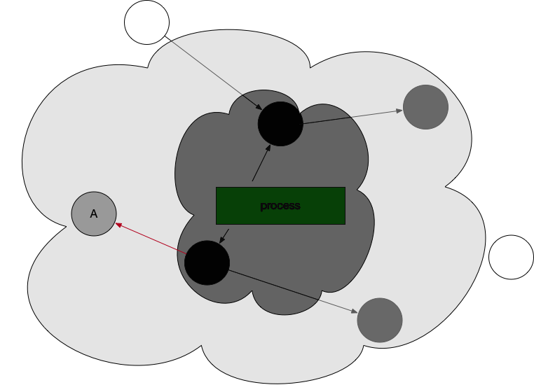
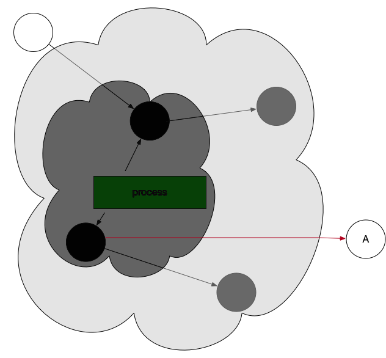
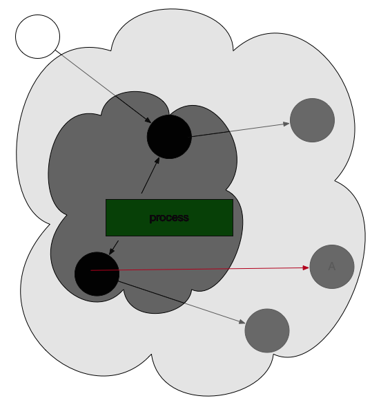

# 第2章 Go内部机制
## 垃圾回收
垃圾回收是释放掉那些不再使用的内存空间的过程.
<!--more-->


## golang GC算法演变过程
|版本|GC算法|
|:---:|:---:|
|v1.1|STW(stop the word)|
|v1.3|Mark STW,Sweep(标记清除)|
|v1.5|三色标记|
|v1.8|hybrid write barrier(三色标记基础上加入写屏障)|


## 标记清除算法(mark and sweep)
### 主要包含两个步骤:  
1.找出不可达对象,然后做上标记
2.回收标记好的对象
> mark and sweep 算法在执行的时候,需要程序暂停,即stop the world
### 标记清除算法存在的问题
* stop the world 程序暂停,即程序会出现卡顿
* 标记需要扫描整个堆(heap)
* 清楚数据会产生heap碎片


## 三色标记清除算法
三色标记清除算法背后的首要原则就是它把堆中的对象根据它们的颜色分到不同集合里面，颜色是根据算法进行标记的  
* 黑色集合 指针指向白色集合。
* 白色集合中的对象允许有指针指向黑色集合,白色集合中的对象就是垃圾回收的候选对象。
* 灰色集合可能会有指针指向白色集合里的对象。

### 写屏障
每次堆中的指针被修改写屏障都会去执行。如果堆中对象的指针被修改，就意味着那个对象现在是可触达的，写屏障会把它标记为灰色并把它放到灰色集合中。  
修改器 运行写屏障,从而保证黑色集合中没有任何元素的指针去指向白色集合中的元素。  
写屏障直观作用有两个: 
1.process新生成的内存对象会被直接标记成灰色  
2.位于黑色集合中的内存对象引用了一个白色集合中的对象,写屏障会将白色集合的这个对象标记为灰色  

### 三色标记过程
1.首先：程序创建的对象都标记为白色。  

2.gc开始：扫描所有可到达的对象，标记为灰色  

3.从灰色对象中找到其引用对象标记为灰色，把灰色对象本身标记为黑色   

4.监视对象中的内存修改，并持续上一步的操作，直到灰色标记的对象不存在

5.此时，gc回收白色对象。

6.最后，将所有黑色对象变为白色，并重复以上所有过程。



### gc和用户逻辑如何并行操作
标记-清除(mark and sweep)算法的STW(stop the world)操作，就是runtime把所有的线程全部冻结掉，所有的线程全部冻结意味着用户逻辑是暂停的。这样所有的对象都不会被修改了，这时候去扫描是绝对安全的。  
Go如何减短这个过程呢？标记-清除(mark and sweep)算法包含两部分逻辑：标记和清除。  
我们知道Golang三色标记法中最后只剩下的黑白两种对象，黑色对象是程序恢复后接着使用的对象，如果不碰触黑色对象，只清除白色的对象，肯定不会影响程序逻辑。所以：清除操作和用户逻辑可以并发。  
标记操作和用户逻辑也是并发的，用户逻辑会时常生成对象或者改变对象的引用，那么标记和用户逻辑如何并发呢？  
**process新生成对象的时候，GC该如何操作呢？不会乱吗？**  
我们看如下图，在此状态下：process程序又新生成了一个对象，我们设想会变成这样：

但是这样显然是不对的，因为按照三色标记法的步骤，这样新生成的对象A最后会被清除掉，这样会影响程序逻辑。  
Golang为了解决这个问题，引入了写屏障这个机制。  
写屏障：该屏障之前的写操作和之后的写操作相比，先被系统其它组件感知。  
通俗的讲：就是在gc跑的过程中，可以监控对象的内存修改，并对对象进行重新标记。(实际上也是超短暂的stw，然后对对象进行标记)  
在上述情况中，新生成的对象，一律都标位灰色！  

**那么，灰色或者黑色对象的引用改为白色对象的时候，Golang是该如何操作的？** 
看如下图，一个黑色对象引用了曾经标记的白色对象。  

这时候，写屏障机制被触发，向GC发送信号，GC重新扫描对象并标位灰色。  

因此，gc一旦开始，无论是创建对象还是对象的引用改变，都会先变为灰色。

### Unsafe Code
Unsafe code是一种绕过go类型安全和内存安全检查的Go代码。

### defer panic recover
* defer是一种栈结构,先入后出
* panic 会终止Go程序的当前流程开始panicking,根据入栈顺序调用defer,若某个defer中,有recover,则捕获panic,程序回到正常执行流程
* recover,在defer函数中直接调用recover才能捕获panic

# Go基本数据类型
## Go切片

### 切片
切片的底层是数组，这意味着Go为每一个切片创建一个底层数组  
切片作为函数的形参时是传引用操作，传递的是指向切片的内存地址，这意味着在函数中对切片的任何操作都会在函数结束后体现出来。另外，函数中传递切片要比传递同样元素数量的数组高效，因为Go只是传递指向切片的内存地址，而非拷贝整个切片。  
### 切片扩容 
GoLang中的切片扩容机制，与切片的数据类型、原本切片的容量、所需要的容量都有关系，比较复杂。对于常见数据类型，在元素数量较少时，大致可以认为扩容是按照翻倍进行的。

### 大切片问题
若果存在一个很大的切片,而只需要使用很少的一部分,应当将此部分拷贝出来,否则因为这一小部分,会导致改切片不能被GC回收,典型问题将大文件的内容读到切片中，但是你只是想使用其中一小部分。  

### 字节切片
字节切片的操作与其他类型的切片并没有什么区别，但是在输入输出中（网络，文件流等）使用的非常多  

### copy()函数
内建函数copy(dst,src) 会以cap(dst)和cap(src)中的最小值为复制长度。  
如果目标dst没有容量,则拷贝不到任何内容  
最新的go版本中(go1.13),copy 已经支持了数组和切片的相互拷贝

### 多维切片
如果你发现你的代码中出现很多多维切片，你就要考虑你的代码设计是否合理并且使用不需要多维切片的更简单的设计。


## Go map
与切片与数组相比，map（映射）的功能要强大的多，但是具有灵活性的同时也伴随着性能损耗，实现Go map往往需要更多的处理能力。但是不用担心，Go的内置数据结构是非常高效的，所以当你需要map的时候就尽情地去用吧！

## 常量
const 定义的常量,特别是数字类型,在定义的时候没有明确类型的化,那么该常量的类型在真正被使用的时候才会确定  
严格来说,常量在编译期间就被确定了,所以定义成常量的值必须是编译器能够确定的值,在程序运行期间,不能修改的值  
Go可以使用布尔类型、字符串、或者数字类型存储常量的值。  
代码建议：如果你要用到许多常量，最好将它们定义到同一个包中。  

## go指针
使用指针时，*可以获取指针的值，此操作成为指针的解引用，*也叫取值操作符；&可以获取非指针变量的地址，叫做取地址操作符。
变量=变量内存地址+变量值,以下代码可以很好的体现这个关系:  
```
func main() {

    var a int
    var b *int

    a=5
    b=&a

    fmt.Println("a变量指针:",&a)
    fmt.Println("a变量值:",a)
    fmt.Println("b变量指针:",&b)
    fmt.Println("b变量值:",b)


}

输出: 
a变量指针: 0xc000088010
a变量值: 5
b变量指针: 0xc00008c018
b变量值: 0xc000088010
```

## 时间与日期的处理技巧

### 解析时间
time.Parse(layout string,value string)此函数用于字符串解析成golang时间类型,如果时间错误,将不能被解析 


# 组合类型的使用
## 使用new关键字
new和make最大的区别就是：new返回的是空的内存地址，即没有做初始化。另外，make仅可以用来创建映射，切片和通道，而且并不是返回指针。


