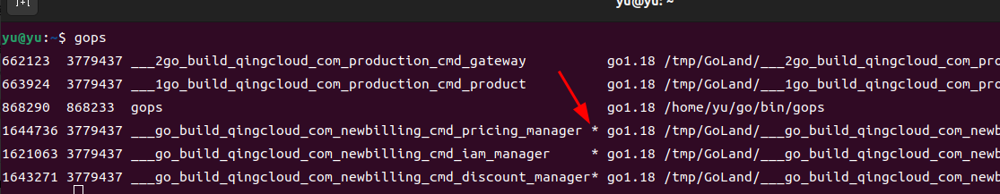

---
categories:
- go

tags:
- 性能分析
---


在 Go 语言中，PProf 是用于可视化和分析性能分析数据的工具，PProf 以 profile.proto 读取分析样本的集合，并生成报告以可视化并帮助分析数据（支持文本和图形报告）。

<!--more-->


# 有哪几种采样方式
* runtime/pprof：采集程序（非 Server）的指定区块的运行数据进行分析。
* net/http/pprof：基于 HTTP Server 运行，并且可以采集运行时数据进行分析。
* go test：通过运行测试用例，并指定所需标识来进行采集。
* gops: 针对非HTTP Server的其它Server 比如GRPC Server 持续采集


# 支持什么使用模式
* Report generation：报告生成。
* Interactive terminal use：交互式终端使用。
* Web interface：Web 界面。

# 可以做什么
* CPU Profiling：CPU 分析，按照一定的频率采集所监听的应用程序 CPU（含寄存器）的使用情况，可确定应用程序在主动消耗 CPU 周期时花费时间的位置。
* Memory Profiling：内存分析，在应用程序进行堆分配时记录堆栈跟踪，用于监视当前和历史内存使用情况，以及检查内存泄漏。
* Block Profiling：阻塞分析，记录 Goroutine 阻塞等待同步（包括定时器通道）的位置，默认不开启，需要调用 runtime.SetBlockProfileRate 进行设置。
* Mutex Profiling：互斥锁分析，报告互斥锁的竞争情况，默认不开启，需要调用 runtime.SetMutexProfileFraction 进行设置。
* Goroutine Profiling： Goroutine 分析，可以对当前应用程序正在运行的 Goroutine 进行堆栈跟踪和分析。这项功能在实际排查中会经常用到，
因为很多问题出现时的表象就是 Goroutine 暴增，而这时候我们要做的事情之一就是查看应用程序中的 Goroutine 正在做什么事情，因为什么阻塞了，然后再进行下一步。


# 服务型持续采集

## net/http/pprof
以下代码会在http路由中加入debug/pprof

```
import (
    _ "net/http/pprof"
    ...
)
```
假如web服务器地址为 http://127.0.0.1:6060

web访问 http://127.0.0.1:6060/debug/pprof  
  
* allocs：查看过去所有内存分配的样本，访问路径为 $HOST/debug/pprof/allocs。
* block：查看导致阻塞同步的堆栈跟踪，访问路径为 $HOST/debug/pprof/block。
* cmdline： 当前程序的命令行的完整调用路径。
* goroutine：查看当前所有运行的 goroutines 堆栈跟踪，访问路径为 $HOST/debug/pprof/goroutine。
* heap：查看活动对象的内存分配情况， 访问路径为 $HOST/debug/pprof/heap。
* mutex：查看导致互斥锁的竞争持有者的堆栈跟踪，访问路径为 $HOST/debug/pprof/mutex。
* profile： 默认进行 30s 的 CPU Profiling，得到一个分析用的 profile 文件，访问路径为 $HOST/debug/pprof/profile。
* threadcreate：查看创建新 OS 线程的堆栈跟踪，访问路径为 $HOST/debug/pprof/threadcreate。


## gops

### gops 安装
go install github.com/google/gops@latest

### 注入采集代理
```
if err := agent.Listen(agent.Options{Addr: "0.0.0.0:6060"}); err != nil {
    log.Fatal(err)
}
```

### gops 查看pid
带星号的可使用gops命令


### 采集cpu
* 程序在本地: gops pprof-cpu 54143
* 远程采集: gops pprof-cpu 172.31.60.114:9300

### gops 功能
* gops 查看当前的运行的go程序，含有星号即可使用下面的命令
* gops +pid  简单查看当前状态
* gops trace + pid  
  * view trace 查看跟踪
  * goroutine analysis go协程分析，目前开着哪些协程
  * Network blocking profile 查看网络阻塞情况，看到网络耗时在哪部分比较多
  * Synchronization blocking profile 同步阻塞配置文件，查看哪个程序调用线路耗时较多
  * Syscall blocking profile 系统调用阻塞配置文件，系统调用的耗时显示
  * Scheduler latency profile 调度程序延迟配置文件
  * User-defined tasks 用户定义的任务
  * User-defined regions 用户定义区域
  * Minimum mutator utilization 最小mutator利用率
* gops tree + pid 显示当前调用的进程树
* gops stack +pid 显示当前栈使用情况
* gops memstats + pid 打印当前内存统计信息
* gops gc + pid 显示gc使用情况
* gops setgc +pid + 数字 将垃圾回收目标设置为特定百分比
* gops version +pid 报告构建目标程序的 Go 版本
* gops stats +pid 打印运行时统计信息
* gops pprof-cpu +pid
* gops pprof-heap +pid

> 远程查看，将pid替换为远端代理 例如: gops pprof-cpu 172.31.60.114:6060

# 非服务型 一次采集

## runtime/pprof
采集CPU
```go
package main

import (
  "flag"
  "log"
  "os"
  "runtime/pprof"
)

var cpuprofile = flag.String("cpuprofile", "", "write cpu profile to file")

func main() {
  flag.Parse()
  // 如果命令行设置了 cpuprofile
  if *cpuprofile != "" {
    // 根据命令行指定文件名创建 profile 文件
    f, err := os.Create(*cpuprofile)
    if err != nil {
      log.Fatal(err)
    }
    // 开启 CPU profiling
    pprof.StartCPUProfile(f)
    defer pprof.StopCPUProfile()
  }
}

  
```

## go test 
```
go test . -v  -test.run Test_RunTestCase -cpuprofile cpu.pprof
```


# 图形化采集结果

## 安装graphviz
```
sudo apt install graphviz
```

## 其它图形化工具
* go get -u github.com/google/pprof
* go get github.com/uber/go-torch


## 本地文件
* go tool pprof -http=:8080 ./A文件
* go tool pprof ./A文件

## http
* go tool pprof -inuse_space http://localhost:6060/debug/pprof/heap
* go tool pprof http://localhost:6060/debug/pprof/goroutine
* go tool pprof http://localhost:6060/debug/pprof/profile\?seconds\=60
> 60s 表示采集时间，默认为30s

