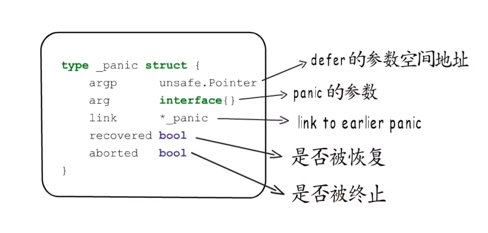

# 字符串

字符串结构: 指向数据地址的指针(8字节)+字符串长度变量(8字节)

1.string 不可修改,因为在字符串会被分配到只读内存段。  
2.将字符串转换为slice([]byte) ,是重新分配了内存，不会修改原有字符串。  
3.使用unsafe包 将slice 指向原字符串的内存，也不能修改，强制修改会包 panic

<!--more-->

# slice

slice结构: 指向数据地址的指针(8字节)+len当前slice长度(8字节)+cap 底层数组的长度(8字节)

## slice 扩容规则

step1: 预估扩容后的容量

1. 预估容量*2 < cap ->newCap=cap
2. 如果oldLen < 1024 -> newCap=oldCap*2 ,否则 newCap=oldCap*1.25

> golang1.16.5 后 是oldCap < 1024 -> newCap=oldCap*2 ,否则 newCap=oldCap*1.25 step2: newCap个元素需要多大的内存   
> 内存= 预估容量* 元素类型大小

step3: 匹配到合适的内存规格

# 内存对齐

## 为什么要内存对齐？

cpu为了快速读取内容，

## 什么是内存对齐 ？

为保证程序顺利高效的运行，编译器会把各种类型的数据安排到合适的地址，并占用合适的长度，这就是内存对齐 。 每种类型的对齐值，就是他的对齐边界

内存对齐要求数据存储地址，以及占用的字节数都要是他对齐边界的倍数

## 平台对应的最大对齐边界

寄存器宽度、机器字长  
数据类型的对齐边界为与平台最大对齐边界取较小的那个。

## 结构体占用字节数?

结构体字节数需要是对齐边界的倍数，因为要考虑数组。只有每个结构体的大小是对齐值的整数倍，才能保证数组里面每个类型都是内存对齐的。

# Map

键值对的存储一般都会使用hash表   
哈希表通常会有一堆桶（buckets）来存储键值对，通过哈希函数将键值对的键处理成键hash值，利用hash值来选择桶

## 选桶算法(m为桶的数量)：

1. 取模法 hash%m
2. 与运算 hash&(m-1)

> golang 使用的与运算法。

## hash冲突

两个key通过hash函数算出的hash值相同  
解决hash冲突的办法

1. 开放地址法，将冲突的hash放到下一个的桶中寻找，当桶找不到则到下一个桶中寻找，直到遇到空桶
2. 拉链法，编号为2的桶被占用了，在2后面链一个新桶，当前桶找不到，去链接的桶里面寻找。  
   hash的发送会影响哈希表的读写效率，选择散列均匀的hash函数可以减少hash冲突的发生，适时的对哈希表进行扩容也是保证读写效率的有效手段

## hash扩容

通常会吧存储键值对的数据与桶数目的比值作为是否需要扩容的判断依据，这个比值叫**负载因子(LoadFactor)**  
数据迁移，把旧桶里存储的键值对都迁移到新桶里。如果哈希表存储的键值对较多，一次性迁移所有桶花费的时间比较显著，所以通常会在哈希表扩容时，先分配足够多的新桶 然后用一个字段记录旧桶的位置，再增加一个字段记录旧桶迁移的进度(
如记录下一个需要迁移的旧桶编号)，如果hash表每次在进行读写操作时，如果检测到当前处于扩容阶段
就完成一部分键值对迁移任务，直到所有的旧桶迁移完成，旧桶不在使用，才算真正完成一次哈希表的扩容，像这样把键值对迁移的时间分摊到多次哈希表操作的方式，叫做渐进式扩容。  
渐进式扩容，可以避免一次性扩容的瞬时抖动。

## go语言中Map类型的底层实现就是哈希表

Map 类型的变量本质上是一个指针, 指向hmap  
一个桶里可以放8个键值对，但是为了让内存更加紧凑，8个key放一起，8个value放一起，在8个key前面是8个tophash  
每个tophash都是对应hash值的高8位 ,overflow 存的是溢出桶   
实际上如果哈希表要分配桶的数据大于2^4次方，就会认为使用溢出桶的几率比较大，就会预分配2^(B-4)个溢出桶备用


```go
package Map

import "unsafe"

//Map 底层结构体
type hmap struct {
	count      int //键值对数目
	flags      uint8
	B          uint8  //B 记录桶的数目的幂，桶数=2^B，因为选择桶用的是与运算的方法
	noverflow  uint16 //使用溢出桶的数量
	hash0      uint32
	buckets    unsafe.Pointer //当前桶
	oldbuckets unsafe.Pointer //旧桶
	nevacuate  uintptr        //渐进式扩容阶段，即将迁移的旧桶编号
	extra      *mapextra
}

//记录溢出桶的相关信息
type mapextra struct {
	overflow     unsafe.Pointer //已经使用的溢出桶
	oldoverflow  unsafe.Pointer //用于在扩容阶段存储旧通用到的那些溢出桶的地址
	nextoverflow unsafe.Pointer //下一个空闲溢出桶
}

//桶
type bmap struct {
}

```

## go Map的扩容规则

* count/(2^5) > 6.5 => 翻倍扩容
* LoadFactor没有超标并且noverflow 较多 => 等量扩容

> noverflow较多的情况:  
> 1.B<=15,noverflow>2^B  
> 2.B>15,noverflow>2^15

### 等量扩容

创建与原来相同数量的桶  
为什么要进行等量扩容？  
在溢出桶使用较多，负载因子较低的时候，说明删除了大量的键。通过等量扩容，减少溢出桶的使用。

# 函数调用栈

我们按照编程语言的语法定义的函数，会被编译器编译成一堆堆的机器指令，写入可执行文件。  
执行时，可以执行文件被加载到内存中，这些机器指令，对应虚拟地址空间中位于代码段。如果在一个函数中调用另外一个函数，编译器就会生成一条call指令。  
程序执行到这条指令时，就会跳转到被调用函数入口处开始执行，而每个函数的最后都有一条ret指令，负责在函数结束后，调回到调用处，继续执行。  
函数执行时，需要有足够的内存空间，供它存放局部变量、参数等数据，这段空间对应到虚拟地址空间的栈，栈只有一个口可以出，先入后出规则  
运行时，栈上面是高地址，向下增长，分配给函数的栈空间称为函数栈帧（stack frame），函数栈帧由栈底（bp 栈基）到栈顶（sp 栈指针）

**go 语言中函数栈帧布局**   
调用者栈基地址  
局部变量  
调用函数的返回值  
参数

call 指令 只做两件事，第一将下一条指令的地址入栈，这就是返回地址，被调用函数执行结束后会跳回到这里，继续执行。第二跳转到被调用函数的入口
处执行，所有的函数栈帧布局都遵循统一的约定，所以被调用者是通过栈指针加上偏移来定位到每一个参数好返回值的  
程序执行时cpu 用特定的寄存器，来存储运行时 栈基和栈指针，用指令指针寄存器用于存储下一条要执行的指令地址  
go语言中函数栈帧不是逐步扩张的，而是在分配栈帧时，直接将栈指针移动到所需最大栈空间的位置，然后通过栈指针加偏移值，这种相对寻址方式使用函数 栈帧。之所以一次行分配，主要是为了避免发送栈访问越界。

ret 指令 1.弹出返回地址，2.跳转到返回地址。  
每个函数开始时会分配栈帧，结束前又会释放自己的栈帧

## go语言中返回值赋值早于defer函数

```go
package main

import "fmt"

func incr(a int) int {
   var b int
   defer func() {
      a++
      b++
   }()
   a++
   b = a
   return a
}

func main() {
   var a, b int
   b = incr(a)
   fmt.Println(a,b)//0,1
}
```
```go
package main

import "fmt"

func incr(a int) (b int) {
   defer func() {
      a++
      b++
   }()
   a++
   return a
}

func main() {
   var a, b int
   b = incr(a)
   fmt.Println(a,b)//0,2
}
```

## 一个函数中调用了多个函数，且参数和返回值各不相同  
如果一个函数A调用了两个函数B、C ,但是这两个函数的参数和返回值占用的空间并不相同，go语言的函数栈帧是一次性分配的，要
以最大的参数加返回值空间为标准来分配，才能满足所有被调用函数的需求。被调用者通过栈指针相对寻址来定位自己的参数和返回值

# 闭包
go 语言中函数是头等对象，可以作为参数传递，可以作为函数返回值，也可以绑定到变量，Go语言称这样的参数、返回值、或变量为function value，
函数指令在编译起见生成，而function value 本质上是一个指针，但是并不直接指向函数指令入口，而是指向一个runtime.funcval的结构体,这个结
构体里只有一个地址fn，这个地址就是函数指令的入口地址。
```go
package runtime
type funcval struct {
	fn uintptr
}
```
## 为什么需要通过funcval结构体来包装执行函数的地址,然后使用一个二级指针来调用呢？
这里主要是为了处理闭包的情况。  
> 闭包：要包括自由变量（在函数外部定义但在函数内部引用）；脱离了形成闭包的上下文，闭包也能正常使用这些自由变量

  
函数create 的返回值是一个函数，但这个函数内部使用了外部定义的变量c，即使create执行结束，通过f1，f2也能正常执行这个闭包函数，并使用定义
在create函数内部的局部变量c，所以这里符合闭包的定义，通常称这个变量c为捕获变量。  
闭包函数的指令自然也在编译阶段生成，但因为每个闭包对象都要保存自己的捕获变量，所以要到执行阶段才创建对应的闭包对象。  
到执行阶段，main函数栈帧有两个局部变量，然后是返回值空间，到create函数栈帧这里，有一个局部变量c等于2，create函数会在堆上分配一个fucval
结构体，fn指向闭包函数入口，除此之外还有一个捕获列表，这里只捕获了一个变量c，然后这个结构体的起始地址就作为返回值，写入返回值空间。  
通过f1、f2，对应的闭包函数就会找到各自对应的funcval结构体，拿到同一个函数入口，但是会使用不同的捕获列表，这就是称闭包为有状态函数的原因

## 闭包函数是如何找到对应的捕获列表呢？
go语言中通过一个funcval 调用函数时，会把对应的funcval结构体地址存入特定寄存器，例如amd64平台使用的是dx寄存器，这样在闭包函数中就可以通
过寄存器取出funcval结构体的地址，然后加上响应的偏移来找到每一个被捕获的变量。  
所以go语言中，闭包就是有捕获列表的funcval，而没有捕获列表的funcval，直接忽略这个寄存器的值就好了。  

## 捕获列表
捕获列表 不单单只是拷贝变量值。需要分情况。被闭包捕获的变量，在外层函数与闭包函数中表现一致，好像他们在使用同一个变量，为此go语言的编译器
针对不同情况做了不同的处理

### 情况1 
被捕获的变量除了初始化复制外，在其它任何地方都没有修改过  
直接拷贝值到捕获列表中

### 情况2
局部变量除了初始化赋值外还被修改过。
变量会改为堆分配，捕获列表中存的是变量的地址
> 局部变量堆分配，是变量逃逸的一种场景。

### 情况3
如果修改并被捕获的是参数，涉及到函数原型，就不能像局部变量那样处理了  
参数依然通过调用者栈帧传入，但是编译器会把栈上这个参数拷贝到堆上一份，然后外层函数和闭包函数都使用堆上分配的这一个，

### 情况4
如果被捕获的是返回值  
调用者栈帧上依然会分配返回值空间，不过闭包的外层函数会在堆上也分配一个，外层函数和闭包函数都使用堆上分配的这一个，在外层函数返回前，需要
把堆上的返回值拷贝到栈上的返回值空间

处理方式虽然多样，但目的只有一个，就是保持捕获变量在外层函数与闭包函数的一致性。  

# 方法
如果我们定义一个类型A,并给它定义一个方法Name,然后就可以使用 a.Name 或者 A.Name(a) 来调用Name方法，实际上a.Name是调用语法糖  
  
go语言中 函数只和参数类型与返回值相关，方法就是普通的函数，方法的接受者是隐含的第一个参数

## 方法表达式与方法变量

方法表达和方法变量 本质上都是一个funcval，方法变量会捕获方法接受者a形成闭包,但这里的f2仅作为局部变量，它与a的生命周期是一致的，所以编译器
会做出优化，把它转换为类型A的方法调用并传入a作为参数 A.Name(a),

# defer
关于defer 我们知道它会在函数返回之前倒叙执行。  
先通过deferproc函数注册defer函数，然后在return之前调用。  
defer信息会注册到一个链表，而当前执行的goroutine持有这个链表的头指针，每个goroutine在执行时都有一个对应的结构体g，其中有一个字段_defer指向
defer链表的头，_defer 链表链起来的是一个一个defer结构体，新注册的defer会添加到链表的头部。执行时也是从头开始，所以defer才会表现为倒叙执行。  

defer 结构体  


## go1.12defer 的问题
1. _defer在堆上分配 ，即使有预分配的deferpool,也需要去堆上获取与释放，而且参数还要在堆栈间来回拷贝  
2. 使用链表注册defer信息，而链表本身操作比较慢

## go1.13和go1.14对defer的改进
go1.14的defer，通过在编译阶段插入代码, 把defer函数的执行逻辑展开在所属函数内，open code defer，和1.13一样不适用于循环中的defer，循环中
defer，由于在编译阶段无法确定数量，所以只能在堆分配。  
go1.14defer 性能提升了一个数量级，open codeed defer 未注册到defer连表中，所以在发生panic和runtime.Goexit的时候，需要额外进行栈扫描来
执行未注册到链表中的defer。所以panic变慢了。  


# panic和recover
当前执行的goroutine 中有一个defer链表的头指针，同时也有个以panic链表的头指针，panic连起来的是一个个panic结构体，当发生新的panic的时候，
也是在链表的头上插入新的panic结构体。
panic 结构体    
  
panic触发defer执行，最后从连表尾部打印异常信息。  

## panic 两点重要信息
* panic执行defer函数的方式为先标记后释放，目的是为了终止之前发生的panic  
* 所有还在panic链表上的项都会被输出，顺序与panic发生的顺序一致

# 类型系统
方法本质上就是函数，只不过在调用时，接受者会作为第一个参数传入  
在定义方法的时候不能为内置类型和接口定义方法。  
内置类型和自定义类型，都有其对应的描述信息，称为他的“类型元数据”，每种类型元数据都是全局唯一的,这些类型元数据共同构成了go语言的“类型系统”

# 接口
## 空接口 interface{}
  

未被赋值前，_type=nil,data=nil 赋值后，_type指向类型元数据 ，data指向数据

## 非空接口 
一个变量想要赋值给一个非空接口类型，必须要实现这个非空接口类型的所有方法。
    

  
如果我们声明一个io.ReadWriter类型的变量rw,它被赋值以前data=nil,tab=nil,吧一个*os.File的类型变量f 赋值给rw,此时rw的动态值就是f,而tab
会指向一个itab结构体，他的接口类型为io.ReadWriter,动态类型为*os.File ,同时注意itab这里的fun，它会从动态类型元数据中拷贝接口要求的那些
方法的地址，以便通过rw快速定位到方法而无需再去类型元数据那里查找。  

关于itab 还要额外关注一点，一旦接口类型确定了，动态类型确定了，那么itab的内容就不会改变了。那这个itab结构体也就确定了。所以这个itab结构体是可以复用的  
实际上go语言会吧itab结构体缓存起来，并且以接口类型和动态类型的组合为key，以itab结构体指针为value,构造一个hash表，用于存储和查询itab缓存信息，
这里的hash表和map底层的hash表不同，是一种更为简便的设计，需要一个itab结构体是，会首先去这里查找，用接口类型的hash值和动态类型的hash值，进行异或运算得到
key的hash值，如果已经有对应的itab指针就直接拿来使用，如果没有就创建一个itab结构体，然后添加到这个hash表中。

# 类型断言
抽象类型： 空接口、非空接口  
具体类型：int、string、slice、map、struct。。。  
类型断言作用在接口值之上，可以是空接口，也可以是非空接口，断言的目标类型可以是非空接口类型、也可以是具体类型。
* 空接口.(具体类型)
* 非空接口.(具体类型)
* 空接口.(非空接口)
* 非空接口.(非空接口)


# 反射 reflect
runtime包中的空接口和非空接口的类型元数据都是未导出的，所以reflect包中又定义了一套和runtime包中保持一致。  
reflect包提供TypeOf 函数，用于获取变量的类型信息，接受一个空接口类型的参数，并返回一个reflect.Type类型的返回值。  
所有参数为空接口类型的情况，通过传递拷贝后的变量的地址，来实现传值的语义   

通过reflect.ValueOf 来获取值，如果需要修改原变量的值，需要传指针。

# GMP

## golang调度器的由来
### 单进程时代的两个问题
1. 单一执行流程，计算机一个任务一个任务处理
2. 进程阻塞锁带来的CPU浪费时间  

### 多进程、多线程的问题
1. 设计变得复杂
* 进程、线程数量越多，切换成本就越大，也就越浪费
* 多线程 随着同步竞争（如锁、竞争资源冲突等）
2. 多进程、多线程的壁垒
* 进程占用内存 虚拟内存4GB(32bit OS),线程占用内存 4MB
* 高CPU调度消耗

### 携程
1. N:1 无法利用多个CPU,出现阻塞的瓶颈
2. 1:1 跟多线程、多进程模型无异 ；切换携程成本代价昂贵
3. M:N 能够利用多核，过于依赖协程调度器的优化和算法  


### golang 调度器的优化
* 占用空间小，4kb,可大量开辟
* 灵活调度 切换成本底

## GMP模型设计思想

### GMP模型简介
#### GMP含义
* G 携程
* P 处理器 通过GOMAXPROCS 设置
> 为什么p的个数要和cpu个数一致，因为并行执行的最大数量为cpu核数
* M 内核线程
#### 全局队列
存放等待运行的G   
包含全局队列锁
#### P的本地队列 
* 存放等待运行的G
* 数量限制，不超过256G
* 优先将新创建的G放在P的本地队列中，如果满了会放在全局队列中
#### P列表 
* 程序启动时候创建
* 最多有GOMAXPROCS个

#### M列表
当前操作系统分配到当前Go程序的内核线程数

#### P和M的数量
P的数量问题   
1. 环境变量$GOMAXPROCS  
2. 在程序中使用runtime.GOMAXPROCS()方法来设置

M的数量问题
1. GO语言本身限定的M最大量是10000 
2. runtime/debug 包中的SetMaxThreads函数来设置
3. 如果有一个M阻塞，会创建新的M,如果M空闲，那么会回收或者随眠，M的数量是一个动态的值


### 调度器的设计策略
#### 复用线程
避免频繁的创建、销毁线程、而是对线程的复用  
* work stealing机制
> 当本线程无可运行的G时，尝试从其它线程绑定的P偷取G,而不是销毁线程 
* handle off 机制  
> 当本线程因为G进行系统调用阻塞时，线程释放绑定的P,把P转移给其它空闲的线程执行
#### 利用并行
GOMAXPROCS 设置P的数量，最多有GOMAXPROCS个线程分布在多个CPU上同时运行  

#### 抢占
在coroutine中要等待一个协程主动让出CPU才执行下一个协程，在GO中，一个goroutine最多占用CPU 10 ms,防止其他goroutine被饿死


#### 全局G队列
当M执行work stealing从其它P偷不到G时，它可以从全局队列获取G

### go fun() 经历了什么过程
我们通过go func 来创建一个goroutine;  

有多个存储G的队列，一个是局部调度器P的本地队列，一个是全局G队列。新创建的G会先保存在P的本地队列中，如果P的本地队列已经满了
就会保存在全局的队列中  

G只能运行在M中，一个M必须持有一个P,M与P是1:1的关系，M会从P的本地队列弹出一个可执行状态的G来执行，如果P的本地队列为空，就会
想其它的MP组合偷取一个可执行的G来执行  

一个M调度G执行的过程是一个循环机制

当M执行某一个G时候如果发生了syscall或则其余的阻塞操作，M会阻塞，如果当前有一些G在执行，runtime会把这个线程M从P中摘除（detach），
然后再创建一个新的操作系统的线程（如果有空闲的线程可用就复用空闲线程）来服务于这个P


### 调度器的生命周期
#### M0
M0 是启动程序后的编号为0的主线程，这个M对应的实例会在全局变量runtime.m0中，不需要在heap上分配，M0负责执行初始化操作和启动
第一个G，在之后M0就和其他的M一样了。  

#### G0
G0是每次启动一个M都会第一个创建的goroutine,GO仅用于负责调度G,G0不指向任何可执行的函数，每个M都会有一个自己的G0。在调度或者系统
调用时会使用G0的栈空间，全局变量的G0是M0的G0


### 可视化的GMP编程
#### trance编程  
```go
package main

import (
   "fmt"
   "os"
   "runtime/trace"
)

func main() {
   f, err := os.Create("trace.out")
   if err != nil {
      panic(err)
   }
   defer f.Close()
   trace.Start(f)

   fmt.Println("hello world")
   
   trace.Stop()

}
```

> go tool trace trace.out  浏览器访问


#### 通过Debug trance查看GMP信息 
```shell
GODEBUG=schedtrace=1000 程序
> 1000指的是1000ms时间间隔

SCHED 3014ms: gomaxprocs=8 idleprocs=8 threads=19 spinningthreads=0 idlethreads=14 runqueue=0 [0 0 0 0 0 0 0 0]
```

* SCHED 调试信息
* 3014ms 从程序启动到输出经历的时间
* gomaxprocs P的数量 默认是和CPU核心数是一致的
* idleprocs 处理idel状态的p的数量，gomaxprocs-idleprocs=目前正在执行的P的数量
* threads 线程数量(包括M0,包括GODEBUG调试的信息)
* spinningthreads 处于自旋状态的线程数量
* idlethreads idle状态的tread
* runqueue 全局队列中G的数量
* [0 0 0 0 0 0 0 0] 每个P的local queue本地队列中，目前存在G的数量

## GO调度器GMP场景过程全分析
### G1创建G3
局部性: G3优先加入G1所在的本地队列  

P拥有G1,M1获取P后开始运行G1,G1使用go func() 创建G2,为了局部性G2优先加入到P1的本地队列
### G1执行完毕
G1运行完成后（函数：goexit）,M上运行的goroutine切换为G0,G0负责调度时协程的切换（函数:schedule）。  
从P的本地队列获取G2,从G0切换到G2,并开始执行G2(函数:execute)。实现了线程M1的复用

### 更多场景见 
https://www.yuque.com/aceld/golang/srxd6d#5c3da99e


> Go调度本质是把大量的goroutine分配到少量线程上去执行，并利用多核并行，实现更强大的并发


# GC
垃圾回收指的是回收在堆上，不再使用的数据。栈上的内存会随着栈的释放而被销毁    
有效数据指的是从栈（stack 正在执行的函数）能追踪到，数据段（全局变量，静态数据），从这些根节点追踪不到的数据则认为是垃圾可以清除  
主流的垃圾算法都是使用可达性，近似等价于存活性的算法  

## 标记清扫算法 
追踪式垃圾回收  
从 栈，数据段 上的对象作为root对象，基于它们进一步追踪，把能追踪到的数据进行标记，追踪不到的数据，则视为垃圾，进行清理  

### 三色标记
三色追踪可以清晰的展现追踪式回收过程中对象状态的变化过程  
标记过程：  
1. 垃圾回收开始时所有对象均为白色  
2. 把直接追踪到的root节点标记为灰色，灰色代表基于当前节点展开的追踪尚未完成  
3. 当基于某个节点的追踪任务完成后，便会把改节点标记为黑色，表示它是存活数据，无需基于它再次进行追踪，基于黑色节点找到的所有节点，都为标记为灰色，表示还要基于它们进步展开追踪
4. 当没有灰色节点时意味着标记工作结束了，剩下的白色对象视为垃圾，执行清除

### 标记清扫算法带来的问题和解决方案
标记清扫算法实现起来相对简单，但是容易造成内存碎片化，回收完的内存要找到合适的内存分块的代价更高，也会造成很多小块内存无法使用的情况   

如何解决这个问题？  
1. 可以基于BiBop(Big Bag Of Pages)的思想 把内存块划分为多种不同大小的规格，对相同规格的内存块进行统一管理，这样可以更快的匹配到大小合适
的空闲内存，规格类型划分的合理也有助于提高内存的使用率
2. 可以通过移动数据来减少碎片化的方法，例如在标记整理（mark-compact）算法中，标记阶段与标记清扫算法相同，但是就在标记清扫工作完成后，移动数据，使它们能够紧凑的放在内存中
虽然标记整理算法有效解决了内存碎片化的问题，但多次扫描与移动开销也不容小觑
3. 复制式回收，会把堆内存划分为两个相等from和to空间，垃圾回收时，将from能追踪到的数据复制到to空间，所有数据复制完成后把from和to交换一下，这种
复制式回收也不会带来碎片化问题，但是只有一半的空间能被使用。为了提高堆内存的使用率，通常会和其它垃圾回收算法结合使用，只在一部分堆内存中使用复制式回收
4. 分代回收 （弱分代假说，大部分对象都在年轻时死亡，如果把新创建的对象称为新生代对象，把经受住特定gc次数的对象称为老年代对象。基于弱分代假说，大部分对象会在
最初经历的垃圾回收中死亡，也就是新生代对象成为垃圾的概率高于老年代对象，所以可以把数据划分为新生代和老年代，降低老年代执行垃圾回收的频率），新生代
和老年代可以采用不同的垃圾回收策略，进一步提升效益减少开销


## 引用计数垃圾回收
引用计数指的是一个对象被引用的次数，程序执行过程中会更新对象的引用计数，当引用计数更新为0时，就表示这个对象不再有用，就可以对他进行垃圾回收了，
引用计数法中垃圾识别的任务已经分摊到每一次数据对象的操作中了，虽然引用计数法可以及时回收无用内存，但高频率的更新引用计数，也是一笔不小的开销   

而且循环引用的情况下，永远无法回收

## STW（stop the word）
垃圾回收执行时，用户程序长时间暂停   
实际上我们总是希望尽量缩短STW的时间，可以将垃圾回收工作分多次完成。  

## 垃圾回收的方式
### 增量式垃圾回收
用户程序与垃圾回收程序交替执行，可以缩短每次垃圾回收的时间，但是交替执行的过程中，保不齐垃圾回收程序前脚标记了一个黑色对象，用户程序后脚又修改了它，
要是放任不管，垃圾回收程序就会误把存活数据当作垃圾回收 例如：黑色->白色


### 写屏障
非移动式垃圾回收，需要建立写屏障  
强三色不变式： 禁止黑色对象到白色对象的引用。  
弱三色不变式： 允许黑色对象到白色对象的引用，但可以保证通过灰色对象可以抵达该白色对象。    

实现强弱三色不变式的方法，是建立读写屏障  
写屏障是在写操作中插入指令，目的是吧数据对象的修改通知到垃圾回收器，写屏障通常会有一个记录集，而记录集是采用顺序存储还是使用哈希表，记录精确到被修改的
对象还是只记录其所在的页，是写屏障具体实现需要考虑的

* 插入写屏障  针对于强三色不变式（黑色对象到白色对象的引用），需要吧黑色对象变为灰色，或者吧白色对象变为灰色
* 删除写屏障 关注哪些对象引用的破坏行为，要删除灰色对象对白色对象的引用时，可以把白色对象变为灰色

### 读屏障
如果时复制式垃圾回收这样通过移动数据来避免碎片化，那GC和用户程序交替执行时，那么读数据也不那么安全了。  
读屏障确保用户程序不会访问到已经存在副本的陈旧对象

## 多核
并行和并发回收的区别在于，同一时刻是否有多个线程在执行垃圾回收   
go 语言的垃圾回收采用标记清扫算法，支持主体并发式增量垃圾回收，使用混合写屏障（插入写屏障，删除写屏障）
### 并行垃圾回收
暂停用户程序的前提下，多线程并行执行垃圾回收程序，这被称为并行垃圾回收

### 并发垃圾回收
指的时用户程序和垃圾回收程序并发执行，并发场景下，会存在用户程序和垃圾回收程序并行执行。这和并行垃圾回收中只考虑垃圾回收程序的执行时不同的  
拿写屏障来说，用户程序和垃圾回收器可能会同时使用写屏障，那就需要考虑用户程序之间以及用户程序和垃圾回收器之间的竞争问题，如果没有任何stw的时间
那么垃圾回收开始的消息便很难准时准确的通知到所有线程，可能导致某些线程开启写屏障的动作有所延迟而发生错误，

### 主体并发式垃圾回收
在实际应用中在某些开启stw，在其它阶段支持并发的 “主体并发式垃圾回收” 更容易实现，

### 主体并发增量式回收
在主体并发回收的基础上，实现增量式回收


##  GC过程
1. GC准备阶段,为每个p创建MarkWorker协程（很快会休眠，_Gwaiting）
2. 第一次STW,记录GC阶段为_GCMark,同时开启写屏障
   * gcBlackenEnable=1  是否允许gc扫描
   * writeBarrier.enabled=true 开启写屏障
   * gcphrase=_GCMark 标识GC阶段为 标记阶段
3. MarkWorker开始根据p的调度进行标记工作，直到标记完成
4. 第二次STW，停止标记，关闭写屏障
   * gcBlackenEnable=0 停止标记
   * writeBarrier.enabled=false 关闭写屏障
   * gcphrase=_GCMarkTermination

5. 开始清扫（清扫也是增量进行，每轮gc开始之前，需要保证上一次清扫已经完成

## GC标记过程实现 gcw&wbBuf
GC标记需要扫描的对象会加入到工作队列中，由后台MarkWorker来消息队列：  
1. 全局工作队列
2. 本地工作队列，包含wbuf1,wbuf2。 先加入wbuf1,再加入wbuf2,当wbuf2满了，就加入全局工作队列  

每个P有一个写屏障缓冲区 wbBuf,写屏障触发时，会加入到这个缓存区中，通过flush 刷入工作队列中

## GC CPU使用用率（决定MarkWork 可以启动的个数）
GC 默认cpu使用率为25%  
workCount=gomaxprocs* 25%，如果计算出来不是整数，需要向上取整，例如取出来的值时1.5，则会取2，如果这个向上取整的数值与原目标比较超过0.3（0.5/1.5>0.3）,那多出来的这个worker就会
进入fraction模式，加入cpu核数时6，那每个cpu再fraction模式下的工作目标就是 0.5/6=1/12，GC Worker有两种模式：
* Dedicated 完全占用模式，直到调度器调度 
* Fraction 非完全占用模式，Mark时间会均摊到每个p上以合计到达 1/12这个目标（p的work时间=Fraction模式的时间/总的Mark的时间），如果当前P到了目标就会让出cpu

## GC 过程中GC内存分配
为避免GC过程的内存分配压力过大，GO语言有 GC Assist(辅助GC)，如果GC过程中协程要分配内存，它需要负担一部分GC标记工作，要申请的内存越大，那对应要
负担的标记任务也多（借贷偿还机制，你申请了内存，那就得你去释放内存），有负债的G在成功申请内存前，需要辅助gc完成一些标记工作，来偿还债务   

后台的MarkWorker 每完成一定量的标记任务就会在全局gcController中存一笔信用，有债务需要偿还的G可以在gcController这里偷取信用来偿还债务  

gc标记阶段，每次分配内存，都会检查当G是否需要辅助GC，到GC清扫阶段，内存分配也会触发辅助清扫

辅助标记和辅助清扫，可以避免因过大的内存分配压力，导致GC来不及回收的情况（GC标记的速度没有分配的速度快，就永远标记不完）

## GC 触发方式
* 手动触发 runtime.GC
* 分配内存，每次GC都会在标记结束后设置下一次触发gc的内存分配量，分配大对象或者从mcentral获取空闲内存时，会判断是否达到了这个值
* sysmon 系统监控，达到一定的时间间隔，强制执行gc,默认是2分钟

# Mutex
```go
package main

type Mutex struct {
	state int32 //存储互斥锁的状态 ，加锁和解锁通过 atomic包提供的函数原子性操作该字段
	sema uint32 //信号量，用于等待队列
}
```
互斥锁，结构简单，此结构体的零值为一个有效的互斥锁   
互斥锁有两种模式，正常模式和饥饿模式
## 正常模式
一个尝试加锁的goroutine 会先自选几次，尝试通过原子操作获得锁，若几次操作后仍不能获得锁，则通过信号量排队，所有等待者会先按照先入先出（FIFO）的顺序排队。  

当锁被释放，第一个排队等待的goroutine需要和那些后来的处于自旋状态的goroutine竞争 ，这种情况下后来者更有优势，原因有两个：1.自旋状态的goroutine
正在cpu上运行，2.自旋状态的goroutine 有可能有多个，而被唤醒的goroutine只有一个。  

如果被唤醒的goroutine没有获得锁，将会重新插入导队列的头部

> 正常模式下自旋和排队是同时存在的，这种排队之前先让大家来抢的模式可以提高吞吐量，因为频繁的挂起和唤醒goroutine会带来较多的开销

## 饥饿模式
如果一个goroutine的等待时间超过1m后，它会吧当前mutex从正常模式切换到饥饿模式，饥饿模式下，其它尝试获得锁的goroutine不会进行自旋,会直接插入到队
列尾部，锁释放后， 会直接给等待队列头部goroutine  

何时从饥饿模式切换为正常模式？  
当一个goroutine获得锁后 ，以下两种情况会切换回正常模式  
1. 它的等待时间小于1ms  
2. 它是最后一个等待者  

> 饥饿模式下不在自旋，所有goroutine都要排队，用于解决尾端延迟问题


## 什么情况下不会自旋 
1. GOMAXPROCS==1   
2. 如果当前runq的等待队列不为空，相比于自旋，切换到本地gorouine更有效率，为保障吞吐也不会自旋  

也就是需要满足以下4个条件，才会自旋：  
1. 多核，
2. GOMAXPROCS>1 
3. 当前P的本地队列为空，
4. 有一个P正在执行

## 总结
1. 自旋
2. 排队
3. 饥饿模式开启，禁止自旋
4. 恢复到正常模式


## 信号量 
为保证临界区操作的互斥性，一般用锁来实现   
锁的实现有两种：
1. 自旋锁，获得锁如果失败了就不断尝试，直到成功获得锁或者时间片耗完
2. 调度器对象，让出cpu，听从操作系统安排，进入到等待队列中，等待唤醒。调度器对象 也称为线程之间的同步原语，以一种系统调用的形式存在   

调度器对象和自旋锁的不同之处主要在于等待队列，同步原语是由内核提供的，之间与系统调度器交互，能够挂起和唤醒线程，这点是自旋锁做不到的，正由于其在内核
中实现，所以应用程序中需要以系统调用的方式来实现它，系统调用就会有一定开销，且获取锁失败也会发生线程切换，使得开销加大 

调度器对象和自旋锁各有各的应用场景   
1. 如果是多核情况，且持有锁的时间占比较小，往往自旋几次就能拿到锁 
2. 若是单核环境或者持有锁的时间占比较大的情况，一味自旋，就算把时间片耗完，也拿不到锁，空耗cpu得不偿失，

在实际业务场景中加锁的时间是不确定的，如果加锁时先经过自旋，但限制最大自旋次数，若在有限次数内，不能加锁成功，再通过调度器对象将线程挂起 也是如今主流的
锁实现思路   

### runtime.mutex
go语言中runtime.mutex 就是这个思路，结合自旋锁和调度器对象优化过后的锁，针对线程设计

### sync.Mutex

协程如果要等待一个锁时，要如何休眠等待和唤醒呢？   
需要通过 runtime.semaphone来实现， semaphone 是供协程使用的信号量，runtime内部通过一个 大小为251的semaTable,来管理所有的semaphone   
semaTable 存储的是251棵平衡数的根，平衡树中每个节点都是一个sudog的对象，要使用一个信号量时需要提供一个记录信号量数值的变量，根据变量地址进行计算
映射到semaTable中的一棵平衡树上，找到对应的节点就找到了改信号量的等待队列。  

如果有协程要等待mutex,就会根据sync.Muxtex.sema 的地址映射到semaTable中的某棵平衡树上，找到对应的sudog类型的节点，也就找到了这个Mutex的等待队列
所以sync.Mutex是通过信号量来实现排队的，   
而channel需要有读等待队列和写等待队列，还要支持缓冲区功能，所以并没有直接使用信号量来排队，而是自己实现一套排队逻辑   

不管是 sync.Mutex还是channel 底层实现都离不开 runtime.mutex,他们对需要保证在面临多线程并发时，不会出现同步问题。  


# 方法集
T 和 *T 是两种类型分别有自己的类型元数据   
自定义类型的类型元数据可以找到该类型关联的方法列表，T和*T各有各的方法集


## 为什么要限制T和*T不能定义同名方法 ？
T类型的方法集里包含的是全部有明确定义的方法  
*T的方法集里面，除了有明确定义的方法，还会有编译器生成的包装方法， 包装方法是对接受者为T类型的同名方法的包装  

为什么编译器会为接受者为T的方法包装一个*T的同名方法呢？
> 通过*T类型的变量，直接调用T类型接受的方法，只是一种语法糖，这种调用方式，编译器会在调用端进行指针解引用，并不会用到接受者为*T的包装方法  

编译器生成包装方法只要是为了支持接口 接口的数据结构：

```go
package main

import "unsafe"

type I interface {
   A()
}

type iface struct {
   tab  *itab //类型元数据
   data unsafe.Pointer  //接口装载的数据
}

```

接口包含两个指针，一个是和类型元数据相关，一个存储接口装载的数据，虽然有数据指针，但却不能向使用语法糖那样，通过指针解引用来调用值接受者的方法    
因为方法的接受者是方法调用时隐含的第一个参数，go语言中函数参数是通过栈来传递的，如果参数是指针类型那就很好实现，平台确定了，指针大小就确定了，如果要
解引用为值类型，就要有明确的类型信息，编译器才能确定这个参数，要在栈上占用多大的空间，而对于接口，编译阶段并不能确定它会装载那一类数据，所以编译器
也不能生成对应的指令来揭引用 ，一句话： 接口不能使用接受者为值类型的方法

## 如何解决 接口不能使用接受者为值类型的方法这个问题 ？
编译器为值接受者的方法生成接受者为指针类型的同名包装方法，正因如此，如果给T和*T 定义了同名包装方法，就会和编译器生成的包装方法冲突。  所以go语言
不允许为T和*T定义同名方法

## *T的方法集包含T的方法的说法
虽然编译器会为接受者为T的方法生成 接受者为*T的包装方法，但是链接器会把程序中确定不用的方法都裁剪掉，如果去分析可执行文件的话，不止是包装方法就连
明确定义的方法，也不一定会存在于可执行文件中

## 总结
1. 结构体 T和*T的方法都可以调用
2. 如果是接口类型的变量，只有*T的方法能够调用T的方法，如果用T，不能赋值给接口，编译不通过，
3. 如果是接口类型的变量，即使是*T能够调用T的方法，传入函数的是*T对应值的拷贝，不能更改结构体的值
4. 不管调用者是谁，决定是否能改变结构体值的唯一因素只有接受者是否为指针类型，为指针就能改变对象的值，否则不能


# 抢占式调度  
在go1.2之前，go的调度器不支持抢占式调度，程序只能依靠Goroutine主动让出资源才能触发调度，这会引发一些问题，比如：  
* 某些Goroutine可以长时间占用线程，造成其它的Goroutine饥饿  
* 垃圾回收是需要stop the world的如果垃圾回收想要运行，那么它必须通知其它goroutine停下来，这会造成较长的等待时间  

为解决这个问题 
* Go1.2实现了基于协作的抢占式调度
* Go1.14实现了基于信号的抢占式调度  

## 基于协作的抢占式调度  
协作式：大家都按事先定义好的规则来，比如：一个goroutine执行完后，退出，让出p，然后下一个goroutine 被调度到p上运行，这样做的的缺点就在于，是否
让出p的决定权在goroutine自身，一旦某个g不主动让出或者执行的时间比较长，那后面的goroutine只能等着，没有方法让前者让出p，导致延迟甚至饿死。  

非协作式：由runtime来决定一个goroutine运行多长时间，如果你不主动让出，就踢出去，让后面的goroutine进来运行  

基于协作的抢占式调度流程：
1. 编译器会在调用函数前插入runtime.morestack 让运行时有机会在这段代码中检查是否需要执行抢占调度
2. Go语言运行时会在垃圾回收暂停程序,系统监控发现goroutine运行超过10ms，那么会在这个协程所在的p设置一个抢占标记
3. 当发生函数调用时，可能会执行编译器插入的runtime.morestack，它调用的runtime.newstack会检查抢占标识,如果有抢占标记就会触发抢占，让出p

这个方案只能说局部解决了 “饿死”问题，只在函数调用的地方才能插入抢占代码 （埋点），对于没有函数调用而是纯算法循环计算的G,go调度器依然无法抢占


案例1 
```go
package main

import (
    "fmt"
	"runtime"
	"time"
)

func main() {
    runtime.GOMAXPROCS(1)
	go func() {
		for{}
    }()
	time.Sleep(time.Second)
	fmt.Println("I got scheduled")
	
}
```
上述代码在1.13之前会卡住，因为就算是goroutine 所在的p被标记了抢占，但是没有调度，没有新的函数执行，p会一直被goroutine 占有  


案例2
```go
package main

import "fmt"

func main(){
	go func(n int) {
		for {
			n++
			fmt.Println(n)
        }
    }(0)
	
	for{}
}
```
上述代码在1.13之前，会输出一段时间的n后停止，因为当gc执行stw的时候，会抢占gorouine,而 main函数的 for{}一直不退出，导致main函数所在的p，一直不被抢占
gc 停了所有的p 在等待 main函数占有的p， fmt.Println 涉及io,会陷入系统调用，从而让出p，当p不可获得的时候就卡住了。


为解决协作式抢占调度带来的问题，Go在1.14版本中增加了对非协作式抢占式调度的支持，这种抢占式调度是基于系统信号的，也就是通过向线程发送信号的方式来抢占
正在运行的goroutine

## 基于信号的抢占式调度
真正的抢占式调度是基于信号完成的，所以也称为“异步抢占”。不管协程有没有意愿主动让出cpu运行权，只要某协程执行的时间过长就会发送信号强行抢夺cpu的运行权  
1. M注册一个SIGURG信号的处理函数，sighandler
2. sysmon启动后会间隔性的进行监控，最长间隔10ms，最短间隔20us，如果发现某协程独占p超过10ms，会给M发送抢占信号
3. M收到信号后，内核执行sighandler函数把当前协程状态从 _Gruning正在执行改成 _Grunable可执行，把抢占的协程放到全局队列里，M继续寻找其它的goroutine来执行
4. 被抢占的G再次调度过来执行时，会继续执行原来的执行流程

抢占分为_Pruning 和_Psyscall ,_Psyscall抢占通常时由于阻塞性系统调用引起的，比如磁盘io，cgo。  
_Pruning 抢占通常是由于一些类似死循环的计算逻辑引起的  


# 泛型
对于一个函数，我们不应该限定它的类型，让调用者自己去定义类型      
在定义函数的时候，类型不确定  

## 泛型作用
泛型减少重复代码并提高类型安全性    
针对不同的数据类型使用相同的代码逻辑 

## 泛型使用范围
* 泛型类型：类型定义中带类型形参的类型，slice,map,struct,channel
* 泛型receiver
* 泛型函数


## 泛型的实现
泛型在编译阶段会为每个类型生成对应的代码，但如果是同类型衍生出来的代码只会生成一份，使用泛型字典 goshape 存储类型


# Channel
ch:=make(chan int,5)    
ch是存在于函数栈帧上的一个指针，指向堆上的hchan数据结构   

## Channel 需要那些功能
1. channel需要支持协程并发访问，需要一把锁 mutex
2. 对于有缓冲channel来讲，需要知道缓冲区在哪儿，已经存储了多少个元素，最多存储多少个元素，每个元素占多大空间，实际上缓存区就是一个数组
3. golang运行时中，内存复制，垃圾回收等机制，依赖数据的类型信息，所以hchan这里还需要有一个指针，指向元素类型的类型元数据
4. channel需要分别记录读写下标位置，当读写不能立即完成时需要立即让当前协程在channel等待，待条件满足时要能立即唤醒等待的协程
5. 需要有两个等待队列分别记录，读和写
6. channel 能够close,所以还要记录他的关闭状态

```go
package main

import "unsafe"

type hchan struct {
   qcount   uint //缓存区存在的元素数量
   dataqsiz uint //缓冲区的大小
   buf      unsafe.Pointer //缓冲区的地址
   elemsize uint16 //缓冲区元素大小
   closed uint32 //关闭标识
   elemtype *_type  //指针，指向缓冲区元素类型的类型元数据
   sendx uint //缓冲区发送的下标
   recvx uint //缓冲区接受的下标
   recvq waitq //缓冲区读队列
   sendq waitq //缓冲区写队列
   lock mutex //互斥锁
}
```

## 发送
不阻塞：  
1. 缓冲区有空闲位置
2. 无缓冲区，有协程在等待接受数据，换句话说，接受队列不为空

阻塞：  
1. channel为nil
2. 无缓冲区 && 没有协程在等待接受数据
3. 有缓冲区，但缓冲区已耗尽

## 接受
不阻塞：
1. 缓冲区有数据
2. 无缓冲区，有协程正在发送数据，换句话说，发送队列不为空

阻塞：  
1. channel 为nil
2. 无缓冲区 && 没有协程正在发送数据
3. 有缓冲区 缓冲区为空


## 发送写法
```go
// 阻塞式写法
ch<-10

// 非阻塞式写法
select {
case ch<-10:

default:

}
```

## 接受写法

阻塞时写法:  
```go
// 这种写法会将结果丢弃
<-ch

// 赋值v
v:=<-ch

//command ok 风格 ,ok为false表示集群已关闭
v,ok:=<-ch 

//


```
> 当一个有缓冲区的channel关闭，command ok风格的写法，直到缓冲区为空 ok才会变为false ，也就是说channel不会去丢弃数据

非阻塞式写法:  
```go
select{
case <-ch:
default:	
}

```

## channel关闭原则
在使用Go channel的时候，一个适用的原则是不要从接收端关闭channel，也不要关闭有多个并发发送者的channel。换句话说，如果sender(发送者)只是唯
一的sender或者是channel最后一个活跃的sender，那么你应该在sender的goroutine关闭channel，从而通知receiver(s)(接收者们)已经没有值可以读了。
维持这条原则将保证永远不会发生向一个已经关闭的channel发送值或者关闭一个已经关闭的channel。

## 多路select的过程
1. 按序加锁
2. 乱序轮询
3. 挂起等待
4. 按序解锁
5. 唤醒执行
6. 按序加锁
7. 离开队列
8. 按序解锁
9. 返回


# 堆内存管理
因为程序运行起来所需要分配的内存块，有大有小，而分散的大小不一的碎片化内存，一方面可能降低内存的使用率，另一方面，要找到内存合适的内存块会因为
碎片化而增加   

为降低碎片化内存给程序造成的不良影响，go 语言采用了 Tcmalloc(对抗内存碎片化的优秀内存分配器) 相似的算法。  

简单来讲 ：  
按照一组预置的大小规格把内存页划分成块，然后把不同规格的内存块放入对应的空闲链表中，程序申请内存时，分配器会先根据要申请的内存大小，找到最匹配
的内存块，然后从对应的空闲链表中分配一块内存块  
go1.16中给出了67种规格，8B->32KB

## 堆内存成员
### area (64MB)
go runtime将堆地址空间划分成 一个个的area ,area的起始地址被定义为常量 areaBaseOffset   
amd64 linux环境下，每个area的大小为64MB   

### page (8KB)
每个area包含8192个page

### span
在一个area中会划分成不同的span ，每个span 包含一组连续的page，并且按照特定规格，划分成等大的内存块


area,span,page,内存块，共同构成了堆内存，在堆内存之外有一大票用于管理堆内存的数据结构  


# Golang内存管理
参考：[Golang内存管理—内存分配器](https://juejin.cn/post/7249286405007507493)
## 简介
程序中的数据都会被分配到程序所在的虚拟内存中，内存空间包含两个重要区域：栈（Stack） 和 堆（Heap）。  
函数调用的参数、返回值和局部变量大部分会分配在栈上，这部分由编译器管理。堆内存的管理方式视语言而定：  
* C/C++等编程语言的堆内存由工程师主动申请和释放；
* Go、Java等编程语言由工程师和编译器/运行时共同管理，其内存由内存分配器分配，由垃圾回收器回收。

## Go内存分配设计原理
Go内存分配器的设计思想来源于TCMalloc，全称是Thread-Caching Malloc，核心思想是把内存分为多级管理，利用缓存的思想提升内存使用效率，降低锁的粒度。
  

如上图所示，是Go的内存管理模型示意图，在堆内存管理上分为三个内存级别：
* 线程缓存（MCache）：作为线程独立的内存池，与线程的第一交互内存，访问无需加锁；
* 中心缓存（MCentral）：作为线程缓存的下一级，是多个线程共享的，所以访问时需要加锁；
* 页堆（MHeap）：中心缓存的下一级，在遇到32KB以上的对象时，会直接选择页堆分配大内存，而当页堆内存不够时，则会通过系统调用向系统申请内存。

### 内存管理基本单元mspan
```go
//go:notinheap
type mspan struct {
   next *mspan     // next span in list, or nil if none
   prev *mspan     // previous span in list, or nil if none
   list *mSpanList // For debugging. TODO: Remove.
   
   startAddr uintptr // address of first byte of span aka s.base()
   npages    uintptr // number of pages in span
   
   
   freeindex uintptr
   
   allocBits  *gcBits
   gcmarkBits *gcBits
   allocCache uint64
   ...
}
```
runtime.mspan是Go内存管理的基本单元，其结构体中包含的next和prev指针，分别指向前后的runtime.mspan，所以其串联后的结构是一个双向链表。

而startAddr表示此mspan的起始地址，npages表示管理的页数，每页大小8KB，这个页不是操作系统的内存页，一般是操作系统内存页的整数倍。  

其它字段：  
* freeindex — 扫描页中空闲对象的初始索引；
* allocBits 和 gcmarkBits — 分别用于标记内存的占用和回收情况；
* allocCache — allocBits 的补码，可以用于快速查找内存中未被使用的内存；

注意使用//go:notinheap标记次结构体mspan为非堆上类型，保证此类型对象不会逃逸到堆上。  
  


### 跨度类 spanClass
在mspan中有一个字段是spanclass，称为跨度类，是对mspan大小级别的划分，每个mspan能够存放指定范围大小的对象，32KB以内的小对象在Go中，会对应
不同大小的内存刻度Size Class，Size Class和Object Size是一一对应的，前者指序号 0、1、2、3，后者指具体对象大小 0B、8B、16B、24B
```go
//go:notinheap
type mspan struct {
   ...
   spanclass   spanClass     // size class and noscan (uint8)
   ...
}
```
spanClass 高7位标记内存块大小规格编号，1-67（8B-32KB）,编号0留出来，对应大于32K的大块内存，一共68种，然后每种规格会按照是否需要gc扫描，用
最低位来标识，分为包含指针的需要gc扫描的scannable和不含指针的noscan 两类，所以有68*2=136种 span

Go 语言的内存管理模块中一共包含 67 种跨度类，每一个跨度类都会存储特定大小的对象并且包含特定数量的页数以及对象，所有的数据都会被预选计算好并存储
在runtime.class_to_size和runtime.class_to_allocnpages等变量中：
  

上表展示了对象大小从 8B 到 32KB，总共 67 种跨度类的大小、存储的对象数以及浪费的内存空间，以表中的第四个跨度类为例，跨度类为 5 的runtime.mspan中
对象的大小上限为 48 字节、管理 1 个页、最多可以存储 170 个对象。因为内存需要按照页进行管理，所以在尾部会浪费 32 字节的内存，当页中存储的对象都是 33 字节时，最多会浪费 31.52% 的资源：
((48−33)∗170+32)/8192=0.31518   
  
除了上述 67 个跨度类之外，运行时中还包含 ID 为 0 的特殊跨度类，它能够管理大于 32KB 的特殊对象。  


### 线程缓存（mcache）
runtime.mcache是Go语言中的线程缓存，它会与线程上的处理器一一绑定，用于缓存用户程序申请的微小对象。每一个线程缓存都持有numSpanClasses个（68*2）个mspan，
存储在mcache的alloc字段中：
```go
//go:notinheap
type mcache struct {
   ...

   alloc [numSpanClasses]*mspan // spans to allocate from, indexed by spanClass

   ...
}
```
68*2 这里之所以乘以2的目的是 mspan划分了2类，一类是需要gc扫描的scanable，另一类是不需要gc的noscanable类 

其图示如下：

  

###  中心缓存（mcentral）

每个中心缓存都会管理某个跨度类的内存管理单元，它会同时持有两个runtime.spanSet，分别存储包含空闲对象和不包含空闲对象的内存管理单元，访问中心缓
存中的内存管理单元需要使用互斥锁。

```go
//go:notinheap
type mcentral struct {
   spanclass spanClass
   partial [2]spanSet // list of spans with a free object 有空闲对象
   full    [2]spanSet // list of spans with no free objects 无空闲对象
}
```
spanSet有两种，1是已清扫的，2是未清扫的
  


### 页堆（mheap）  
```go
//go:notinheap
type mheap struct {
   ...
   arenas [1 << arenaL1Bits]*[1 << arenaL2Bits]*heapArena
   ...
   central [numSpanClasses]struct {
      mcentral mcentral
      pad      [cpu.CacheLinePadSize - unsafe.Sizeof(mcentral{})%cpu.CacheLinePadSize]byte
   }
   ...
}
```
runtime.mheap是内存分配的核心结构体，其最重要的两个字段如上。

在Go中其被作为全局变量mheap_存储：
```go
var mheap_ mheap
```

页堆中包含一个长度为numSpanClasses个 (68*2) 个的runtime.mcentral数组，其中 68 个为跨度类需要 scan 的中心缓存，另外的 68 个是 noscan 
（没有指针，无需扫描）的中心缓存。

arenas是heapArena的二维数组的集合。如下：
  

其中二维数组占用8192*64M=512G的空间
  
预申请的内存为：  
* spans 存放span的指针对应page的位置，共需要（512G/8KB）*8byte=512M
* bitmap 主要用于gc，其中一个字节可以用来标记4个指针大小的位置，低4位用于标记是指针还是标量，高4位用于标记这块内存空间后续是否需要gc扫描，（512G/(4*8)）=16G
* 堆区，共512G,包含8192*64M=512G  ，8192个page*8KB=64MB

## 内存分配过程
mallocgc负责堆分配的关键函数，runtime的new和make都依赖它， 主要逻辑分为4个部分

### 辅助gc
如果程序申请堆内存时正处于gc标记阶段，当下分配的堆内存还没标记完，又要分配新的堆内存，如果内存申请的速度超过gc标记的速度，那就有问题。  
申请一字节内存空间，需要做多少扫描工作，或者说完成一字节扫描工作后可以分配多大的内存空间，是根据gc扫描的进度更新计算的。  
每次执行辅助gc 最少要扫描64KB，协程每次执行辅助扫描gc时多出来的部分会作为信用存储到当前G中，下次分配内存时，有额度可以直接使用，不用再辅助gc    

窃取信用  
后台的gc mark worker 执行扫描任务，会在全局的gcController这里积累信用，如果能够窃取足够多的信用值，来抵消当前协程背负的债务，那就不用执行
辅助gc了

### 空间分配


* 小于16B并且是noscan类型的内存分配请求会执行 tiny allocator
* 大于32KB包括 noscan和scannable类型 都会采用大块内存分配器
* [16B,32KB]的nosacn类型以及 小于32KB的scanable的内存分配请求，都会直接匹配预置的大小规格来分配

大于32KB的规格需要额外处理，因为预制的内存最大规格才32kb，会直接根据需要的页面树 分配一个新的span

tiny allocator 为了减少浪费,如果需要连续分配16次1字节的内存，tiny allocator能够将几个小块的内存分配请求合并，16次1字节的内存分配请求可以
合并到1个16字节的内存块中，可以提高内存使用率   

每个P的mcache中有专门用于tiny allocator的内存，是一个16字节大小的内存单元 

### 位图标记
通过一个堆内存地址，如何找到对应的heapArea和msapn  

#### 已知内存地址p，arenaBaseOffset,求arena的编号


#### 已知 amd64架构的linux环境，一个arena大小和对其边界64M，虚拟地址空间中的线性地址有48位，求这么大的空间可以划分为多少个arena?


如果我们直接把*heapArea放到一个数组中，并用arena的编号作为索引那这个数组的大小就是4M个*8B=32M   
但是在amd64架构的windows环境下一个arena的大小只有4M（arena的大小和MMA,虚拟内存管理的页大小有关）那就有2^48/4M=64M个arena，那这个数组的
大小就是 : 64M个*8B=512M者就有点大了  

所以go的开发者将*heapArea 放到了一个二维数组里，所以寻址arena不能直接使用arena的编号直接索引，而需要根据arena编号计算出一个arenaIdx
它本质上是个uint, amd64 windows下，areans数组第一维有64个元素，所以arenaIdx第一维有6位，第二维的数组长度为1M=2^20  

> 这样处理后，数组只用找8M的空间来存，512M的连续空间有点不好找


### 收尾工作
* 如果当前处于gc标记阶段，需要对新分配的对象进行gc标记
* 如果这次内存分配达到来gc的触发条件，还会触发新一轮的gc


# 栈内存管理
栈内存也是用mspan管理的，mspan分为2类,用mspan.state标识：
* mSpanInUse 用于堆内存
* mSpanManual 用于栈内存

为提高栈内存分配的效率，调度器初始化的时候会初始化两个用于栈分配的全局对象 
* stackpool 面向32KB以下的栈分配，栈大小必须是2的幂，最小2KB,linux环境下stackpool提供了 2KB,4KB,8KB,16KB 4种规格的mspan链表
* stackLarge 面向32KB及以上的栈分配，这是一个长度为25的msapn链表，从8KB开始，每个mspan的大小都是前一个2倍

同堆内存分配一样，每个p也有用于栈分配的本地缓存，相当于是stackpool的本地缓存，在linux环境下同样由4种规格的空闲内存块链表   
对于栈内存分配时，对于小于32KB的栈分配，会优先使用当前p的本地缓存  
对于大于等于32KB的内存分配，就计算需要的page数，并以2为低求对数，将得到的结果作为stacklarge数组的下标，找到对应的mspan，如果链表为空就拿一个过来用
如果链表不为空，就直接从堆内存中拿一个过来用


## 栈增长
栈内存初始分配发生在goroutine创建时，初始的栈大小都是2KB，在实际的业务中可能不够用，所以需要实现一种在运行阶段动态增长栈的机制   
goroutine的栈增长时通过编译器和runtime合作实现的，编译器会在函数头部安插检测代码，检查当前剩余的栈空间是否够用，不够用的时候，就调用runtime
中的相关函数来增长栈空间（runtime.morestack_noctxt）,栈空间是成倍增长的，需要增长时，就把当前的栈空间大小乘以2，并把协程状态置为_Gcopystack  
接下来调用copystack函数分配新的栈空间，拷贝旧栈上的数据，释放旧栈空间，最后恢复协程运行_Gruning 


## 栈收缩
栈不仅能增长，还能收缩，收缩到最小2KB   
发起栈收缩的地方是gc ,gc寻找标记root节点时，如果发现可以安全的收缩栈，就会执行栈收缩，

不能马上执行时，就设置栈收缩标识（g.preemptShrink=true），等到协程检测到抢占标识（stackPreempt）,在让出cpu之前，会检查这个栈收缩标识,为true
的话会进行栈收缩，再让出cpu

栈收缩可以减少运行协程堆栈空间的浪费，结束运行的那些栈空间如何利用   
常规goroutine在运行结束时会被放到调度器对象这里的空闲G队列中（sched.gFree）,这里的协程分两种，一种有协程栈，一种没有协程栈,如果协程栈没有增长
就放入有栈队列，增栈过就吧栈释放掉放到无栈队列   
有栈的空闲协程，在gc执行 markroot时也会释放栈，同时放到无栈队列中 


### 栈释放
小于32KB的栈在释放时会先放回到本地缓存中，如果本地缓存对应链表中栈空间总和大于32KB，就把一部分放回到stackpool中，如果本地缓存不可用也会直接
返回到stackpool中，如果发现stackpool的mspan所有的内存块都被释放了，就会把它归还给堆内存  


大于等于32KB的栈释放，如果当前处于gc清理阶段，就直接释放到堆内存，否则就把它释放到stackLarge这里


