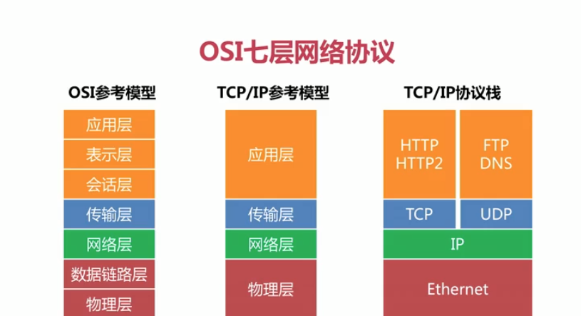
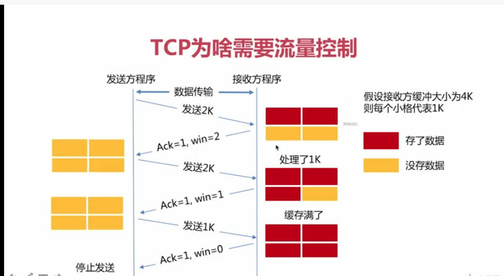
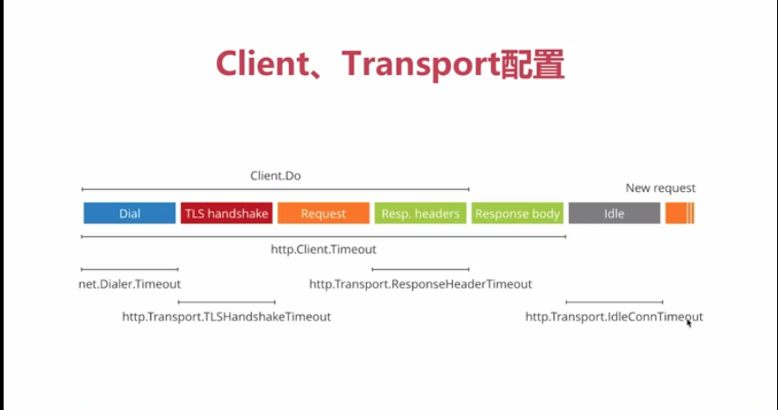
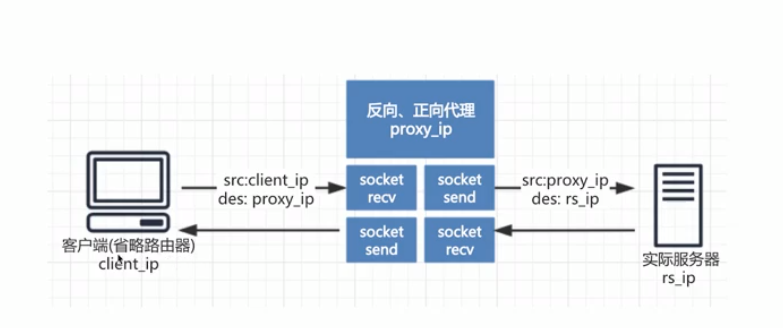
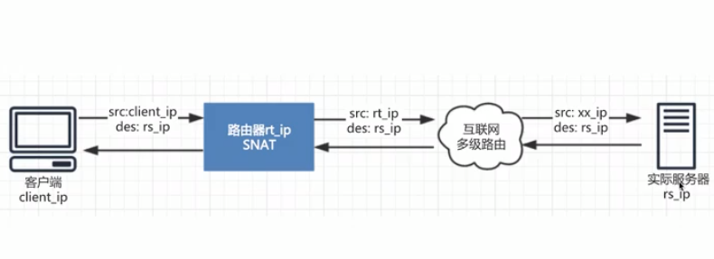
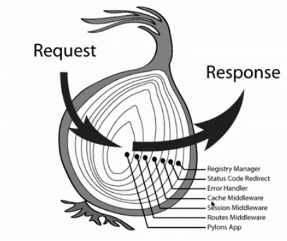

# 业级微服务网关-frimicro

## 介绍
https://gitee.com/phpdi/frimicro  
利用Go优越的性能
设计与实现高性能企业级微服务网关

## 第1章 开篇引导

### 网关应该具备的基本功能
* 支持多种协议代理：tcp/http/websocket/grpc
* 支持多种负载均衡策略：轮询、权重轮询、hash一致性
* 支持下游服务发现：主动探测、自动服务发现
* 支持横向扩容：加机器就能解决高并发

### 借助网关处理高可用、高并发
* 限流：请求QPS限制
* 熔断：错误率达阈值则服务熔断
* 降级：确保核心业务可用
* 权限认证：请求拦截

## 第2章 扫盲网关前置技术：必备网络基础

### OSI7层网络模型


### 经典协议与数据包


### TCP为啥需要三次握手、四次挥手

序号（sequence number）：Seq序号，占32位，用来标识从TCP源端向目的端发送的字节流，发起方发送数据时对此进行标记。  
确认号（acknowledgement number）：Ack序号，占32位，只有ACK标志位为1时，确认序号字段才有效，Ack=Seq+1。  

|标记|含义|
|:---:|:---:|
|URG|Urgent:紧急位,URG=1,表示紧急数据|
|ACK|Acknowledgement:确认位,ACK=1,确认号才生效|
|PSH|Push:推送位,PSH=1,尽快吧数据交付给应用层|
|PST|Reset:重置位,RST=1,重新建立连接|
|SYN|Synchronization:同步位,SYN=1表示连接请求报文|
|FIN|Finish:终止位,FIN=1表示释放连接|

#### 三次握手的过程
1. 发送方 发送: SYN=1,seq=x 
2. 接收方 回应: SYN=1,seq=y,ack=x+1
3. 发送方 发送: ACK=1,seq=x+1,ack=y+1

#### 为什么需要三次握手
已经失效的连接请求报文传送到对方,引起错误  
如果不进行第三次握手,就会导致一个现象,发送方发送的连接请求由于网络原因(超时重传),发送多个连接请求,导致建立多个连接.

#### 为什么建立连接协议是三次握手，而关闭连接却是四次握手呢？
这是因为服务端的LISTEN状态下的SOCKET当收到SYN报文的建连请求后，它可以把ACK和SYN（ACK起应答作用，而SYN起同步作用）放在一个报文里来发送。
但关闭连接时，当收到对方的FIN报文通知时，它仅仅表示对方没有数据发送给你了；但未必你所有的数据都全部发送给对方了，所以你可以未必会马上会关闭SOCKET,也即你可能还需要发送一些数据给对方之后，再发送FIN报文给对方来表示你同意可以关闭连接了，所以它这里的ACK报文和FIN报文多数情况下都是分开发送的。

#### 抓包分析三次握手和四次挥手

```
sudo tcpdump -n -S -i enp0s31f6 host www.baidu.com and tcp port 80
```
#### 为啥time_wait需要等待2msl
* msl: 最长包的传输时间（30秒-1分钟）
* 保证TCP 协议的全双工连接可以可靠关闭
* 保证这次连接的重复数据段从网络中消失

#### 为啥会出现大量的close_wait?
* 首先close_wait一般出现在被动关闭方
* 并发请求太多导致
* 被动关闭方未及时释放端口资源导致

#### TCP为啥需要流量控制？
* 由于通讯双方，网速不同，通讯方任一方发送过快都会导致对方消息处理不过来，所以就需要吧数据放到缓冲区中  
* 如果缓冲区满了，发送方还在疯狂发送，那接收方只能吧数据包丢弃，因此我们需要控制发送速率。
* 我们缓冲区剩余大小称之为接收窗口，用变量win表示，如果接收方的win=0,则发送方停止发送



### 拥塞控制
* 流量控制考虑点对点的通信量的控制
* 拥塞控制考虑整个网络,是全局性的考虑

#### TCP为啥需要拥塞控制
* 流量控制和拥塞控制是两个概念，拥塞控制是调节网络的负载
* 接收方网络资源繁忙，因未及时响应ack导致发送方重传大量数据，这样将导致网络更加拥塞
* 拥塞控制是动态调整win大小，不只是依赖缓冲区大小确定窗口

#### TCP拥塞控制
tcp 拥塞控制包括2部分  
* 慢开始和拥塞避免
* 快速重传和快速恢复 （如果收到三个重复的ack,执行快速重传，当前窗口值变为原来的一半）


### TCP粘包、拆包
#### 为什么会出现粘包、拆包?
* 应用程序写入的数据大于套接字缓冲区大小，这将会发生拆包
* 应用程序写入数据小于套接字缓冲区大小，网卡将应用多次写入的数据发送到网络上，这将会发生粘包
* 进行MSS(最大报文长度)大小的TCP分段，当“TCP报文长度-TCP头部长度>MSS”的时候将发生彩镖
* 接收方法不及时读取套接字缓冲区数据，这将发生粘包

#### 如何获取完整应用数据报文?
* 使用带消息头的协议，头部写入包长度，然后再读取包内容
* 设置定长消息，每次读取定长内容，长度不够时空位补齐固定字符
* 设置消息边界，服务端从网络流中按消息边界分离消息内容，一般使用‘\n’
* 更为复杂的协议，例如 json,protobuf

### 忘记关闭连接会怎么样？
linux 检查端口状态
```
```
#### 客户端忘记关连接
如果进程不退出的话  
客户端占用的端口会一直处于连接状态，资源不会被释放。  
服务端和客户端的tcp连接都处于ESTABLISHED 状态,直到tcp探活机制触发，才能释放资源

#### 服务端忘记关连接
如果进程不退出的话
服务端会一直处于CLOSE_WAIT状态，由于没有给客户端发送FIN包，客户端会处于FIN_WAIT_2状态,直到tcp探活机制触发，才能释放资源


#### golang http客户端超时时间设置


## 第3章 网络代理之HTTP代理*基础篇

### 网络代理和转发的区别
#### 什么是网络代理
* 用户通过代理请求信息
* 请求通过网络代理完成转发到达目标服务器
* 目标服务器相应后再通过网络代理回传给用户


#### 网络转发


#### 比较
* 网络代理 用户不直接连接服务器，网络代理去连接，获取数据后返回给用户
* 网络转发 是路由器对报文的转发操作，中间可能对数据包进行修改

### 网络代理类型
1. 正向代理
是客户端的一种代理技术，帮助客户端访问无法访问的服务资源，可以隐藏用户真实ip,比如：浏览器web代理，VPN等
2. 反向代理
是一种服务端的代理技术，帮服务器做负载均衡、缓存、提供安全校验，可以隐藏服务器真实ip,比如：LVS技术，nginx proxy_pass等

#### web浏览器代理
* 代理接收客户端请求，复制原请求对象，并根据数据配置新请求各种参数
* 把新请求发送到真实服务端，并收到服务器端返回
* 代理服务器对响应做一些处理，然后返回给客户端

### 反向代理
* 代理客户端请求，更改请求结构体信息
* 通过一定的负载均衡算法获取下游服地址
* 把请求发送到下游服务器，并获取返回内容
* 对返回内容做一些处理，然后返回给客户端

### ReverseProxy 功能点
* 更改内容支持
* 错误信息回调
* 支持自定义负载均衡
* url重写功能
* 连接池功能
* 支持websocket服务
* 支持https代理

#### ReverseProxy 补充知识-特殊的Header头

##### 特殊的Header头
* "X-Forwarded-For" 客户端ip,反向代理服务端ip列表,可能会被伪造
* "X-Real-IP" 实际请求的客户端ip，每过一层代理都会被覆盖掉，只需要第一代理设置转发
* "Connection" 描述连接，关闭、长连接等
* "TE" 客户端希望的传输类型
* "Trailer" 允许发送方在消息后面添加的一些源信息，例如超时时间等

##### 第一代理除去标准的逐段传输头（hop-by-hop）


#### ReverseProxy源码分析

##### 核心方法ServeHTTP
1. 验证是否请求终止
2. 设置请求ctx信息
3. 深拷贝header
4. 修改req
5. Upgrade头的特殊处理
6. 追加clientIp信息
7. 向下游请求数据
8. 处理升级协议请求
9. 移除逐段头部
10. 修改返回内容
11. 写入状态码
12. 周期刷新内容到response

##### 4大负载均衡策略
随机、轮询、加权、一致性哈希

##### 加权轮询  
参数  
* Weight 初始化时对节点约束的权重
* currentWeight 节点临时权重，每轮都会变化
* effectiveWeight 节点有效权重，默认与weight相同
* totalWeight 所有节点有效权重之和 sum(effectiveWeight)
策略(参考nginx加权策略)  
1. currentWeight=currentWeight+effectiveWeight
2. 选中最大的currentWeight节点为选中节点
3. currentWeight=currentWeight-totalWeight

##### 一致性哈希  
1. 一致性hash,将所有对象映射到环空间上  
2. 引入虚拟节点解决少量节点的情况下分布不均衡问题


## 第4章 网络代理制HTTP代理*进阶篇
### 开发一个中间件
#### 中间件的意义
* 避免成为if狂魔
* 提高复用、隔离业务
* 调用清晰、组合随意
#### 中间件的实现原理
洋葱结构 

以上中间件依次为:  
1. 错误拦截
2. 缓存中间件
3. 会话中间件
4. 路由中间件

#### 中间件代码实现
* 中间件一般都封装在路由上，路由是Url请求分发的管理器
* 中间件选型
    * 基于链表构建的中间件。缺点：实现复杂，调用方式不灵活
    * 使用数组构建中间件。控制灵活方便，推荐使用
    
#### 实现思路
##### 方法组装
1. 构建中间件的路由
2. 构建URL的中间件方法数组
3. 使用use方法整合路由与方法数组
##### 方法调用
1. 构建方法请求逻辑
2. 封装http.Handler接口与http.Server整合
    
### 限流
#### 高并发系统三大利器： 缓存、降级、限流  
* 缓存：提升系统访问速度和增大处理容量，为相应业务增加缓存
* 降级：当服务器压力剧增时，根据业务策略降级，以此释放服务资源保证业务正常
* 限流：通过并发限速，以达到拒绝服务，排队或等待、降级处理
#### 限流分类
* 漏桶限流 每次请求时计算桶流量，超过阀值则降级请求
* 令牌桶限流 每次请求时从令牌桶取令牌，取不到则降级请求

### time/rate 限速器的使用
* rate.NewLimiter(limit,burst) limit 表示每秒产生token数量、burst最多存token数
    * burst 意味着最大并发数
    * limit 意味着流速，流速快，允许相同时间段内，接受更多的请求
* Allow 判定当前是否可以取到token (此方法最为常用)
* Wait 阻塞等待直到取到token
* Reserve 返回等待时间、再去取token

### 熔断与降级
熔断的意义  
熔断器是当依赖的服务已经出现故障时，为了保证自身服务的正常运行不再访问依赖的服务，防止雪崩效应  
降级意义  
当服务器压力剧增时，根据业务策略降级，以此释放服务资源保证业务正常  

#### 熔断状态
* 关闭状态  
服务正常，维护失败率统计，达到失败率阀值时，转到开启状态。  
* 开启状态  
服务异常，调用fallback函数，一段时间后，进入半开启状态。  
* 半开启状态  
尝试恢复服务，失败率高于阀值，进入半开启状态，低于阀值，进入关闭状态。

#### 降级策略
* 使用缓存
* 提示错误

#### 熔断器原理


### hystrix-go类库
hystrix-go 是熔断、降级、限流集成类库

## 第5章 实时通讯websocket+安全加密https

### websocket 协议
#### Header意义
* 标记请求发起方和第一代理的状态
* 决定当前事务完成后，是否会关闭网络
    * Connection:keep-alive 保持长连接（http1.1 默认参数）
    * Connection:close 关闭连接
    * Connection:Upgrade 协议升级
* 当有多个代理服务器的时候，http长连接是代理服务器之间两两保持的    

### https与http2代理
https是http安全版，http2是一种传输协议，两者没有本质联系    

#### http2
* http2 采用二进制格式而非文本格式
* http2 使用一个连接可使用多路复用
* 使用报头压缩，http2降低了开销
* http2让服务器可以将响应主动推送到客户端缓存
#### http2与https的关系
* http2代表多路复用的传输协议
* https代表http服务器使用了加密传输
* 一个启用https的服务器不一定使用http2
* 使用http2的服务器必须启用https（浏览器强制）

### golang服务器支持https与http2
* ListenAndServe 调整成ListenAndServeTLS即可支持https
* https服务器设置http2.ConfigureServer支持http2


## 第6章 四层tcp代理 【兼顾上层协议】
### 四层代理和七层代理的区别
* 实际是路由转发（4层代理）和反向代理（7层代理）的区别
* 转发客户端与服务器只会有一次三次握手，而代理有两次
* NAT是作用于内核运行的，代理是用户程序运行的
* 代理的数据会进入程序buffer中
### tcp代理原理
* 本质还是7层反向代理，只是代理内容是tcp协议包
* 初始化tcp服务器
* 创建上游连接
* 创建下游连接
* 上下游连接数据交换

### 构建一个tcp服务器
* 监听服务
* 获取构建新连接对象并设置超时时间及keepalive
* 设置方法退出时连接关闭
* 调用回调接口 TcpHandler

### 构建一个tcp反向代理
* 代理实现TcpHandler回调方法结构
* 连接下游服务
* 设置退出时关闭连接
* 一边读数据一边写数据


### tcp代理特点
* 流式数据及无状态数据推荐使用
* 对服务控制比较少，只能做流量控制及请求来源控制
* 如果有对应协议代理推荐使用对应协议的代理

### thrift 代理测试
#### 介绍
Thrift是一个轻量级、跨语言的远程服务调用框架，最初由Facebook开发，后面进入Apache开源项目。它通过自身的IDL中间语言, 并借助代码生成引擎生成各种主流语言的RPC服务端/客户端模板代码。  
thrift就是一个rpc框架，类似于grpc  
Thrift的网络协议建立在TCP协议基础上
#### 安装
参照：https://thrift.apache.org/docs/install
```
sudo apt-get install automake bison flex g++ git libboost-all-dev libevent-dev libssl-dev libtool make pkg-configex
sudo apt install thrift-compiler
```
#### 测试
1. 编写thrift_gen.thrift
2. 运行IDL生成命令
```
thrift --gen go thrift_gen.thrift
```
3. 使用生成的IDL单独构建 server与client即可


## 第7章 支持炫酷的grpc透明代理

### 构建grpc-gateway 测试服务端，让服务器支持http
地址  
https://github.com/grpc-ecosystem/grpc-gateway

#### 安装
```
 go get \
    github.com/grpc-ecosystem/grpc-gateway/v2/protoc-gen-grpc-gateway \
    github.com/grpc-ecosystem/grpc-gateway/v2/protoc-gen-openapiv2 \
    google.golang.org/protobuf/cmd/protoc-gen-go \
    google.golang.org/grpc/cmd/protoc-gen-go-grpc
```


## 第8章 网关拓展服务发现功能

### 网关实现客户端服务发现


### zookeeper
#### 介绍
* 是一个分布式数据库，Hadoop子项目
* 树状方式维护节点方数据的增删改查
* 监听通知机制:通过监听可以获取相应的消息事件
#### zookeeper 节点类型
* 持久节点：一直存在服务器上
* 临时节点：会话失效，节点自动清理
* 顺序节点：节点创建，自动分配序列号