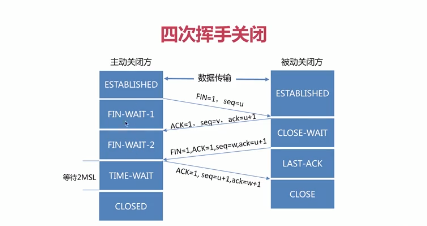
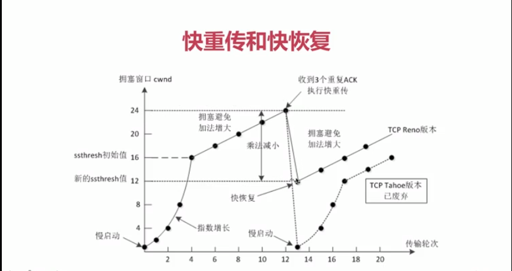

# 业级微服务网关-frimicro

## 介绍
https://gitee.com/phpdi/frimicro  
利用Go优越的性能
设计与实现高性能企业级微服务网关

## 第1章 开篇引导

### 网关应该具备的基本功能
* 支持多种协议代理：tcp/http/websocket/grpc
* 支持多种负载均衡策略：轮询、权重轮询、hash一致性
* 支持下游服务发现：主动探测、自动服务发现
* 支持横向扩容：加机器就能解决高并发

### 借助网关处理高可用、高并发
* 限流：请求QPS限制
* 熔断：错误率达阈值则服务熔断
* 降级：确保核心业务可用
* 权限认证：请求拦截

## 第2章 扫盲网关前置技术：必备网络基础

### OSI7层网络模型


### 经典协议与数据包


### TCP为啥需要三次握手、四次挥手

序号（sequence number）：Seq序号，占32位，用来标识从TCP源端向目的端发送的字节流，发起方发送数据时对此进行标记。  
确认号（acknowledgement number）：Ack序号，占32位，只有ACK标志位为1时，确认序号字段才有效，Ack=Seq+1。  

|标记|含义|
|:---:|:---:|
|URG|Urgent:紧急位,URG=1,表示紧急数据|
|ACK|Acknowledgement:确认位,ACK=1,确认号才生效|
|PSH|Push:推送位,PSH=1,尽快吧数据交付给应用层|
|PST|Reset:重置位,RST=1,重新建立连接|
|SYN|Synchronization:同步位,SYN=1表示连接请求报文|
|FIN|Finish:终止位,FIN=1表示释放连接|

#### 三次握手的过程
1. 发送方 发送: SYN=1,seq=x 
2. 接收方 回应: SYN=1,seq=y,ack=x+1
3. 发送方 发送: ACK=1,seq=x+1,ack=y+1

#### 为什么需要三次握手
已经失效的连接请求报文传送到对方,引起错误  
如果不进行第三次握手,就会导致一个现象,发送方发送的连接请求由于网络原因(超时重传),发送多个连接请求,导致建立多个连接.

#### 为什么建立连接协议是三次握手，而关闭连接却是四次握手呢？
这是因为服务端的LISTEN状态下的SOCKET当收到SYN报文的建连请求后，它可以把ACK和SYN（ACK起应答作用，而SYN起同步作用）放在一个报文里来发送。
但关闭连接时，当收到对方的FIN报文通知时，它仅仅表示对方没有数据发送给你了；但未必你所有的数据都全部发送给对方了，所以你可以未必会马上会关闭SOCKET,也即你可能还需要发送一些数据给对方之后，再发送FIN报文给对方来表示你同意可以关闭连接了，所以它这里的ACK报文和FIN报文多数情况下都是分开发送的。

#### 抓包分析三次握手和四次挥手

```
sudo tcpdump -n -S -i enp0s31f6 host www.baidu.com and tcp port 80
```
#### 为啥time_wait需要等待2msl
* msl: 最长包的传输时间（30秒-1分钟）
* 保证TCP 协议的全双工连接可以可靠关闭
* 保证这次连接的重复数据段从网络中消失

#### 为啥会出现大量的close_wait?
* 首先close_wait一般出现在被动关闭方
* 并发请求太多导致
* 被动关闭方未及时释放端口资源导致

#### TCP为啥需要流量控制？
* 由于通讯双方，网速不同，通讯方任一方发送过快都会导致对方消息处理不过来，所以就需要吧数据放到缓冲区中  
* 如果缓冲区满了，发送方还在疯狂发送，那接收方只能吧数据包丢弃，因此我们需要控制发送速率。
* 我们缓冲区剩余大小称之为接收窗口，用变量win表示，如果接收方的win=0,则发送方停止发送


### 拥塞控制
* 流量控制考虑点对点的通信量的控制
* 拥塞控制考虑整个网络,是全局性的考虑

#### TCP为啥需要拥塞控制
* 流量控制和拥塞控制是两个概念，拥塞控制是调节网络的负载
* 接收方网络资源繁忙，因未及时响应ack导致发送方重传大量数据，这样将导致网络更加拥塞
* 拥塞控制是动态调整win大小，不只是依赖缓冲区大小确定窗口

#### TCP拥塞控制
tcp 拥塞控制包括2部分  
* 慢开始和拥塞避免
* 快速重传和快速恢复 （如果收到三个重复的ack,执行快速重传，当前窗口值变为原来的一半）



### TCP粘包、拆包
#### 为什么会出现粘包、拆包?
* 应用程序写入的数据大于套接字缓冲区大小，这将会发生拆包
* 应用程序写入数据小于套接字缓冲区大小，网卡将应用多次写入的数据发送到网络上，这将会发生粘包
* 进行MSS(最大报文长度)大小的TCP分段，当“TCP报文长度-TCP头部长度>MSS”的时候将发生彩镖
* 接收方法不及时读取套接字缓冲区数据，这将发生粘包

#### 如何获取完整应用数据报文?
* 使用带消息头的协议，头部写入包长度，然后再读取包内容
* 设置定长消息，每次读取定长内容，长度不够时空位补齐固定字符
* 设置消息边界，服务端从网络流中按消息边界分离消息内容，一般使用‘\n’
* 更为复杂的协议，例如 json,protobuf

### 忘记关闭连接会怎么样？
linux 检查端口状态
```
```
#### 客户端忘记关连接
如果进程不退出的话  
客户端占用的端口会一直处于连接状态，资源不会被释放。  
服务端和客户端的tcp连接都处于ESTABLISHED 状态,直到tcp探活机制触发，才能释放资源

#### 服务端忘记关连接
如果进程不退出的话
服务端会一直处于CLOSE_WAIT状态，由于没有给客户端发送FIN包，客户端会处于FIN_WAIT_2状态,直到tcp探活机制触发，才能释放资源


#### golang http客户端超时时间设置


## 网络代理