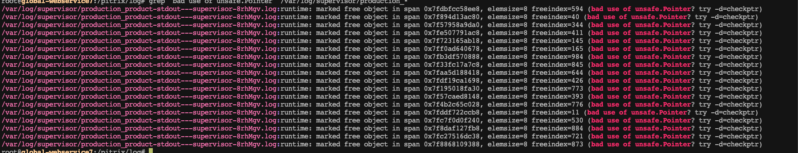

# 问题现象
监控告警服务团队反馈，产品中心线上服务偶尔有重启的问题    

排查服务日志发现，在重启之前报错:     
grep "bad use of unsafe.Pointer" -C 5 /var/log/supervisor/production_*  

```
runtime: marked free object in span
...
0xc002afdfe8 free  unmarked
0xc002afdff0 free  unmarked
0xc002afdff8 free  unmarked
fatal error: found pointer to free object
```

# 排查过程
程序中只有一个地方使用了unsafe.Pointer: pageutil.Pagination 函数实现
```
// Pagination 内存分页
// Deprecated
func Pagination(arr interface{}, limit, offset int) (total int64, err error) {
	var (
		v  reflect.Value
		ve reflect.Value
	)
	v = reflect.ValueOf(arr)
	if v.Kind() != reflect.Ptr {
		return 0, pageDataMustBePtr
	}

	ve = v.Elem()
	if ve.Kind() != reflect.Slice {
		return 0, pageDataMustBePtr
	}

	//数据总量
	total = int64(ve.Len())

	if int(total) <= limit && offset == 0 {
		return
	}

	//防止越界
	if int(total) < offset {
		offset = int(total)
	}

	sliHeader := (*reflect.SliceHeader)(unsafe.Pointer(v.Pointer()))

	//取切片元素大小
	sizeItem := reflect.TypeOf(arr).Elem().Elem().Size()

	//移动指针
	sliHeader.Data += uintptr(offset) * sizeItem

	//防止越界
	if int(total)-offset < limit {
		limit = int(total) - offset
	}
	sliHeader.Len = limit

	return
}
```

该函数在go1.18泛型之前，用于实现对切片的内存分页。该函数在1.18之前是稳定的 

这里替换该函数为泛型实现  
```
// PaginationParadigm 内存分页
func PaginationParadigm[T any](arr []T, limit, offset int) (res []T, total int) {
	//数据总量
	total = len(arr)

	//防止越界
	if total < offset {
		offset = total
	}

	end := offset + limit
	if end > total {
		end = total
	}

	res = arr[offset:end]
	return
}
```


在将该分页函数替换成泛型实现后，偶尔重启问题已不在出现

# 结论
unsafe包正如它的名称一般，并不安全，即使你在当前的go版本下稳定运行，当你升级go版本的时候，就可能出现问题。  
不要使用unsafe包  
