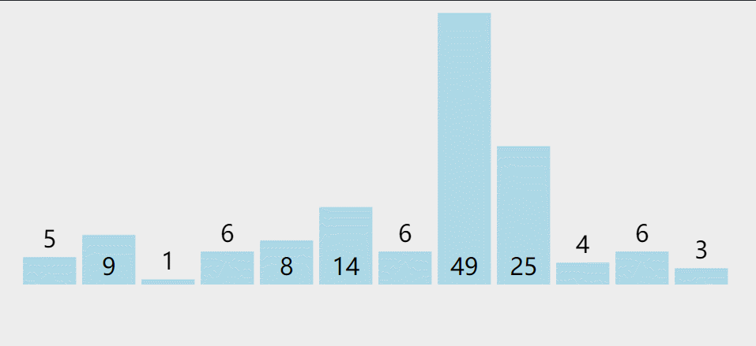
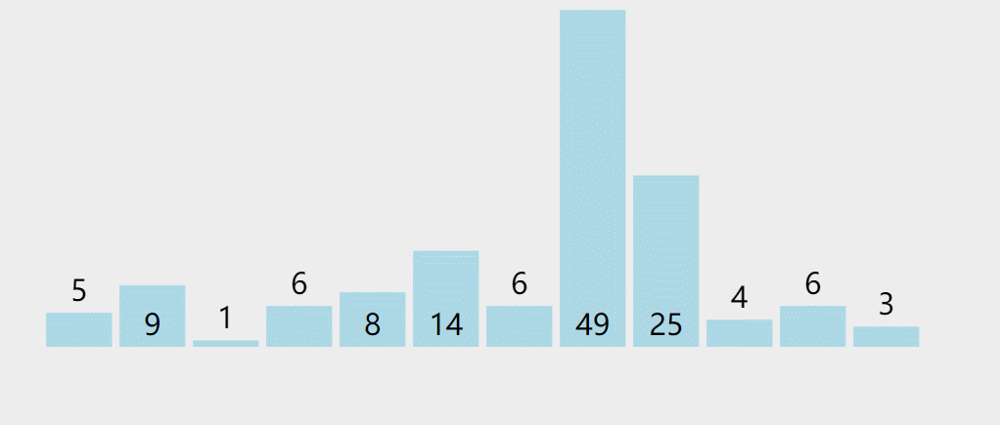

# 摘录自
数据结构和算法（Golang实现）  
https://www.bookstack.cn/books/hunterhug-goa.c

# 基础知识
## 什么是数据结构
大多数算法都需要组织数据，所以产生了数据结构。数据结构在计算机中，主要是用来实现各种算法的基础，当然数据结构本身也是算法的一部分。  
## 基本的数据结构
链表，栈和队列，树和图。    

* 链表，就是把数据链接起来，关联起来，一个数据节点指向另外一个数据节点，像自然界的一条条铁链，大部分数据结构，都是由链表的若干变种来表示
* 栈和队列，主要用来存储多个数据，只不过一个是先进后出，一个先进先出。比如下压栈，先入栈的数据是最后才能出来，而我们熟知的队列，先排队的人肯定先获得服务。
* 其次是树和图，树就是有一个树根节点，存放着数据，下面有很多子节点，也存放着数据，类比自然界的树。图则可以类比自然界的地图，多个点指向多个点，点和点之间有一条或多条边，而这些点存放着数据，边也可以存放着数据，比如距离等。

## 基本的算法
* 排序算法
* 查找算法
* 图相关算法
* 其它算法

## 分治法和递归
分治法一般使用递归来求问题的解。
理论上，所有的递归方式都可以转化为非递归的方式，只不过使用递归，代码的可读性更高。

### 递归
递归就是不断地调用函数本身。
如果递归式使用了运算符，每次重复的调用都使得运算的链条不断加长，系统不得不使用栈进行数据保存和恢复。
### 尾部递归
尾部递归是指递归函数在调用自身后直接传回其值，而不对其再加运算，效率将会极大的提高。

## 算法复杂度
算法的优先级排列如下，一般排在上面的要优于排在下面的：　　 
1. 常数复杂度：O(1)  
2. 对数复杂度：O(logn)  
3. 一次方复杂度：O(n)  
4. 一次方乘对数复杂度：O(nlogn)  
5. 乘方复杂度：O(n^2)，O(n^3)  
6. 指数复杂度：O(2^n)  
7. 阶乘复杂度：O(n!)  
8. 无限大指数复杂度：O(n^n)  

# 数据结构
## 链表
链表由一个个数据节点组成的，它是一个递归结构，要么它是空的，要么它存在一个指向另外一个数据节点的引用。  
简单来说，链表就是将一个数据与另一个数据关联起来的结构  
* 单链表，就是链表是单向的，像我们上面这个结构一样，可以一直往下找到下一个数据节点，它只有一个方向，它不能往回找
* 双链表，每个节点既可以找到它之前的节点，也可以找到之后的节点，是双向的。
* 循环链表，就是它一直往下找数据节点，最后回到了自己那个节点，形成了一个回路。循环单链表和循环双链表的区别就是，一个只能一个方向走，一个两个方向都可以走。


**数组和链表**   

数组和链表是两个不同的概念。一个是编程语言提供的基本数据类型，表示一个连续的内存空间，可通过一个索引访问数据。另一个是我们定义的数据结构，通过一个数据节点，可以定位到另一个数据节点，不要求连续的内存空间。 
数组的优点是占用空间小，查询快，直接使用索引就可以获取数据元素，缺点是移动和删除数据元素要大量移动空间。  
链表的优点是移动和删除数据元素速度快，只要把相关的数据元素重新链接起来，但缺点是占用空间大，查找需要遍历。  
链表 和 数组 可以用来辅助构建各种基本数据结构 。

**应用场景**
1. 数据结构实现：链表是一种基本的数据结构，用于实现其他高级数据结构，如栈、队列和哈希表。链表可以提供高效的插入和删除操作，尤其在需要频繁插入和删除元素的情况下。
2. 链表与图的表示：链表可以用来表示图的邻接表。在图算法中，邻接表是一种常见的表示方式，用于存储图的顶点和边的关系。
3. 操作系统中的进程调度：操作系统中的进程调度算法通常使用链表来维护就绪队列或等待队列。进程可以按照某种优先级或其他策略链接在一起，以便操作系统能够轮流执行它们。
4. 缓存实现：链表常用于实现缓存数据结构，如LRU（Least Recently Used）缓存。LRU缓存根据最近访问的元素来保持缓存中的数据，当缓存满时，最近最少使用的元素会被淘汰。
5. 高级编程语言中的垃圾回收：在一些高级编程语言中，链表被用于实现垃圾回收机制。当对象不再被引用时，垃圾回收器可以使用链表来跟踪和释放这些无用的对象。
6. 文件系统：链表常用于文件系统的索引结构，如索引节点（inode）链表。索引节点链表记录了文件在磁盘上的物理位置和其他元数据信息。
7. 网络数据传输：链表可以用于实现网络协议中的数据包队列，如TCP/IP协议栈中的发送和接收缓冲区。


## 可变长数组
可变长数组在实际开发上，经常会使用到，其在固定大小数组的基础上，会自动进行容量扩展。  

**应用场景**  
Golang 自动提供了这一数据类型：切片（可变长数组）  

## 栈和队列
* 栈：先进后出，先进队的数据最后才出来。
* 队列：先进先出，先进队的数据先出来。

我们可以用数据结构：链表（可连续或不连续的将数据与数据关联起来的结构），或 数组（连续的内存空间，按索引取值） 来实现 栈（stack） 和 队列 (queue)。

数组实现：能快速随机访问存储的元素，通过下标 index 访问，支持随机访问，查询速度快，但存在元素在数组空间中大量移动的操作，增删效率低。

链表实现：只支持顺序访问，在某些遍历操作中查询速度慢，但增删元素快。  

**栈的应用场景**
1. 函数调用 在程序中，每个函数调用都需要将当前状态的信息（比如函数调用前的参数、局部变量和程序计数器等）保存到栈中，等到函数调用结束后再从栈中弹出这些信息，恢复调用前的状态。这个过程被称作函数的压栈和弹栈操作。
2. 表达式求值 通常我们在计算机中对表达式求值时都采用栈来实现。比如中缀表达式转后缀表达式的操作就需要使用栈。
3. 系统调用 在操作系统中，内核通常会将一个系统调用的参数、返回值和程序计数器等状态保存到进程的用户栈中，在系统调用结束后再从栈中弹出这些信息，恢复调用前的状态。

**队列的应用场景**
1. 异步处理：例如在用户注册后，需要发送注册邮件和注册短信。传统的做法有两种，串行方式和并行方式。使用队列可以实现并行处理，提高处理时间。假设三个业务节点每个使用50毫秒，不考虑网络等其他开销，串行方式的时间是150毫秒，而并行方式可能是100毫秒。
2. 应用解耦：在单体应用中，业务流程耦合可能导致系统对用户请求响应慢。通过将系统拆分为子系统，并使用消息队列作为子系统间的异步通信通道，可以实现系统的解耦，提高整个系统的响应速度。例如，在电商网站促销期间，抢到的商品订单信息可以放入消息队列，出库、发货等后续操作会从队列里读取任务信息然后执行。
3. 流量削锋：在电商大促销等流量洪流突然来袭时，可以通过队列服务堆积缓存订单等信息，在下游系统有能力处理消息的时候再处理，避免下游订阅系统因突发流量崩溃。
4. 消息通讯：在物联网中，设备通过接入网关连接云端，消息队列可以提供高速的数据传输通道，连接后端的数据分析系统。
5. 数据同步：在大中型分布式系统中，消息队列可以帮助各个子系统的数据及时同步到后台模块，并提供数据通道帮助触发其他的业务流程，如函数处理、消息通知等。


## 列表(线性表)
可以存放数据的数据结构，数据按顺序排列，可以依次入队和出队。  
队列 (queue) 和先进后出的 栈（stack） 都是列表  
线性表 也是列表的意思，示具有相同特性的数据元素的有限序列

列表的实现有 顺序表示 或 链式表示。即可以用数组或者链表表示

**双端队列**
双端队列（Double-ended Queue，deque）是一种具有两端插入和删除操作的数据结构，可以在队列两端进行插入和删除元素。双端队列可以用数组（Array）或链表（Linked List）实现，具有队列和栈的特性，因此可以实现先进先出（FIFO）和后进先出（LIFO）两种数据存储方式。在双端队列中，元素可以从两端插入和删除，因此可以更加灵活地处理数据。


## 字典
字典是存储键值对的数据结构，把一个键和一个值映射起来，一一映射，键不能重复。  
字典的实现有两种方式：哈希表 HashTable 和红黑树 RBTree。Golang 语言中字典 map 的实现由哈希表实现  

**应用场景**
1. 缓存（Cache）：字典可以用来存储缓存数据，通过键快速查找和获取对应的值。例如，将网络请求的结果以URL作为键，保存在字典中，下次请求相同URL时可以直接从字典中获取结果，提高访问速度。
2. 配置管理：字典可以用来存储和管理配置信息。将配置项的名称作为键，配置项的值作为对应的值，可以方便地进行配置的读取和修改。
3. 数据索引：字典可以用来构建数据索引，提供高效的数据查找和访问能力。例如，在搜索引擎中，将关键词作为键，搜索结果的URL作为值，可以通过关键词快速索引到相关的搜索结果。
4. 词频统计：字典可以用来进行词频统计，统计文本中每个单词出现的次数。将单词作为键，出现次数作为对应的值，可以便捷地对文本进行词频统计。
5. 路由表：在网络路由中，字典可以用来存储路由表信息，通过对应的键查找到对应的路由信息。
6. 编程语言中的变量和参数存储：在编程语言中，字典可以用来存储变量和参数，并通过键来访问和修改相应的值

## 树
树是一种比较高级的基础数据结构，由 n 个有限节点组成的具有层次关系的集合。

### 树的定义  
1. 有节点间的层次关系，分为父节点和子节点。
2. 有唯一一个根节点，该根节点没有父节点。
3. 除了根节点，每个节点有且只有一个父节点。
4. 每一个节点本身以及它的后代也是一棵树，是一个递归的结构。
5. 没有后代的节点称为叶子节点，没有节点的树称为空树。

**二叉树**：每个节点最多只有两个儿子节点的树。  

**满二叉树**：非叶子节点儿子都是满的树就是满二叉树


#### 二叉树的数学特征
1. 高度为 h≥0 的二叉树至少有 h+1 个结点，比如最不平衡的二叉树就是退化的线性链表结构，所有的节点都只有左儿子节点，或者所有的节点都只有右儿子节点。
2. 高度为 h≥0 的二叉树至多有 2^h+1 个节点，比如这棵树是满二叉树。
3. 含有 n≥1 个结点的二叉树的高度至多为 n-1，由 1 退化的线性链表可以反推。
4. 含有 n≥1 个结点的二叉树的高度至少为 logn，由 2 满二叉树可以反推。
5. 在二叉树的第 i 层，至多有 2^(i-1) 个节点，比如该层是满的。


#### 四种遍历方法
1. 先序遍历：先访问根节点，再访问左子树，最后访问右子树。
2. 后序遍历：先访问左子树，再访问右子树，最后访问根节点。
3. 中序遍历：先访问左子树，再访问根节点，最后访问右子树。
4. 层次遍历：每一层从左到右访问每一个节点。

# 排序算法
快速排序，归并排序和堆排序是比较高级的排序算法。  
目前被认为综合最好的高级排序算法是快速排序，快速排序的平均用时最短，大多数的编程库内置的排序算法都是它。  


在 sort.go文件中，排序算法有: 插入排序(insertionSort)、堆排序(heapSort)，快速排序(quickSort)、希尔排序(ShellSort)、归并排序(SymMerge)。 这些函数都是以小写字母开头，意味着他们对外是不可见的(letter case set visibility)。其中，归并排序用于 Stable函数，其余算法用于 Sort函数。

## 插入排序
### 直接插入排序 O(n^2)
插入排序，一般我们指的是简单插入排序，也可以叫直接插入排序。就是说，每次把一个数插到已经排好序的数列里面形成新的排好序的数列，以此反复。

过程
```
[]表示排好序
第一轮： [4] 2 9 1 拿待排序的第二个数 2，插入到排好序的数列 [4]
    与排好序的数列 [4] 比较
    第一轮进行中：2 比 4 小，插入到 4 前
第二轮： [2 4] 9 1 拿待排序的第三个数 9，插入到排好序的数列 [2 4]
    与排好序的数列 [2 4] 比较
    第二轮进行中： 9 比 4 大，不变化
第三轮： [2 4 9] 1 拿待排序的第四个数 1，插入到排好序的数列 [2 4 9]
    与排好序的数列 [2 4 9] 比较
    第三轮进行中： 1 比 9 小，插入到 9 前
    第三轮进行中： 1 比 4 小，插入到 4 前
    第三轮进行中： 1 比 2 小，插入到 2 前
结果： [1 2 4 9]
```
### 希尔排序 O(n^1.3)
一般建议待排序数组为小规模情况下使用直接插入排序，在规模中等的情况下可以使用希尔排序，但在大规模还是要使用快速排序，归并排序或堆排序。

举个简单例子，希尔排序一个 12 个元素的数列：[5 9 1 6 8 14 6 49 25 4 6 3]，增量 d 的取值依次为：6，3，1：
```
x 表示不需要排序的数
取 d = 6 对 [5 x x x x x 6 x x x x x] 进行直接插入排序，没有变化。
取 d = 3 对 [5 x x 6 x x 6 x x 4 x x] 进行直接插入排序，排完序后：[4 x x 5 x x 6 x x 6 x x]。
取 d = 1 对 [4 9 1 5 8 14 6 49 25 6 6 3] 进行直接插入排序，因为 d=1 完全就是直接插入排序了。
```

越有序的数列，直接插入排序的效率越高，希尔排序通过分组使用直接插入排序，因为步长比 1 大，在一开始可以很快将无序的数列变得不那么无序，比较和交换的次数也减少，直到最后使用步长为 1 的直接插入排序，数列已经是相对有序了，所以时间复杂度会稍好一点

希尔排序的时间复杂度大约在这个范围：O(n^1.3)~O(n^2)，具体还无法用数学来严格证明它。

希尔排序不是稳定的，因为每一轮分组，都使用了直接插入排序，但分组会跨越 n 个位置，导致两个相同的数，发现不了对方而产生了顺序变化。

## 选择排序

### 直接选择排序 O(n^2)
每次扫描数列找出最小的数，然后与第一个数交换，然后排除第一个数，从第二个数开始重复这个操作，这种排序叫做简单选择排序


### 堆排序 O(nlog2n)

### 优先队列
优先队列是一种能完成以下任务的队列：插入一个数值，取出最小或最大的数值（获取数值，并且删除）。

优先队列可以用二叉树来实现，我们称这种结构为二叉堆。

最小堆和最大堆是二叉堆的一种，是一棵完全二叉树（一种平衡树）。

最小堆的性质：  
1. 父节点的值都小于左右儿子节点。  
2. 这是一个递归的性质。

最大堆的性质：
1. 父节点的值都大于左右儿子节点。
2. 这是一个递归的性质。

3. 最大堆和最小堆实现方式一样，只不过根节点一个是最大的，一个是最小的。

维持好堆后，依次将根节点和最后一个节点交换，取出最大值或最小值


## 交换排序
### 冒泡排序 O(n^2)
从第一个数开始，依次比较相邻的两个数，如果前面一个数比后面一个数大，那么交换位置，直到处理到最后一个数，最后的这个数是最大的。 


### 快速排序 O(nlogn)
快速排序通过一趟排序将要排序的数据分割成独立的两部分，其中一部分的所有数据都比另外一部分的所有数据都要小，然后再按此方法对这两部分数据分别进行快速排序，整个排序过程可以递归进行，以此达到整个数据变成有序序列。


## 归并排序
归并排序是一种分治策略的排序算法。它是一种比较特殊的排序算法，通过递归地先使每个子序列有序，再将两个有序的序列进行合并成一个有序的序列。  

归并排序首先由著名的现代计算机之父 John_von_Neumann 在 1945 年发明，被用在了 EDVAC(一台美国早期电子计算机)，足足用墨水写了 23 页的排序程序。注：冯·诺依曼（John von Neumann，1903年12月28日-1957年2月8日），美籍匈牙利数学家、计算机科学家、物理学家，是20世纪最重要的数学家之一。

##### 自顶向下归并排序
使用递归实现，时间复杂度为：O(nlogn)。 空间复杂度为：O(logn)

##### 自底向上归并排序
不使用递归，时间复杂度为：O(nlogn)。 空间复杂度为：O(1)

## 内置库使用快速排序的原因
首先堆排序，归并排序最好最坏时间复杂度都是：O(nlogn)，而快速排序最坏的时间复杂度是：O(n^2)，但是很多编程语言内置的排序算法使用的仍然是快速排序，这是为什么？

1. 这个问题有偏颇，选择排序算法要看具体的场景，Linux 内核用的排序算法就是堆排序，而 Java 对于数量比较多的复杂对象排序，内置排序使用的是归并排序，只是一般情况下，快速排序更快。
2. 归并排序有两个稳定，第一个稳定是排序前后相同的元素位置不变，第二个稳定是，每次都是很平均地进行排序，读取数据也是顺序读取，能够利用存储器缓存的特征，比如从磁盘读取数据进行排序。因为排序过程需要占用额外的辅助数组空间，所以这部分有代价损耗，但是原地手摇的归并排序克服了这个缺陷。
3. 复杂度中，大 O 有一个常数项被省略了，堆排序每次取最大的值之后，都需要进行节点翻转，重新恢复堆的特征，做了大量无用功，常数项比快速排序大，大部分情况下比快速排序慢很多。但是堆排序时间较稳定，不会出现快排最坏 O(n^2) 的情况，且省空间，不需要额外的存储空间和栈空间。
4. 当待排序数量大于16000个元素时，使用自底向上的堆排序比快速排序还快可见此：https://core.ac.uk/download/pdf/82350265.pdf。
5. 快速排序最坏情况下复杂度高，主要在于切分不像归并排序一样平均，而是很依赖基准数的现在，我们通过改进，比如随机数，三切分等，这种最坏情况的概率极大的降低。大多数情况下，它并不会那么地坏，大多数快才是真的块。
6. 归并排序和快速排序都是分治法，排序的数据都是相邻的，而堆排序比较的数可能跨越很大的范围，导致局部性命中率降低，不能利用现代存储器缓存的特征，加载数据过程会损失性能。

对稳定性有要求的，要求排序前后相同元素位置不变，可以使用归并排序，Java 中的复杂对象类型，要求排序前后位置不能发生变化，所以小规模数据下使用了直接插入排序，大规模数据下使用了归并排序。

对栈，存储空间有要求的可以使用堆排序，比如 Linux 内核栈小，快速排序占用程序栈太大了，使用快速排序可能栈溢出，所以使用了堆排序。

## golang 标准库sort排序
### sort.SliceStable
会先按照 20 个元素的范围，对整个切片分段进行插入排序，因为小数组插入排序效率高，然后再对这些已排好序的小数组进行归并排序。其中归并排序还使用了原地排序，节约了辅助空间。
### sort.Slice
快速排序限制程序栈的层数为： 2*ceil(log(n+1))，当递归超过该层时表示程序栈过深，那么转为堆排序。
上述快速排序还使用了三种优化，第一种是递归时小数组转为插入排序，第二种是使用了中位数基准数，第三种使用了三切分。


# 查找算法
1. 散列查找：也称哈希查找，有拉链法查找，也有线性探测法查找，拉链法使用数组链表结构，线性探测法使用数组。
2. 树查找：有搜索二叉树，平衡查找树如：红黑树，B树，AVL树，B+等，使用链表树结构。

## 哈希表：散列查找
* 线性探测法
* 拉链法

选择 2^x 作为数组长度有一个很好的优点，就是计算速度变快了，如下是一个恒等式：
> 恒等式 hash % 2^k = hash & (2^k-1)，表示截断二进制的位数，保留后面的 k 位
这样取余 % 操作将变成按位 &  

散列查找，主要是将键进行 hash 计算得出一个大整数，然后与数组长度进行取余，这样一个比较大的域空间就只会映射到数组的下标范围，利用数组索引快的特征，用空间换时间的思路，使得查找的速度快于线性查找。

哈希表查找，是一种用空间换时间的查找算法，时间复杂度能达到：O(1)，最坏情况下退化到查找链表：O(n)。但均匀性很好的哈希算法以及合适空间大小的数组，在很大概率避免了最坏情况。

哈希表在添加元素时会进行伸缩，会造成较大的性能消耗，所以有时候会用到其他的查找算法：树查找算法。


## 二叉查找树
二叉查找树，又叫二叉排序树，二叉搜索树，是一种有特定规则的二叉树  
1. 它是一棵二叉树，或者是空树。
2. 左子树所有节点的值都小于它的根节点，右子树所有节点的值都大于它的根节点。
3. 左右子树也是一棵二叉查找树。
二叉查找树的特点是，一直往左儿子往下找左儿子，可以找到最小的元素，一直往右儿子找右儿子，可以找到最大的元素。

二叉查找树可能退化为链表，也可能是一棵非常平衡的二叉树，查找，添加，删除元素的时间复杂度取决于树的高度 h。  

1. 当二叉树是满的时，树的高度是最小的，此时树节点数量 n 和高度 h 的关系为：h = log(n)。
2. 当二叉树是一个链表时，此时树节点数量 n 和高度 h 的关系为：h = n。

二叉查找树的效率来源其二分查找的特征，时间复杂度在于二叉树的高度，因此查找，添加和删除的时间复杂度范围为 log(n)~n。

为了提高二叉查找树查找的速度，树的高度要尽可能的小。AVL树和红黑树都是相对平衡的二叉查找树，因为特殊的旋转平衡操作，树的高度被大大压低。它们查找效率较高，添加，删除，查找操作的平均时间复杂度都为 log(n)，经常在各种程序中被使用。

## AVL 树
二叉查找树的树高度影响了查找的效率，需要尽量减小树的高度，AVL树正是这样的树。  
定义：  
1. 首先它是一棵二叉查找树。
2. 任意一个节点的左右子树最大高度差为1。


## 红黑树

约束：  
1. 叶子节点不存储数据，且是黑节点 
2. 从左到右升序 
3. 黑节点的数量平衡（每一条路径上的黑色节点的数量是一致的 ）
4. 不能有两个连续的红节点

### 插入规则   
插入的时候除了根节点的情况，都是以红色节点的身份插入   
1. 父为黑，直接插入
2. 父叔为红，颜色调换
3. 父红叔黑（父子在一条直线上），颜色调换，再移动（爷节点下沉，父节点上升） 插入节点需要与父爷节点在一条直线上
4. 父红叔黑（父子不在一跳直线上），父子不同向，先掰直（父子关系调换），再执行第3条

## B树

B树是一种自平衡的搜索树，广泛应用于文件系统和数据库中的索引结构。它的定义如下：
1. B树是一种多路搜索树，每个节点可以拥有多个子节点。
2. 每个节点最多有M个子节点，M被称为B树的阶数。
3. 除根节点外，每个节点至少有ceil(M/2)个子节点。也就是说，节点的子节点数量必须在[M/2]和M之间，其中[]表示向上取整，即 round up 。
4. B树的所有叶子节点位于同一层，而且叶子节点的指针为NULL。
5. 节点内的关键字按非降序排列，每个节点包含的关键字数必须比子节点数量少一个

B树的定义使得它具有以下特性： 
1. 所有节点的子节点数目相等，这样可以保证在插入和删除操作时，树的高度保持平衡，提高查找效率。
2. 每个节点中的关键字按照非降序排列，这样可以方便进行二分查找。
3. B树的阶数决定了每个节点中能存储的最多关键字数量，可以根据需求调整B树的阶数来适应不同的存储情况。

B树是一种自平衡的多路搜索树，具有高效的查找和插入删除操作，广泛应用于需要大量随机访问的场景，如数据库和文件系统的索引结构。


## B+树
B+树是在B 树的基础上优化而来的，与B树不同的是 
1. 非叶子节点不存储数据，数据都存储在叶子节点上
2. 叶子节点之间是链表结构

非叶子节点不存储数据，叶子节点直接是链表结构，便于范围查询