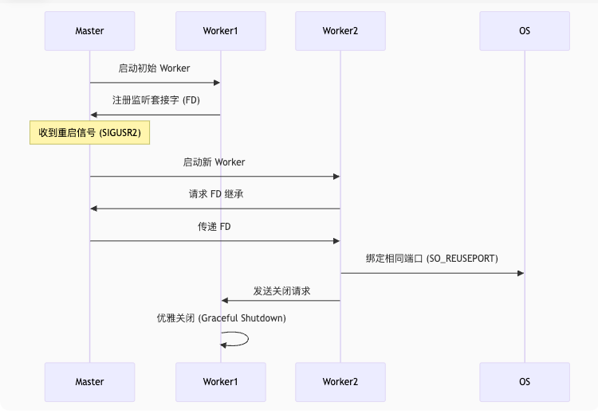

# 背景
项目中有一个服务叫定价服务，用于获取价格，会被计费服务不停的调用。   
注册中心由zookeeper实现   
线上服务由supervisor代管    


在定价服务升级的时候，由于注册中心的及时性没有那么高。就会出现，服务已经不可用（正在重启），调用端还在调用然后失败的情况


如何解决重启期间 定价服务依然可用能，达到100%的可用时间，不影响调用端？
即服务的零停机重启   


# 解决方案
利用 github.com/jpillora/overseer 包对程序进行热更新 

其核心原理是通过 多进程协作 + 文件描述符传递 实现无缝重启。   


# overseer原理介绍
## 核心架构
  

**Master进程：**
* 常驻内存的守护进程
* 不处理业务逻辑，只负责管理 Worker 生命周期
* 监听重启信号（如 SIGUSR2 或文件变更）

**Worker 进程：**
* 实际运行业务代码的进程（如 HTTP 服务）
* 可被 Master 随时创建/销毁
* 关键：继承监听套接字（Socket FD）

## 热重启流程
  
1. 旧 Worker 运行中
    * Worker1 监听端口（如 :8080）
    * 将 Socket 文件描述符（FD）注册到 Master
2. 触发重启
    * Master 收到 SIGUSR2 或检测到新二进制文件
    * 启动新 Worker2（加载新版本代码）
3. FD 继承
    * Master 将保存的 Socket FD 通过 Unix Domain Socket 传递给 Worker2
    * Worker2 使用 net.FileListener 接管相同端口
4. 双进程并行
    * 内核将新连接负载均衡到两个 Worker（SO_REUSEPORT）
    * Worker1 停止接受新连接（net.Listener.Close()）
5. 优雅退出
    * Worker1 等待现有请求完成（可配置超时）
    * 处理完成后自动退出

## 使用示例
```
import "github.com/jpillora/overseer"

func main() {
    overseer.Run(overseer.Config{
        Program: prog,  // 业务逻辑函数
        Address: ":8080",
        RestartSignal: syscall.SIGUSR2, // 自定义重启信号
        PreUpgrade: func() { /* 预热缓存等 */ },
    })
}

// 业务代码（每次重启重新执行）
func prog(state overseer.State) {
    http.Handle("/", handler)
    // 关键：使用继承的 Listener
    http.Serve(state.Listener, nil)
}
```


