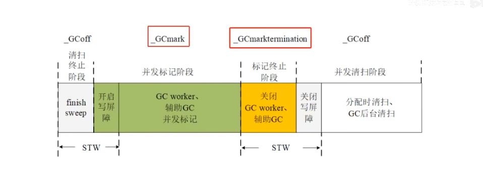
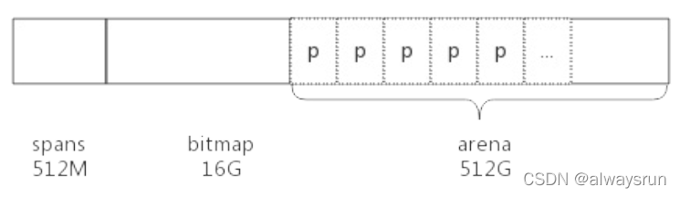

# 字符串
* 字符串的结构 ptr+len
* utf8字符集 (0一个字节，10两个字节，110三个字节)
* 字符串的内容在只读内存区，就算用unsafe包转成数组byte，也不可以更改

# Slice
* 结构： data+len+cap,data为底层数组指针
* 切片操作出来的slice 会共用底层数组

slice扩容规则：
1. 预估容量 
   * len<1024, 2倍扩容,二者取大
   * len>=1024, 1.25扩容,二者取大
2. 计算内存大小，容量*单元素内存大小
3. 通过内存管理模块匹配合适内存规格（8，16，32,48,64,80,96,112...），拿到真实的容量

# 内存对齐
内存对齐可以提高内存访问效率，不对齐可能需要多次扫描才能获取到数据

* 对齐边界：平台对齐边界和数据类型的最小值  
* 结构体所占用的内存为，最大对齐边界的倍数(要保证数组情况下每个元素都能内存对齐)
* 组织结构体的时候，小数据类型放前面，可以让内存排列的更加紧凑，节约内存

# Map     
Golang使用的哈希表来实现map ,用桶来存储键值对，每个桶存储8个元素  
1. 选桶算法：%，&，golang使用的&，为保证不会出现空桶，桶的个数是2的倍数
2. 哈希冲突：开放地址法，拉链法，golang使用的拉链法
3. 渐进式扩容：将一次扩容的时间分摊到多个读写上，redis，rehash也是用的这种方式。

扩容规则：
1. 翻倍扩容,count/2^B > 6.5(负载因子)， 每个桶里面的元素个数达到6.5个，表示比较满了，如果hash表的负载
因子过高会导致大量的hash冲突，从而导致效率下降，所以需要扩容
2. 等量扩容,当map中有大量key删除的情况，为了将溢出桶的元素迁移到普通桶中，触发条件
   * 普通桶数量<2^15,且溢出桶的数量>普通桶
   * 普通桶数量>2^15,且溢出桶的数量>2^15

# GMP

内核态和用户态:  
要讲GMP，得先从Linux内核说起，内核向下管理硬件设备，向上提供API给用户程序调用。 CPU运行的时候包含两种模式，实模式（执行任何指令，访问任何内存）和保护模式（执行部分指令，访问部分内存）  
内核作为第一个程序被加载进内存时，运行在实模式下，通过GDT（全局描述表）声明全局空间（Linux Kernel程序所占用的空间），从这个空间读取到的指令可 以完全访问内存，此外空间的指令，不允许访问GDT声明的内存空间  
实模式和保护模式所能操作的空间，就是内核空间和用户空间，对应着内核态和用户态。线程也被细分为内核态线程和用户态线程  

GMP调度过程：  
GMP中G为协程，M代表一个线程,P为抽象的处理器。GO运行是维护了一个全局的G队列，每个P也有自己的本地队列,每个P绑定一个M,通过M的G0程序，来从本地P中获取待执行的G
如果本地队列为空从全局队列获取G,如果全局队列为空，就从其它的P的本地队列偷取来执行，当M阻塞时，例如陷入系统调用进入到内核态，P会绑定其它可用的M继续执行它队列
里面的G。

抢占式调度:  
每个G默认情况下最多只能执行10ms,就会被调度器抢占，重新执行其它的G,这个切换因为是用户态之间的切换，代价很小(不用陷入内核态)  

Go调度本质是把大量的goroutine分配到少量线程上去执行，并利用多核并行，实现更强大的并发 

# GC
用于回收在程序运行过程中不再使用的内存  
Golang 使用标记清扫+主体并发式增量垃圾回收
* 标记清扫：从栈，数据段 上的对象作为root对象，基于它们进一步追踪，把能追踪到的数据进行标记，追踪不到的数据，则视为垃圾，进行清理
* 主体并发式增量垃圾回收: 短暂的stw确保所有线程开启写屏障，与用户程序并行执行，且将垃圾回收的时间分散到不同的线程上执行。
   * 主体并发：只有在开启写屏障的短暂时间stw，整个gc绝大部分时间是和用户程序并发进行的
   * 增量：利用cpu多核与用户程序交替进行，最大程度减少对用户程序的影响

## 三色标记过程
三色标记法将对象分为三种状态：白色、灰色和黑色。白色表示该对象未被标记过，灰色表示该对象已被标记，但其子对象可能还未被标记，黑色表示该对象及其子对象都已被标记。通过不断将灰色对象标记为黑色，并将黑色对象的子对象标记为灰色，最终将所有可达对象标记为黑色，然后清除所有白色对象，完成垃圾回收。

三色标记法无STW，会出现有效数据被回收的场景，同时满足：
* 黑色对象下面引用了白色对象
* 灰色对象与它们之间的可达性关系遭到破坏

解决这个问题的方案有两个：
1. 强三色不变式： 强制性不允许黑色对象引用白色对象
2. 弱三色不变式： 黑色对象可以引用白色对象，但要求白色对象必须存在其它灰色对象对它的引用或者可达它的链路上有灰色对象

使用屏障机制（可以理解为“钩子”函数，在执行插入/删除时，先执行“钩子”函数）来实现强弱三色不变式：
1. 插入写屏障：对象引用时触发,对象A引用对象B,对象B会被标记为灰色，由于栈上的对象触发写屏障（性能考虑），所以在标记结束时，需要STW(大约需要10~100ms)来重新扫描栈，来确保没有黑色对象到白色对象的引用
2. 删除写屏障：对象删除时触发，自身会被标记为灰色，来保证灰色对象到白色对象的路径不会断，因此一个对象即使被删除了最后一个指向它的指针，也依旧可以活过这一轮，在下一轮GC中被删除掉（延迟GC）

> 只用删除写屏障无法解决，黑色节点下新增白色节点的情况，

go1.8版本引入混合写屏障，其过程如下：
1. GC刚开始的时候，会将栈上的可达对象全部标记为黑色。
2. GC期间，任何在栈上新创建的对象，均为黑色。
3. 堆上被删除的对象标记为灰色
4. 堆上新添加的对象标记为灰色

栈上由于性能保证，未开启写屏障，其中1.2两点的目的有一个：强三色不变，2.保证栈对象只有黑色和白色，标记结束时不用再stw去检查白色对象。
堆上操作对象会被标记为灰色，保证灰色对象及其下游对象不会被错误GC

## GC过程
1. GC准备阶段,为每个p创建MarkWorker协程（很快会休眠，_Gwaiting）
2. 第一次STW,记录GC阶段为_GCMark,同时开启写屏障
   * gcBlackenEnable=1  是否允许gc扫描
   * writeBarrier.enabled=true 开启写屏障
   * gcphrase=_GCMark 标识GC阶段为 标记阶段
3. MarkWorker开始根据p的调度进行标记工作，直到标记完成
4. 第二次STW，停止标记，关闭写屏障
   * gcBlackenEnable=0 停止标记
   * writeBarrier.enabled=false 关闭写屏障
   * gcphrase=_GCMarkTermination 

5. 开始清扫（清扫也是增量进行，每轮gc开始之前，需要保证上一次清扫已经完成

## GC标记过程实现 gcw&wbBuf
GC标记需要扫描的对象会加入到工作队列中，由后台MarkWorker来消息队列：
1. 全局工作队列
2. 本地工作队列，包含wbuf1,wbuf2。 先加入wbuf1,再加入wbuf2,当wbuf2满了，就加入全局工作队列

每个P有一个写屏障缓冲区 wbBuf,写屏障触发时，会加入到这个缓存区中，通过flush 刷入工作队列中

## GC CPU使用用率（决定MarkWork 可以启动的个数）
GC 默认cpu使用率为25%  
workCount=gomaxprocs* 25%，如果计算出来不是整数，需要向上取整，例如取出来的值时1.5，则会取2，如果这个向上取整的数值与原目标比较超过0.3（0.5/1.5>0.3）,那多出来的这个worker就会
进入fraction模式，加入cpu核数时6，那每个cpu再fraction模式下的工作目标就是 0.5/6=1/12，GC Worker有两种模式：
* Dedicated 完全占用模式，直到调度器调度
* Fraction 非完全占用模式，Mark时间会均摊到每个p上以合计到达 1/12这个目标（p的work时间=Fraction模式的时间/总的Mark的时间），如果当前P到了目标就会让出cpu

## GC 过程中GC内存分配
为避免GC过程的内存分配压力过大，GO语言有 GC Assist(辅助GC)，如果GC过程中协程要分配内存，它需要负担一部分GC标记工作，要申请的内存越大，那对应要
负担的标记任务也多（借贷偿还机制，你申请了内存，那就得你去释放内存），有负债的G在成功申请内存前，需要辅助gc完成一些标记工作，来偿还债务

后台的MarkWorker 每完成一定量的标记任务就会在全局gcController中存一笔信用，有债务需要偿还的G可以在gcController这里偷取信用来偿还债务

gc标记阶段，每次分配内存，都会检查当G是否需要辅助GC，到GC清扫阶段，内存分配也会触发辅助清扫

辅助标记和辅助清扫，可以避免因过大的内存分配压力，导致GC来不及回收的情况（GC标记的速度没有分配的速度快，就永远标记不完）

## GC 触发方式
* 手动触发 runtime.GC
* 分配内存，每次GC都会在标记结束后设置下一次触发gc的内存分配量，分配大对象或者从mcentral获取空闲内存时，会判断是否达到了这个值
* sysmon 系统监控，达到一定的时间间隔，强制执行gc,默认是2分钟
 

# Mutex
Mutex加锁解锁利用atomic包实现，其结构体包含两个字段： 
1. state int32 存储互斥锁的状态，0号位标识是否上锁，1号位标识是否有goroutine被唤醒，2号位标识锁的模式（正常模式，饥饿模式）,其它位记录等待锁的Goroutine的数量
2. sema uint32 信号量，用于阻塞或者唤醒协程

加锁过程：  
1. 尝试获得锁，获取不到进入自旋，最大自旋次数为4
2. 插入排队等待队列尾部
3. 当队列头部G等待时间超过1ms，它会将锁标置为饥饿模式，此时其它想要获取锁的G，不会自旋，而是直接插队队列尾部，防止尾端延迟
4. 当获得锁的G，如果它的等待时间小与1ms或者它是最后一个等待者，会将锁置为正常模式

解锁过程：
1. 解锁
2. 唤醒等待队列头部G,这个G会继承当前解锁G的时间片，立刻执行

## 自旋需要满足的条件 
* 锁为正常模式
* 多核，GOMAXPROCS>1
* 当前P的等待队列为空
* 当前有一个P正在执行

## 为什么要自旋？
如果是多核情况，且持有锁的时间比较短，往往自旋几次就能拿到锁，比系统调用开销小  

# 抢占式调度

go1.14 基于信号的协程调度抢占。

runtime在启动时会创建一个线程来执行sysmon,sysmon启动后会间隔性的进行监控，最长间隔10ms，最短间隔20us。如果某协程独占P超过10ms，那么就会被抢占！整体过程：
1. 发送抢占信号
2. M收到抢占信号，休眠当前的G,重新进行调度

> go1.13前依赖栈增长检测来实现抢占式调度

# Channel
Channel是一个指针指向堆上的数据hchan:   
* mutex 互斥锁支持协程并发访问
* 缓冲区数组
* 缓冲区类型元数据 *_type
* 缓冲区读写下标
* 缓冲区读写G队列

某协程g1 执行select过程：  
1. 按序加锁 所有的channel
2. 乱序轮询 channel
3. 不可读写，加入到channel读写等待队列中，挂起等待 
4. 按序解锁 所有channel
5. 可读写，g1会被channel唤醒执行
6. 执行case分之后，按序加锁
7. 离开等待队列
8. 返回

# 堆内存管理
Go内存分配器的设计思想来源于TCMalloc，把内存分为多级管理，利用缓存的思想 ,提升内存使用效率，降低锁的粒度。

程序启动的时会预申请堆内存：  

* 堆区（area,page,span,内存块）： 512G,最小粒度为page（8KB）,8192个page组成一个area(64MB), 8192个area组成堆区512G ，每个area会被切分为不同的span,span包含一组连续的page,span内部会划分为等大的内存块
* bitmaps: 16G,一个字节标记4个指针大小的位置，低4位标记是否位指针，高4位标记是否需要gc扫描，512G/(4*8)=16G
* spans: 512M,存放span指针，数组大小为8192,用于定位area中8192个page分别被哪些span使用了

## 堆内存的管理结构： 
* mheap: 整个堆内存对象
   * mheap.central 全局mspan管理中心，一个mcentral管一种类型的mspan,总共有136种mentral
     * spanclass  spanclass 是一个字节，编号0号表示>32KB的规格，1-67 表示[8B~32KB]的规格，最低位标识是否需要gc扫描,总共136种
     * partial [2]spanSet // 未用尽的span(已清扫，未清扫)
     * full [2]spanSet //已用尽的span(已清扫，未清扫)

* p.mecache: 每个P都有一个本地缓存,分配内存时先从alloc里面找，找不到就去mcentral.partial中获取，同时吧用尽的*mspan放到mcentral.full中
    * tiny 分配小于16B的小对象
    * alloc 136个用于存储不同规格的*mspan

* heapArena: 对应一个area
    * bitmap 一个字节标记4个指针大小的位置，低4位标记是否位指针，高4位标记是否需要gc扫描,由此可见gc的扫描粒度是一个指针(8byte)的大小
    * spans [8192]*span ,用于定位一个page对应的mspan在哪儿
    * pageInuse 标记每个span的第一个page的位置
    * pageMarks 标记存gc过程中标记的页，结合pageInuse来清扫那些没有标记的sapn
* mspan: 对应一个span，管理span中一组连续的page
    * spanclass 表示当前span内存储的内存规格
    * nelem 标识存储了多少个内存块
    * freeIndex 记录下个内存空闲块的索引
    * allocBits 标记已经分配的内存块
    * gcmarkBits 标记span的内存块，清扫完成后会将此位图赋值给allocBits

* 线程缓存（MCache）：作为线程独立的内存池，与线程的第一交互内存，访问无需加锁；
* 中心缓存（MCentral）：作为线程缓存的下一级，是多个线程共享的，所以访问时需要加锁；
* 页堆（MHeap）：中心缓存的下一级，在遇到32KB以上的对象时，会直接选择页堆分配大内存，而当页堆内存不够时，则会通过系统调用向系统申请内存。

## 堆内存分配 mallocgc
1. 辅助GC：为保证GC标记的速度快于内存分配的速度，每次辅助GC至少扫描64KB的空间
    * 存储信用 如果当前G申请的内存小于64KB，多出来的部分会作为信用存储，下次来，可以消耗这个信用
    * 窃取信用 后台的MarkWork在gcController里面积累信用，可以供协程窃取
2. 空间分配,分配策略如下：
    * tiny allocator: <16B && noscan的内存分配,节约内存空间
    * mcache.alloc: <32KB && (scan || >16B), 利用本地的mcahe,与全局的mcentral配合来找匹配的内存规格
    * large span: 直接从area中划分目标page组成一个span
3. 位图标记
    * area编号：通过内存块的地址计算其所在的area编号
    * heapArea地址：通过area编号，从mheap.arenas 二维数组中找到*heapArena （二维数组是用于减少寻找连续空间的压力）
    * page编号： (p/pageSize)%pagesPerArena
    * mspan地址： 通过heapArea.spans数组下表找到 mspan地址
    * 标记mspan.allocBits
4. 最后收尾
    * 如果当前处于GC标记阶段，需要对新分配的对象进行GC标记（灰色）
    * 如果内存分配达到了GC的触发条件，那就需要触发GC (每次GC都会在标记结束后设置下一次触发gc的内存分配量，分配大对象或者从mcentral获取空闲内存时，会判断是否达到了这个值)

# 栈内存管理
栈内存也是用mspan管理的，mspan分为2类：
* mSpanInUse 用于堆内存
* mSpanManual 用于栈内存

调度器初始化的时候会初始化两个用于栈分配的全局对象 ：
* stackpool：<32KB，栈大小必须是2的幂，最小2KB,linux环境下stackpool提供了 2KB,4KB,8KB,16KB 4种规格的mspan链表
* stackLarge >=32KB，这是一个长度为25的msapn链表，从8KB开始，每个mspan的大小都是前一个2倍
* mcache.stackcache 栈分配的本地缓存，存放不同规格的栈内存链表

## 分配过程：
初始栈大小为2KB   
* <32KB的分配过程
  1. 先找本地缓存对应规格的内存块
  2. 本地缓存没有，则从stackpool中获取可用内存
  3. 如果stackpool中也没有，就直接堆内存找32KB的span,放到stackpool中
* 大于32KB的分配
  1. 以log2n 计算出stackLarge的索引
  2. 链表不为空直接使用，为空则直接从堆内存获取

## 栈增长
编译器会在函数头部安插检测代码，检查当前剩余的栈空间是否够用,不够用，就把当前的栈空间大小乘以2，然后拷贝到新的栈上

## 栈收缩
* gc寻找标记root节点时，如果发现可以安全的收缩栈，就会执行栈收缩  
* 不能马上执行时，就设置栈收缩标识（g.preemptShrink=true），等到协程检测到抢占标识（stackPreempt）,在让出cpu之前，会检查这个栈收缩标识,为true 的话会进行栈收缩，再让出cpu

## 栈释放
* 小于32KB的栈在释放时会先放回到本地缓存中，如果本地缓存对应链表中栈空间总和大于32KB，就把一部分放回到stackpool中，如果本地缓存不可用也会直接 返回到stackpool中，如果发现stackpool的mspan所有的内存块都被释放了，就会把它归还给堆内存

* 大于等于32KB的栈释放，如果当前处于gc清理阶段，就直接释放到堆内存，否则就把它释放到stackLarge这里