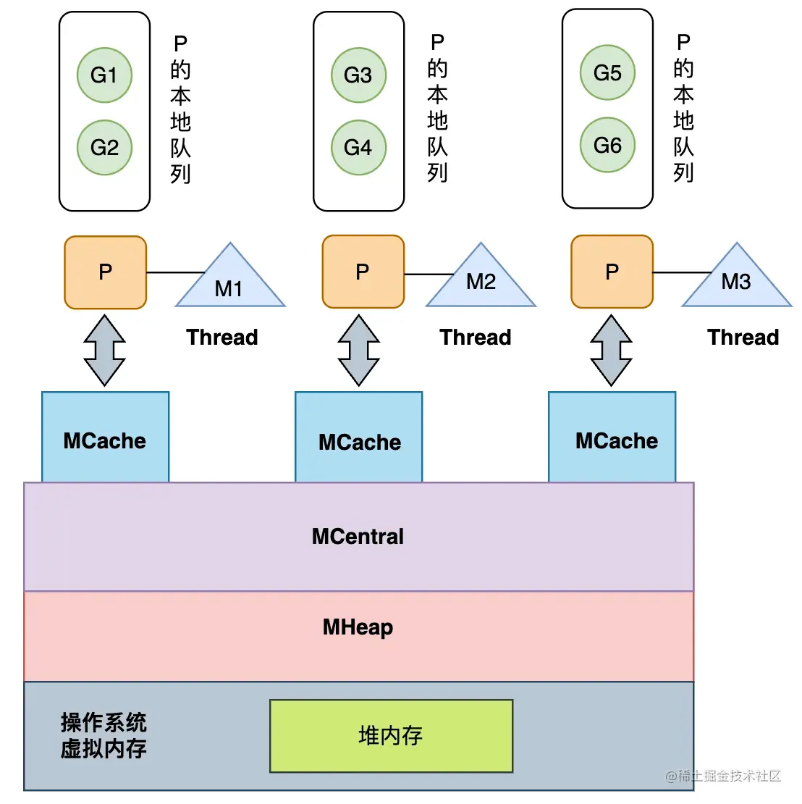

# 字符串
* 字符串的结构 ptr+len
* utf8字符集 (0一个字节，10两个字节，110三个字节)
* 字符串的内容在只读内存区，就算用unsafe包转成数组byte，也不可以更改

# Slice
* 结构： data+len+cap,data为底层数组指针
* 切片操作出来的slice 会共用底层数组

slice扩容规则：
1. 预估容量 
   * len<1024, 2倍扩容,二者取大
   * len>=1024, 1.25扩容,二者取大
2. 计算内存大小，容量*单元素内存大小
3. 通过内存管理模块匹配合适内存规格（8，16，32,48,64,80,96,112...），拿到真实的容量

# 内存对齐
内存对齐可以提高内存访问效率，不对齐可能需要多次扫描才能获取到数据

* 对齐边界：平台对齐边界和数据类型的最小值  
* 结构体所占用的内存为，最大对齐边界的倍数(要保证数组情况下每个元素都能内存对齐)
* 组织结构体的时候，小数据类型放前面，可以让内存排列的更加紧凑，节约内存

# Map     
Golang使用的哈希表来实现map ,用桶来存储键值对，每个桶存储8个元素  
1. 选桶算法：%，&，golang使用的&，为保证不会出现空桶，桶的个数是2的倍数
2. 哈希冲突：开放地址法，拉链法，golang使用的拉链法
3. 渐进式扩容：将一次扩容的时间分摊到多个读写上，redis，rehash也是用的这种方式。

扩容规则：
1. 翻倍扩容,count/2^B > 6.5(负载因子)， 每个桶里面的元素个数达到6.5个，表示比较满了，如果hash表的负载
因子过高会导致大量的hash冲突，从而导致效率下降，所以需要扩容
2. 等量扩容,当map中有大量key删除的情况，为了将溢出桶的元素迁移到普通桶中，触发条件
   * 普通桶数量<2^15,且溢出桶的数量>普通桶
   * 普通桶数量>2^15,且溢出桶的数量>2^15

# GMP
GMP（Goroutine, Machine, Processor）是Go语言运行时（runtime）中的调度模型，用于管理并发执行的任务。GMP模型中的三个关键组件是G（Goroutine）、M（Machine）和P（Processor）。在这个模型中，G是表示一个执行的协程，M代表一个内核线程，而P则代表一个逻辑处理器，它封装了执行G所需的上下文信息。

GMP模型的具体调度策略如下：

1. 全局队列与本地队列：Go运行时维护了一个全局的G队列，用于存放等待运行的Goroutine。每个P也有自己的本地队列，存放从全局队列获取的、或者由其他P通过“work stealing”机制偷取过来的Goroutine。
2. P与M的绑定：每个P都会绑定一个M，这样G就可以在M上执行。当M阻塞时（例如进行系统调用），P会尝试寻找另一个空闲的M进行绑定，或者从其他P的本地队列中“偷取”Goroutine来运行。
3. 调度循环：在每个调度循环中，P会尝试从本地队列中取出Goroutine来执行。如果本地队列为空，P会尝试从全局队列中取出Goroutine，或者通过“work stealing”机制从其他P的本地队列中偷取Goroutine。
4. work stealing机制：当P的本地队列为空时，它会尝试从其他P的本地队列中“偷取”Goroutine来执行。这种机制有助于平衡不同P之间的负载，避免某些P过于繁忙而其他P空闲。
5. 抢占式调度：Go的调度器采用了一种抢占式调度策略，即一个Goroutine最多只能占用CPU一段时间（默认为10ms），之后就会被调度器抢占，将CPU让给其他等待运行的Goroutine。这有助于防止某些长时间运行的Goroutine饿死其他短时间的Goroutine。
6. 利用并行：通过设置环境变量GOMAXPROCS，可以控制P的数量，从而限制同时运行的Goroutine数量。这有助于在多核CPU上实现并行执行。

# GC
用于回收在程序运行过程中不再使用的内存  
Golang 使用标记清扫+主体并发式增量垃圾回收
* 标记清扫：从栈，数据段 上的对象作为root对象，基于它们进一步追踪，把能追踪到的数据进行标记，追踪不到的数据，则视为垃圾，进行清理
* 主体并发式增量垃圾回收: 短暂的stw确保所有线程开启写屏障，与用户程序并行执行，且将垃圾回收的时间分散到不同的线程上执行。
   * 主体并发：只有在开启写屏障的短暂时间stw，整个gc绝大部分时间是和用户程序并发进行的
   * 增量：利用cpu多核与用户程序交替进行，最大程度减少对用户程序的影响

## 三色标记过程
三色标记法将对象分为三种状态：白色、灰色和黑色。白色表示该对象未被标记过，灰色表示该对象已被标记，但其子对象可能还未被标记，黑色表示该对象及其子对象都已被标记。通过不断将灰色对象标记为黑色，并将黑色对象的子对象标记为灰色，最终将所有可达对象标记为黑色，然后清除所有白色对象，完成垃圾回收。

三色标记法无STW，会出现有效数据被回收的场景，同时满足：
* 黑色对象下面引用了白色对象
* 灰色对象与它们之间的可达性关系遭到破坏

解决这个问题的方案有两个：
1. 强三色不变式： 强制性不允许黑色对象引用白色对象
2. 弱三色不变式： 黑色对象可以引用白色对象，但要求白色对象必须存在其它灰色对象对它的引用或者可达它的链路上有灰色对象

使用屏障机制（可以理解为“钩子”函数，在执行插入/删除时，先执行“钩子”函数）来实现强弱三色不变式：
1. 插入写屏障：对象引用时触发,对象A引用对象B,对象B会被标记为灰色，由于栈上的对象触发写屏障（性能考虑），所以在标记结束时，需要STW(大约需要10~100ms)来重新扫描栈，来确保没有黑色对象到白色对象的引用
2. 删除写屏障：对象删除时触发，自身会被标记为灰色，来保证灰色对象到白色对象的路径不会断，因此一个对象即使被删除了最后一个指向它的指针，也依旧可以活过这一轮，在下一轮GC中被删除掉（延迟GC）

> 只用删除写屏障无法解决，黑色节点下新增白色节点的情况，

go1.8版本引入混合写屏障，其过程如下：
1. GC刚开始的时候，会将栈上的可达对象全部标记为黑色。
2. GC期间，任何在栈上新创建的对象，均为黑色。
3. 堆上被删除的对象标记为灰色
4. 堆上新添加的对象标记为灰色

栈上由于性能保证，未开启写屏障，其中1.2两点的目的有一个：强三色不变，2.保证栈对象只有黑色和白色，标记结束时不用再stw去检查白色对象。
堆上操作对象会被标记为灰色，保证灰色对象及其下游对象不会被错误GC

## GC过程
1. GC准备阶段,为每个p创建MarkWorker协程（很快会休眠，_Gwaiting）
2. 第一次STW,记录GC阶段为_GCMark,同时开启写屏障
   * gcBlackenEnable=1  是否允许gc扫描
   * writeBarrier.enabled=true 开启写屏障
   * gcphrase=_GCMark 标识GC阶段为 标记阶段
3. MarkWorker开始根据p的调度进行标记工作，直到标记完成
4. 第二次STW，停止标记，关闭写屏障
   * gcBlackenEnable=0 停止标记
   * writeBarrier.enabled=false 关闭写屏障
   * gcphrase=_GCMarkTermination 

5. 开始清扫（清扫也是增量进行，每轮gc开始之前，需要保证上一次清扫已经完成

## GC标记过程实现 gcw&wbBuf
GC标记需要扫描的对象会加入到工作队列中，由后台MarkWorker来消息队列：
1. 全局工作队列
2. 本地工作队列，包含wbuf1,wbuf2。 先加入wbuf1,再加入wbuf2,当wbuf2满了，就加入全局工作队列

每个P有一个写屏障缓冲区 wbBuf,写屏障触发时，会加入到这个缓存区中，通过flush 刷入工作队列中

## GC CPU使用用率（决定MarkWork 可以启动的个数）
GC 默认cpu使用率为25%  
workCount=gomaxprocs* 25%，如果计算出来不是整数，需要向上取整，例如取出来的值时1.5，则会取2，如果这个向上取整的数值与原目标比较超过0.3（0.5/1.5>0.3）,那多出来的这个worker就会
进入fraction模式，加入cpu核数时6，那每个cpu再fraction模式下的工作目标就是 0.5/6=1/12，GC Worker有两种模式：
* Dedicated 完全占用模式，直到调度器调度
* Fraction 非完全占用模式，Mark时间会均摊到每个p上以合计到达 1/12这个目标（p的work时间=Fraction模式的时间/总的Mark的时间），如果当前P到了目标就会让出cpu

## GC 过程中GC内存分配
为避免GC过程的内存分配压力过大，GO语言有 GC Assist(辅助GC)，如果GC过程中协程要分配内存，它需要负担一部分GC标记工作，要申请的内存越大，那对应要
负担的标记任务也多（借贷偿还机制，你申请了内存，那就得你去释放内存），有负债的G在成功申请内存前，需要辅助gc完成一些标记工作，来偿还债务

后台的MarkWorker 每完成一定量的标记任务就会在全局gcController中存一笔信用，有债务需要偿还的G可以在gcController这里偷取信用来偿还债务

gc标记阶段，每次分配内存，都会检查当G是否需要辅助GC，到GC清扫阶段，内存分配也会触发辅助清扫

辅助标记和辅助清扫，可以避免因过大的内存分配压力，导致GC来不及回收的情况（GC标记的速度没有分配的速度快，就永远标记不完）

## GC 触发方式
* 手动触发 runtime.GC
* 分配内存，每次GC都会在标记结束后设置下一次触发gc的内存分配量，分配大对象或者从mcentral获取空闲内存时，会判断是否达到了这个值
* sysmon 系统监控，达到一定的时间间隔，强制执行gc,默认是2分钟
 

# Mutex

# 内存管理
程序中的数据都会被分配到程序所在的虚拟内存中，内存空间包含两个重要区域：栈（Stack） 和 堆（Heap）。   
函数调用的参数、返回值和局部变量大部分会分配在栈上，这部分由编译器管理。堆内存的管理方式视语言而定：
* C/C++等编程语言的堆内存由工程师主动申请和释放；
* Go、Java等编程语言由工程师和编译器/运行时共同管理，其内存由内存分配器分配，由垃圾回收器回收。

Go内存分配器的设计思想来源于TCMalloc，全称是Thread-Caching Malloc，
核心思想是把内存分为多级管理，利用缓存的思想
提升内存使用效率，降低锁的粒度。

在堆内存管理上分为三个内存级别：
* 线程缓存（MCache）：作为线程独立的内存池，与线程的第一交互内存，访问无需加锁；
* 中心缓存（MCentral）：作为线程缓存的下一级，是多个线程共享的，所以访问时需要加锁；
* 页堆（MHeap）：中心缓存的下一级，在遇到32KB以上的对象时，会直接选择页堆分配大内存，而当页堆内存不够时，则会通过系统调用向系统申请内存。

## 内存管理基本单元mspan

runtime.mspan是Go内存管理的基本单元，其结构体中包含的next和prev指针，分别指向前后的runtime.mspan，所以其串联后的结构是一个双向链表。
而startAddr表示此mspan的起始地址，npages表示管理的页数，每页大小8KB

在mspan中有一个字段是spanclass，称为跨度类，是对mspan大小级别的划分，每个mspan能够存放指定范围大小的对象，32KB以内的小对象在Go中，会对应
不同大小的内存刻度Size Class

spanClass 高7位标记内存块大小规格编号，1-67（8B-32KB）,编号0留出来，对应大于32K的大块内存，一共68种，然后每种规格会按照是否需要gc扫描，用
最低位来标识，分为包含指针的需要gc扫描的scannable和不含指针的noscan 两类，所以有68*2=136种 span
