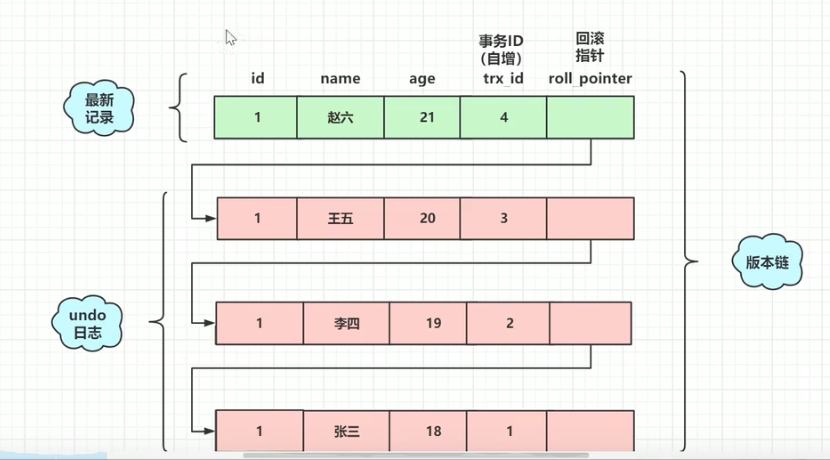

# B树和B+树的区别是什么
B树是一种自平衡的树，能够保持数据有序，可以拥有多个子节点（节点个数为B树的阶）:
1. 一个节点里面有多个元素
2. 有序性

B+树在B树的基础之上多了几个特点： 
1. 非叶子节点的数据都冗余一份数据在叶子节点上
2. 叶子节点之间有指针

<!--more-->

# Innodb中的B+树是怎么产生的？
Innodb与磁盘最小的交互单位是Page(16KB)  
假设主键4byte,页地址6byte,行数据占1KB,那3层B+树能够存 (16KB/10B)*(16KB/10B)*(16KB/1KB)=4千万+的行记录 所以如果超过这个记录，那么B+树就会
分化成4层，那走索引的效率就会下降，这时候就需要分库分表

# Innodb如何支持范围查找能走索引的
先通过索引找到边界值，再利用叶子节点双向链表的特性来支持范围查找

# 为什么要遵循最左前缀原则才能利用索引？
这个Innodb建立索引的规则有关，只有按照联合索引的顺序来给where条件才能走到索引，也就说联合索引的存储结构是按联合索引里面字段的顺序来排的，如果不按
左前缀原则给where条件，就不能命中这个索引。   

和where条件里面的顺序没有关系，是条件里面要根据定义联合索引的字段给条件，最左前缀指的是联合索引的字段顺序  

索引下推：联合索引的情况，如果where条件中有其它的条件可以命中当前的索引，那也会用到索引而不会回表

# 范围查找导致索引失效原理分析
当范围超找不如全表扫描快的时候就会失效，比如索引查找出来的数据，要进行大量回表的时候，这时候就没有直接全表扫描快。

# 覆盖索引底层原理
explain里面Extra里面有Using index 表示走了覆盖索引    
覆盖索引指查询的字段都在索引里面，建立联合索引的情况会发生，由于不用回表，速度非常快

# 索引扫描
即使没有where条件，也是可以走索引的。  
当查询字段在索引里面有的时候，就直接扫描索引就可以了。

# order by 导致索引失效
* 走索引，不需要排序，但是需要回表
* 全表扫描，额外排序，不用回表

# Mysql数据类型转换（隐式转换）导致索引失效
不是数字的字符，会转成0   

对字段进行了操作，也走不了索引

# Mysql锁有哪些，如何理解
按锁的粒度分：行锁，表锁，间隙锁（innodb中锁住区间）

还可以分为：
1. 共享锁：也就是读锁，一个事务给某行加了读锁，其它事务可以读，但不可以写
2. 排他锁：写锁，一个事务给某行加了写锁，其它事务不能读，也不能写

还可以分为：
1. 乐观锁： 并不会真正的去锁某行记录，而是通过版本号实现
2. 悲观锁：上面的行锁，表锁，都是悲观锁

在事务的隔离级别中，利用锁解决幻读  

# Mysql慢查询如何优化
1. 检查是否走了索引，如有没有则优化SQL利用索引
2. 检查利用的索引，是否是最优索引
3. 检查所查表字段是否都是必须的，是否查询了多余字段，查出了多余数据
4. 检查表中数据是否过多，是否应该分库分表
5. 检查数据库实例机器的性能配置，是否太低，是否可以适当增加资源

# mysql聚簇索引和非聚簇索引
都是B+树索引结构  
聚簇索引：叶子节点存放索引和数据，非叶子节点存索引，InnoDB  
非聚簇索引：叶子节点和非叶子节点存放的是数据行地址 ,MyIsam  

聚簇索引优势：
1. 查询可以直接通过聚簇索引直接获取数据，相比非聚簇索引需要第二次查询（非覆盖索引）效率要高
2. 聚簇对于适合范围查询的效率很高，因为其数据是按照大小排列的
3. 聚簇索引适合用在排序的场合，非聚簇不适合

聚簇索引劣势：  
1. 维护索引很昂贵，特别是插入新行或者主键被更新导致要分页（page split）的时候，建议在大量插入新行后，选择负载低的时间段，通过 OPTIMIZE TABLE
优化表，因为必须被移的行数据可能造成碎片，使用独享表空间可以弱化碎片  
2. 表因为使用UUID作为主键，是数据存储稀疏，这就会出现聚簇索引有可能比全表扫描更慢，所以建议使用int的auto_increment作为主键  
3. 如果主键比较大的化，那辅助索引将会变的更大

InnoDB中一定有主键，主键一定是聚簇索引，不手动设置则会选用unique索引，没有unique索引，则会使用内部的row_id来当主键索引，在聚簇索引之上创建的
称为辅助索引

# 索引类型

从数据结构划分：
1. B-Tree索引：这是最常见的索引类型，它使用B-Tree数据结构来存储索引数据。B-Tree索引可以处理大量的数据，并且查询速度快。
2. Hash索引：Hash索引基于哈希算法来存储索引数据。它适用于等值查询，但对于范围查询和排序操作，性能可能较差。
3. Bitmap索引：Bitmap索引主要用于处理大量的离散值，例如性别、状态等。它使用位图来表示哪些值存在于表中。
4. 空间索引：空间索引用于处理地理空间数据，如GIS数据。
5. 全文索引：全文索引用于处理文本数据，它允许用户基于文本内容进行搜索。

| 从逻辑功能划分 | 从物理实现划分 | 从作用字段划分 |
|---------|---------|---------|
| 普通索引、唯一索引、主键索引、全文索引        |  聚簇索引、非聚簇索引       |     单列索引、联合索引    |

# 索引优化
1. 查询频次较高且数据量大的表建立索引；索引选择使用频次较高，过滤效果好的列或者组合。
2. 使用短索引；例如，如果某一列的取值范围很小，可以考虑使用较短的数据类型，如SMALLINT或TINYINT，而不是使用INT或BIGINT。
3. 对于很长的动态字符串，考虑使用前缀索引；例如邮箱
4. 对于组合索引，考虑最左侧匹配原则和覆盖索引；
5. 尽量选择区分度高的列作为索引；该列的值相同的越少越好；
6. 不要 select * ； 尽量只列出需要的列字段；方便使用覆盖索引；
7. 索引列，列尽量设置为非空；

# 事务ACID
1. 原子性（Atomicity）：事务是一个不可分割的工作单位，事务中包括的操作要么全部完成，要么全部不完成。也就是说，如果一个事务中的某些操作失败，那么整个事务就会失败，需要回滚到事务开始前的状态。(undo log)
2. 一致性（Consistency）：事务必须使数据库从一个一致性状态变换到另一个一致性状态。也就是说，一个事务执行前后，数据库中的数据必须保持一致。
3. 隔离性（Isolation）：通常，一个事务所做的修改在最终提交以前，对其他事务是不可见的。即一个事务内部的操作及使用的数据对并发的其他事务是隔离的，并发执行的各个事务之间不能互相干扰。(锁和mvcc实现)
4. 持久性（Durability）：一旦事务提交，则其结果永久保存在数据库中。即使系统崩溃，重新启动后数据库还能恢复到事务成功结束时的状态 (redo log)

# 事务隔离机制
1. 读未提交（Read Uncommitted）：这是最低的隔离级别，允许读取尚未提交的数据变更，可能会导致脏读、不可重复读和幻读。
2. 读已提交（Read Committed）：只允许读取已提交的数据，可以避免脏读，但是可能会出现不可重复读和幻读。
3. 可重复读（Repeatable Read）：在同一事务内，多次读取同一数据返回的结果是一致的，可以避免脏读和不可重复读，但是可能出现幻读。
4. 串行化（Serializable）：这是最严格的隔离级别，完全遵循ACID特性，所有的事务依次逐个执行，可以避免脏读、不可重复读和幻读。

| 隔离级别 | 脏读 | 不可以重复读 | 幻读 | 加锁读 |
|------|----|--------|----|-----|
| 读未提交 | ✓  | ✓      | ✓  | x   |
| 读以提交 | x  | ✓      | ✓  | x   |
| 可重复读 | x  | x      | x  | x   |
| 串行化  | x  | x      | x  | ✓   |

MVCC多版本并发控制，保证的是“读已提交”和“可重复读”

幻读：范围查询的时候，两次查询结果不一致，MVCC机制解决不了范围查询

# MVCC机制
MVCC（乐观锁）多版本并发控制，保证的是“读已提交”和“可重复读”

版本链：
页记录里面有两个额外的字段trx_id(事务ID)和roll_pointer,    
undo日志里面有三个额外的字段trx_id(事务ID)和roll_pointer,row_id   
roll_pointer指向row_id形成一条版本链

ReadView:  
事务在使用MVCC机制时产生的一致性视图，包含4个字段：
1. creator_trx_id: 创建readView的事务的事务ID
2. m_ids: 创建视图时当前数据库中活跃且为提交的事务ID列表，在这个列表里面的事务版本不可读
3. min_trx_id: 创建ReadView时，最小活跃事务ID，用于在版本链中找出已经提交过的数据
4. max_trx_id: 全局事务ID最大值+1

MVCC 通过ReadView以及undo日志形成的版本来控制多版本并发读，查询记录时先判定，页记录的trx_id是否在当前ReadView的m_ids列表中，如果不在说明事务已提交，如果在表明
当前当前数据行是在，查询开始后提交的，就需要根据版本链找出小于min_trx_id的记录

读已提交和可重复读的实现区别在于，读已提交每次读的时候都会重新生成ReadView，这样已提交的事务就不在m_ids中，实现读到提交的记录

MVCC没有解决幻读的问题，Innodb 默认的隔离级别是“可重复读”，通过行锁和间隙锁(next-key Lock)来解决幻读的问题,在查询时使用 SELECT ... FOR UPDATE开启行锁或间隙锁  

## undo log, binlog, redo log的作用是什么
undo log
* 提供回滚操作，保证事务的原子性
* 提供多版本并发控制

redo log   
mysql 每执行一条DML语句，先将记录写入redo log buffer. 后续某个时间点再一次将多个操作记录写入到redo log file中。当故障发生导致内存数据丢失时，
InnoDB会在重启时，经过重放redo,将page恢复到崩溃之前的状态，通过redo log实现事务的持久性

binlog
* 以二进制的形式，记录用户写操作
* mysql Server层实现，所有引擎共用
* binlog为逻辑日志，记录的是原始SQL
    * 不限制大小，不会覆盖以前的日志
    * 需要使用mysqlbinlog 解析查看

binlog作用：
1. 主从复制
2. 数据恢复

# 主从复制
用途：
1. 实时灾备，用于故障切换
2. 读写分离，提供查询服务
3. 备份，避免影响业务

必要条件：
1. 主库开启binlog日志
2. 主从server-id不同
3. 从库可以联通主库

过程：  
1. 主库记录所有写日志到binlog
2. 发送binlog到从库I/O线程 
3. 从库IO线程写入本地的relay log
4. 从库SQL线程读取relay log并写入从库

同步模式：
1. 异步复制（默认）： 主库把日志发送给从库后，不关心从库是否处理 
2. 全同步复制： 主库写入binlog后强制同步到从库，所有从库都执行完后返回给客户端
3. 半同步复制：从库写入日志成功后返回ack给主库，主库收到至少1个从库的确认就认为写操作完成   

