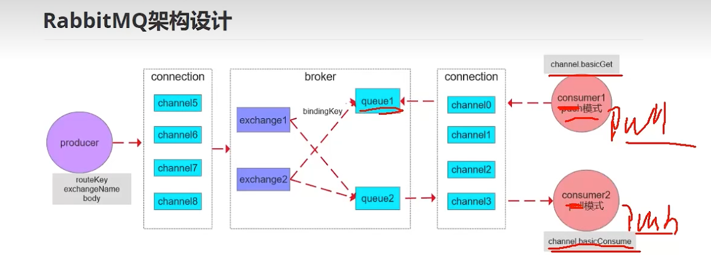
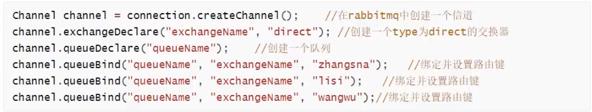
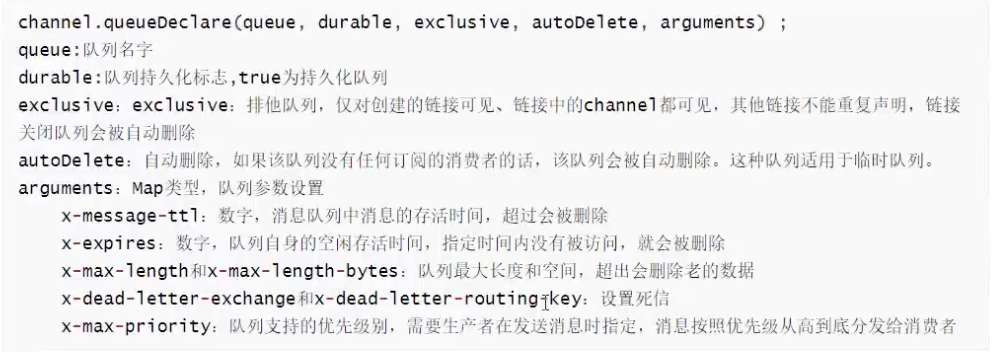
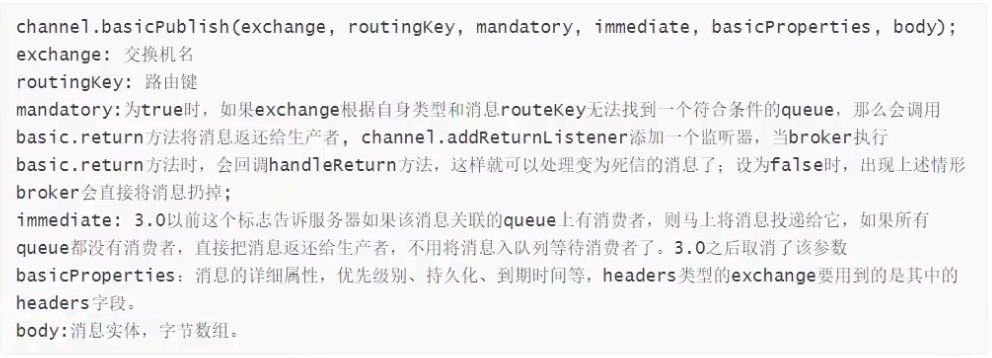
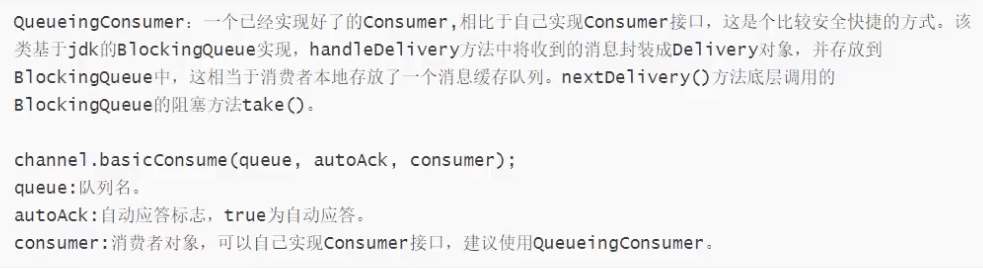
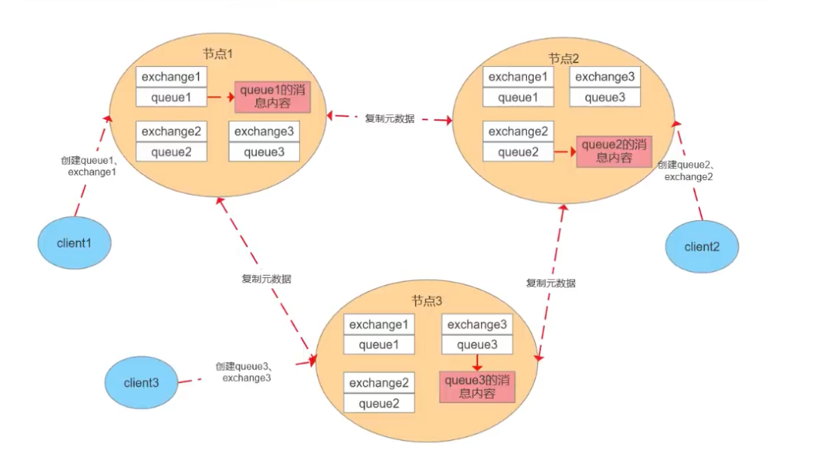
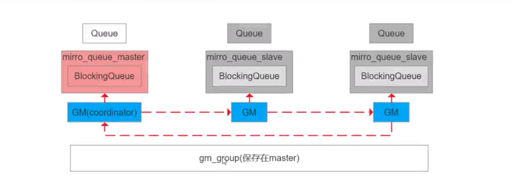

# 简单RabbitMQ架构设计

1. Broker: rabbitmq的物理服务节点
2. Vhost: rabbitmq的虚拟物理节点
3. Queue: 队列，rabbitmq的内部对象，用于存储消息。生产者投递消息到队列，消费者从队列中获取消息并消费，多个消费者订阅同一个队列的时候，消费会被均摊给多个消费者。
（rabbitmq不支持队列层面的广播消费，如果需要广播消费，可以采用一个交换器通过路由key绑定多个队列，由多个消费者来订阅队列的方式实现）
4. Exchange: 交换器，生产者将消息发送到Exchange,由交换器将消息路由到一个或对个队列中。如果路由不到，或返回给消费者，或直接丢弃，或做其它处理。
5. RoutingKey: 路由Key，生产者将消息发送给交换器的时候，一般会指定一个RoutingKey，用来指定这个消息的路由规则。这个路由Key需要与交换器类型和
绑定键（BindingKey）联合使用才会生效。在交换器类型和绑定键固定的情况下，生产者可以在发送消息给交换器时通过指定RoutingKey来决定消息流向那里
6. Connection: rabbitmq使用一个TCP连接，通过定义虚拟连接（channel）的方式，来复用TCP。这个方式和HTTP2中的Stream很类似。
   
<!--more-->

# 简述RabbitMq的交换机类型
交换机分发会先找出绑定的队列 ，然后再判定RoutineKey,来决定是否将消息分发到某一队列中。

1. fanout: 扇形交换机，不在判断routekey,直接将消息分发到所有绑定的队列
2. direct: routeKey全匹配
3. topic: routeKey模糊匹配
4. header: 绑定队列与交换机时指定一个键值对，当交换器在分发消息的时候会先解开消息题里面的headers数据，然后判断里面是否有设置的键值对，来决定是否
发消息到队列中。这种交换器类型性能差，工作中很少使用。

# rabbitmq可以直连队列吗
可以，利用rabbitmq的默认交换机

RabbitMQ中的默认交换机（Default Exchange）是一个特殊的交换机，它预先由RabbitMQ声明，并且名字为空字符串（""）。每个新建的队列（Queue）都会自动绑定到这个默认交换机上，绑定的路由键（Routing Key）名称与队列名称相同。因此，当携带着与队列名称相同的路由键的消息被发送到默认交换机时，该消息会被默认交换机路由至对应的队列中。

默认交换机实际上是一个直连交换机（Direct Exchange）

声明队列参数：  

发送消息参数：

消费消息参数：

# 简述rabbitmq的持久化机制
1. 交换机持久化： exchange_declare时通过参数指定
2. 队列持久化： queue_declare 创建队列时通过参数指定
3. 消息持久化：new AMQPMessage 创建消息时通过参数指定

append方式写文件，会根据大小自动分割文件（16M）,rabbitmq启动时会创建两个进程，一个负责持久化消息的存储，另外一个负责非持久化消息的存储（内存不够时）

消息存储时会在ets表中记录消息在文件中的映射以及相关信息，消息删除时只从ets删除，变为垃圾数据。

垃圾回收：  
1. 当垃圾数据比例超过50%，并且文件树达到3个，触发垃圾回收，锁定左右两个文件，整理左边文件有效数据，将右边有效数据写入左边，更新文件信息，删除右边，完成合并。  
2. 当一个文件的有效数据等于0时，删除该文件。

刷盘过程：  
* 写文件前会先写入buffer缓冲区，如果buffer已满，则写入文件（此时只是操作系统的页存）  
* 每隔25ms刷一次磁盘，不管buffer满没满，都将buffer和页存中的数据落盘
* 每次消息写入后，如果没有后续写入请求，则直接落盘（操作系统函数fsync）

在RabbitMQ服务端，如果消息正确被发送，但是RabbitMQ未来得及持久化，没有将数据写入磁盘，服务异常而导致数据丢失，解决方案之一是通过RabbitMQ集群的方式实现消息中间件的高可用性。

# 简述rabbitmq事务消息机制
通过设置信道实现：  
1. channel.txSelect();通知服务器开启事务模式；服务端返回tx.Select-ok
2. channel.basicPublish();发送消息，可以是多条，可以是消费消息提交ack
3. channel.txCommit();提交事务
4. channel.txRollback();回滚事务

消费者使用事务：  
1. autoAck=false,手动提交ack，以事务提交或回滚为准
2. autoAck=true,不支持事务，也就是说即使在收到消息之后回滚事务也是于事无补的，队列已经吧消息移除了

事务会阻塞channel，事务会降低rabbitmq的性能，一般会使用ack机制来替代事务

# RabbitMQ如何保证消息的可靠性传输
可靠性传输，指的是，client到rabbitmq之间传入数据没有问题（消息到了rabbitmq中只是在内存中，而还没有刷到磁盘里面，刷磁盘是由rabbitmq的持久化机制来保证的）

1. 使用事务消息（性能上不是很好）
2. 使用消息确认机制。

发送方确认：  
1. channel设置为confirm模式，则每条消息会被分配一个唯一id
2. 消息投递成功，信道会发送ack给生产者，包含了id,回调ConfirmCallback接口
3. 如果发生错误导致消息丢失，发生nack给生产者，回调ReturnCallback接口
4. ack和nack只有一个触发，且只有一次，异步触发，可以继续发消息。

接收方确认：  
1. 声明队列时，指定noack=false,broker会等待消费者手动ack，才会删除消息，否则会立刻删除
2. broker的ack没有超时机制，只会判断连接是否断开，如果断开，消息会被重新发送

# rabbitmq的死信队列，延迟队列原理

## 死信消息
1. 消息被消费方否定，使用channel.basicNack或channel.basicReject,并且此时requeue属性被设置为false
2. 消息在队列的存活时间超过设置的TTL时间
   如果一条消息设置了TTL，或者队列设置了TTL，以较小的时间为准
3. 消息队列的消息数量已经超过最大队列长度

那么该消息会成为死信消息，如果配置了死信队列，那么消息会进入到死信队列中，如果没有配置，则该消息会被丢弃  

为每个需要使用死信的业务队列配置一个死信交换机，同一个项目的死信交换机可以共用一个，然后为每个业务队列分配一个单独的routeKey，死信队列也是一个普通的
交换机，可以为任意类型：fanout,direct,topic

## 延迟队列
利用消息的TTL和死信队列实现  
一条消息在一定的时间过期后会进入到实现队列，然后被死信队列所绑定的消费者消费  

延迟队列其它的实现方式：  
* redis的zset
* 时间轮

# 简述rabbitmq的普通集群模式
普通集群模式并不具备高可用

元数据：  
* 队列元数据：名称，属性
* 交换器元数据：名称，属性，类型
* 绑定元数据：一张表，存储如何将消息路由到队列
* vhost元数据： 为vhost内的队列，交换器和绑定提供命名空间和安全属性

为什么指同步元数据？  
* 存储空间，每个节点都保存全量数据，影响消息堆积能力
* 性能，消息的发布者需要将消息复制到每一个集群节点

客户端连接的是非队列数据所在的节点，则该节点会进行路由转发，包括发送和消费  

集群节点类型：  
* 磁盘节点：将配置信息和元信息存储在磁盘上
* 内存节点：将配置信息和元信息存储在内存中，性能优于磁盘节点，依赖磁盘节点进行持久化

RabbitMQ要求集群中至少有一个磁盘节点，但节点加入或离开集群时，必须通知磁盘节点（如果集群中唯一的磁盘节点崩溃了，则不能进行创建队列，创建交换器，创建绑定，
添加用户，更改权限，添加和删除集群节点）。如果唯一磁盘节点崩溃，集群是可以保持运行的，但不能更改任何东西，因此建议在集群中设置两个磁盘节点，只要一个可以就能
正常操作）

# rabbitmq的镜像队列原理
镜像队列模式具备高可用

GM负责广播消息，所有的GM组成一个gm_group，形成环型链表，负责监听相邻节点的状态，以及传递消息到相邻节点，master的GM收到消息时代表消息同步完成  

mirror_queue_master/slave负责消息的处理，操作blockingQueue,Queue负责AMQP协议（commit,rollback,ack等）

master负责读写

# Kafka,ActiveMQ,RabbitMQ,RocketMQ 对比
* ActiveMQ: JMS规范，支持事务，支持XA协议，没有生产大规模支撑场景，官方维护越来越少，单机万级吞吐
* RabbitMQ: erlang语言开发，性能好，高并发，支持多语言，社区，文档方面有优势，依赖开源社区的维护和升级，需要学习AMQP协议，单机万级吞吐
* Kafka: 高性能，高可用，生产环境有大规模使用场景，单机容量有限（超过64个分区响应明显变长），ELK的日志收集就是用的kafka,社区更新慢，单机百万吞吐
* rocketMQ: 阿里实现，java实现，设计参考了kafka,高可用，高可靠（消息0丢失），社区活跃度一般，支持语言较少（java，c++），单机十万级吞吐

# 如何保证消息不被重复消费
消息队列中间件是保证不了的，需要业务端自己去保证，实际上就是需要保证接口的幂等性  
* 基于数据库的唯一键 （插入的情况，重复插不进去）
* 乐观锁 （数据携带version版本）
* 悲观锁 （select for update）
* token 先服务端生成令牌 (预先生成令牌)
* 客户端生成 uuid,消费者拿到uuid，验证是否在已经存在过（比如存到redis）,如果存在过了，就不进行处理（这个方案有点问题，set的数据什么时候过期）

# 消息队列的优缺点，使用场景
优点：  
1. 解藕，降低系统之间的依赖（发布订阅的模式）
2. 异步处理，不需要同步等待。
3. 削峰填谷，将流量从高峰期引入到低谷期处理

缺点：
1. 增加了系统的复杂度，幂等，重复消费，消息丢失等问题的带入
2. 系统可用性降低，MQ的故障会影响系统可用
3. 一致性，消费端可能失败。

场景：
1. 日志采集
2. 发布订阅

# 参考
[RabbitMQ面试题详解 | 一口气看完16个面试必问的rabbitmq面试核心知识点，让你面试少走99%的弯路！](https://www.bilibili.com/video/BV1ZV411A7kV/?spm_id_from=333.337.search-card.all.click&vd_source=826416428f883a4b1c119869d5a0983b)