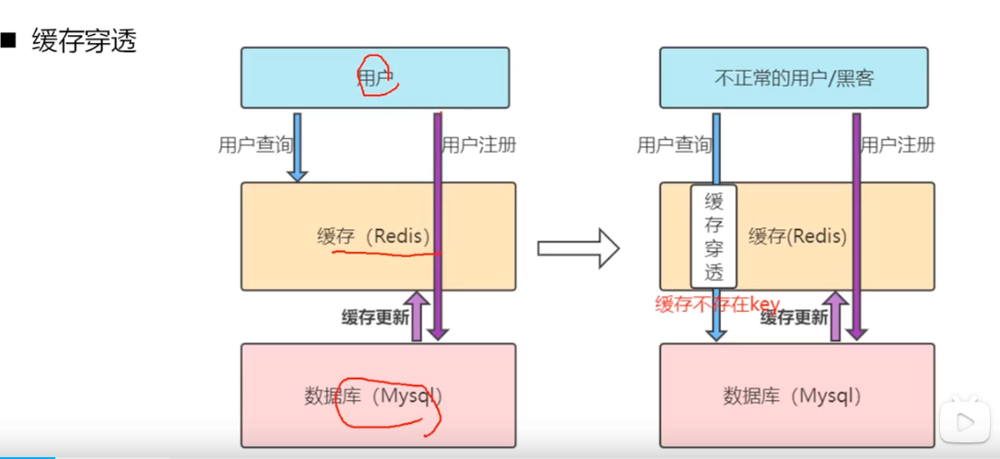
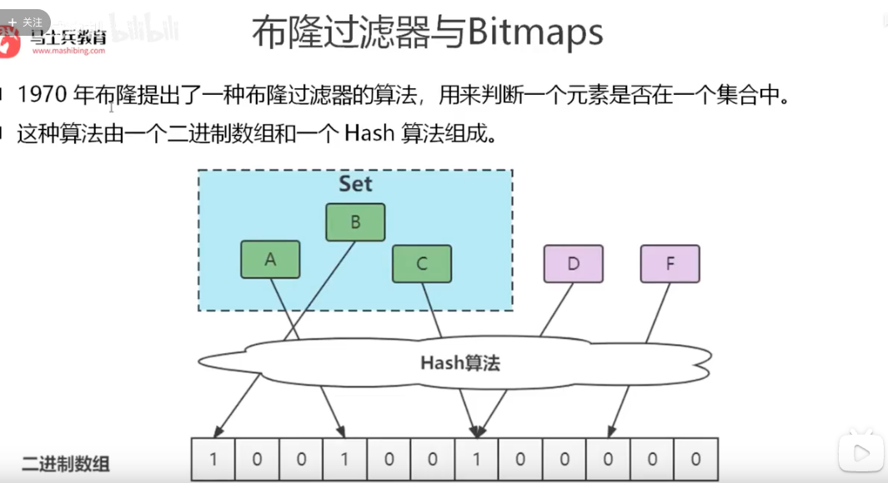
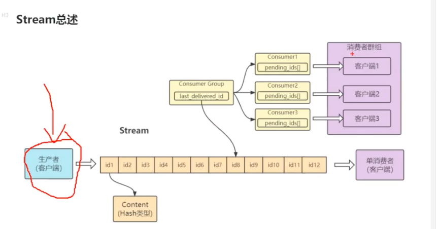
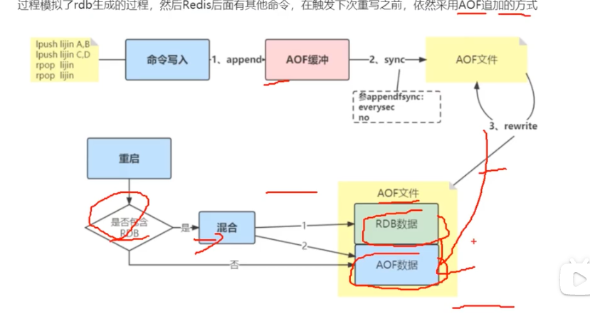
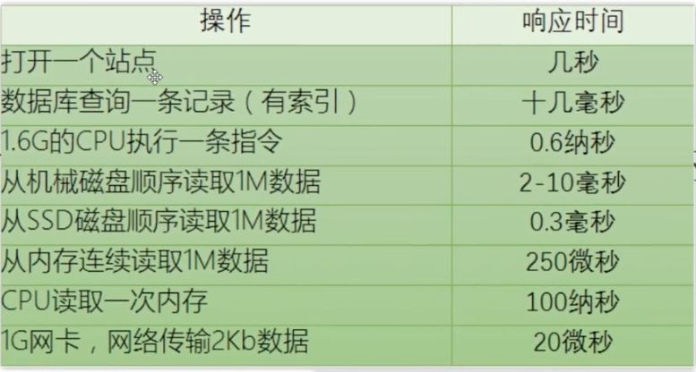

# redis为什么快？
1. 纯内存访问
2. 单线程避免上下文切换
3. 渐进式ReHash,缓存时间戳
   * 渐进式ReHash,通过分摊数据拷贝的开销，避免阻塞IO
   * 缓存时间戳避免频繁获取时间的系统调用 

# 使用Redis有哪些好处（为什么要用redis）
* 速度快，因为数据存在内存中，类似于HashMap，HashMap的优势就是查找和操作的时间复杂度都是O(1)
* 支持丰富数据类型，支持string，list，set，sorted set，hash
* 支持事务，操作都是原子性，所谓的原子性就是对数据的更改要么全部执行，要么全部不执行
* 丰富的特性：可用于缓存，消息，按key设置过期时间，过期后将会自动删除
<!--more-->

# redis相比memcached有哪些优势?
1. **数据类型支持**：Redis支持多种复合类型，例如哈希表、列表、集合和有序集合等。这样的数据类型提供了更灵活且细粒度的数据操作功能，而Memcached只支持基本的字符串类型。因此，Redis在业务场景需要进行更多维护和处理多层数据结构时，优于Memcached。
2. **速度**：Redis的速度通常比Memcached快。Redis使用单线程的IO复用模型，将速度优势发挥到最大，并提供了较简单的计算功能。此外，Redis使用现场申请内存的方式来存储数据，不会剔除任何非临时数据，这避免了频繁的内存分配和释放，提高了性能。而Memcached使用预分配的内存池方式，虽然可以减少内存碎片，但在一定程度上会造成空间的浪费，并且在内存仍然充足的情况下，新的数据也可能会被剔除。
3. **持久化**：Redis支持数据的持久化，可以通过RDB持久化、AOF持久化或同时应用两者来确保数据的完整性和可靠性。而Memcached则不支持数据持久化，数据在服务器重启后会丢失。
4. **数据备份**：Redis支持数据的备份，即master-slave模式的数据备份，提供了数据的高可用性。而Memcached则没有这样的数据备份机制。
5. **扩展性**：Redis支持集群模式，可以方便地进行水平扩展，从而满足大规模数据处理的需求。而Memcached虽然也支持集群，但其扩展性相对较差。

# 怎么理解Redis中事务
Redis中的事务是一种保证命令原子性和顺序性的机制

Redis中的事务是一组命令的集合，这些命令可以一次性、顺序性、排他性地执行。Redis事务通过MULTI、EXEC、DISCARD和WATCH等命令来实现。其中，MULTI命令用于开启事务，EXEC命令用于执行事务中的所有操作命令，DISCARD命令用于取消事务，而WATCH命令则用于监视一个或多个key，以确保事务执行期间这些key的值不会发生变化。  

在Redis事务中，所有命令都被序列化并按顺序执行，其他客户端提交的命令请求不会插入到事务执行命令序列中。这保证了事务的原子性和隔离性。然而，需要注意的是，Redis事务并不支持回滚机制，即如果事务中的某个命令执行失败，其余的命令仍会被执行。

此外，Redis事务没有隔离级别，这意味着在事务执行期间，其他客户端仍然可以读取和修改数据。因此，在并发环境下，Redis事务并不能完全保证数据的一致性。为了解决这个问题，Redis提供了WATCH命令来监视key的变化，并在必要时取消事务。

# redis常见性能问题和解决方案
## Master写内存快照
save命令调度rdbSave函数，会阻塞主线程的工作，当快照比较大时对性能影响是非常大的，会间断性暂停服务，所以Master最好不要写内存快照。 
 
Master最好不要做任何持久化工作，包括内存快照和AOF日志文件，特别是不要启用内存快照做持久化。  
## Master AOF持久化
1. 如果不重写AOF文件，这个持久化方式对性能的影响是最小的，但是AOF文件会不断增大，AOF文件过大会影响Master重启的恢复速度。
2. 如果数据比较关键，某个Slave开启AOF备份数据，策略为每秒同步一次。

## Master调用BGREWRITEAOF
Master调用BGREWRITEAOF重写AOF文件，AOF在重写的时候会占大量的CPU和内存资源，导致服务load过高，出现短暂服务暂停现象。
  
将no-appendfsync-on-rewrite的配置设为yes可以缓解这个问题，设置为yes表示rewrite期间对新写操作不fsync，暂时存在内存中，等rewrite完成后再写入。最好是不开启Master的AOF备份功能。  

## Redis主从复制的性能问题
第一次Slave向Master同步的实现是：Slave向Master发出同步请求，Master先dump出rdb文件，然后将rdb文件全量传输给slave，然后Master把缓存的
命令转发给Slave，初次同步完成。  
第二次以及以后的同步实现是：Master将变量的快照直接实时依次发送给各个Slave。   
不管什么原因导致Slave和 Master断开重连都会重复以上过程。   

Redis的主从复制是建立在内存快照的持久化基础上，只要有Slave就一定会有内存快照发生。虽然Redis宣称主从
复制无阻塞，但由于Redis使用单线程服务，如果Master快照文件比较大，那么第一次全量传输会耗费比较长时间，且文件传输过程中Master可能无法
提供服务，也就是说服务会中断，对于关键服务，这个后果也是很可怕的。  

1. 尽量避免在压力较大的主库上增加从库。
2. 主不要做持久化，从节点做持久化
3. 不要采用网状结构，而采用线性结构
4. 为保证复制流畅，主从节点建议在同一个局域网内

## 单点故障问题
由于目前Redis的主从复制还不够成熟，所以存在明显的单点故障问题，这个目前只能自己做方案解决

为了Master的稳定性，主从复制不要用图状结构，用单向链表结构更稳定，即主从关系为：Master<–Slave1<–Slave2<–Slave3…….，这样的结构也方便解
决单点故障问题，实现Slave对Master的替换，也即，如果Master挂了，可以立马启用Slave1做Master，其他不变。

# MySQL里有2000w数据，redis中只存20w的数据，如何保证redis中的数据都是热点数据
## 相关知识  
redis 内存数据集大小上升到一定大小的时候，就会施行数据淘汰策略。redis 提供 
## 6种数据淘汰策略  
* volatile-lru 从已设置过期时间的数据集中挑选最近最少使用的数据淘汰
* volatile-ttl 从已设置过期时间的数据集中挑选将要过期的数据淘汰
* volatile-random 从已设置过期时间的数据集中任意选择数据淘汰
* allkeys-lru 从数据集中挑选最近最少使用的数据淘汰
* allkeys-random 从数据集中任意选择数据淘汰
* no-enviction 禁止驱逐数据
## 实际操作  
计算一下20w数据大约占用的内存，设置Redis内存限制，设置淘汰策略，加载热数据到内存中

# Memcache与Redis的区别都有哪些   

## 存储方式  
* Memecache把数据全部存在内存之中，断电后会挂掉，数据不能超过内存大小
* Redis有部份存在硬盘上，这样能保证数据的持久性。

## 数据支持类型  
* Memcache对数据类型支持相对简单
* Redis有复杂的数据类型

## value大小  
* redis最大可以达到1GB，而memcache只有1MB

# redis最适合的场景
## 缓存 (String)
缓存现在几乎是所有中大型网站都在用的必杀技，合理的利用缓存不仅能够提升网站访问速度，还能大大降低数据库的压力。Redis提供了键过期功能，
也提供了灵活的键淘汰策略，所以，现在Redis用在缓存的场合非常多。
## 排行榜 (ZSet)
实时排行榜可以使用 Redis 的有序集合数据类型来存储用户积分和排名信息，利用有序集合的分数和排名功能，可以实现实时的排行榜功能。

很多网站都有排行榜应用的，如京东的月度销量榜单、商品按时间的上新排行榜等。Redis提供的有序集合数据类构能实现各种复杂的排行榜应用。

## 计数器 (String)
什么是计数器，如电商网站商品的浏览量、视频网站视频的播放数等。为了保证数据实时效，每次浏览都得给+1，并发量高时如果每次都请求数据库操作无
疑是种挑战和压力。Redis提供的incr命令来实现计数器功能，内存操作，性能非常好，非常适用于这些计数场景。
## 分布式会话 (Hash)
用户会话数据通常使用 Redis 的哈希数据类型来存储。可以将用户ID作为键，会话信息（如用户信息、权限信息等）存储在哈希中，方便快速查找和更新。

集群模式下，在应用不多的情况下一般使用容器自带的session复制功能就能满足，当应用增多相对复杂的系统中，一般都会搭建以Redis等内存数据库为中
心的session服务，session不再由容器管理，而是由session服务及内存数据库管理。

## 分布式锁  (String EX,Nx)
在很多互联网公司中都使用了分布式技术，分布式技术带来的技术挑战是对同一个资源的并发访问，如全局ID、减库存、秒杀等场景，并发量不大的场景可
以使用数据库的悲观锁、乐观锁来实现，但在并发量高的场合中，利用数据库锁来控制资源的并发访问是不太理想的，大大影响了数据库的性能。
可以利用Redis的setnx功能来编写分布式的锁，如果设置返回1说明获取锁成功，否则获取锁失败，实际应用中要考虑的细节要更多。

> LUA 脚本解决多个redis命令之间的原子性，在实现持有锁的时候用到

## 社交网络,网站UV  (HyperLogLog)
点赞、踩、关注/被关注、共同好友等是社交网站的基本功能，社交网站的访问量通常来说比较大，而且传统的关系数据库类型不适合存储这种类型的数据，
Redis提供的哈希、集合等数据结构能很方便的的实现这些功能。

PV（Page Views）指的是页面浏览量或页面访问量，表示网站或应用程序上的页面被访问的总次数。每当用户浏览一次页面，就会增加一次 PV。

UV（Unique Visitors）指的是独立访客数，表示访问网站或应用程序的设备的总数量。UV 计算的是去重后的用户访问量，一天内同一个设备多次访问只会被计算一次。

## 最新列表  (List)
Redis列表结构，LPUSH可以在列表头部插入一个内容ID作为关键字，LTRIM可用来限制列表的数量，这样列表永远为N个ID，无需查询最新的列表，直接根据ID去到对应的内容页即可。
## 消息系统 （List） 
消息队列是大型网站必用中间件，如ActiveMQ、RabbitMQ、Kafka等流行的消息队列中间件，主要用于业务解耦、流量削峰及异步处理实时性低的业务。
Redis提供了发布/订阅及阻塞队列功能，能实现一个简单的消息队列系统。另外，这个不能和专业的消息中间件相比。
队列系统通常使用 Redis 的列表数据类型来实现，生产者向列表右端插入消息，消费者从列表左端弹出消息，实现简单的队列功能。可以利用 Redis 的阻塞式命令来实现轮询消费或者发布订阅模式。

# Redis的同步机制
Redis通过主从同步机制来确保master和salve之间的数据同步
1. **保存主节点信息**：当执行SLAVEOF命令或者通过配置文件设置主从关系后，从节点会保存主节点的IP地址和端口号。
2. **建立连接**：从节点每秒都会尝试与主节点建立连接，如果连接成功，则从节点会发送一个PING命令给主节点，以确认主从连接是否正常。
3. **数据同步**：一旦连接建立成功，接下来就是数据同步的过程。根据Redis的版本和配置，数据同步可以分为全量同步和部分同步两种方式。
   * **全量同步**：当从节点初次连接主节点，或者从节点与主节点的连接断开后重新连接时，通常会进行全量同步。全量同步的过程是，主节点会生成一个RDB文件（快照），然后将这个文件发送给从节点，从节点加载这个RDB文件来获取主节点的全部数据。完成全量同步后，主节点会开始将后续接收到的写命令发送给从节点，从节点执行这些命令来保持与主节点的数据一致。
   * **部分同步**：如果主从连接在一段时间内一直保持连接状态，那么当主节点接收到写命令时，它会将这些命令缓存起来，并记录下这些命令的偏移量。当从节点重新连接主节点时，它会发送自己最后接收到的命令的偏移量给主节点。主节点会根据这个偏移量，将从该偏移量之后的命令发送给从节点，从节点执行这些命令来同步数据。这种方式只同步从节点断开连接后主节点接收到的写命令，因此称为部分同步。
4. **持续复制**：完成数据同步后，主节点会持续地将接收到的写命令发送给从节点，从节点执行这些命令来保持与主节点的数据一致。这个过程是实时的，确保了从节点的数据始终是主节点数据的副本。

从节点复制主节点数据时，会尽量保持与主节点的数据一致，但由于网络延迟、主节点故障等原因，从节点的数据可能会与主节点存在一定的差异

# 如何保证缓存与数据库双写时的数据一致
## 新增数据类
数据会直接写到数据库中，此时缓存没有新增数据，而数据库中是最新值，此时，缓存和数据库的数据是一致的

## 更新缓存类 （DB或缓存有一个操作失败都会有问题）
1. 先更新缓存，再更新DB
2. 先更新DB,再更新缓存

## 删除缓存类
1. 先删除缓存，后更新DB (通过延迟双删的方案，避免删除缓存到未更新数据库的这段时间，缓存被再次刷入旧数据；延迟的目的是为避免线程B 已经拿到旧数据在内存中还未写进缓存的情况)
2. 先更新DB，再删缓存 （推荐）
   * 删除失败可以重试
   * 写操作期间可以标记key，强制走库
   * 监听binlog变化的数据进行兜底，再删除缓存

# 数据库与缓存数据一致性问题
Cache Aside Pattern  
1.失效：程序先从缓存中读取数据，如果没有命中，则从数据库中读取，成功之后将数据放到缓存中  
2.命中：程序先从缓存中读取数据，如果命中，则直接返回
3.更新：程序先更新数据库，在删除缓存

如何解决缓存击穿问题？  
当一个线程需要去访问这个缓存的时候，如果发现缓存为空，则需要先去竞争一个锁，如果成功则进行正常的数据库读取和写入缓存这一操作，然后再释放锁，否则就等待一段时间之后，重新尝试读取缓存，如果还没有数据就继续去竞争锁　　

怎么做到强一致性？   
上一致性协议当然是可以的，虽然成本也是非常客观的。2PC甚至是3PC本身是存在一定程度的缺陷的，所以如果要采用这个方案，那么在架构设计中要引入很多的容错，回退和兜底措施。那如果是上Paxos和Raft呢？那么你首先至少要看过这两者的相关论文，并且调研清楚目前市面上有哪些开源方案，并做好充分的验证，并且能够做到出了问题自己有能力修复...对了，我还没提到性能问题呢。

# Redis6.0之前的为什么一直不使用多线程？
1. 使用Redis,CPU不是瓶颈，受制于内存，网络IO（IO多路复用）
2. 提高Redis,Pipeline(命令批量处理)，每秒100万的请求处理
3. 单线程，内部维护代价比较低
4. 如果是多线程（线程切换，加锁/解锁，导致死锁问题）
5. 渐进式Rehash 实现起来性能开销较大
6. 一般的公司，单线程Redis足够

# Redis6.0为什么要引入多线程？
1. 充分利用多核CPU资源
2. 分摊Redis同步I/O读写负荷  Redis的性能瓶颈除了CPU外，还包括内存和网络。网络I/O在执行期间会大量占用CPU，引入多线程可以分摊Redis同步I/O读写负荷，减少网络I/O对CPU的占用，进一步提高Redis的性能和并发处理能力。 

Redis 6.0中的多线程模型主要用于处理网络I/O操作，而不是事件处理或数据操作     
Redis 6.0的多线程模型采用了无锁设计，避免了锁竞争和线程切换等开销，从而保证了Redis的高性能和高并发能力，真正处理命令的只有一个线程

## 为什么不采用分布式架构
1. **数据一致性问题**：分布式架构中，多个节点之间需要进行数据同步和复制，这可能会引入数据一致性问题。Redis作为一个内存数据库，对数据的一致性要求非常高。为了实现数据的高可用性，Redis提供了主从同步等机制，但在这种架构下，如果主节点写入成功，但从节点写入失败，即使客户端收到了写入失败的响应，主节点中的数据已经更新，这会造成数据语义上的不一致性。为了解决这一问题，Redis引入了Raft等强一致性协议，但这些协议在实现上相对复杂，可能会影响Redis的性能。
2. **复杂性和性能开销**：分布式架构需要处理节点间的通信、数据同步和故障转移等问题，这会增加系统的复杂性和性能开销。Redis的设计目标是提供高性能、低延迟的数据存储和访问，而分布式架构可能会引入额外的延迟和开销，影响Redis的性能表现。
3. **运维和管理的复杂性**：分布式架构的运维和管理相对复杂，需要考虑节点间的负载均衡、故障转移和数据备份等问题。这会增加运维人员的工作量和难度，也可能增加系统的风险

# Redis有哪些高级功能
1. 慢查询 开起后可以记录执行慢的命令
2. Pipline ,减少RTT时间（数据在网络上传输的时间）
3. Watch命令， 用来保证在exec之前，如果key被修改了，事务回滚
4. 使用Redis+Lua来实现限流 ()
5. redis的持久化 （rdb,aof）

> 限流算法：1.计数器，2.固定窗口，3.滑动窗口，4.滑动窗口，5.漏桶算法，6.令牌桶算法

# Redis的过期策略
redis会将每个设置了过期时间的key放到一个独立的字典中，以后会定时遍历这个字典来删除到期的key，除定时遍历外，它还会使用惰性策略来删除过期的key。

定期删除是集中处理，惰性删除是零散处理
## 定期删除
redis默认会每秒进行十次过期扫描，过期扫描不会遍历过期字典中所有的key，而是采用了一种简单的贪心算法策略  
1. 从过期字典中随机20个key
2. 删除这20个key中已经过期的key
3. 如果过期的key比例超过1/4，那就重复步骤1

### 如果一个大的redis实例中所有的key，在同一时间过期，会出现怎样的结果？   
redis 会持续扫描过期字典（循环多次），直到过期字典中过期的key变得稀疏，才会停止（循环次数明显下降），这就会导致线上读写请求出现明显的卡顿现象，
导致这种卡顿的另外一种原因是内存管理器需要频繁的回收内存页，产生一定的CPU消耗  

所以开发的时候要注意给过期时间设置一个随机范围，避免同一时间有大量key 过期

### 从库的过期策略
从库不会进行定期扫描，从库对过期的处理是被动的。主库在key到期时，会在AOF文件里增加一条del指令，同步到所有的从库，从库通过执行这条del指令来删除过期的key   
因为指令同步是异步的，所以主库过期的key的del指令还没有同步到从库的话，会出现主从数据不一致。

## 惰性删除
客户端在访问这个key的时候，redis对key的过期时间进行检查，如果过期了就会立即删除，不会给你返回任何东西

# Redis的内存淘汰机制
当redis内存超出物理内存限制的时，内存的数据会开始和磁盘产生频繁的交换（swap），交换会让redis的性能急剧下降，对于访问量比较频繁的redis来说，
这样龟速的存取效率基本上等于不可用  

在生产环境中我们是不允许Redis出现交换行为的，为了限制最大使用内存，Redis提供了配置参数maxmemory来限制内存超出期望的大小  
* config set maxmemory 2gb
* config set maxmemory-policy volatile-lfu  设置缓存淘汰算法

缓存淘汰算法可设置的值：  
1. noeviction 不会淘汰任何数据，当使用的内存空间超过maxmemory值时，返回错误。这种策略一般不常用，因为当内存不足时，新写入操作会报错，无法写入新数据。
2. volatile/allkeys-lru 筛选最近最少使用的key进行淘汰。这种策略适用于那些有过期时间要求，且希望优先淘汰最不常用的数据的场景。
3. volatile/allkeys-ttl：挑选即将过期的数据淘汰。这种策略可以优先淘汰那些更早过期的数据，从而避免数据过期后还占用内存。
4. volatile/allkeys-random：随机挑选数据淘汰。这种策略在数据过期时间分布不均时，可以提供相对公平的淘汰策略。
5. volatile/allkeys-lfu：LFU算法根据数据的访问频率和访问时间衰减来淘汰最不常用的数据。这种策略适用于那些希望优先淘汰最不常用的数据的场景。

## 近似LRU算法(时间维度)
[Redis的LRU缓存淘汰算法实现](https://baijiahao.baidu.com/s?id=1720665108516577924&wfr=spider&for=pc)
LRU算法需要以时间为维度维护链表，代价太大，所以redis采用一个近似LRU的算法，用24bits存储时间戳   
过程：  
1. 计算待释放的内存空间
2. 随机采样键值对(maxmemory-samples,默认为5)，并插入到待淘汰集合中
3. 遍历待淘汰集合，选择实际被淘汰数据，并删除。

## 近似LFU(频率维度)
[缓存淘汰篇-LFU算法](https://blog.csdn.net/u013277209/article/details/126754778)
LFU算法是redis4.0以后增加的策略，LFU算法需要以时间为维度维护链表，代价太大,其复用了lru的字段，将前16bits作为上一次访问的时间戳，后8bit 用作计数器  
8bits 最大存储255次，因此需要做一个衰减,lfu_decay_time(每分钟衰减的次数，默认为1)

过程：
1. 计算待释放的内存空间
2. 随机采样键值对(maxmemory-samples,默认为5)，并插入到待淘汰集合中
3. 遍历待淘汰集合，选择实际被淘汰数据，并删除。

可以看到LFU算法，巧妙的复用的LRU算法的字段以及淘汰数据的过程

# 什么是缓存穿透，如何避免？（数据库里面没有数据）
这种一般是针对恶意攻击  

缓存穿透是指请求的key在缓存中没有对应的数据，此时去查找数据库，结果发现数据库也没有数据或者数据库有数据但没有存进缓存，最终导致缓存中一直找不到数据，查询都是直接访问数据库。如果有大量请求并发访问，瞬时数据库的压力会很大，容易造成服务宕机。解决缓存穿透的方案主要有以下几种：  
1. 缓存空对象：如果查询数据库也为空的时候，把这个key，值为null缓存起来，这样在下次请求过来的时候就可以走缓存了。但这种方式有缺点，如果受到“洪水攻击”，key肯定是变着样来，空缓存会越来越多，也会占满内存，服务也就挂了。
2. 对参数进行一些规则限制认证：比如根据商品id查询某商品，在查询之前可以对这个id做认证，看是不是符合规范，比如id的位数、类型、包含特殊字符等，当不符合的时候就直接返回默认的值，既不用去缓存中查询，也不用操作数据库了。
3. 使用布隆过滤器：布隆过滤器（Bloom Filter）是1970年由布隆提出的。它实际上是一个很长的二进制向量和一系列随机映射函数。布隆过滤器可以用于检索一个元素是否在一个集合中。它的优点是空间效率和查询时间都远远超过一般的算法，缺点是有一定的误识别率且删除困难。新建一个maven工程，引入guava包，使用布隆过滤器来实现对缓存key的检验，需要将所有可能缓存的数据Hash到一个足够大的BitSet中，在走缓存之前先从布隆过滤器中判断这个key是否存在，然后做对应的操作。

## 布隆过滤器

如果一个值通过hash 映射到bitmap上，无值则一定不存在    

如何解决布隆过滤器的误判问题？  
1. 增大数组的值
2. 增加hash函数

# 什么是缓存击穿，如何避免？
缓存击穿是指一个非常热点的key在缓存失效的瞬间，由于大量的请求同时访问这个key，导致这些请求都直接穿透缓存去查询数据库，从而给数据库带来巨大的压力。  
1. 设置热点数据永远不过期：对于某些热点数据，可以设置其缓存永远不过期，这样就不会出现缓存失效的情况，从而避免缓存击穿。
2. 缓存失效时加分布式锁：当一个key在本地缓存以及Redis缓存中未查询到数据，此时对这个key加分布式锁，然后去数据库查询数据。如果取到数据则反写到缓存中，避免大量请求进入数据库；如果取不到数据则缓存一个空对象，这样可以保证数据库不会被大量请求直接挂掉。  
3. 设计一个逻辑的过期时间，提前载入缓存

# 什么是缓存雪崩，如何避免？
缓存雪崩是指当缓存服务器重启或者是在某一时间段大量缓存集体失效的时候，高并发请求集体请求后端数据库系统，就会对数据库系统带来很大压力  

## redis不可用
1. 直接报错，不允许请求直接打到库上
2. 使用redis集群（主备架构，集群会进行数据分区），提高redis的可用性
3. 多级缓存，在redis前面再架一层缓存
4. 使用限流器，避免数据库被打卦

## redis中大量的key同一时间过期
设置ttl的时候加入一定范围的随机值，避免同一时间大量key失效。

# 怎么利用redis 实现消息队列?
## 基于List LPUSH+BRPOP的实现
足够简单，消费消息延迟几乎为零，但需要处理空闲连接问题  

如果线程一直阻塞在那里，Redis客户端的连接就成了空闲连接，闲置太久，服务器一般会主动断开连接，减少闲置资源占用，这时候blpop或brpop就会抛出异常
所以在编写客户端的时候要小心，如果捕获到异常，还要重拾

其它缺点包括：  
做消费者确认ACK麻烦，不能保证消费者消费消息后是否成功处理的问题（宕机或异常处理等），通常需要维护一个pending列表，保证消息处理确认，不能做广播模式，
不能重复消费，一旦消费就会被删除，不支持分组消费

## 基于Sorted-Set的实现
多用来实现延迟队列，当然也可以实现有序的普通消息队列，但是消费者无法阻塞的获取消息，只能轮询，不允许重复消息。

## PUB/SUB,订阅/发布模式
典型的广播，一个消息可以发布到多个消费者；多信道订阅，消费者可以同时订阅多个信道，从而接收多类消息。  
消息即时发送，消息不用等待消费者读取，消费者会自动接受到信道发布的消息  

消息一旦发布，不能接收

## 基于Stream类型的实现
基本有了一个消息中间件的雏形，可以考虑在生产环境中使用  
Redis5.0最大的特性就是多出了一个数据结构Stream,它是一个新的强大的支持多播的可持久化的消息队列（借鉴了Kafka）

Stream已经具备了一个消息队列的基本要素，生产者api，消费者api，消息Broker,消息确认机制等，所以在使用消息中间件中产生的问题，这里一样会遇到  

### Stream消息太多怎么办？
要是消息积压太多，Stream链表岂不是很长，内容会不会爆掉，xdel又不会删除消息，它只是给消息做了标识位？  
Redis自然考虑到了这点，所以它提供了一个定长的Stream的功能，在xadd的指令提供一个定长长度的maxlen,就可以将老的消息干掉，确保最多不超过指定长度

### 消息如果忘记ACK 会怎样？
Stream在每个消费者组结构中保存了正在处理中的消息ID列表PEL，如果消费者收到了消息处理完了但是没有回ack，就会导致PEL列表不断增长，如果有很多消费
组的话，那么这个PEL占用的内存就会放大，所以消费要尽可能的快速消费并确认

### PEL如何避免消息丢失
在客户端消费者读取Stream消息时，Redis服务器将消息回复给客户端的过程中，客户端突然断开了连接，消息就丢失了。但是PEL里已经保存了发出去的消息ID。
待客户端重新连上之后，可以再次收到PEL中的消息列表。不过此时的xreadgroup不能为参数>,而必须是任意有效的消息ID，一般将参数设置成0-0，表示读取
所有的PEL消息以及自last_delivered_id之后的消息

### 死信问题
如果某个消息，不能被消费者处理，也就是不能被ACK，这是要长时间处于Pending列表中，即使被反复的转移给各个消费者也是如此。此时该消息的delivery counter(XPENDING可以查到)
就会累加，当累加到某个我们预设的临界值时，我们就会人为时坏消息（也叫死信，DeadLetter,无法投递的消息），由于有了判定条件，我们将坏消息处理掉即可。 
删除消息，使用XDEL语法，注意，这个命令并没有删除Pending中的消息，因此查看Pending,消息还在，可以在执行XDEL后，XACK这个消息标识处理完毕。

### Stream高可用
Stream高可用是建立在主从复制的基础之上的，它和其他的数据结构的复制机制并没有区别，也就是说在Sentinel和Cluster集群环境下Stream是可以支持高可用的。
不过鉴于Redis的指令复制是异步的，在Failover发生时，Redis可能会丢失极小部分数据，这点Redis其它的数据结构也是一样的。

### 分区Partition
Redis服务器没有原生支持分区能力，如果想要使用分区，那就需要分配多个Stream,然后到客户端使用一定的策略来生产消息到不同的Stream

# 什么是bigkey，会有什么影响？
## 什么是bigkey
bigkey是指key对应的value所占用的内存空间比较大，例如一个字符串类型的value可以最大存到512MB，一个列表value最多可以存储2^(32-1)个元素  
1. 字符串类型：体现在单个value值很大，一般认为超过10KB就是bigkey
2. 非字符串类型：哈希，列表，集合，有序集合，体现在元素个数过多

## bigkey的危害
1. 内存空间不均匀： 例如在Redis Cluster中，bigkey会造成节点的内存空间使用不均匀
2. 超时阻塞： 由于redis单线程的特性，操作bigkey比较耗时，也就意味着阻塞Redis的可能性增大
3. 网络拥塞： 每次获取bigkey产生的网络流量较大
假设一个bigkey为1MB，每秒访问量为1000，那么每秒产生1000MB的流量，对于普通的千兆网卡（按字节是128MB/s）的服务器来说是灭顶之灾，而且一般服务器会采用多实例的方式来部署，也就是说一个bigkey可能会对其它实例造成影响。

## 发现bigkey
redis-cli --bigkey命令可以统计bigkey的分布

# redis如何解决Key冲突问题
1. 业务隔离：不同的业务用不同的库
2. key的设计：项目名称+业务模块+业务场景
3. 分布式锁： 避免多个客户端同一时间操作相同的key

# 怎么提高缓存的命中率
1. 提前加载
2. 增加缓存的存储空间，提高缓存的占比，提高命中率
3. 调整缓存的数据类型 例如string->json 转换为hash存储
4. 提升缓存的更新频次 例如监测binlog发生变化立刻更新缓存，可以使用mq记录变化，从而从消费者端直接更新缓存

# Redis持久化方式有哪些？有什么区别?
1. RDB
2. AOF
3. RDB&&AOF

## RDB
RDB持久化是把当前进程的数据生成快照保存到硬盘的过程，它是全量快照  

## RDB文件的生成是否会阻塞主线程
Redis提供了两个手动命令来生成RDB文件，分别是save和bgsave    
1. save: 在主线程中执行，会导致阻塞
2. bgsave: 创建一个子进程，专门用于写入RDB文件，避免了主线程的阻塞，这也是Redis RDB文件生成的默认配置
   在一般情况下，子进程会复制父进程的内存空间。这种机制被称为写时复制（Copy-On-Write，COW），它使得在子进程修改内存内容之前，子进程与父进程共享相同的物理内存。当子进程需要修改某个内存页时，操作系统会复制这个内存页，并让子进程对复制后的内存页进行操作，这样就避免了不必要的内存复制开销。

## RDB bgsave的执行流程
bgsave->父进程->fork->子进程->生成RDB文件->父进程  
1. Redis主进程接收到BGSAVE命令后，会创建一个子进程。这个子进程是通过调用fork函数来复制父进程的内存地址空间生成的，因此它可以共享主进程的所有内存数据。
2. 子进程开始遍历全局数据库，将数据库的状态写入到内存缓冲区中。这个过程中，如果主进程需要对数据进行读取操作，那么主进程和子进程可以互不影响地运行。但如果主进程需要更改一部分数据，那么它会将这部分数据复制一份（写时复制），生成该数据的副本，然后子进程会将这个副本数据写入到RDB文件中。在这个过程中，主进程仍然可以直接更改原来的数据。
3. 子进程将内存缓冲区的内容写入到磁盘文件中，生成RDB文件。这个过程可能会非常耗时，但是由于它是在子进程中进行的，因此不会阻塞主进程的正常运行。
4. 子进程完成RDB文件的写入操作后，会向Redis主进程发送一个信号，通知备份操作已经完成。Redis主进程在接收到子进程发送的信号后，持久化操作结束

> fork的过程主进程是阻塞的

## AOF
由于RDB的方式有丢失数据的问题。redis又提供了一种持久化方式AOF   
以独立日志的方式记录每次写命令，重启时再重新执行AOF文件中的命令达到恢复数据的命令  
AOF的主要作用是解决了数据持久化的实时性，目前已经是Redis持久化的主流方式

AOF重写，以减小AOF文件的大小，提高内存重载的速度

### AOF 持久化有哪几种同步方式
1. always：每个写命令执行完成后，立即同步到AOF文件中。这种方式可以确保数据的实时性，但可能会对性能产生一定的影响，因为每次写操作都需要进行磁盘I/O操作。
2. everysec：每秒同步一次写命令到AOF文件。这是Redis的默认配置方式。它可以在性能和持久化之间取得一个平衡，因为每秒只同步一次，可以减少磁盘I/O操作的次数。
3. no：由操作系统决定何时同步写命令到AOF文件。这种方式将同步操作完全交给了操作系统来处理，因此性能上可能会有所优化，但数据的安全性可能无法得到保证。

## RDB-AOF混合持久化 (Redis 4.0)
开启： aof-use-rdb-preamble yes   
  
执行bgrewriteaof 命令可以将aof 文件 rewrite文件重写成二进制的rdb文件格式存储到aof文件中。

# 为什么Redis需要把所有的数据存储到内存
1. 内存快

2. 内存越来越便宜

# 集群功能的限制?
1. key批量操作有限，如mget，mlist只支持相同的slot值的批量
2. key事务操作有限，只支持相同slot的事务
3. key作为最小分区粒度，不能将大的hash，list 分散到不同的节点
4. 不支持多数据库空间，单机Redis有16个库，集群模式下只有一个库
5. 复制结构只支持一层，从节点复制主节点，不支持嵌套复制结构

# Redis集群方案什么情况下会导致整个集群不可用？
1. 当访问一个Master和Slave节点都挂了，且cluster-require-full-coverage=yes,会报槽无法获取  
2. 集群主库节点半数宕机（failover原理，fail掉一个主需要一半以上主都投票才可以）

# 说一说redis哈希槽的概念  
## 数据分布
* 节点取余分区: rehash的代价较大
* 一致性哈希分区： 哈希环，rehash的时候只影响环上相邻的节点，但节点较少的情况 rehash的代价依然很大
* 虚拟一致性哈希分区： 虚拟多个节点，以解决节点少的情况，rehash代价大的问题
* 虚拟槽分区（redis cluster 使用的方案）：算是虚拟一致性哈希的变种

## 为什么槽要被划分为0～16383个？
1. 每个节点之间会发送ping/pong消息节点越多，ping/pong消息占用的带宽越大
2. 超过1000个节点的情况，会导致网络拥塞

# redis集群的原理是什么?
Redis集群的原理主要包括数据分片、主从复制、节点间通信、故障检测和故障转移以及客户端路由等几个方面。

1. **数据分片**：Redis集群通过分片来实现数据的分布式存储。它将整个数据集划分为16384个槽（slot），每个槽可以存储一个键值对。集群中的每个主节点负责处理一部分槽的数据，这样可以实现数据的水平扩展和高可用性。
2. **主从复制**：每个主节点都可以配置一个或多个从节点。主节点负责处理客户端的请求，并将写操作同步到对应的从节点。从节点通过复制主节点上的数据来提供读操作的服务。这种主从复制机制可以提高系统的读性能和可用性。
3. **节点间通信**：Redis集群使用Gossip协议进行节点间的信息传递和状态同步。每个节点会将自己的状态信息（如槽分配情况、节点状态等）周期性地广播给其他节点，然后根据接收到的信息来更新自己的状态。这种通信机制可以确保集群中的节点保持一致的状态。
4. **故障检测和故障转移**：集群中的每个节点会定期通过Ping/Pong机制检测其他节点的健康状态。当某个主节点发生故障时，它的从节点会自动接管该主节点负责的槽，成为新的主节点，以维持系统的可用性。同时，集群会选择一个从节点晋升为新的主节点，以维持主节点的数量。
5. **客户端路由**：客户端通过集群客户端将请求路由到对应的槽所在的主节点上。客户端可以使用CRC16哈希算法将键进行哈希计算，然后根据哈希值将请求发送到对应的主节点。这种方式可以确保每个键都被路由到正确的节点上进行处理。

## 故障发现
* 主观下线是单个Sentinel节点的判断
* 客观下线则是多个Sentinel节点达成共识的结果

## 故障恢复流程
1. 资格检查
2. 准备选举时间
3. 发起选举
4. 选举投票
5. 替换主节点

# 热点数据和冷数据是什么？
1. 热点数据（Hot Data）：指的是那些频繁被访问的数据，通常包括经常使用的、新发布的数据或需要被计算节点频繁访问的在线类数据。由于这些数据经常被读取或写入，因此它们通常被存储在高速缓存或内存中，以便快速访问。例如，网站的总注册用户数、论坛的最新发表列表、最新报名列表等都属于热点数据  
2. 冷数据（Cold Data）：指的是那些长期未使用或未经常使用的数据，通常包括企业的备份数据、业务与操作日志数据、话单与统计数据等。这些数据的访问频率较低，因此通常被存储在低速存储设备（如硬盘）或归档存储中。冷数据在存储时需要考虑其长期保存和备份的策略，以确保在需要时能够快速访问和恢复

# 什么情况下可能会导致Redis阻塞？
1. 客户端命令导致的阻塞 例如： keys *,hgetall,smembers, 时间复杂度为O(N)
2. bigkey的删除
3. 清空库 flushdb,flushall
4. aof日志的同步写入，记录AOF日志，大量写操作
5. 从库加载rdb文件，rdb文件越大时间越久

# zset底层数据结构
Redis的ZSET底层实现是一个跳跃表（SkipList）和一个哈希表。跳跃表用于按照元素的分数进行排序和范围查询，而哈希表则用于快速定位元素的位置。跳跃表是一种可以进行对数级别查找的数据结构，它通过在每个节点上维护多个“前进”指针来实现高效的查找和插入操作。哈希表则用于存储元素到跳跃表节点的映射，以便快速定位元素。

为啥使用跳表而不使用红黑树：
1. 跳表的实现更加简单，不用旋转节点，相对效率更高  
2. 跳表在范围查询的时候的效率是高于红黑树的，因为跳表是从上层往下层查找的，上层的区域范围更广，可以快速定位到查询的范围（我认为是最重要的）
3. 平衡树的插入和删除操作可能引发子树的调整、逻辑复杂，而跳表只需要维护相邻节点即可
4. 查找单个key，跳表和平衡树时间复杂度都是O(logN)
> 空间换时间

# redis预热，预热会阻塞吗，如何处理，如果有重复数据预热，如何处理 

## 如何处理预热阻塞
1. 批量操作: 使用Redis的批量操作命令（如MSET）来一次性写入多个键值对，而不是逐个写入。这样可以减少网络往返次数，提高写入速度。
2. 使用管道（Pipeline）：Redis的管道功能允许将多个命令打包成一个请求发送给Redis服务器，然后一次性接收所有响应。这可以显著减少网络延迟。
3. 控制预热速度

## 重复数据
1. 去重处理：在预热前对数据进行去重处理，确保每个键值对都是唯一的。布隆过滤器。
2. 更新策略：如果重复数据表示更新操作（即新数据应覆盖旧数据），则可以直接使用新的键值对替换旧的键值对。Redis的写入操作是原子性的，因此可以确保数据的一致性。
