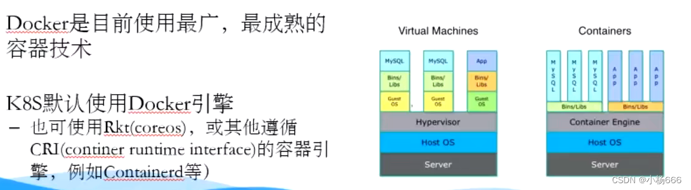
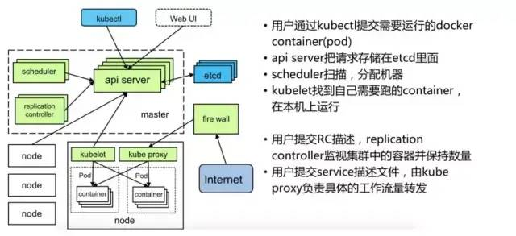

# Kubernetes Service 都有哪些类型
通过创建Service，可以为一组具有相同功能的容器应用提供一个统一的入口地址，并且将请求负载分发到后端的各个容器应用上。其主要类型有：
* ClusterIP：虚拟的服务IP地址，该地址用于Kubernetes集群内部的Pod访问，在Node上kube-proxy通过设置的iptables规则进行转发；
* NodePort：使用宿主机的端口，使能够访问各Node的外部客户端通过Node的IP地址和端口号就能访问服务；
* LoadBalancer：使用外接负载均衡器完成到服务的负载分发，需要在spec.status.loadBalancer字段指定外部负载均衡器的IP地址，通常用于公有云。

# K8s 标签与标签选择器的作用是什么
标签：是当相同类型的资源对象越来越多的时候，为了更好的管理，可以按照标签将其分为一个组，为的是提升资源对象的管理效率。

标签选择器：就是标签的查询过滤条件。目前API支持两种标签选择器：

基于等值关系的，如：“=”、“”“==”、“! =”（注：“==”也是等于的意思，yaml文件中的matchLabels字段）；

基于集合的，如：in、notin、exists（yaml文件中的matchExpressions字段）

<!--more-->

# Kubernetes 如何实现集群管理
在集群管理方面，Kubernetes将集群中的机器划分为一个Master节点和一群工作节点Node。其中，在Master节点运行着集群管理相关的一组进程kube-apiserver、kube-controller-manager和kube-scheduler，这些进程实现了整个集群的资源管理、Pod调度、弹性伸缩、安全控制、系统监控和纠错等管理能力，并且都是全自动完成的。

# 如何解释 kubernetes 架构组件之间的不同

# Kubernetes 中 kube-proxy 有什么作用
kube-proxy运行在所有节点上，它监听apiserver中service和endpoint的变化情况，创建路由规则以提供服务IP和负载均衡功能    
简单理解此进程是Service的透明代理兼负载均衡器，其核心功能是将到某个Service的访问请求转发到后端的多个Pod实例上。  

# 什么是 Pod
Pod是最基本的Kubernetes对象。Pod由一组在集群中运行的容器组成。 最常见的是，一个pod运行一个主容器。  

# 什么是 Kubelet
这是一个代理服务，它在每个节点上运行，并使从服务器与主服务器通信。因此，Kubelet处理PodSpec中提供给它的容器的描述，并确保PodSpec中描述的容器运行正常。

# 为什么需要 Kubernetes，它能做什么  

容器是打包和运行应用程序的好方式。在生产环境中，管理运行应用程序的容器，并确保不会停机。例如，如果一个容器发生故障，则需要启动另一个容器。如果系统处理此行为，会不会更容易？

这就是Kubernetes来解决这些问题的方法！Kubernetes提供了一个可弹性运行分布式系统的框架。Kubernetes可以解决扩展要求、故障转移、部署模式等  

## 服务发现和负载均衡  
Kubernetes可以使用DNS名称或自己的IP地址公开容器，如果进入容器的流量很大，Kubernetes可以负载均衡并分配网络流量，从而使部署稳定  

## 存储编排
Kubernetes支持自动挂载存储系统，例如本地存储、公共云提供商等。  

## 自动部署和回滚
可以使用Kubernetes描述已部署容器的所需状态，它可以以受控的速率将实际状态 更改为期望状态。例如，可以自动化Kubernetes来实现部署创建新容器， 删除现有容器并将它们的所有资源用于新容器。

## 自动完成装箱计算
Kubernetes允许指定每个容器所需CPU和内存（RAM）。 当容器指定了资源请求时，Kubernetes可以做出更好的决策来管理容器的资源。

## 自我修复
Kubernetes 重新启动失败的容器、替换容器、杀死不响应用户定义的 运行状况检查的容器，并且在准备好服务之前不将其通告给客户端。

## 密钥与配置管理
Kubernetes允许存储和管理敏感信息，例如密码、OAuth 令牌和 ssh 密钥。 可以在不重建容器镜像的情况下部署和更新密钥和应用程序配置，也无需在堆栈配置中暴露密钥。  

# 什么是容器编排
容器编排是与运行容器相关的组件和流程的自动化。 它包括诸如配置和调度容器、容器的可用性、容器之间的资源分配以及保护容器之间的交互等内容。

# daemonset、deployment、replication 之间有什么区别
* daemonset：确保您选择的所有节点都运行Pod的一个副本。
* deployment：是Kubernetes中的一个资源对象，它为应用程序提供声明性更新。它管理Pod的调度和生命周期。它提供了几个管理Pod的关键特性，包括Pod健康检查、Pod滚动更新、回滚能力以及轻松水平扩展Pod的能力。
* replication：指定应该在集群中运行多少个Pod的精确副本。它与deployment的不同之处在于它不提供pod健康检查，并且滚动更新过程不那么健壮

# k8s-中镜像的下载策略是什么
K8s的镜像下载策略有三种：Always、Never、IfNotPresent；  
* Always：镜像标签为latest时，总是从指定的仓库中获取镜像；
* Never：禁止从仓库中下载镜像，也就是说只能使用本地镜像；
* IfNotPresent：仅当本地没有对应镜像时，才从目标仓库中下载。

> 默认的镜像下载策略是：当镜像标签是latest时，默认策略是Always；当镜像标签是自定义时(也就是标签不是latest)，那么默认策略是IfNotPresent。

# 删除一个-pod-会发生什么事情
Kube-apiserver会接受到用户的删除指令，默认有30秒时间等待优雅退出，超过30秒会被标记为死亡状态，此时Pod的状态Terminating，kubelet看到pod标记为Terminating就开始了关闭Pod的工作；  

关闭流程如下: 
1. pod从service的endpoint列表中被移除
2. 如果该pod定义了一个停止前的钩子，其会在pod内部被调用，停止钩子一般定义了如何优雅的结束进程
3. 进程被发送TERM信号（kill -14）
4. 当超过优雅退出的时间后，Pod中的所有进程都会被发送SIGKILL信号（kill -9）  

# 简述-kubernetes-scheduler-作用及实现原理

Kubernetes Scheduler在整个系统中承担了“承上启下”的重要功能，“承上”是指它负责接收Controller Manager创建新的Pod，为其安排一个目标Node；“启下”是指安置工作完成后，目标Node上的kubelet服务进程接管后续工作，负责Pod生命周期中的“下半生”。

Kubernetes Scheduler的作用是将待调度的Pod(API新创建的Pod、Controller Manager为补足副本而创建的Pod等)按照特定的调度算法和调度策略绑定(Binding)到集群中某个合适的Node上，并将绑定信息写入etcd中。

目标节点上的kubelet通过API Server监听到Kubernetes Scheduler产生的Pod绑定事件，随后获取对应的Pod清单，下载Image镜像并启动容器。

Scheduler只与API Server交互，其输入和输出如下：  
输入：待调度的Pod和全部计算节点的信息  
输出：目标Pod要”安家“的最优节点(或者暂时不存在)  

# kubernetes-scheduler使用哪两种算法将pod绑定到worker节点
* 预选（Predicates）：输入是所有节点，输出是满足预选条件的节点。kube-scheduler根据预选策略过滤掉不满足策略的Nodes。如果某节点的资源不足或者不满足预选策略的条件则无法通过预选。如“Node的label必须与Pod的Selector一致”。
* 优选（Priorities）：输入是预选阶段筛选出的节点，优选会根据优先策略为通过预选的Nodes进行打分排名，选择得分最高的Node。例如，资源越富裕、负载越小的Node可能具有越高的排名。

> 常见的Priorities包含LeastRequestedPriority(选出资源消耗最小的节点)、BalanceResourceAllocation(选出资源使用率最均衡的节点)

# 说一下kubernetes针对pod资源对象的健康监测机制
* livenessProbe探针 可以根据用户自定义规则来判定pod是否健康，如果livenessProbe探针探测到容器不健康，则kubelet会根据其重启策略来决定是否重启，如果一个容器不包含livenessProbe探针，则kubelet会认为容器的livenessProbe探针的返回值永远成功。
* ReadinessProbe探针 同样是可以根据用户自定义规则来判断pod是否健康，如果探测失败，控制器会将此pod从对应service的endpoint列表中移除，从此不再将任何请求调度到此Pod上，直到下次探测成功。
* startupProbe探针 启动检查机制，应用一些启动缓慢的业务，避免业务长时间启动而被上面两类探针kill掉，这个问题也可以换另一种方式解决，就是定义上面两类探针机制时，初始化时间定义的长一些即可。

## 相关参数
initialDelaySeconds：初始第一次探测间隔，用于应用启动的时间，防止应用还没启动而健康检查失败
periodSeconds：检查间隔，多久执行probe检查，默认为10s；
timeoutSeconds：检查超时时长，探测应用timeout后为失败；
successThreshold：成功探测阈值，表示探测多少次为健康正常，默认探测1次

# kubernetes是什么
强大的容器编排工具，现代化的分布式操作系统  
是一个开源的，用于管理云平台中多个主机上的容器化的应用，Kubernetes的目标是让部署容器化的应用简单并且高效（powerful）,Kubernetes提供了应用部署，规划，更新，维护的一种机制。

用户可以使用 Label 以自己的方式组织管理资源，还可以使用 Annotation 来自定义资源的描述信息，比如为管理工具提供状态检查等。此外，Kubernetes 控制器也是构建在跟开发人员和用户使用的相同的 API 之上。用户可以编写自己的控制器和调度器，也可以通过各种插件机制扩展系统的功能。这种设计使得用户可以方便地在 Kubernetes 之上构建各种应用系统。

# 什么是sidecar，容器使用它做什么
将本将属于应用程序的功能拆分成单独的进程，这个进程可以被理解为Sidecar。在微服务体系内，将集成在应用内的微服务功能剥离到了sidecar内，sidecar提供了微服务发现、注册，服务调用，应用认证，限速等功能。  

1. Sidecar 代理服务注册发现，异构服务通过sidecar接入注册中心
2. Sidecar 代理异构服务发起服务调用， 异构服务本身不和注册中心有直接联系，所以异构服务的调用也需要走sidecar，通过sidecar进行服务发现调用，sidecar收到异构服务的请求后通过服务发现和负载均衡选中目标服务实例，转发请求至目标服务。
3. 异构服务如何被调用 如果异构服务为服务提供方（会被其它服务调用），服务发起方会先注册中心发现sidecar代理注册的实例信息，将请求发送到Sidecar，Sidecar将请求转发给异构服务完成调用请求。

# 创建一个pod的流程是什么
1. kubectl 向api server 发起一个create pod 请求 
2. api server接收到pod创建请求后，不会去直接创建pod，而是生成一个包含创建信息的yaml。
3. api server 将刚才的yaml信息写入etcd数据库。到此为止仅仅是在etcd中添加了一条记录， 还没有任何的实质性进展。 
4. scheduler 查看 k8s api ，类似于通知机制,为新的pod计算node，写入etcd
5. kubelet 通过监停etcd数据库，发现api server 中有了个新的Node，如果这条记录中的Node与自己的编号相同（即这个Pod由scheduler分配给自己了），则调用node中的容器运行时，创建容器

# kubernetes中如何隔离资源
在k8s中的我们的资源如何隔离呢？如果说有一个服务异常了，内存无限制的占用，其他的服务岂不是无法部署上去了？

而且我们一般一个集群是给很多人，很多对象使用的，那么如何保证他们互不打扰？且无法看到其他人的相关内容呢？  

k8s通过Namespace实现资源隔离和配额的隔离  

# k8s-常用的标签分类有哪些
* 版本类标签（release） ：stable（稳定版）、canary（金丝雀版本，可以将其称之为测试版中的测试版）、beta（测试版
* 环境类标签（environment）：dev（开发）、qa（测试）、production（生产）、op（运维）；
* 应用类（app）： ui、as、pc、sc
* 架构类（tier）： frontend（前端）、backend（后端）、cache（缓存）
* 分区标签（partition）：customerA（客户A）、customerB（客户B）
* 品控级别（Track）：daily（每天）、weekly（每周）

# 容器和主机部署应用的区别是什么
容器的中心思想就是秒级启动；一次封装、到处运行；这是主机部署应用无法达到的效果，但同时也更应该注重容器的数据持久化问题   
另外，容器部署可以将各个服务进行隔离，互不影响，这也是容器的另一个核心概念。

# 描述一下kubernetes deployment 升级过程
在Deployment的定义中，可以通过spec.strategy指定Pod更新的策略，目前支持两种策略：Recreate（重建）和RollingUpdate（滚动更新），默认值为RollingUpdate
* Recreate：设置spec.strategy.type=Recreate，表示Deployment在更新Pod时，会先杀掉所有正在运行的Pod，然后创建新的Pod。
* RollingUpdate：设置spec.strategy.type=RollingUpdate，表示Deployment会以滚动更新的方式来逐个更新Pod。同时，可以通过设置spec.strategy.rollingUpdate下的两个参数（maxUnavailable和maxSurge）来控制滚动更新的过程。

# kubernetes中metric service有什么作用
用于实现自动伸缩  
Metrics Service是一个关键组件，它主要用于提供集群内Pod和节点资源使用情况的标准接口。通过Metrics API，Metrics Service向集群的其他组件暴露这些数据，使得Kubernetes的其他组件能够基于资源利用率来做出决策。

Metrics Server不适用于非自动缩放目的。例如，不要使用它来将指标转发给监控解决方案，或作为监控解决方案指标的来源。在这种情况下，请直接从Kubelet/metrics/resource端点收集指标

# kubernetes中 rbac是什么，有什么优势
RBAC（Role-Based Access Control，基于角色的访问控制）是一种用于限制用户、Service Account或组等实体对集群里资源（例如Pod、Deployment和ConfigMap等）的操作和访问权限的机制。

RBAC在Kubernetes中的实现基于三个核心组件：角色（Role）、角色绑定（RoleBinding）和集群角色绑定（ClusterRoleBinding）。角色定义了权限，角色绑定将这些权限分配给用户或用户组，而集群角色绑定则允许在集群级别进行权限分配。

使用RBAC，管理员可以动态地配置策略，实现细粒度的访问控制。例如，可以让一个用户扮演一个角色，角色拥有特定的权限，这样用户就拥有了这些权限。这种方式仅作用于当前空间，即权限的分配是特定于命名空间的。

RBAC具有如下优势：  
1. 对集群中的资源和非资源权限均有完整的覆盖。
2. 整个RBAC完全由几个API对象完成， 同其他API对象一样， 可以用kubectl或API进行操作。
3. 可以在运行时进行调整，无须重新启动API Server。

# 什么是容器
一系列隔离运行的进程，提供了一种轻量操作系统层面的虚拟化技术每个容器拥有自己的PID,User,UTS,Network栈命名空间等
与传统VM比具有启动快、性能损耗小、更轻量等优点  

## Kubernetes 特点
* 可移植: 支持公有云，私有云，混合云，多重云（multi-cloud）
* 可扩展: 模块化，插件化，可挂载，可组合
* 自动化: 自动部署，自动重启，自动复制，自动伸缩/扩展  

## Kubernetes架构和组件

# Kubernetes所能识别的最小单元什么
Pod就是Kubernetes所能识别的最小单元。它包含了一个或多个的容器并看做是一个整体的单元。基本上，可以说Pod就是一个单一的微服务。  

# K8S与Swarm的共同点是什么
Docker Swarm和Kubernetes都是用来编排容器的，但是是以不同的方式。  

# Docker + Kubernetes只能在Linux环境下运行吗
不，Docker加入对Windows的支持已经有一段时间了，而就在1.5版本的时候，Kubernetes加入了对Windows Server容器的支持，控制器仍然还跑在Linux上，然后Kubelet和Kubeproxy则可以在Windows上运行。

# kube api server和kube-scheduler的作用是什么
kube–api server遵循横向扩展架构，并且是主节点控制面板的前端。这将公开Kubernetes主节点组件的所有API，并负责在Kubernetes节点和Kubernetes主组件之间建立通信。kube-scheduler负责在工作节点上分配和管理工作负载。因此，它根据资源需求选择最合适的节点来运行Pod，并跟踪资源利用率。它可以确保未在已满的节点上调度工作负载。

# k8s的核心组件
* etcd 保存整个集群的状态
* api server 提供了资源操作的唯一入口，并提供认证、授权、访问控制、API注册和发现等机制
* controller manager  负责维护集群的状态，比如故障检测、自动扩展、滚动更新等
* scheduler 负责资源的调度，按照预定的调度策略将Pod调度到相应的机器上
* kubelet 负责维护容器的生命周期，同时也负责Volume（CSI）和网络（CNI）的管理
* Container runtime  负责镜像管理以及Pod和容器的真正运行（CRI）
* kube-proxy 负责为Service提供cluster内部的服务发现和负载均衡

其它组件： 
* kube-dns负责为整个集群提供DNS服务
* Ingress Controller为服务提供外网入口
* Heapster提供资源监控
* Dashboard提供GUI
* Federation提供跨可用区的集群

