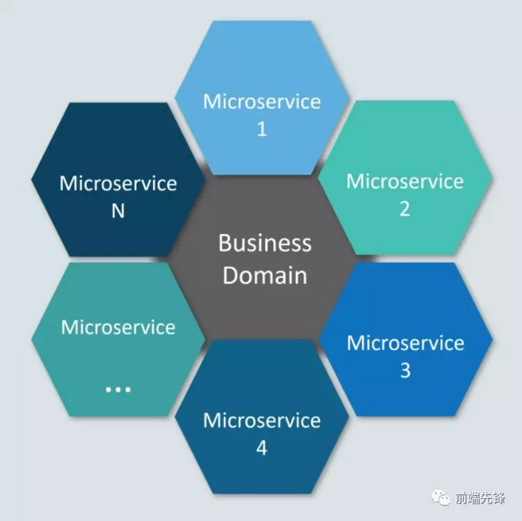
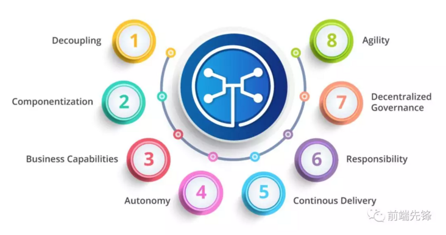
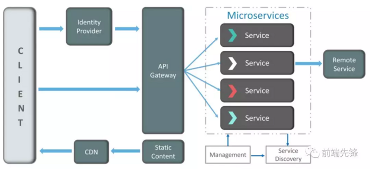
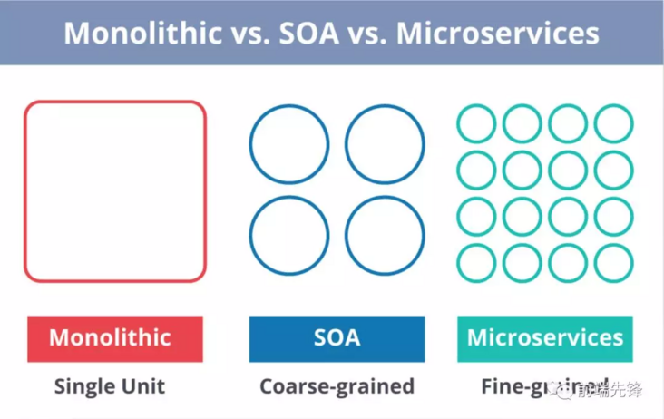

## 说说微服务架构的优势。
|优势|说明|
|:---:|:---:|
|独立开发|所有微服务都可以根据各自的功能轻松开发|
|独立部署|根据他们所提供的服务，可以在任何应用中单独部署|
|故障隔离|即使应用中的一个服务不起作用，系统仍然继续运行|
|混合技术栈|可以用不同的语言和技术来构建同一应用程序的不同服务|
|粒度缩放|各个组件可根据需要进行扩展，无需将所有组件融合到一起|

<!--more-->

## 你对微服务是怎么理解的？
微服务，又名微服务架构，是一种架构风格，它将应用构建为一个小型自治服务的集合，以业务领域为模型。  

通俗地说，就像蜜蜂通过对蜡制的等边六角形单元来构建它们的蜂巢。他们最初从使用各种材料的小单元开始，一点点的搭建出一个大型蜂巢。 这些小单元组成坚固的结构，将蜂窝的特定部分固定在一起。这里，每个小单元都独立于另一个，但它也与其他小单元相关。这意味着对一个小单元的损害不会损害其他的单元，因此，蜜蜂可以在不影响完整蜂巢的情况下重建这些单元。

请参考上图。这里，每个六边形都代表单独的服务组件。与蜜蜂的工作类似，每个敏捷团队都使用可用的框架和所选的技术栈构建单独的服务组件。就像在蜂巢中一样，这些服务组件形成一个强大的微服务架构，以提供更好的可扩展性。此外敏捷团队可以单独处理每个服务组件的问题，而不会对整个应用程序产生影响或使影响最小。  

## 微服务有哪些特点？

* 解耦（Decoupling） - 系统内的服务很大程度上是分离的。因此整个应用可以被轻松构建、修改和扩展
* 组件化（Componentization） - 微服务被视为可以被轻松替换和升级的独立组件
* 业务能力（Business Capabilities） - 微服务非常简单，专注于单一功能
* 自治（Autonomy） - 开发人员和团队可以相互独立工作，从而提高效率
* 持续交付（ContinousDelivery） - 允许频繁发版，通过系统自动化完成对软件的创建、测试和审核，
* 责任（Responsibility） - 微服务不把程序作为项目去关注。相反，他们将程序视为自己负责的产品
* 分散治理（Decentralized Governance） - 重点是用正确的工具去做正确的事。这意味着没有任何标准化模式或着技术模式。开发人员可以自由选择最合适的工具来解决自己的问题
* 敏捷性（Agility） - 微服务支持敏捷开发。任何新功能都可以快速开发并被再次丢弃

## 设计微服务的最佳实践是什么？
以下是设计微服务的最佳实践：  
1.为每个微服务分开数据存储  
2.将代码保持在类似的成熟度等级上  
3.为每个微服务进行单独的构建  
4.部署到容器中
5.将服务器视为无状态的

## 微服务架构是如何运作的？
微服务架构具有以下组件：  

* Clients – 来自不同设备的不同用户发送请求。
* Identity Providers – 对用户或客户端身份进行身份验证，并颁发安全令牌。
* API Gateway – 处理客户端请求。
* Static Content – 容纳系统的所有内容。
* Management – 平衡节点上的服务压力并识别故障。
* Service Discovery – 用于找到微服务之间通信路径的向导。
* Content Delivery Networks – 代理服务器及其数据中心的分布式网络。
* Remote Service – 启用驻留在 IT 设备网络上的远程访问信息

## 微服务架构的优点和缺点是什么？
|优点|缺点|
|:---:|:---:|
|可以自由使用不同的技术|增加故障排除的难度|
|每个微服务都专注于单一功能|由于远程调用而导致延迟增加|
|支持单个可部署单元|增加配置和其他操作的工作量|
|允许软件的持续发布|难以维持处理的安全性|
|可确保每项服务的安全性|很难跟踪各种边界的数据|
|并行开发和部署多个服务|服务之间难以编码|

## 单体应用、SOA 和微服务架构有什么区别？

* 单体应用类似于一个大容器，其中程序的所有组件都被组装在一起并紧密包装。
* SOA是一组相互通信的服务。通信可以涉及简单的数据传送，也可以涉及两个或多个协调某些活动的服务。
* 微服务架构是一种架构风格，它将应用程序构建为以业务域为模型的小型自治服务集合。

## 在使用微服务架构时，你面临的挑战是什么？
开发较小的微服务听起来很容易，但在开发时会经常遇到一些挑战。  
* 自动化组件：难以自动化，因为有许多较小的组件。对于每个组件，都必须采取构建、发布和监控的步骤。
* 可感知性：将大量组件维持在一起会带来难以部署、维护、监控和识别的问题。它需要在所有组件周围具有很好的感知能力。
* 配置管理：有时在各种环境中维护组件的配置会很困难。
* 调试：很难找到与产生的错误相关的每一项服务。维护一个集中式的日志和控制面板对调试问题至关重要。

## SOA 和微服务架构之间的主要区别是什么？
|SOA|微服务|
|:---:|:---:|
|遵循“尽可能多的共享”架构方法|遵循“尽可能少的共享”的架构方法|
|侧重点是业务功能重用|侧重点在于“bounded context”的概念|
|遵循共同治理并有相关的标准|专注于人的合作和其他选择的自由|
|使用企业服务总线（ESB）进行通信|简单的消息系统|
|支持多消息协议|使用轻量级协议，例如 HTTP/REST 等|
|多线程，有更多的开销来处理I / O|单线程，通常使用事件循环进行非锁定 I/O 处理|
|最大化服务的可重用性|专注于解耦|
|使用传统关系数据库较多|使用现代关系型数据库较多|
|系统发生变化时需要修改整体|系统发生变化是创建一项新服务|
|DevOps和持续交付正在变得流行，但尚未成为主流|专注于DevOps和持续交付|

## 什么是内聚？
内聚是一个模块内部各元素之间相关联程度的度量

## 什么是耦合？
组件之间依赖关系强度的度量被称为耦合。好的设计总是高内聚和低耦合的。

## 什么是REST/RESTful ？它的用途是什么？
Representational State Transfer（REST）/ RESTful （表述性状态转移）是一种帮助计算机系统通过 Internet 进行通信的架构风格。这使得微服务更容易理解和实现。  
微服务可以用 RESTful API 来实现，当然也可以不用，但是用 RESTful API 去构建松散耦合的微服务总是更容易些。  

## 你对分布式事务的理解？
分布式事务是单个事件导致两个或多个不能以原子方式提交的单独数据源的突变的情况。在微服务的世界中，它变得更加复杂，因为每个服务都是一个工作单元，并且在大多数情况下，多个服务必须协同工作才能使业务成功。  

## 什么是幂等性（Idempotence）及用在那里？
幂等性是能够以同样的方式做两次，而最终结果将保持不变，就好像它只做了一次的特性。  
用法：在远程服务或数据源中使用幂等性，以便当它多次接收指令时，只处理一次。  

## 什么是客户端证书？
客户端系统向远程服务器发出经过身份验证的请求所用的数字证书被称为客户端证书。客户端证书在许多相互认证设计中起着非常重要的作用，为请求者的身份提供了强有力的保证。  

## 什么是OAuth？
OAuth 代表开放授权协议。这允许通过在 HTTP 服务上启用客户端应用（例如第三方提供商 Facebook，GitHub等）来访问资源所有者的资源。因此，你可以在不使用其凭据的情况下与另一个站点共享存储在一个站点上的资源。  

## 容器在微服务中的用途是什么？
容器是管理基于微服务的程序以便单独开发和部署它们的好方法。你可以将微服务封装在容器镜像及其依赖项中，然后可以用它来滚动开发按需实例的微服务而无需任何额外的工作。

##  Docker 的用途是什么？
Docker 提供了一个可用于托管任何应用程序的容器环境。将软件应用程序和支持它的依赖项紧密打包在一起。

这个打包的产品被称为容器 ，因为它是由 Docker 完成的，所以被称为 Docker 容器。

##  什么是金丝雀发布（Canary Releasing）？
金丝雀发布是一种降低在生产中引入新版本软件风险的技术。通过在将更改传递给整个基础架构之前将更改缓慢地推广到一小部分用户来完成的。

## 什么是持续集成（CI）？
持续集成（CI）是每次团队成员提交版本控制更改时自动构建和测试代码的过程。这鼓励开发人员通过在每个小任务完成后将更改合并到共享版本控制存储库来共享代码和单元测试。  

## 架构师在微服务架构中的角色是什么？
* 决定整个软件系统的布局。
* 有助于确定组件的分区。因此，他们确保组件相互粘合，但不紧密耦合。
* 与开发人员一起编写代码，了解日常面临的挑战。
* 为开发微服务的团队提供某些工具和技术的建议。
* 提供技术治理，以便技术开发团队遵循微服务原则。

## 微服务之间是如何通讯的？
### 远程过程调用（Remote Procedure Invocation）
直接通过远程过程调用来访问别的service。  
示例：REST、gRPC、Apache、Thrift 
简单，常见。因为没有中间件代理，系统更简单  
只支持请求/响应的模式，不支持别的，比如通知、请求/异步响应、发布/订阅、发布/异步响应降低了可用性，因为客户端和服务端在请求过程中必须都是可用的  

### 消息
使用异步消息来做服务间通信。服务间通过消息管道来交换消息，从而通信。
示例：Apache Kafka、RabbitMQ  

把客户端和服务端解耦，更松耦合 提高可用性，因为消息中间件缓存了消息，直到消费者可以消费  
支持很多通信机制比如通知、请求/异步响应、发布/订阅、发布/异步响应  

消息中间件有额外的复杂性  

## 分布式系统面临的问题?
复杂分布式体系结构中的应用程序有数十个依赖关系，每个依赖关系在某些时候将不可避免地失败。  

服务雪崩多个微服务之间调用的时候，假设微服务A调用微服务B和微服务C，微服务B和微服务C又调用其它的微服务，这就是所谓的“扇出”。如果扇出的链路上某个微服务的调用响应时间过长或者不可用，对微服务A的调用就会占用越来越多的系统资源，进而引起系统崩溃，所谓的“雪崩效应”.  

对于高流量的应用来说，单一的后端依赖可能会导致所有服务器上的所有资源都在几秒钟内饱和。比失败更糟糕的是，这些应用程序还可能导致服务之间的延迟增加，备份队列，线程和其他系统资源紧张，导致整个系统发生更多的级联故障。这些都表示需要对故障和延迟进行隔离和管理，以便单个依赖关系的失败，不能取消整个应用程序或系统。  

一般情况对于服务依赖的保护主要有以下三种解决方案：  
1. 熔断模式：这种模式主要是参考电路熔断，如果一条线路电压过高，保险丝会熔断，防止火灾。放到我们的系统中，如果某个目标服务调用慢或者有大量超时，此时，熔断该服务的调用，对于后续调用请求，不在继续调用目标服务，直接返回，快速释放资源。如果目标服务情况好转则恢复调用。

2. 隔离模式：这种模式就像对系统请求按类型划分成一个个小岛的一样，当某个小岛被火少光了，不会影响到其他的小岛。例如可以对不同类型的请求使用线程池来资源隔离，每种类型的请求互不影响，如果一种类型的请求线程资源耗尽，则对后续的该类型请求直接返回，不再调用后续资源。这种模式使用场景非常多，例如将一个服务拆开，对于重要的服务使用单独服务器来部署，再或者公司最近推广的多中心。  

3.限流模式：上述的熔断模式和隔离模式都属于出错后的容错处理机制，而限流模式则可以称为预防模式。限流模式主要是提前对各个类型的请求设置最高的QPS阈值，若高于设置的阈值则对该请求直接返回，不再调用后续资源。这种模式不能解决服务依赖的问题，只能解决系统整体资源分配问题，因为没有被限流的请求依然有可能造成雪崩效应。  

## 什么是服务熔断，什么是服务降级?

### 服务熔断
熔断机制是应对雪崩效应的一种微服务链路保护机制。当扇出链路的某个微服务不可用或者响应时间太长时，会进行服务的降级，进而熔断该节点微服务的调用，快速返回”错误”的响应信息。当检测到该节点微服务调用响应正常后恢复调用链路。在SpringCloud框架里熔断机制通过Hystrix实现。Hystrix会监控微服务间调用的状况，当失败的调用到一定阈值，缺省是5秒内20次调用失败就会启动熔断机制。熔断机制的注解是@HystrixCommand。  
### Hystrix服务降级
其实就是线程池中单个线程障处理，防止单个线程请求时间太长，导致资源长期被占有而得不到释放，从而导致线程池被快速占用完，导致服务崩溃。  
Hystrix能解决如下问题：  
* 请求超时降级，线程资源不足降级，降级之后可以返回自定义数据
* 线程池隔离降级，分布式服务可以针对不同的服务使用不同的线程池，从而互不影响
* 自动触发降级与恢复
* 实现请求缓存和请求合并

## 微服务的优缺点分别是什么？说下你在项目开发中碰到的坑？
### 优点
* 每个服务足够内聚，足够小，代码容易理解这样能聚焦一个指定的业务功能或业务需求
* 开发简单、开发效率提高，一个服务可能就是专一的只干一件事。
* 微服务能够被小团队单独开发，这个小团队是2到5人的开发人员组成。
* 微服务是松耦合的，是有功能意义的服务，无论是在开发阶段或部署阶段都是独立的。
* 微服务能使用不同的语言开发。
* 易于和第三方集成，微服务允许容易且灵活的方式集成自动部署，通过持续集成工具，如Jenkins, Hudson, bamboo 。
* 微服务易于被一个开发人员理解，修改和维护，这样小团队能够更关注自己的工作成果。无需通过合作才能体现价值。
* 微服务允许你利用融合最新技术。
* 微服务只是业务逻辑的代码，不会和HTML,CSS 或其他界面组件混合。
* 每个微服务都有自己的存储能力，可以有自己的数据库。也可以有统一数据库

### 缺点
* 开发人员要处理分布式系统的复杂性
* 多服务运维难度，随着服务的增加，运维的压力也在增大
* 系统部署依赖
* 服务间通信成本
* 数据一致性
* 系统集成测试
* 性能监控……

## 你所知道的微服务技术栈有哪些？请列举一二
* 服务开发Springboot、Spring、SpringMVC
* 服务配置与管理Netflix公司的Archaius、阿里的Diamond等
* 服务注册与发现Eureka、Consul、Zookeeper等
* 服务调用Rest、RPC、gRPC
* 服务熔断器Hystrix、Envoy等
* 负载均衡Ribbon、Nginx等
* 服务接口调用(客户端调用服务的简化工具)Feign等
* 消息队列Kafka、RabbitMQ、ActiveMQ等
* 服务配置中心管理SpringCloudConfig、Chef等
* 服务路由（API网关）Zuul等
* 服务监控Zabbix、Nagios、Metrics、Spectator等
* 全链路追踪Zipkin，Brave、Dapper等
* 服务部署Docker、OpenStack、Kubernetes等
* 数据流操作开发包SpringCloud Stream（封装与Redis,Rabbit、Kafka等发送接收消息）
* 事件消息总线Spring Cloud Bus

