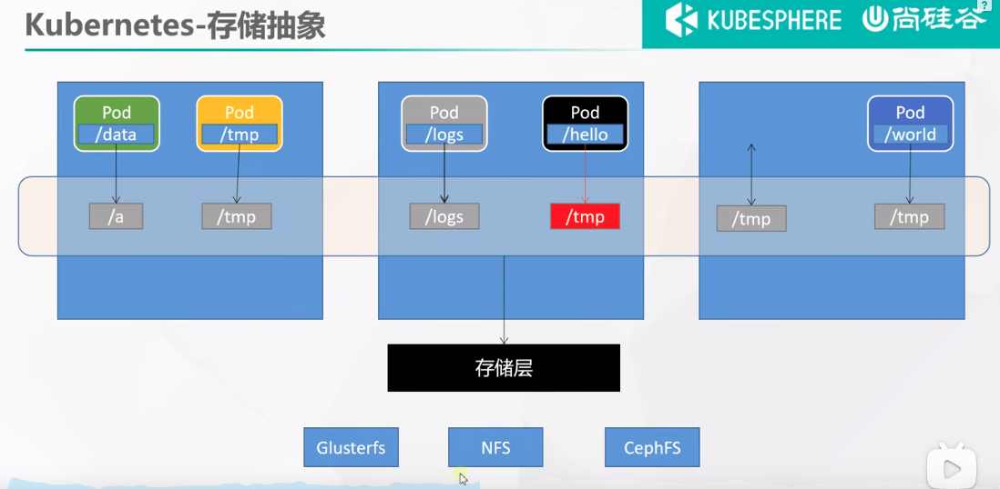
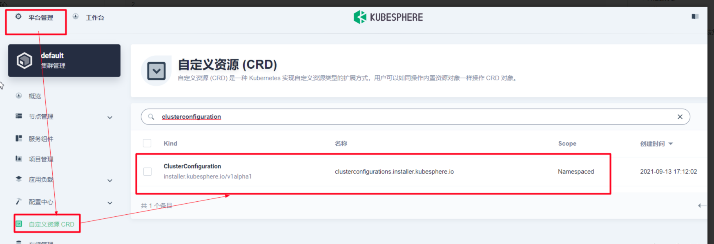
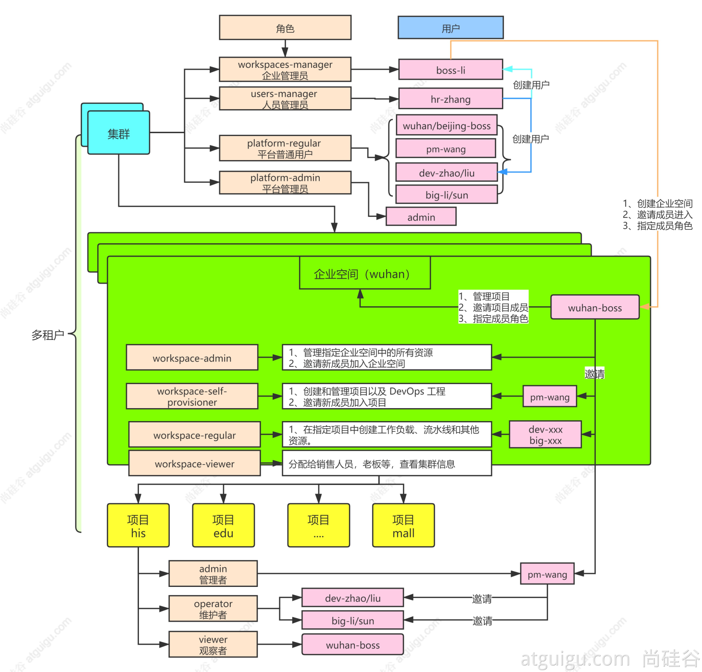

# k8s 集群安装


## 准备3台云服务器
centos   
云服务器 规划到一个vpc(虚拟私有云网络) 中  
* master  172.31.0.2 
* worker1 172.31.0.3
* worker2 172.31.0.4

> master 上面可以装一个sshpass 用于快速连接其它两个worker

## 配置网络
教程中直接给3台服务器中绑定了3个公网ip，实际生产环境中往往只会配一个公网ip  
这里我们使用nat网关来实现，集群中任意一台机器都可以上网  
  

[青云NAT网关配置文档](https://docsv3.qingcloud.com/network/nat_gateway/quickstart/snat_qs/)  

* SNAT  负责实现内网中 服务器访问公网
* DNAT  负责实现外网 访问内网服务器 （实现是类似端口转发）


## 3台服务器上面装 docker
### 配置yum源
```shell
sudo yum install -y yum-utils
sudo yum-config-manager \
--add-repo \
http://mirrors.aliyun.com/docker-ce/linux/centos/docker-ce.repo

```
### 安装docker
```shell
sudo yum install -y docker-ce docker-ce-cli containerd.io


#以下是在安装k8s的时候使用
yum install -y docker-ce-20.10.7 docker-ce-cli-20.10.7  containerd.io-1.4.6
```


### 启动docker
```shell
systemctl enable docker --now
```
### 配置加速
```shell
sudo mkdir -p /etc/docker
sudo tee /etc/docker/daemon.json <<-'EOF'
{
  "registry-mirrors": ["https://82m9ar63.mirror.aliyuncs.com"],
  "exec-opts": ["native.cgroupdriver=systemd"],
  "log-driver": "json-file",
  "log-opts": {
    "max-size": "100m"
  },
  "storage-driver": "overlay2"
}
EOF
sudo systemctl daemon-reload
sudo systemctl restart docker
```

## kubeadm创建集群

### 设置主机名（非必要）
推荐设置，设置后比较直观的能看到每台机器的角色  
在 master worker1 worker1 分别执行  
```shell
hostnamectl set-hostname k8s-master
hostnamectl set-hostname k8s-worker1
hostnamectl set-hostname k8s-worker2

```

### 基础环境
所有机器执行以下操作  (一下操作都是k8s官方要求做的) 
```shell

# 将 SELinux 设置为 permissive 模式（相当于将其禁用）
sudo setenforce 0
sudo sed -i 's/^SELINUX=enforcing$/SELINUX=permissive/' /etc/selinux/config

#关闭swap
swapoff -a  
sed -ri 's/.*swap.*/#&/' /etc/fstab

#允许 iptables 检查桥接流量
cat <<EOF | sudo tee /etc/modules-load.d/k8s.conf
br_netfilter
EOF

cat <<EOF | sudo tee /etc/sysctl.d/k8s.conf
net.bridge.bridge-nf-call-ip6tables = 1
net.bridge.bridge-nf-call-iptables = 1
EOF
sudo sysctl --system

```

### 安装kubelet、kubeadm、kubectl
```shell
cat <<EOF | sudo tee /etc/yum.repos.d/kubernetes.repo
[kubernetes]
name=Kubernetes
baseurl=http://mirrors.aliyun.com/kubernetes/yum/repos/kubernetes-el7-x86_64
enabled=1
gpgcheck=0
repo_gpgcheck=0
gpgkey=http://mirrors.aliyun.com/kubernetes/yum/doc/yum-key.gpg
   http://mirrors.aliyun.com/kubernetes/yum/doc/rpm-package-key.gpg
exclude=kubelet kubeadm kubectl
EOF


sudo yum install -y kubelet-1.20.9 kubeadm-1.20.9 kubectl-1.20.9 --disableexcludes=kubernetes

sudo systemctl enable --now kubelet
```

### 使用kubeadm引导集群
#### 下载各个机器需要的镜像
```shell
sudo tee ./images.sh <<-'EOF'
#!/bin/bash
images=(
kube-apiserver:v1.20.9
kube-proxy:v1.20.9
kube-controller-manager:v1.20.9
kube-scheduler:v1.20.9
coredns:1.7.0
etcd:3.4.13-0
pause:3.2
)
for imageName in ${images[@]} ; do
docker pull registry.cn-hangzhou.aliyuncs.com/lfy_k8s_images/$imageName
done
EOF
   
chmod +x ./images.sh && ./images.sh
```
#### 初始化主节点
```shell

#所有机器添加master域名映射，以下需要修改为自己的
echo "172.31.0.2  cluster-endpoint" >> /etc/hosts


#主节点初始化
kubeadm init \
--apiserver-advertise-address=172.31.0.2 \
--control-plane-endpoint=cluster-endpoint \
--image-repository registry.cn-hangzhou.aliyuncs.com/lfy_k8s_images \
--kubernetes-version v1.20.9 \
--service-cidr=10.96.0.0/16 \
--pod-network-cidr=192.168.0.0/16

#所有网络范围不重叠

# 输出
Your Kubernetes control-plane has initialized successfully!

To start using your cluster, you need to run the following as a regular user:

  mkdir -p $HOME/.kube
  sudo cp -i /etc/kubernetes/admin.conf $HOME/.kube/config
  sudo chown $(id -u):$(id -g) $HOME/.kube/config

Alternatively, if you are the root user, you can run:

  export KUBECONFIG=/etc/kubernetes/admin.conf

You should now deploy a pod network to the cluster.
Run "kubectl apply -f [podnetwork].yaml" with one of the options listed at:
  https://kubernetes.io/docs/concepts/cluster-administration/addons/

You can now join any number of control-plane nodes by copying certificate authorities
and service account keys on each node and then running the following as root:

  kubeadm join cluster-endpoint:6443 --token 2814mk.x9qrs7s68zgpvp4b \
    --discovery-token-ca-cert-hash sha256:5302308d2acb78fd732fa569daaeba074e0ca49006965d832e4eaa23f884dde7 \
    --control-plane 

Then you can join any number of worker nodes by running the following on each as root:

kubeadm join cluster-endpoint:6443 --token 2814mk.x9qrs7s68zgpvp4b \
    --discovery-token-ca-cert-hash sha256:5302308d2acb78fd732fa569daaeba074e0ca49006965d832e4eaa23f884dde7

```

1. 指定配置文件  
```shell
  mkdir -p $HOME/.kube
  sudo cp -i /etc/kubernetes/admin.conf $HOME/.kube/config
  sudo chown $(id -u):$(id -g) $HOME/.kube/config
```
2. 安装网络组件
```shell
curl https://docs.projectcalico.org/archive/v3.20/manifests/calico.yaml -O

kubectl apply -f calico.yaml

```

#### 加入work节点
```shell
kubeadm join cluster-endpoint:6443 --token 2814mk.x9qrs7s68zgpvp4b \
    --discovery-token-ca-cert-hash sha256:5302308d2acb78fd732fa569daaeba074e0ca49006965d832e4eaa23f884dde7
```
> 这里注意 云服务器 我是先后创建的导致安全组用的不是一个，导致节点在加入集群的时候和master的6443端口的通信问题

> 新令牌
kubeadm token create --print-join-command


高可用部署方式，也是在这一步的时候，使用添加主节点的命令即可


####  验证集群 
```shell
kubectl get nodes 
```

## 部署dashboard
### 部署 
```shell
kubectl apply -f https://raw.githubusercontent.com/kubernetes/dashboard/v2.3.1/aio/deploy/recommended.yaml 
```
### 设置访问端口
```shell
kubectl edit svc kubernetes-dashboard -n kubernetes-dashboard
```
> type: ClusterIP 改为 type: NodePort

```shell
kubectl get svc -A |grep kubernetes-dashboard
```
> 找到端口，在安全组放行

### 创建访问账号
dash.yaml
```shell
#创建访问账号，准备一个yaml文件； vi dash.yaml
apiVersion: v1
kind: ServiceAccount
metadata:
  name: admin-user
  namespace: kubernetes-dashboard
---
apiVersion: rbac.authorization.k8s.io/v1
kind: ClusterRoleBinding
metadata:
  name: admin-user
roleRef:
  apiGroup: rbac.authorization.k8s.io
  kind: ClusterRole
  name: cluster-admin
subjects:
- kind: ServiceAccount
  name: admin-user
  namespace: kubernetes-dashboard
```
### 令牌访问
```shell
#获取访问令牌
kubectl -n kubernetes-dashboard get secret $(kubectl -n kubernetes-dashboard get sa/admin-user -o jsonpath="{.secrets[0].name}") -o go-template="{{.data.token | base64decode}}"
```

# 核心实战
## Namespace
名称空间，用来对集群资源进行隔离划分，默认只隔离资源，不隔离网络
```shell
kubectl create ns hello
kubectl delete ns hello 
```

```yaml
apiVersion: v1
kind: Namespace
metadata:
  name: hello
```
## Pod
运行中的一组容器，Pod是k8s中应用的最小单位
```shell
kubectl run mynginx --image=nginx

# 查看default名称空间的Pod
kubectl get pod 
# 描述
kubectl describe pod 你自己的Pod名字
# 删除
kubectl delete pod Pod名字
# 查看Pod的运行日志
kubectl logs Pod名字

# 每个Pod - k8s都会分配一个ip
kubectl get pod -owide
# 使用Pod的ip+pod里面运行容器的端口
curl 192.168.169.136

# 集群中的任意一个机器以及任意的应用都能通过Pod分配的ip来访问这个Pod


```

```yaml
apiVersion: v1
kind: Pod
metadata:
  labels:
    run: mynginx
  name: mynginx
#  namespace: default
spec:
  containers:
  - image: nginx
    name: mynginx

```

一个pod多个容器  

```yaml
apiVersion: v1
kind: Pod
metadata:
  labels:
    run: myapp
  name: myapp
spec:
  containers:
  - image: nginx
    name: nginx
  - image: tomcat:8.5.68
    name: tomcat
```

> watch -n 1 kubectl get pods   每隔1秒执行一次 kubectl get pods

## Deployment
控制pod,使Pod拥有多副本，自愈、扩容等能力。  
```yaml
# 清除所有Pod，比较下面两个命令有何不同效果？
kubectl run mynginx --image=nginx

kubectl create deployment mytomcat --image=tomcat:8.5.68
# 自愈能力
```

### 多副本
```shell
kubectl create deployment my-dep --image=nginx --replicas=3
```

```yaml
apiVersion: apps/v1
kind: Deployment
metadata:
  labels:
    app: my-dep
  name: my-dep
spec:
  replicas: 3
  selector:
    matchLabels:
      app: my-dep
  template:
    metadata:
      labels:
        app: my-dep
    spec:
      containers:
      - image: nginx
        name: nginx
```


### 扩缩容
```shell
kubectl scale --replicas=5 deployment/my-dep
```
```yaml
kubectl edit deployment my-dep

#修改 replicas
```


### 自愈&故障转移
* 停机
* 删除Pod
* 容器崩溃

### 滚动更新
```shell
kubectl set image deployment/my-dep nginx=nginx:1.16.1 --record
kubectl rollout status deployment/my-dep
```

```yaml
# 修改 kubectl edit deployment/my-dep
```

### 版本回退
```shell
#历史记录
kubectl rollout history deployment/my-dep


#查看某个历史详情
kubectl rollout history deployment/my-dep --revision=2

#回滚(回到上次)
kubectl rollout undo deployment/my-dep

#回滚(回到指定版本)
kubectl rollout undo deployment/my-dep --to-revision=2
```


> 更多：
除了Deployment，k8s还有 StatefulSet 、DaemonSet 、Job  等 类型资源。我们都称为 工作负载。
有状态应用使用  StatefulSet  部署，无状态应用使用 Deployment 部署
https://kubernetes.io/zh/docs/concepts/workloads/controllers/


## Service
将一组 Pods 公开为网络服务的抽象方法  
```shell
#暴露Deploy
kubectl expose deployment my-dep --port=8000 --target-port=80

#使用标签检索Pod
kubectl get pod -l app=my-dep
```
> k8s 服务域名的构成方式： 服务名.名称空间.svc

```yaml
apiVersion: v1
kind: Service
metadata:
  labels:
    app: my-dep
  name: my-dep
spec:
  selector:
    app: my-dep
  ports:
  - port: 8000
    protocol: TCP
    targetPort: 80
```

### ClusterIP
```shell
# 等同于没有--type的
kubectl expose deployment my-dep --port=8000 --target-port=80 --type=ClusterIP
```
```yaml
apiVersion: v1
kind: Service
metadata:
  labels:
    app: my-dep
  name: my-dep
spec:
  ports:
  - port: 8000
    protocol: TCP
    targetPort: 80
  selector:
    app: my-dep
  type: ClusterIP
```
### NodePort
```shell
kubectl expose deployment my-dep --port=8000 --target-port=80 --type=NodePort
```

```yaml
apiVersion: v1
kind: Service
metadata:
  labels:
    app: my-dep
  name: my-dep
spec:
  ports:
  - port: 8000
    protocol: TCP
    targetPort: 80
  selector:
    app: my-dep
  type: NodePort

```


## Ingress
Service 的统一网关入口  


### 安装
```shell
wget https://raw.githubusercontent.com/kubernetes/ingress-nginx/controller-v0.47.0/deploy/static/provider/baremetal/deploy.yaml

#修改镜像
vi deploy.yaml
#将image的值改为如下值：
registry.cn-hangzhou.aliyuncs.com/lfy_k8s_images/ingress-nginx-controller:v0.46.0

# 检查安装的结果
kubectl get pod,svc -n ingress-nginx

# 最后别忘记把svc暴露的端口要放行
```
> 如果下载不到，用这个文件  [ingress.yaml](云原生实战/ingress.yaml)


ingress 主要解决几个问题  
* 使用NodePort 方式暴露服务，带来的端口占用问题
* 使用LoadBalancer 绑定公网ip带来的费用以及多ip管理问题
### 测试

```yaml
apiVersion: apps/v1
kind: Deployment
metadata:
  name: hello-server
spec:
  replicas: 2
  selector:
    matchLabels:
      app: hello-server
  template:
    metadata:
      labels:
        app: hello-server
    spec:
      containers:
      - name: hello-server
        image: registry.cn-hangzhou.aliyuncs.com/lfy_k8s_images/hello-server
        ports:
        - containerPort: 9000
---
apiVersion: apps/v1
kind: Deployment
metadata:
  labels:
    app: nginx-demo
  name: nginx-demo
spec:
  replicas: 2
  selector:
    matchLabels:
      app: nginx-demo
  template:
    metadata:
      labels:
        app: nginx-demo
    spec:
      containers:
      - image: nginx
        name: nginx
---
apiVersion: v1
kind: Service
metadata:
  labels:
    app: nginx-demo
  name: nginx-demo
spec:
  selector:
    app: nginx-demo
  ports:
  - port: 8000
    protocol: TCP
    targetPort: 80
---
apiVersion: v1
kind: Service
metadata:
  labels:
    app: hello-server
  name: hello-server
spec:
  selector:
    app: hello-server
  ports:
  - port: 8000
    protocol: TCP
    targetPort: 9000
```

#### 域名访问
```yaml
apiVersion: networking.k8s.io/v1
kind: Ingress  
metadata:
  name: ingress-host-bar
spec:
  ingressClassName: nginx
  rules:
  - host: "hello.atguigu.com"
    http:
      paths:
      - pathType: Prefix
        path: "/"
        backend:
          service:
            name: hello-server
            port:
              number: 8000
  - host: "demo.atguigu.com"
    http:
      paths:
      - pathType: Prefix
        path: "/nginx"  # 把请求会转给下面的服务，下面的服务一定要能处理这个路径，不能处理就是404
        backend:
          service:
            name: nginx-demo  ## java，比如使用路径重写，去掉前缀nginx
            port:
              number: 8000
```
> ingress 的404 和 nginx-demo 的404 不同


#### 路径重写
```yaml
apiVersion: networking.k8s.io/v1
kind: Ingress  
metadata:
  annotations:
    nginx.ingress.kubernetes.io/rewrite-target: /$2
  name: ingress-host-bar
spec:
  ingressClassName: nginx
  rules:
  - host: "hello.atguigu.com"
    http:
      paths:
      - pathType: Prefix
        path: "/"
        backend:
          service:
            name: hello-server
            port:
              number: 8000
  - host: "demo.atguigu.com"
    http:
      paths:
      - pathType: Prefix
        path: "/nginx(/|$)(.*)"  # 把请求会转给下面的服务，下面的服务一定要能处理这个路径，不能处理就是404
        backend:
          service:
            name: nginx-demo  ## java，比如使用路径重写，去掉前缀nginx
            port:
              number: 8000
```
#### 流量限制
```yaml
apiVersion: networking.k8s.io/v1
kind: Ingress
metadata:
  name: ingress-limit-rate
  annotations:
    nginx.ingress.kubernetes.io/limit-rps: "1"
spec:
  ingressClassName: nginx
  rules:
  - host: "haha.atguigu.com"
    http:
      paths:
      - pathType: Exact
        path: "/"
        backend:
          service:
            name: nginx-demo
            port:
              number: 8000
```
> Exact 为精确匹配

### k8s 网络模型
k8s 中网络模型有三层，分别是ingress/service/pod     

流量通过负载均衡到达ingress 再通过ingress 到达service ,通过service负载均衡最后抵达pod  


## 存储抽象
k8s做的是存储层抽象，并没有具体的实现， 下图中有三个具体存储层实现，分别是Glusterfs/NFS/CephFS  


### NFS环境准备
网络文件系统  
client server 模式， client 会自动同步server文件，达到每个节点相互备份的效果。  

#### 所有节点
```shell
#所有机器安装
yum install -y nfs-utils
```

#### 主节点
```shell
#nfs主节点
echo "/nfs/data/ *(insecure,rw,sync,no_root_squash)" > /etc/exports

mkdir -p /nfs/data
systemctl enable rpcbind --now
systemctl enable nfs-server --now
#配置生效
exportfs -r
```

#### 从节点
172.31.0.2 为nfs server ip  
```shell
showmount -e 172.31.0.2 # 列出目标机器哪些目录可以挂载

#执行以下命令挂载 nfs 服务器上的共享目录到本机路径 /nfs/data
mkdir -p /nfs/data

mount -t nfs 172.31.0.2:/nfs/data /nfs/data
# 写入一个测试文件
echo "hello nfs server" > /nfs/data/test.txt
```

#### 原生方式数据挂载
```yaml
apiVersion: apps/v1
kind: Deployment
metadata:
  labels:
    app: nginx-pv-demo
  name: nginx-pv-demo
spec:
  replicas: 2
  selector:
    matchLabels:
      app: nginx-pv-demo
  template:
    metadata:
      labels:
        app: nginx-pv-demo
    spec:
      containers:
      - image: nginx
        name: nginx
        volumeMounts:
        - name: html
          mountPath: /usr/share/nginx/html
      volumes:
        - name: html
          nfs:
            server: 172.31.0.2
            path: /nfs/data/nginx-pv
```

原生挂载方式的问题  
* 需要手动创建目录
* pod删除后，挂载文件内容不会被删除
* 对pod 使用的空间无法进行限制

### PV&PVC
PV：持久卷（Persistent Volume），将应用需要持久化的数据保存到指定位置  
PVC：持久卷申明（Persistent Volume Claim），申明需要使用的持久卷规格

#### 创建pv池

```shell
#nfs主节点
mkdir -p /nfs/data/01
mkdir -p /nfs/data/02
mkdir -p /nfs/data/03
```

创建PV  
```yaml
apiVersion: v1
kind: PersistentVolume
metadata:
  name: pv01-10m
spec:
  capacity:
    storage: 10M
  accessModes:
    - ReadWriteMany
  storageClassName: nfs
  nfs:
    path: /nfs/data/01
    server: 172.31.0.2
---
apiVersion: v1
kind: PersistentVolume
metadata:
  name: pv02-1gi
spec:
  capacity:
    storage: 1Gi
  accessModes:
    - ReadWriteMany
  storageClassName: nfs
  nfs:
    path: /nfs/data/02
    server: 172.31.0.2
---
apiVersion: v1
kind: PersistentVolume
metadata:
  name: pv03-3gi
spec:
  capacity:
    storage: 3Gi
  accessModes:
    - ReadWriteMany
  storageClassName: nfs
  nfs:
    path: /nfs/data/03
    server: 172.31.0.2
```
> 172.31.0.2 为nfs-server 地址


#### PVC创建与绑定
创建PVC  
```yaml
kind: PersistentVolumeClaim
apiVersion: v1
metadata:
  name: nginx-pvc
spec:
  accessModes:
    - ReadWriteMany
  resources:
    requests:
      storage: 200Mi
  storageClassName: nfs
```
创建Pod绑定PVC  
```yaml
apiVersion: apps/v1
kind: Deployment
metadata:
  labels:
    app: nginx-deploy-pvc
  name: nginx-deploy-pvc
spec:
  replicas: 2
  selector:
    matchLabels:
      app: nginx-deploy-pvc
  template:
    metadata:
      labels:
        app: nginx-deploy-pvc
    spec:
      containers:
      - image: nginx
        name: nginx
        volumeMounts:
        - name: html
          mountPath: /usr/share/nginx/html
      volumes:
        - name: html
          persistentVolumeClaim:
            claimName: nginx-pvc
```
> pv静态供应 事先手动分配好pv
> pv动态供应 根据pvc 动态创建

### ConfigMap
抽取应用配置，并且可以自动更新    
配置集的数据存储在k8s etcd中

#### redis示例
##### 把之前的配置文件创建为配置集  
```shell
# 创建配置，redis保存到k8s的etcd；
kubectl create cm redis-conf --from-file=redis.conf
```
```yaml
apiVersion: v1
data:    #data是所有真正的数据，key：默认是文件名   value：配置文件的内容
  redis.conf: |
    appendonly yes
kind: ConfigMap
metadata:
  name: redis-conf
  namespace: default
```
##### 创建Pod
```yaml
apiVersion: v1
kind: Pod
metadata:
  name: redis
spec:
  containers:
  - name: redis
    image: redis
    command:
      - redis-server
      - "/redis-master/redis.conf"  #指的是redis容器内部的位置
    ports:
    - containerPort: 6379
    volumeMounts:
    - mountPath: /data
      name: data
    - mountPath: /redis-master
      name: config
  volumes:
    - name: data
      emptyDir: {}
    - name: config
      configMap:
        name: redis-conf
        items:
        - key: redis.conf
          path: redis.conf
```
##### 检查默认配置
```shell
kubectl exec -it redis -- redis-cli

127.0.0.1:6379> CONFIG GET appendonly
127.0.0.1:6379> CONFIG GET requirepass
```

> 修改了CM。Pod里面的配置文件会跟着变。  
> 配置值未更改，因为需要重新启动 Pod 才能从关联的 ConfigMap 中获取更新的值。  
> 原因：我们的Pod部署的中间件自己本身没有热更新能力  


## Secret
Secret 对象类型用来保存敏感信息，例如密码、OAuth 令牌和 SSH 密钥。 将这些信息放在 secret 中比放在 Pod 的定义或者 容器镜像 中来说更加安全和灵活。  

```shell
kubectl create secret docker-registry leifengyang-docker \
--docker-username=leifengyang \
--docker-password=Lfy123456 \
--docker-email=534096094@qq.com

##命令格式
kubectl create secret docker-registry regcred \
  --docker-server=<你的镜像仓库服务器> \
  --docker-username=<你的用户名> \
  --docker-password=<你的密码> \
  --docker-email=<你的邮箱地址>
```

```yaml
apiVersion: v1
kind: Pod
metadata:
  name: private-nginx
spec:
  containers:
  - name: private-nginx
    image: leifengyang/guignginx:v1.0
  imagePullSecrets:
  - name: leifengyang-docker
```

# KubeSphere平台安装
https://kubesphere.com.cn/


## Kubernetes上安装KubeSphere
### 安装步骤
* [ ] 选择4核8G（master）、8核16G（node1）、8核16G（node2） 三台机器，按量付费进行实验，CentOS7.9
* [ ] 安装Docker
* [ ] 安装Kubernetes
* [ ] 安装KubeSphere前置环境
* [ ] 安装KubeSphere


#### 安装Docker
```shell
sudo yum remove docker*
sudo yum install -y yum-utils

#配置docker的yum地址
sudo yum-config-manager \
--add-repo \
http://mirrors.aliyun.com/docker-ce/linux/centos/docker-ce.repo


#安装指定版本
#sudo yum install -y docker-ce-20.10.7 docker-ce-cli-20.10.7 containerd.io-1.4.6

sudo yum install -y docker-ce docker-ce-cli containerd.io

#	启动&开机启动docker
systemctl enable docker --now

# docker加速配置
sudo mkdir -p /etc/docker
sudo tee /etc/docker/daemon.json <<-'EOF'
{
  "registry-mirrors": ["https://82m9ar63.mirror.aliyuncs.com"],
  "exec-opts": ["native.cgroupdriver=systemd"],
  "log-driver": "json-file",
  "log-opts": {
    "max-size": "100m"
  },
  "storage-driver": "overlay2"
}
EOF
sudo systemctl daemon-reload
sudo systemctl restart docker
```

#### 安装Kubernetes

##### 基本环境
每个机器使用内网ip互通  
每个机器配置自己的hostname，不能用localhost  
```shell
#设置每个机器自己的hostname
hostnamectl set-hostname xxx

# 将 SELinux 设置为 permissive 模式（相当于将其禁用）
sudo setenforce 0
sudo sed -i 's/^SELINUX=enforcing$/SELINUX=permissive/' /etc/selinux/config

#关闭swap
swapoff -a  
sed -ri 's/.*swap.*/#&/' /etc/fstab

#允许 iptables 检查桥接流量
cat <<EOF | sudo tee /etc/modules-load.d/k8s.conf
br_netfilter
EOF

cat <<EOF | sudo tee /etc/sysctl.d/k8s.conf
net.bridge.bridge-nf-call-ip6tables = 1
net.bridge.bridge-nf-call-iptables = 1
EOF

sudo sysctl --system
```
##### 安装kubelet、kubeadm、kubectl

```shell
#配置k8s的yum源地址
cat <<EOF | sudo tee /etc/yum.repos.d/kubernetes.repo
[kubernetes]
name=Kubernetes
baseurl=http://mirrors.aliyun.com/kubernetes/yum/repos/kubernetes-el7-x86_64
enabled=1
gpgcheck=0
repo_gpgcheck=0
gpgkey=http://mirrors.aliyun.com/kubernetes/yum/doc/yum-key.gpg
   http://mirrors.aliyun.com/kubernetes/yum/doc/rpm-package-key.gpg
EOF


#安装 kubelet，kubeadm，kubectl
sudo yum install -y kubelet-1.20.9 kubeadm-1.20.9 kubectl-1.20.9

#启动kubelet
sudo systemctl enable --now kubelet

#所有机器配置master域名
echo "172.31.0.2  k8s-master" >> /etc/hosts

```

##### 初始化master节点
```shell
kubeadm init \
--apiserver-advertise-address=172.31.0.2 \
--control-plane-endpoint=k8s-master \
--image-repository registry.cn-hangzhou.aliyuncs.com/lfy_k8s_images \
--kubernetes-version v1.20.9 \
--service-cidr=10.96.0.0/16 \
--pod-network-cidr=192.168.0.0/16


Your Kubernetes control-plane has initialized successfully!

To start using your cluster, you need to run the following as a regular user:

  mkdir -p $HOME/.kube
  sudo cp -i /etc/kubernetes/admin.conf $HOME/.kube/config
  sudo chown $(id -u):$(id -g) $HOME/.kube/config

Alternatively, if you are the root user, you can run:

  export KUBECONFIG=/etc/kubernetes/admin.conf

You should now deploy a pod network to the cluster.
Run "kubectl apply -f [podnetwork].yaml" with one of the options listed at:
  https://kubernetes.io/docs/concepts/cluster-administration/addons/

You can now join any number of control-plane nodes by copying certificate authorities
and service account keys on each node and then running the following as root:

  kubeadm join k8s-master:6443 --token 2y9ceh.2de0yinu5fybnuuc \
    --discovery-token-ca-cert-hash sha256:2a5c848ec0806c4a991b3c1559ff004c086b664471a9a67d4f3bfd415144f3bc \
    --control-plane 

Then you can join any number of worker nodes by running the following on each as root:

kubeadm join k8s-master:6443 --token 2y9ceh.2de0yinu5fybnuuc \
    --discovery-token-ca-cert-hash sha256:2a5c848ec0806c4a991b3c1559ff004c086b664471a9a67d4f3bfd415144f3bc 
```


##### 安装网络组件
```shell
curl https://docs.projectcalico.org/archive/v3.20/manifests/calico.yaml -O

kubectl apply -f calico.yaml

```
#### 安装KubeSphere前置环境
##### nfs文件系统
###### 安装nfs-server
```shell
# 在每个机器。
yum install -y nfs-utils


# 在master 执行以下命令 
echo "/nfs/data/ *(insecure,rw,sync,no_root_squash)" > /etc/exports


# 执行以下命令，启动 nfs 服务;创建共享目录
mkdir -p /nfs/data


# 在master执行
systemctl enable rpcbind
systemctl enable nfs-server
systemctl start rpcbind
systemctl start nfs-server

# 使配置生效
exportfs -r


#检查配置是否生效
exportfs
```
###### 配置nfs-client

```shell
showmount -e 172.31.0.2

mkdir -p /nfs/data

mount -t nfs 172.31.0.2:/nfs/data /nfs/data
```
###### 配置默认存储 (这步是安装kubesphere必须的)
配置动态供应的默认存储类  
```yaml
## 创建了一个存储类
apiVersion: storage.k8s.io/v1
kind: StorageClass
metadata:
  name: nfs-storage
  annotations:
    storageclass.kubernetes.io/is-default-class: "true"
provisioner: k8s-sigs.io/nfs-subdir-external-provisioner
parameters:
  archiveOnDelete: "true"  ## 删除pv的时候，pv的内容是否要备份

---
apiVersion: apps/v1
kind: Deployment
metadata:
  name: nfs-client-provisioner
  labels:
    app: nfs-client-provisioner
  # replace with namespace where provisioner is deployed
  namespace: default
spec:
  replicas: 1
  strategy:
    type: Recreate
  selector:
    matchLabels:
      app: nfs-client-provisioner
  template:
    metadata:
      labels:
        app: nfs-client-provisioner
    spec:
      serviceAccountName: nfs-client-provisioner
      containers:
        - name: nfs-client-provisioner
          image: registry.cn-hangzhou.aliyuncs.com/lfy_k8s_images/nfs-subdir-external-provisioner:v4.0.2
          # resources:
          #    limits:
          #      cpu: 10m
          #    requests:
          #      cpu: 10m
          volumeMounts:
            - name: nfs-client-root
              mountPath: /persistentvolumes
          env:
            - name: PROVISIONER_NAME
              value: k8s-sigs.io/nfs-subdir-external-provisioner
            - name: NFS_SERVER
              value: 172.31.0.2 ## 指定自己nfs服务器地址
            - name: NFS_PATH  
              value: /nfs/data  ## nfs服务器共享的目录
      volumes:
        - name: nfs-client-root
          nfs:
            server: 172.31.0.2
            path: /nfs/data
---
apiVersion: v1
kind: ServiceAccount
metadata:
  name: nfs-client-provisioner
  # replace with namespace where provisioner is deployed
  namespace: default
---
kind: ClusterRole
apiVersion: rbac.authorization.k8s.io/v1
metadata:
  name: nfs-client-provisioner-runner
rules:
  - apiGroups: [""]
    resources: ["nodes"]
    verbs: ["get", "list", "watch"]
  - apiGroups: [""]
    resources: ["persistentvolumes"]
    verbs: ["get", "list", "watch", "create", "delete"]
  - apiGroups: [""]
    resources: ["persistentvolumeclaims"]
    verbs: ["get", "list", "watch", "update"]
  - apiGroups: ["storage.k8s.io"]
    resources: ["storageclasses"]
    verbs: ["get", "list", "watch"]
  - apiGroups: [""]
    resources: ["events"]
    verbs: ["create", "update", "patch"]
---
kind: ClusterRoleBinding
apiVersion: rbac.authorization.k8s.io/v1
metadata:
  name: run-nfs-client-provisioner
subjects:
  - kind: ServiceAccount
    name: nfs-client-provisioner
    # replace with namespace where provisioner is deployed
    namespace: default
roleRef:
  kind: ClusterRole
  name: nfs-client-provisioner-runner
  apiGroup: rbac.authorization.k8s.io
---
kind: Role
apiVersion: rbac.authorization.k8s.io/v1
metadata:
  name: leader-locking-nfs-client-provisioner
  # replace with namespace where provisioner is deployed
  namespace: default
rules:
  - apiGroups: [""]
    resources: ["endpoints"]
    verbs: ["get", "list", "watch", "create", "update", "patch"]
---
kind: RoleBinding
apiVersion: rbac.authorization.k8s.io/v1
metadata:
  name: leader-locking-nfs-client-provisioner
  # replace with namespace where provisioner is deployed
  namespace: default
subjects:
  - kind: ServiceAccount
    name: nfs-client-provisioner
    # replace with namespace where provisioner is deployed
    namespace: default
roleRef:
  kind: Role
  name: leader-locking-nfs-client-provisioner
  apiGroup: rbac.authorization.k8s.io
``` 
>  确认配置是否生效 kubectl get sc

##### metrics-server
集群指标监控组件  监控cpu/memory 等
metrics.yaml  
```yaml
apiVersion: v1
kind: ServiceAccount
metadata:
  labels:
    k8s-app: metrics-server
  name: metrics-server
  namespace: kube-system
---
apiVersion: rbac.authorization.k8s.io/v1
kind: ClusterRole
metadata:
  labels:
    k8s-app: metrics-server
    rbac.authorization.k8s.io/aggregate-to-admin: "true"
    rbac.authorization.k8s.io/aggregate-to-edit: "true"
    rbac.authorization.k8s.io/aggregate-to-view: "true"
  name: system:aggregated-metrics-reader
rules:
- apiGroups:
  - metrics.k8s.io
  resources:
  - pods
  - nodes
  verbs:
  - get
  - list
  - watch
---
apiVersion: rbac.authorization.k8s.io/v1
kind: ClusterRole
metadata:
  labels:
    k8s-app: metrics-server
  name: system:metrics-server
rules:
- apiGroups:
  - ""
  resources:
  - pods
  - nodes
  - nodes/stats
  - namespaces
  - configmaps
  verbs:
  - get
  - list
  - watch
---
apiVersion: rbac.authorization.k8s.io/v1
kind: RoleBinding
metadata:
  labels:
    k8s-app: metrics-server
  name: metrics-server-auth-reader
  namespace: kube-system
roleRef:
  apiGroup: rbac.authorization.k8s.io
  kind: Role
  name: extension-apiserver-authentication-reader
subjects:
- kind: ServiceAccount
  name: metrics-server
  namespace: kube-system
---
apiVersion: rbac.authorization.k8s.io/v1
kind: ClusterRoleBinding
metadata:
  labels:
    k8s-app: metrics-server
  name: metrics-server:system:auth-delegator
roleRef:
  apiGroup: rbac.authorization.k8s.io
  kind: ClusterRole
  name: system:auth-delegator
subjects:
- kind: ServiceAccount
  name: metrics-server
  namespace: kube-system
---
apiVersion: rbac.authorization.k8s.io/v1
kind: ClusterRoleBinding
metadata:
  labels:
    k8s-app: metrics-server
  name: system:metrics-server
roleRef:
  apiGroup: rbac.authorization.k8s.io
  kind: ClusterRole
  name: system:metrics-server
subjects:
- kind: ServiceAccount
  name: metrics-server
  namespace: kube-system
---
apiVersion: v1
kind: Service
metadata:
  labels:
    k8s-app: metrics-server
  name: metrics-server
  namespace: kube-system
spec:
  ports:
  - name: https
    port: 443
    protocol: TCP
    targetPort: https
  selector:
    k8s-app: metrics-server
---
apiVersion: apps/v1
kind: Deployment
metadata:
  labels:
    k8s-app: metrics-server
  name: metrics-server
  namespace: kube-system
spec:
  selector:
    matchLabels:
      k8s-app: metrics-server
  strategy:
    rollingUpdate:
      maxUnavailable: 0
  template:
    metadata:
      labels:
        k8s-app: metrics-server
    spec:
      containers:
      - args:
        - --cert-dir=/tmp
        - --kubelet-insecure-tls
        - --secure-port=4443
        - --kubelet-preferred-address-types=InternalIP,ExternalIP,Hostname
        - --kubelet-use-node-status-port
        image: registry.cn-hangzhou.aliyuncs.com/lfy_k8s_images/metrics-server:v0.4.3
        imagePullPolicy: IfNotPresent
        livenessProbe:
          failureThreshold: 3
          httpGet:
            path: /livez
            port: https
            scheme: HTTPS
          periodSeconds: 10
        name: metrics-server
        ports:
        - containerPort: 4443
          name: https
          protocol: TCP
        readinessProbe:
          failureThreshold: 3
          httpGet:
            path: /readyz
            port: https
            scheme: HTTPS
          periodSeconds: 10
        securityContext:
          readOnlyRootFilesystem: true
          runAsNonRoot: true
          runAsUser: 1000
        volumeMounts:
        - mountPath: /tmp
          name: tmp-dir
      nodeSelector:
        kubernetes.io/os: linux
      priorityClassName: system-cluster-critical
      serviceAccountName: metrics-server
      volumes:
      - emptyDir: {}
        name: tmp-dir
---
apiVersion: apiregistration.k8s.io/v1
kind: APIService
metadata:
  labels:
    k8s-app: metrics-server
  name: v1beta1.metrics.k8s.io
spec:
  group: metrics.k8s.io
  groupPriorityMinimum: 100
  insecureSkipTLSVerify: true
  service:
    name: metrics-server
    namespace: kube-system
  version: v1beta1
  versionPriority: 100
```
> kubectl top nodes 观察

#### 安装KubeSphere
##### 下载核心文件
```shell
#安装工具
wget https://github.com/kubesphere/ks-installer/releases/download/v3.1.1/kubesphere-installer.yaml


#集群配置，里面包含可插拔组件   
wget https://github.com/kubesphere/ks-installer/releases/download/v3.1.1/cluster-configuration.yaml

```
##### 修改cluster-configuration 
cluster-configuration.spec
* persistence.storageClass  没有指定默认存储可以在这里配置
* etcd.monitoring etcd 监控功能
* etcd.endpointIps  集群masterip 地址，多个逗号分割
* common.redis  redis
* common.openldap 轻量级目录协议
* alerting 系统告警
* auditing 审计功能
* devops  
* events 集群事件功能
* logging 日志功能
* metrics_server kubesphere 默认是从官方下载的很慢，在前置工作中我们已经安装了
* network.networkpolicy  我们使用的是 calico
* openpitrix 应用商店
* servicemesh 微服务治理
* kubeedge 边缘计算

> 在 cluster-configuration.yaml中指定我们需要开启的功能
参照官网“启用可插拔组件”
https://kubesphere.com.cn/docs/pluggable-components/overview/


##### 执行安装
```shell
kubectl apply -f kubesphere-installer.yaml

kubectl apply -f cluster-configuration.yaml

```
##### 查看安装进度
需要等待 kubesphere-installer 安装好后才可以执行
```shell
kubectl logs -n kubesphere-system $(kubectl get pod -n kubesphere-system -l app=ks-install -o jsonpath='{.items[0].metadata.name}') -f
```
Console: http://172.31.0.2:30880  
Account: admin  
Password: P@88w0rd  
Password: Chenyu@666

解决etcd监控证书找不到问题  
```shell
kubectl -n kubesphere-monitoring-system create secret generic kube-etcd-client-certs  --from-file=etcd-client-ca.crt=/etc/kubernetes/pki/etcd/ca.crt  --from-file=etcd-client.crt=/etc/kubernetes/pki/apiserver-etcd-client.crt  --from-file=etcd-client.key=/etc/kubernetes/pki/apiserver-etcd-client.key
```

安装过程中扩容了两次，如果要开启所有的组件，需要150G的容量

## Linux单节点部署KubeSphere (All-in-One)

All-in-One 只适用于演示环境
### 开通服务器
4c8g；centos7.9；防火墙放行  30000~32767；指定hostname  
```shell
hostnamectl set-hostname node1
```

### 安装
#### 准备KubeKey
```shell
export KKZONE=cn


curl -sfL https://get-kk.kubesphere.io | VERSION=v1.1.1 sh -

chmod +x kk
```

#### 使用KubeKey引导安装集群
```shell
#可能需要下面命令
yum install -y conntrack

./kk create cluster --with-kubernetes v1.20.4 --with-kubesphere v3.1.1
```

#### 安装后开启功能


## Linux多节点部署KubeSphere
### 准备三台服务器
* [ ] 4c8g （master）
* [ ] 8c16g * 2（worker）
* [ ] centos7.9
* [ ] 内网互通
* [ ] 每个机器有自己域名
* [ ] 防火墙开放30000~32767端口

### 使用KubeKey创建集群
#### 下载KubeKey
```shell
export KKZONE=cn


curl -sfL https://get-kk.kubesphere.io | VERSION=v1.1.1 sh -

chmod +x kk
``` 
#### 创建集群配置文件 config-sample.yaml
```shell
./kk create config --with-kubernetes v1.20.4 --with-kubesphere v3.1.1

```

#### 创建集群
```shell
./kk create cluster -f config-sample.yaml
```

#### 查看进度
```shell
kubectl logs -n kubesphere-system $(kubectl get pod -n kubesphere-system -l app=ks-install -o jsonpath='{.items[0].metadata.name}') -f
```

# KubeSphere实战
## 多租户系统实战



# 参考
https://www.yuque.com/leifengyang/oncloud/ctiwgo  

https://www.bilibili.com/video/BV13Q4y1C7hS?spm_id_from=333.337.search-card.all.click&vd_source=826416428f883a4b1c119869d5a0983b


