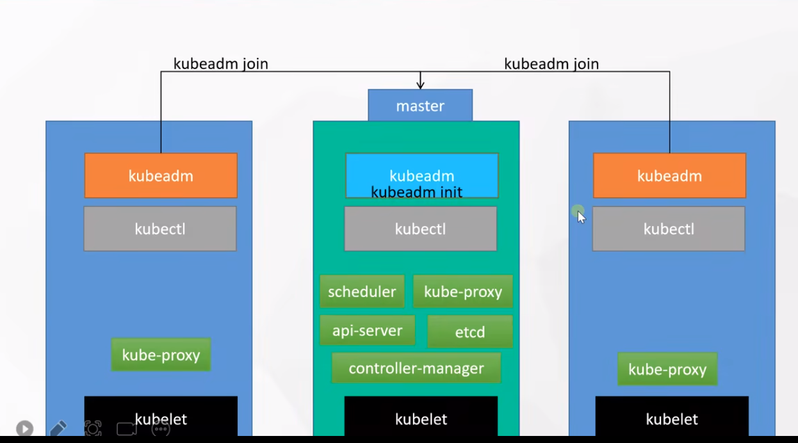
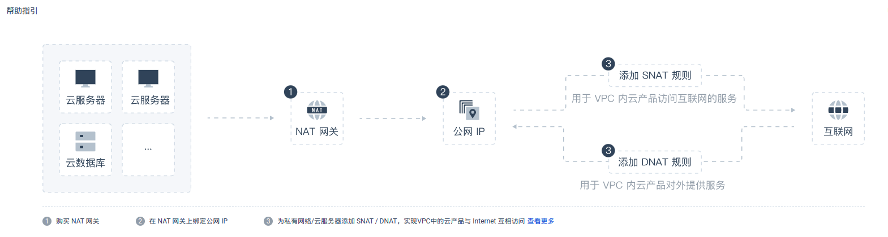
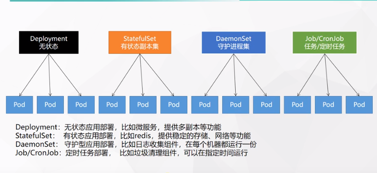
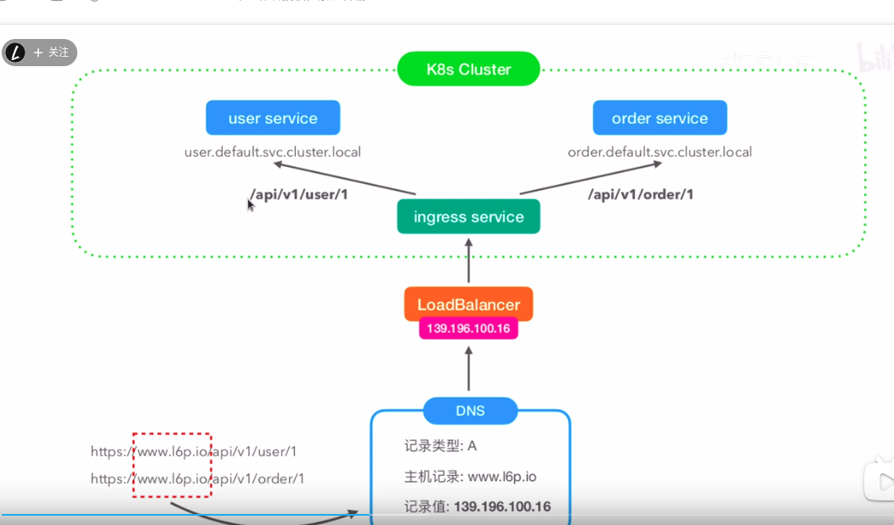
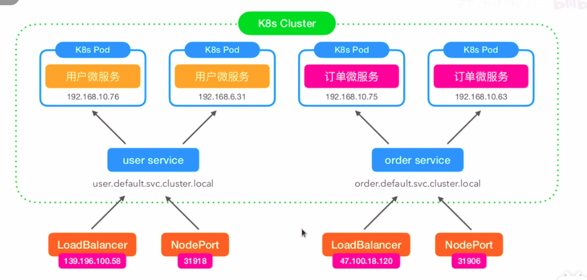
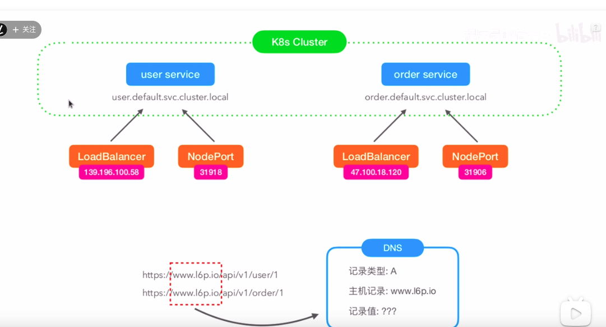
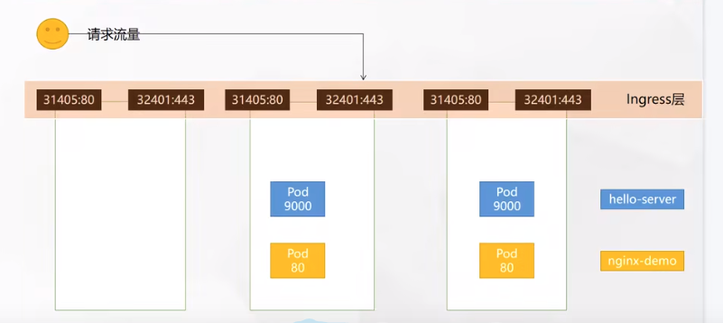
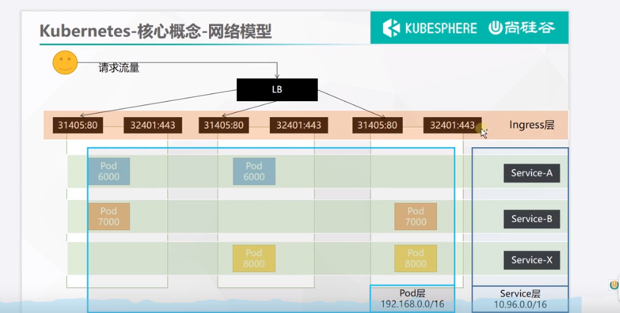

# k8s 集群安装



## 准备3台云服务器
centos   
云服务器 规划到一个vpc(虚拟私有云网络) 中  
* master  172.31.0.2 
* worker1 172.31.0.3
* worker2 172.31.0.4

> master 上面可以装一个sshpass 用于快速连接其它两个worker

## 配置网络
教程中直接给3台服务器中绑定了3个公网ip，实际生产环境中往往只会配一个公网ip  
这里我们使用nat网关来实现，集群中任意一台机器都可以上网  
  

[青云NAT网关配置文档](https://docsv3.qingcloud.com/network/nat_gateway/quickstart/snat_qs/)  

* SNAT  负责实现内网中 服务器访问公网
* DNAT  负责实现外网 访问内网服务器 （实现是类似端口转发）


## 3台服务器上面装 docker
### 配置yum源
```shell
sudo yum install -y yum-utils
sudo yum-config-manager \
--add-repo \
http://mirrors.aliyun.com/docker-ce/linux/centos/docker-ce.repo

```
### 安装docker
```shell
sudo yum install -y docker-ce docker-ce-cli containerd.io


#以下是在安装k8s的时候使用
yum install -y docker-ce-20.10.7 docker-ce-cli-20.10.7  containerd.io-1.4.6
```


### 启动docker
```shell
systemctl enable docker --now
```
### 配置加速
```shell
sudo mkdir -p /etc/docker
sudo tee /etc/docker/daemon.json <<-'EOF'
{
  "registry-mirrors": ["https://82m9ar63.mirror.aliyuncs.com"],
  "exec-opts": ["native.cgroupdriver=systemd"],
  "log-driver": "json-file",
  "log-opts": {
    "max-size": "100m"
  },
  "storage-driver": "overlay2"
}
EOF
sudo systemctl daemon-reload
sudo systemctl restart docker
```

## kubeadm创建集群

### 设置主机名（非必要）
推荐设置，设置后比较直观的能看到每台机器的角色  
在 master worker1 worker1 分别执行  
```shell
hostnamectl set-hostname k8s-master
hostnamectl set-hostname k8s-worker1
hostnamectl set-hostname k8s-worker2

```

### 基础环境
所有机器执行以下操作  (一下操作都是k8s官方要求做的) 
```shell

# 将 SELinux 设置为 permissive 模式（相当于将其禁用）
sudo setenforce 0
sudo sed -i 's/^SELINUX=enforcing$/SELINUX=permissive/' /etc/selinux/config

#关闭swap
swapoff -a  
sed -ri 's/.*swap.*/#&/' /etc/fstab

#允许 iptables 检查桥接流量
cat <<EOF | sudo tee /etc/modules-load.d/k8s.conf
br_netfilter
EOF

cat <<EOF | sudo tee /etc/sysctl.d/k8s.conf
net.bridge.bridge-nf-call-ip6tables = 1
net.bridge.bridge-nf-call-iptables = 1
EOF
sudo sysctl --system

```

### 安装kubelet、kubeadm、kubectl
```shell
cat <<EOF | sudo tee /etc/yum.repos.d/kubernetes.repo
[kubernetes]
name=Kubernetes
baseurl=http://mirrors.aliyun.com/kubernetes/yum/repos/kubernetes-el7-x86_64
enabled=1
gpgcheck=0
repo_gpgcheck=0
gpgkey=http://mirrors.aliyun.com/kubernetes/yum/doc/yum-key.gpg
   http://mirrors.aliyun.com/kubernetes/yum/doc/rpm-package-key.gpg
exclude=kubelet kubeadm kubectl
EOF


sudo yum install -y kubelet-1.20.9 kubeadm-1.20.9 kubectl-1.20.9 --disableexcludes=kubernetes

sudo systemctl enable --now kubelet
```

### 使用kubeadm引导集群
#### 下载各个机器需要的镜像
```shell
sudo tee ./images.sh <<-'EOF'
#!/bin/bash
images=(
kube-apiserver:v1.20.9
kube-proxy:v1.20.9
kube-controller-manager:v1.20.9
kube-scheduler:v1.20.9
coredns:1.7.0
etcd:3.4.13-0
pause:3.2
)
for imageName in ${images[@]} ; do
docker pull registry.cn-hangzhou.aliyuncs.com/lfy_k8s_images/$imageName
done
EOF
   
chmod +x ./images.sh && ./images.sh
```
#### 初始化主节点
```shell

#所有机器添加master域名映射，以下需要修改为自己的
echo "172.31.0.2  cluster-endpoint" >> /etc/hosts


#主节点初始化
kubeadm init \
--apiserver-advertise-address=172.31.0.2 \
--control-plane-endpoint=cluster-endpoint \
--image-repository registry.cn-hangzhou.aliyuncs.com/lfy_k8s_images \
--kubernetes-version v1.20.9 \
--service-cidr=10.96.0.0/16 \
--pod-network-cidr=192.168.0.0/16

#所有网络范围不重叠

# 输出
Your Kubernetes control-plane has initialized successfully!

To start using your cluster, you need to run the following as a regular user:

  mkdir -p $HOME/.kube
  sudo cp -i /etc/kubernetes/admin.conf $HOME/.kube/config
  sudo chown $(id -u):$(id -g) $HOME/.kube/config

Alternatively, if you are the root user, you can run:

  export KUBECONFIG=/etc/kubernetes/admin.conf

You should now deploy a pod network to the cluster.
Run "kubectl apply -f [podnetwork].yaml" with one of the options listed at:
  https://kubernetes.io/docs/concepts/cluster-administration/addons/

You can now join any number of control-plane nodes by copying certificate authorities
and service account keys on each node and then running the following as root:

  kubeadm join cluster-endpoint:6443 --token 2814mk.x9qrs7s68zgpvp4b \
    --discovery-token-ca-cert-hash sha256:5302308d2acb78fd732fa569daaeba074e0ca49006965d832e4eaa23f884dde7 \
    --control-plane 

Then you can join any number of worker nodes by running the following on each as root:

kubeadm join cluster-endpoint:6443 --token 2814mk.x9qrs7s68zgpvp4b \
    --discovery-token-ca-cert-hash sha256:5302308d2acb78fd732fa569daaeba074e0ca49006965d832e4eaa23f884dde7

```

1. 指定配置文件  
```shell
  mkdir -p $HOME/.kube
  sudo cp -i /etc/kubernetes/admin.conf $HOME/.kube/config
  sudo chown $(id -u):$(id -g) $HOME/.kube/config
```
2. 安装网络组件
```shell
curl https://docs.projectcalico.org/archive/v3.20/manifests/calico.yaml -O

kubectl apply -f calico.yaml

```

#### 加入work节点
```shell
kubeadm join cluster-endpoint:6443 --token 2814mk.x9qrs7s68zgpvp4b \
    --discovery-token-ca-cert-hash sha256:5302308d2acb78fd732fa569daaeba074e0ca49006965d832e4eaa23f884dde7
```
> 这里注意 云服务器 我是先后创建的导致安全组用的不是一个，导致节点在加入集群的时候和master的6443端口的通信问题

> 新令牌
kubeadm token create --print-join-command


高可用部署方式，也是在这一步的时候，使用添加主节点的命令即可


####  验证集群 
```shell
kubectl get nodes 
```

## 部署dashboard
### 部署 
```shell
kubectl apply -f https://raw.githubusercontent.com/kubernetes/dashboard/v2.3.1/aio/deploy/recommended.yaml 
```
### 设置访问端口
```shell
kubectl edit svc kubernetes-dashboard -n kubernetes-dashboard
```
> type: ClusterIP 改为 type: NodePort

```shell
kubectl get svc -A |grep kubernetes-dashboard
```
> 找到端口，在安全组放行

### 创建访问账号
dash.yaml
```shell
#创建访问账号，准备一个yaml文件； vi dash.yaml
apiVersion: v1
kind: ServiceAccount
metadata:
  name: admin-user
  namespace: kubernetes-dashboard
---
apiVersion: rbac.authorization.k8s.io/v1
kind: ClusterRoleBinding
metadata:
  name: admin-user
roleRef:
  apiGroup: rbac.authorization.k8s.io
  kind: ClusterRole
  name: cluster-admin
subjects:
- kind: ServiceAccount
  name: admin-user
  namespace: kubernetes-dashboard
```
### 令牌访问
```shell
#获取访问令牌
kubectl -n kubernetes-dashboard get secret $(kubectl -n kubernetes-dashboard get sa/admin-user -o jsonpath="{.secrets[0].name}") -o go-template="{{.data.token | base64decode}}"
```

# 核心实战
## Namespace
名称空间，用来对集群资源进行隔离划分，默认只隔离资源，不隔离网络
```shell
kubectl create ns hello
kubectl delete ns hello 
```

```yaml
apiVersion: v1
kind: Namespace
metadata:
  name: hello
```
## Pod
运行中的一组容器，Pod是k8s中应用的最小单位
```shell
kubectl run mynginx --image=nginx

# 查看default名称空间的Pod
kubectl get pod 
# 描述
kubectl describe pod 你自己的Pod名字
# 删除
kubectl delete pod Pod名字
# 查看Pod的运行日志
kubectl logs Pod名字

# 每个Pod - k8s都会分配一个ip
kubectl get pod -owide
# 使用Pod的ip+pod里面运行容器的端口
curl 192.168.169.136

# 集群中的任意一个机器以及任意的应用都能通过Pod分配的ip来访问这个Pod


```

```yaml
apiVersion: v1
kind: Pod
metadata:
  labels:
    run: mynginx
  name: mynginx
#  namespace: default
spec:
  containers:
  - image: nginx
    name: mynginx

```

一个pod多个容器  

```yaml
apiVersion: v1
kind: Pod
metadata:
  labels:
    run: myapp
  name: myapp
spec:
  containers:
  - image: nginx
    name: nginx
  - image: tomcat:8.5.68
    name: tomcat
```

> watch -n 1 kubectl get pods   每隔1秒执行一次 kubectl get pods

## Deployment
控制pod,使Pod拥有多副本，自愈、扩容等能力。  
```yaml
# 清除所有Pod，比较下面两个命令有何不同效果？
kubectl run mynginx --image=nginx

kubectl create deployment mytomcat --image=tomcat:8.5.68
# 自愈能力
```

### 多副本
```shell
kubectl create deployment my-dep --image=nginx --replicas=3
```

```yaml
apiVersion: apps/v1
kind: Deployment
metadata:
  labels:
    app: my-dep
  name: my-dep
spec:
  replicas: 3
  selector:
    matchLabels:
      app: my-dep
  template:
    metadata:
      labels:
        app: my-dep
    spec:
      containers:
      - image: nginx
        name: nginx
```


### 扩缩容
```shell
kubectl scale --replicas=5 deployment/my-dep
```
```yaml
kubectl edit deployment my-dep

#修改 replicas
```


### 自愈&故障转移
* 停机
* 删除Pod
* 容器崩溃

### 滚动更新
```shell
kubectl set image deployment/my-dep nginx=nginx:1.16.1 --record
kubectl rollout status deployment/my-dep
```

```yaml
# 修改 kubectl edit deployment/my-dep
```

### 版本回退
```shell
#历史记录
kubectl rollout history deployment/my-dep


#查看某个历史详情
kubectl rollout history deployment/my-dep --revision=2

#回滚(回到上次)
kubectl rollout undo deployment/my-dep

#回滚(回到指定版本)
kubectl rollout undo deployment/my-dep --to-revision=2
```



> 更多：
除了Deployment，k8s还有 StatefulSet 、DaemonSet 、Job  等 类型资源。我们都称为 工作负载。
有状态应用使用  StatefulSet  部署，无状态应用使用 Deployment 部署
https://kubernetes.io/zh/docs/concepts/workloads/controllers/


## Service
将一组 Pods 公开为网络服务的抽象方法  
```shell
#暴露Deploy
kubectl expose deployment my-dep --port=8000 --target-port=80

#使用标签检索Pod
kubectl get pod -l app=my-dep
```
> k8s 服务域名的构成方式： 服务名.名称空间.svc

```yaml
apiVersion: v1
kind: Service
metadata:
  labels:
    app: my-dep
  name: my-dep
spec:
  selector:
    app: my-dep
  ports:
  - port: 8000
    protocol: TCP
    targetPort: 80
```

### ClusterIP
```shell
# 等同于没有--type的
kubectl expose deployment my-dep --port=8000 --target-port=80 --type=ClusterIP
```
```yaml
apiVersion: v1
kind: Service
metadata:
  labels:
    app: my-dep
  name: my-dep
spec:
  ports:
  - port: 8000
    protocol: TCP
    targetPort: 80
  selector:
    app: my-dep
  type: ClusterIP
```
### NodePort
```shell
kubectl expose deployment my-dep --port=8000 --target-port=80 --type=NodePort
```

```yaml
apiVersion: v1
kind: Service
metadata:
  labels:
    app: my-dep
  name: my-dep
spec:
  ports:
  - port: 8000
    protocol: TCP
    targetPort: 80
  selector:
    app: my-dep
  type: NodePort

```

## Ingress
Service 的统一网关入口  


### 安装
```shell
wget https://raw.githubusercontent.com/kubernetes/ingress-nginx/controller-v0.47.0/deploy/static/provider/baremetal/deploy.yaml

#修改镜像
vi deploy.yaml
#将image的值改为如下值：
registry.cn-hangzhou.aliyuncs.com/lfy_k8s_images/ingress-nginx-controller:v0.46.0

# 检查安装的结果
kubectl get pod,svc -n ingress-nginx

# 最后别忘记把svc暴露的端口要放行
```
> 如果下载不到，用这个文件  [ingress.yaml](云原生实战/ingress.yaml)



ingress 主要解决几个问题  
* 使用NodePort 方式暴露服务，带来的端口占用问题
* 使用LoadBalancer 绑定公网ip带来的费用以及多ip管理问题
### 测试

```yaml
apiVersion: apps/v1
kind: Deployment
metadata:
  name: hello-server
spec:
  replicas: 2
  selector:
    matchLabels:
      app: hello-server
  template:
    metadata:
      labels:
        app: hello-server
    spec:
      containers:
      - name: hello-server
        image: registry.cn-hangzhou.aliyuncs.com/lfy_k8s_images/hello-server
        ports:
        - containerPort: 9000
---
apiVersion: apps/v1
kind: Deployment
metadata:
  labels:
    app: nginx-demo
  name: nginx-demo
spec:
  replicas: 2
  selector:
    matchLabels:
      app: nginx-demo
  template:
    metadata:
      labels:
        app: nginx-demo
    spec:
      containers:
      - image: nginx
        name: nginx
---
apiVersion: v1
kind: Service
metadata:
  labels:
    app: nginx-demo
  name: nginx-demo
spec:
  selector:
    app: nginx-demo
  ports:
  - port: 8000
    protocol: TCP
    targetPort: 80
---
apiVersion: v1
kind: Service
metadata:
  labels:
    app: hello-server
  name: hello-server
spec:
  selector:
    app: hello-server
  ports:
  - port: 8000
    protocol: TCP
    targetPort: 9000
```

#### 域名访问
```yaml
apiVersion: networking.k8s.io/v1
kind: Ingress  
metadata:
  name: ingress-host-bar
spec:
  ingressClassName: nginx
  rules:
  - host: "hello.atguigu.com"
    http:
      paths:
      - pathType: Prefix
        path: "/"
        backend:
          service:
            name: hello-server
            port:
              number: 8000
  - host: "demo.atguigu.com"
    http:
      paths:
      - pathType: Prefix
        path: "/nginx"  # 把请求会转给下面的服务，下面的服务一定要能处理这个路径，不能处理就是404
        backend:
          service:
            name: nginx-demo  ## java，比如使用路径重写，去掉前缀nginx
            port:
              number: 8000
```
> ingress 的404 和 nginx-demo 的404 不同


#### 路径重写
```yaml
apiVersion: networking.k8s.io/v1
kind: Ingress  
metadata:
  annotations:
    nginx.ingress.kubernetes.io/rewrite-target: /$2
  name: ingress-host-bar
spec:
  ingressClassName: nginx
  rules:
  - host: "hello.atguigu.com"
    http:
      paths:
      - pathType: Prefix
        path: "/"
        backend:
          service:
            name: hello-server
            port:
              number: 8000
  - host: "demo.atguigu.com"
    http:
      paths:
      - pathType: Prefix
        path: "/nginx(/|$)(.*)"  # 把请求会转给下面的服务，下面的服务一定要能处理这个路径，不能处理就是404
        backend:
          service:
            name: nginx-demo  ## java，比如使用路径重写，去掉前缀nginx
            port:
              number: 8000
```
#### 流量限制
```yaml
apiVersion: networking.k8s.io/v1
kind: Ingress
metadata:
  name: ingress-limit-rate
  annotations:
    nginx.ingress.kubernetes.io/limit-rps: "1"
spec:
  ingressClassName: nginx
  rules:
  - host: "haha.atguigu.com"
    http:
      paths:
      - pathType: Exact
        path: "/"
        backend:
          service:
            name: nginx-demo
            port:
              number: 8000
```
> Exact 为精确匹配

### k8s 网络模型
k8s 中网络模型有三层，分别是ingress/service/pod     

流量通过负载均衡到达ingress 再通过ingress 到达service ,通过service负载均衡最后抵达pod  


## 存储抽象


# 参考
https://www.yuque.com/leifengyang/oncloud/ctiwgo  

https://www.bilibili.com/video/BV13Q4y1C7hS?spm_id_from=333.337.search-card.all.click&vd_source=826416428f883a4b1c119869d5a0983b