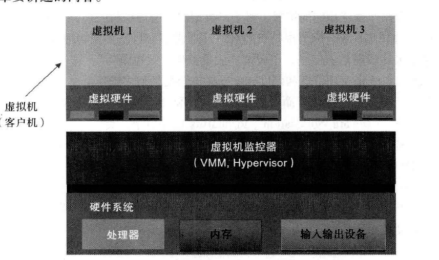
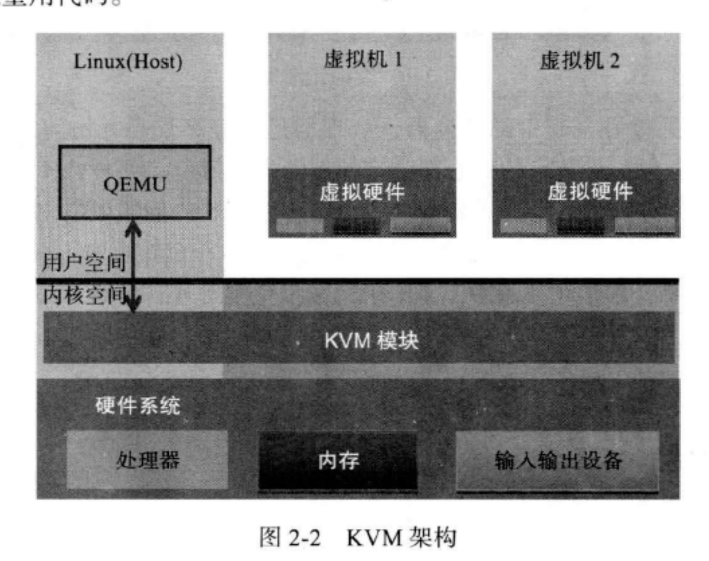

# 虚拟化与云计算
## 云计算
云计算是一种通过因特网以服务的方式提供的动态的可伸缩的虚拟化资源的计算模式。  
资源包括：网络，服务器，存储，应用软件和服务      
云计算也可以认为是分布式计算的一种。  

提供资源的网络被称谓“云”，“云”中的资源在使用者看来是可以无限扩展的，并可以随时获取，按需使用。

<!--more-->

## 虚拟化
虚拟化是一个广义的术语，是指计算元件在虚拟的基础上而不是在真实的基础上运行，是一个为了简化管理，优化资源的解决方案。  

### 虚拟化的方案
* 软件方案 纯软件的方法在现有的物理平台上（往往是不支持硬件虚拟化）实现对物理平台访问的截获和模拟 例如 QEMU
* 硬件方案 物理平台本身提供了对特殊指令的截获和重定向的硬件支持  

### 准虚拟化与全虚拟化
* 准虚拟化 为提升“软件虚拟化方案”的性能问题，而改造客户机操作系统  例如 Xen
* 全虚拟化 为客户机提供完整的虚拟X86平台，包括处理器内存外设，支持运行任何理论上可在真实的物理平台上运行的操作系统。 

### 虚拟机实现方案
* KVM 基于虚拟化扩展（Intel VT或AMD-V）的X86硬件，是Linux完全原生的虚拟化解决方案。  
* Xen 微内核准虚拟化的实现方案
* VMWare 基于软件的全虚拟化解决方案 
* VirtualBox 即支持纯软件虚拟化，也支持硬件虚拟化
* Hyper-V 微软的

### 虚拟机的架构 类型一和类型二
#### 类型一
虚拟机在上电之后首先加载运行虚拟机监控程序，而传统的操作系统则运行在其创建的虚拟机中。  包括：  
* 开源的虚拟化软件Xen
* 商业软件VMWare ESX/ESXi
* 微软的Hyper-V

#### 类型二
虚拟机监控程序，在系统上电之后仍然运行一般的操作系统（宿主机操作系统），虚拟机监控程序作为特殊的应用程序，可视为操作系统功能的扩展  
包括： 
* VMWare Workstation
* VirtualBox 
* KVM 

# KVM 原理
## Linux简介
单内核与微内核   
Linux 内核为单内核，采用微内核的设计：模块化设计以及动态加载内核模块的能力  

## 虚拟化模型
在物理系统基础之上，与传统的操作系统模型不同，运行的是虚拟机监控器（VMM或者Hypervisor）    
虚拟机监控器的主要职能是 管理真实的物理硬件平台，并为每个虚拟客户机提供对应的硬件虚拟平台  

## KVM 架构
kvm 为类型二的虚拟机    
在KVM 架构中，虚拟机实现为常规的Linux进程，由标准的Linux调度程序进行调度。  
事实上，每个虚拟CPU显示为一个常规的Linux进程，这使得KVM能够享受Linux内核的所有功能，最大程序重用Linux内核代码   

KVM 本身不执行任何模拟，需要用户空间程序通过 /dev/kvm 接口设置一个客户机虚拟服务器的地址空间，向他提供模拟I/O, 并将它的视频显示映射回
宿主机的显示屏，这个应用程序就是QEMU（Quick Emulator）

QEMU使用虚拟机技术，将目标架构的指令集、内存和硬件设备等进行模拟，并通过内存映射来实现对目标系统的访问

## KVM模块
KVM模块是KVM虚拟机的核心部分，功能是初始化CPU硬件，打开虚拟化模式，然后将虚拟客户机运行在虚拟机的模式下，并对客户机的运行提供一定的支持。  

KVM 使用QEMU作为用户空间程序的实现

## QEMU模块
QEMU本身是一套完整的虚拟机实现，包括处理器虚拟化，内存虚拟化，以及KVM使用到的虚拟设备模拟（网卡，显卡，存储控制器和硬盘等）

QEMU 借助于KVM的虚拟化功能，为自己的虚拟机提供硬件虚拟化的加速，从而极大提高虚拟机的性能。 

> QEMU与KVM结合是目前最成熟的方案  

# KVM环境搭建

