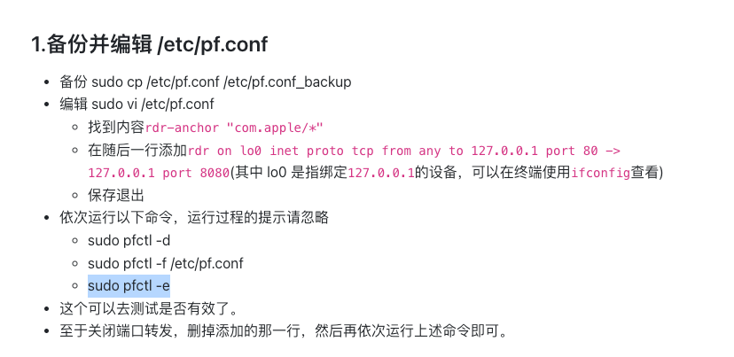
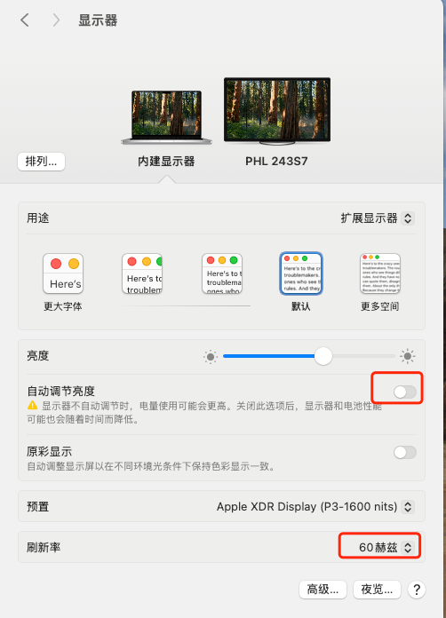

# docker安装
orbStack 


# 解决brew install 缓慢问题
## 首次安装
```shell
curl https://raw.githubusercontent.com/Homebrew/install/master/install.sh  > install-brew.sh
```
然后,在下载的文件中, 修改BREW_REPO为:  
```shell
BREW_REPO="https://mirrors.ustc.edu.cn/brew.git"
```

最后, 运行:  
```shell
HOMEBREW_CORE_GIT_REMOTE=https://mirrors.ustc.edu.cn/homebrew-core.git bash install-brew.sh
```

## 已经安装  
```shell
cd "$(brew --repo)"
git remote set-url origin https://mirrors.ustc.edu.cn/brew.git

echo 'export HOMEBREW_BOTTLE_DOMAIN=https://mirrors.ustc.edu.cn/homebrew-bottles' >> ~/.bash_profile
source ~/.bash_profile

cd "$(brew --repo)/Library/Taps/homebrew/homebrew-core"
git remote set-url origin https://mirrors.ustc.edu.cn/homebrew-core.git
```


# 命令自动补全 
```shell
git clone https://github.com/zsh-users/zsh-autosuggestions ${ZSH_CUSTOM:-~/.oh-my-zsh/custom}/plugins/zsh-autosuggestions
```
vim .zshrc 写入
```
plugins=(git zsh-autosuggestions)
```

## git命令 自动补全
```shell
brew install bash-completion
mkdir .zsh_fpath
curl https://raw.githubusercontent.com/git/git/master/contrib/completion/git-completion.zsh \
-o ~/.zsh_fpath/.git-completion.zsh
```
vim .zshrc 内容如下  
```
zstyle ':completion:*:*:git:*' script ~/.zsh_fpath/.git-completion.zsh
fpath=(~/.zsh_fpath $fpath)
autoload -Uz compinit && compinit
```


# 安装ab压测工具
## 先安装三个工具 
```shell
brew install apr
brew install apr-util
brew install prce
```

> 注意根据输出更新 ~/.zshrc 以及对应环境变量

## 下载httpd
https://httpd.apache.org/download.cgi#apache24  
解压进行 httpd目录   
```
./configure
make  
sudo make install 

# 测试
ab -v
```

# mac 添加 ssh-agent
现象：当我用golang代码通过sshtunnel 通过跳板机连接数据库的时候，报错 认证失败  
原因：我本地mac 机器没有添加ssh client    
解决： 
```
eval 'ssh-agent'
ssh-add ~/.ssh/id_rsa
```


# 如何在mac根目录下创建目录
1. 进入/User/xxxxxx/下并创建data文件夹
    ```
    cd /User/xxxxxxx/
    sudo mkdir data
    sudo chmod -R 777 /data
    ```
2. 打开synthetic.conf并写入以下内容，注意data和/System/Volumes/Data/data之间是tab不是空格
    ```
    sudo vim /etc/synthetic.conf
    data    /User/xxxxxxx/data
    ```
3. 重启电脑   


# mac下端口转发



# m1 macbook pro连接扩展屏幕会闪屏

1. 关闭自动调节亮度
2. 内建显示屏刷效率固定为60Hz (有时候系统更新后会改这个值，重新设置回来就好)
3. 扩展显示器刷行率固定为60HZ
4. 扩展显示器颜色描述文件选择RGB


