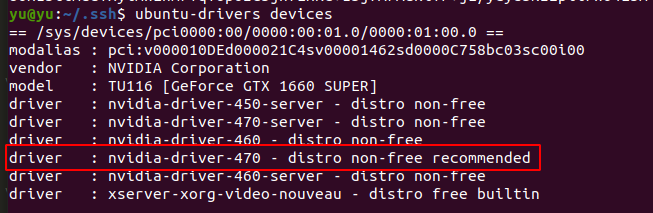
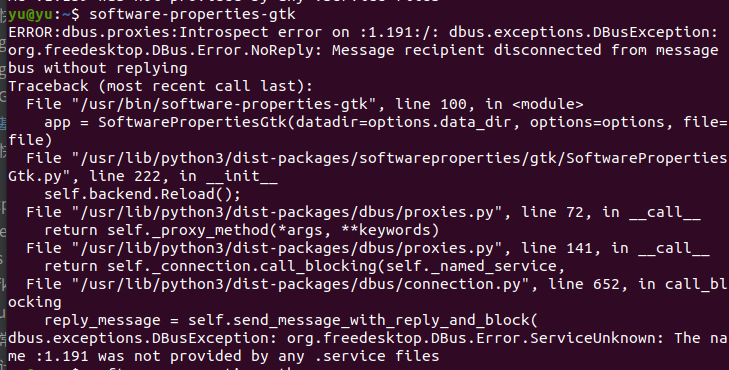

---
categories:
- linux
tags:
- linux问题
---


# cat 
* cat mysql.conf | grep -v "#" | grep -v "^$" 查看未被注释掉的行 

# 生成随机密码
date +%s |sha256sum |base64 |head -c 10 ;echo

# 检查端口状态
```
netstat -Aaln | grep 9090
```

# nohup
```
nohup ./lwyfront >/dev/null 2>log &
```

# ubuntu 变更默认执行环境dash => bash
在安装华为seo-client(vpn)时候遇到的
```
sudo dpkg-reconfigure dash #选否
ll /bin/sh #查看
```

# sshpass 命令行带密码登录  
配置自定义命令，实现快速登录服务器
```
sshpass -p "XXX" ssh user@IP
```

# ubuntu解压windows生成的zip文件时乱码问题
```
unzip -O CP936 xxx.zip
```

# https 证书生成

```
openssl req -newkey rsa:4096 \
            -x509 \
            -sha256 \
            -days 3650 \
            -nodes \
            -out example.crt \
            -keyout example.key
```

# ubuntu20.04 频繁卡死重启
NVIDIA 独立显卡在ubuntu中使用其默认驱动，不兼容，导致频繁死机重启   
解决办法，为独立显卡安装官方驱动:  
1. ubuntu-drivers devices  #查询驱动
选择recommended 推荐驱动

2. sudo apt install nvidia-driver-470 #安装驱动  
3. sudo reboot # 重启  
4. nvidia-smi # 查看显卡状态  
> 参考 https://www.modb.pro/db/159765

# 更新软件出现没有公钥的错误
sudo apt-key adv --keyserver keyserver.ubuntu.com --recv-keys 公钥
# 清理ubuntu apt中不用的源
sudo vim /etc/apt/sources.list

# software-properties-gtk 不可用

```shell 
sudo apt install --reinstall python3-urllib3 python3-six python3-certifi python3-requests  
```
我是在更新了python3-requests  解决了问题


# 在升级ubuntu22.04后公司的vpn不可用
因为升级过后，vpn的 tls-cipher 策略等级提升了，不支持简单的ca ，需要在office.ovpn 中加入 
``` bash
tls-cipher "DEFAULT:@SECLEVEL=0"
cipher BF-CBC
# 同时给openvpn加入sudo ，否则被报权限缺失
sudo chmod u+s $(which openvpn)
```


# 企业微信
```shell
wget -O- https://deepin-wine.i-m.dev/setup.sh | sh
sudo apt install com.qq.weixin.work.deepin
# 注释 /opt/apps/com.qq.weixin.work.deepin/files/run.sh 文件第24和26行，企业微信运行正常。
```

# 扩容磁盘 
背景： 测试环境在使用graylog 的时候，磁盘被沾满了，  原磁盘 /dev/vdc 200G  /dev/vdc1 100G  
将 /dev/vdc1 分区扩容到  200G  
只有一个分区 /dev/vdc1
```shell
umount  /dev/vdc   
# umount 可能会遇到 /mnt: target is busy   安装psmisc工具解决

 
fdisk /dev/vdc  
p 
d 
n 
w


```
参考 : https://www.jianshu.com/p/5ea2e5cc936c