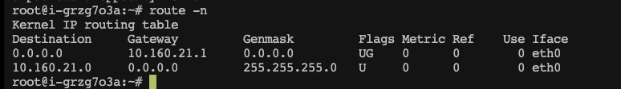

网络IO模型丨TCP/IP协议 三次握手与四次挥手丨HTTPS底层原理丨SOCKET丨多路复用丨操作系统

<!--more-->

# TCP/IP协议

## 简介
### OSI(Open System Interconnect)7层网络参考模型
1. 应用层
2. 表示层
3. 会话层
4. 传输层 三次握手，传输数据，四次挥手
5. 网络层 路由器 ip
6. 数据链路层  节点，
7. 物理层 交换机/mac

### 实际的5层网络模型
参考模型是架构上的分层 实际应用中分为5层   
1. 应用层 （程序控制）
2. 传输层 （内核控制）TCP 包
3. 网络层 （内核控制）IP
4. 数据链路层 （内核控制）MAC
5. 物理层 （内核控制）

内核将网路中的数据放到Recv-Q 中等待程序读取  

### 常见的应用层协议
1. HTTP（Hyper Text Transfer Protocol，超文本传输协议）：用于从万维网（WWW）服务器传输超文本到本地浏览器的传送协议，可以传输普通文本、超文本、音频和视频等数据。
2. FTP（File Transfer Protocol，文件传输协议）：用于在网络上进行文件传输的一套标准协议，它使用TCP可靠的运输服务。FTP允许用户以文件操作的方式（如文件的增、删、改、查、传送等）与另一主机相互通信。
3. SMTP（Simple Mail Transfer Protocol，简单邮件传输协议）：用于发送电子邮件的TCP/IP协议，它是一组用于由源地址到目的地址传送邮件的规则，由它来控制信件的中转方式。
4. POP3（Post Office Protocol 3，邮局协议3）：用于接收电子邮件的协议，它规定怎样将个人计算机连接到Internet的邮件服务器和下载电子邮件的电子协议。
5. Telnet：远程终端协议，允许用户通过网络在远程计算机上进行登录，并进行工作。
6. DHCP（Dynamic Host Configuration Protocol，动态主机配置协议）：是一个局域网的网络协议，使用UDP协议工作，主要有两个用途：给内部网络或网络服务供应商自动分配IP地址，给用户或者内部网络管理员作为对所有计算机作中央管理的手段。
7. NTP（Network Time Protocol，网络时间协议）：是用来使网络中的各个计算机时间同步的一种协议。
8. SNMP（Simple Network Management Protocol，简单网络管理协议）：用于网络管理的协议，它定义了管理站和代理之间所交换的分组格式。
9. DNS(Domain Name System，域名系统) 它用于将域名转换为IP地址

## 传输控制层
### TCP
面向**连接**，**可靠**的,基于字节流的传输层通信协议  

#### TCP面向连接的，怎么理解这个连接  
连接本质的数据结构，资源的开辟    

TCP 建立连接的本质是在客户端和服务端各自维护一定的数据结构（一种状态机），来记录和维护这个“连接”的状态  

发送数据之前，双方需要先进行一系列的握手操作，以初始化并建立连接状态。这个过程被称为三次握手。

#### TCP是可靠的，怎么理解这个可靠
1. **数据完整性**：TCP协议通过校验、序号、确认和重传等机制确保数据的完整性。每个TCP报文段都包含校验和，用于检查数据在传输过程中是否发生了错误。同时，每个报文段都有一个序号，接收方会按照序号顺序接收数据，确保数据的顺序性。如果接收方发现数据有误或丢失，会要求发送方重新发送，这就是重传机制。
2. **面向连接**：TCP是面向连接的协议，这意味着在通信开始之前，必须建立连接。这种连接状态确保了通信的可靠性，因为只有在连接建立成功后，数据才会开始传输。这种连接状态还使得发送方和接收方都可以确认对方的存在和接收能力，从而进一步增强了通信的可靠性。
3. **确认应答机制**：TCP使用确认应答机制来确保数据的可靠传输。当接收方收到数据后，它会向发送方发送一个确认报文，告知发送方数据已成功接收。如果发送方在一段时间内未收到确认报文，它会认为数据丢失并重新发送数据。
4. **流量控制和拥塞控制**：TCP还使用流量控制和拥塞控制机制来确保数据的可靠传输。流量控制允许接收方控制发送方的发送速率，以防止接收方缓冲区溢出。拥塞控制则用于避免网络拥塞，当网络出现拥塞时，TCP会降低发送速率，以减轻网络负担。


#### 三次握手
1. A > SYN  > B  请求建立连接
2. A < SYN+ACK < B  告诉客户端可以创建
3. A > ACK > B 客户端创建完成，响应给ACK给服务端，完成连接建立

#### SOCKET
* 套接字     
* 四元组  ip:port + ip:port   
* 操作系统最多有65535个端口  

一个客户端与服务器最多建立多少个TCP？   
由于客户端端口是65535个，所以客户端最多建立65535个连接 ，服务端只监听了一个端口，服务端可以建立无数个，取决于硬件资源（内存）   

一个客户端已经和服务器建立建立的情况下，是否可以和这个服务器的其它端口建立连接（端口是否可以重用）？  
可以，四元组的唯一性

既然一个客户端和服务器最多建立65535个连接，那如果想实现十万/百万连接如何处理？    
增加ip地址，一个网卡可以增加多个ip地址，（还是四元组的唯一性）

#### 四次挥手
客户端和服务端断开连接（释放资源）  
1. A > FIN > B
2. A < FIN+ ACK < B  收到断开请求，做清理工作
3. A < FIN < B 服务端做完清理工作，确认断开
4. A > ACK > B 客户端处理完清理工作，确认断开


> 三次握手和四次挥手均由linux内核完成

## 网络层

### 名词解释
* IP 点分字节
* 子网掩码 与IP进行按位与，计算出局域网中的主机号
* 路由表， 存储下一跳的ip

通过arp找出下一跳ip的mac地址，交由数据链路层  

子网掩码的作用感觉应该是实现 局域网内的节点直接通信，而不需要经过下一跳。

## 链路层
链路层通过mac地址通信  

* C 局域网节点
* R 路由器
* ISP 运营商节点
* S 目标节点
* SIP 目标地址ip

整个通信的过程中SIP不回发生改变，而是结合子网掩码和路由表找出下一跳的ip，然后获取到下一跳的mac地址，结构好似链表一样，所以叫链路层  

## 负载均衡lvs
高并发场景下需要由负载均衡来分散流量
### 四层负载均衡
对应着网络模型中的四层，lvs服务器只负责转发数据包，而不会和客户端建立连接，弊端：
1. 因四层的负载均衡器，面向的是数据包，只能进行无差别转发  
2. 后端服务和client直接握手，TCP没法复用，随着客户端变多，比较消耗资源

### 七层负载均衡
对应网络模型的七层，lvc服务器与客户端建立tcp连接，可以根据业务来转发流量


# 计算机组成


计算机是由CPU,内存，一系列的IO设备，磁盘，网卡硬件设备组成

## 可执行程序
可执行程序是CPU的指令集，是文件，存储在磁盘上   
可执行程序文件被加载进内存，则是进程

## Linux Kernel  
Linux Kernel 操作系统的第一个程序，使用这个程序的对象是程序员。   
程序员实现的app 通过API 调用Linux Kernel   
内核向下管理硬件设备

如果任意程序，可以执行任意指令，访问任意内存，那么就会出现程序A就可以恶意串改内核程序的内存空间，影响整个系统的征程运行。为解决此问题
CPU运行时包含两种模式 实模式和保护模式  
* 实模式，CPU 可以执行任何指令，访问任何内存地址
* 保护模式，CPU 执行部分指令，访问部分内存

内核作为第一个程序被加载进内存时，运行在实模式下，通过GDT（全局描述表）声明全局空间（Linux Kernel程序所占用的空间），从这个空间读取到的指令可
以完全访问内存，此外空间的指令，不允许访问GDT，声明的内存空间

实模式和保护模式，所能操作的空间，就是内核空间和用户应用程序的空间，对应着内核态和用户态


### 有GDT的保护，程序如何访问Kernel?
中断机制  
Kernel在加载的时候会生成IDT(中断描述符表) ，一个字节，存储255种中断   
CPU从中断表中取出callback的函数地址，继续执行。

* 时钟中断: 通过晶振（固定频率）这个硬件，对CPU进行中断
* int 0x80: CPU指令集中断,0x80在IDT中对应序号128，调用内核时，将内核的函数，参数，放到寄存器中，通过中断机制调用128中断对应的函数，来实现对Linux Kernel的调用


### 系统调用
程序想访问硬件，需要借助内核，这个方式叫做系统调用（systemcall），通过中断int 0x80 软中断来实现系统调用   
系统调用保护了Linux Kernel 却浪费了时间

### 抢锁
* 通过系统调用实现，效率较底
* 基于cpu指令集实现CAS，效率很高。


> **CPU不能停止，只能控制他的方向**

> CPU指令集中断，既保护了Linux Kernel程序，又达到了调用的效果。 

> 目前的Linux内核中，大概共有约300个系统调用函数


# IO

IO (Input/Output，输入/输出)即数据的读取（接收）或写入（发送）操作，通常用户进程中的一个完整IO分为两阶段：用户进程空间<-->内核空间、内核空间<-->设备空间（磁盘、网络等）。IO有内存IO、网络IO和磁盘IO三种，通常我们说的IO指的是后两者   
LINUX中进程无法直接操作I/O设备，其必须通过系统调用请求kernel来协助完成I/O动作；内核会为每个I/O设备维护一个缓冲区。  
对于一个输入操作来说，进程IO系统调用后，内核会先看缓冲区中有没有相应的缓存数据，没有的话再到设备中读取，因为设备IO一般速度较慢，需要等待；内核缓冲区有数据则直接复制到进程空间。  
所以，对于一个网络输入操作通常包括两个不同阶段：  
* 等待网络数据到达网卡→读取到内核缓冲区，数据准备好；
* 从内核缓冲区复制数据到进程空间。

5种IO模型分别是阻塞IO模型、非阻塞IO模型、IO复用模型、信号驱动的IO模型、异步IO模型；前4种为同步IO操作，只有异步IO模型是异步IO操作。  

阻塞/非阻塞指的是和内核交互的时候会不会卡住


## 同步阻塞IO(BIO) 

进程发起IO系统调用后，进程被阻塞，转到内核空间处理，整个IO处理完毕后返回进程。操作成功则进程获取到数据。

特点：   
* 进程阻塞挂起不消耗CPU资源，及时响应每个操作；
* 实现难度低、开发应用较容易；
* 适用并发量小的网络应用开发；

不适用并发量大的应用：因为一个请求IO会阻塞进程，所以，得为每请求分配一个处理进程（线程）以及时响应，系统开销大。

## 同步非阻塞IO(NIO)

进程发起IO系统调用后，如果内核缓冲区没有数据，需要到IO设备中读取，进程返回一个错误而不会被阻塞；进程发起IO系统调用后，如果内核缓冲区有数据，内核就会把数据返回进程。  
对于上面的阻塞IO模型来说，内核数据没准备好需要进程阻塞的时候，就返回一个错误，以使得进程不被阻塞。  

Linux Socket 默认是阻塞的方式，声明NONBLOCK设置为非阻塞

特点：
* 进程轮询（重复）调用，消耗CPU的资源；
* 实现难度低、开发应用相对阻塞IO模式较难；
* 适用并发量较小、且不需要及时响应的网络应用开发；


## IO多路复用

多个的进程的IO可以注册到一个复用器（select）上，然后用一个进程调用该select， select会监听所有注册进来的IO；  
如果select没有监听的IO在内核缓冲区都没有可读数据，select调用进程会被阻塞；而当任一IO在内核缓冲区中有可数据时，select调用就会返回；  
而后select调用进程可以自己或通知另外的进程（注册进程）来再次发起读取IO，读取内核中准备好的数据。  
可以看到，多个进程注册IO后，只有另一个select调用进程被阻塞。 

IO多路复用实现有三种方案：select、poll、epoll   
特点：  
* 专一进程解决多个进程IO的阻塞问题，性能好
* 实现、开发应用难度较大；
* 适用高并发服务应用开发：一个进程（线程）响应多个请求；


### select
select 的fd_set通过bitmap 1024位的方式存储fd  
bitmap从用户态拷贝到内核态，由内核态来判断，没有数据变化，select会阻塞，有变化，bitmap的fd会被置位  

缺点：  
1. 1024的大小限制
2. fdset不可重用
3. rset(bitmap) 用户态到内核态的开销
4. 复杂度为O(n)

### poll
poll将要监听的对象存到数组中，且数组中的元素是结构体 
```
struct pollfd
{
    int fd;
    short events;//事件
    short revents;//有变化被置位，什么事件，置为什么事件，最后要将revents重新置为0
}

```
解决了select中 的两个问题  
1. 1024的大小限制
2. fdset不可重用

### epoll
epoll的接口非常简单，一共就三个函数  
* epoll_create：创建一个epoll句柄
* epoll_ctl：向 epoll 对象中添加/修改/删除要管理的连接
* epoll_wait：等待其管理的连接上的 IO 事件

### epoll的边缘触发与水平触发
**水平触发(LT)**  

关注点是数据是否有无，只要读缓冲区不为空，写缓冲区不满，那么epoll_wait就会一直返回就绪，水平触发是epoll的默认工作方式。  

**边缘触发(ET)**

关注点是变化，只要缓冲区的数据有变化，epoll_wait就会返回就绪。
这里的数据变化并不单纯指缓冲区从有数据变为没有数据，或者从没有数据变为有数据，还包括了数据变多或者变少。即当buffer长度有变化时，就会触发。
假设epoll被设置为了边缘触发，当客户端写入了100个字符，由于缓冲区从0变为了100，于是服务端epoll_wait触发一次就绪，服务端读取了2个字节后不再读取。这个时候再去调用epoll_wait会发现不会就绪，只有当客户端再次写入数据后，才会触发就绪。
这就导致如果使用ET模式，那就必须保证要「一次性把数据读取&写入完」，否则会导致数据长期无法读取/写入

### epoll 为什么比select、poll更高效？
* epoll 为什么比select、poll更高效？
* epoll 将文件描述符添加和检测分离，减少了文件描述符拷贝的消耗
  select&poll 调用时会将全部监听的 fd 从用户态空间拷贝至内核态空间并线性扫描一遍找出就绪的 fd 再返回到用户态。下次需要监听时，又需要把之前已经传递过的文件描述符再读传递进去，增加了拷贝文件的无效消耗，当文件描述很多时，性能瓶颈更加明显。
  而epoll只需要使用epoll_ctl添加一次，后续的检查使用epoll_wait，减少了文件拷贝的消耗。

### 总结
select，poll，epoll都是IO多路复用机制，即可以监视多个描述符，一旦某个描述符就绪（读或写就绪），能够通知程序进行相应读写操作。 但select，poll，
epoll本质上都是同步I/O，因为他们都需要在读写事件就绪后自己负责进行读写，也就是说这个读写过程是阻塞的，而异步I/O则无需自己负责进行读写，异步I/O
的实现会负责把数据从内核拷贝到用户空间。  

select，poll实现需要自己不断轮询所有fd集合，直到设备就绪，期间可能要睡眠和唤醒多次交替。而epoll其实也需要调用epoll_wait不断轮询就绪链表，期间
也可能多次睡眠和唤醒交替，但是它是设备就绪时，调用回调函数，把就绪fd放入就绪链表中，并唤醒在epoll_wait中进入睡眠的进程。虽然都要睡眠和交替，但是
select和poll在“醒着”的时候要遍历整个fd集合，而epoll在“醒着”的时候只要判断一下就绪链表是否为空就行了，这节省了大量的CPU时间。这就是回调机制带来的性能提升。

select，poll每次调用都要把fd集合从用户态往内核态拷贝一次，并且要把current往设备等待队列中挂一次，而epoll只要一次拷贝，而且把current往等待队列
上挂也只挂一次（在epoll_wait的开始，注意这里的等待队列并不是设备等待队列，只是一个epoll内部定义的等待队列）。这也能节省不少的开销。

## 异步IO(AIO)

当进程发起一个IO操作，进程返回（不阻塞），但也不能返回果结；内核把整个IO处理完后，会通知进程结果。如果IO操作成功则进程直接获取到数据。  
特点：  
* 不阻塞，数据一步到位
* 需要操作系统的底层支持，LINUX 2.5 版本内核首现，2.6 版本产品的内核标准特性；
* 实现、开发应用难度大；
* 非常适合高性能高并发应用；


# 用过的命令
* nc www.baidu.com 80
* netstat -natp 查看网络连接情况
* ifconfig eth0:33 192.168.150.88/24  新增一块虚拟网卡
* tcpdump -nn -i eth0 port 80  抓包信息,红框中分别代表三次握手和四次挥手

* route -n 查看路由表 目标地址与子网掩码按位与，如果和目标地址Destionation 匹配则为下一跳的地址


* arp -a 查询ip对应的mac地址


# 备注
* ifconfig 命令输出中的MTU 控制报文传输大小通常情况是1500，而最大传输为1460，因为有固定的字节存储ip地址信息等