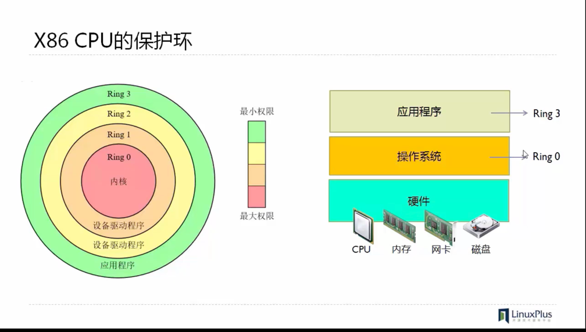
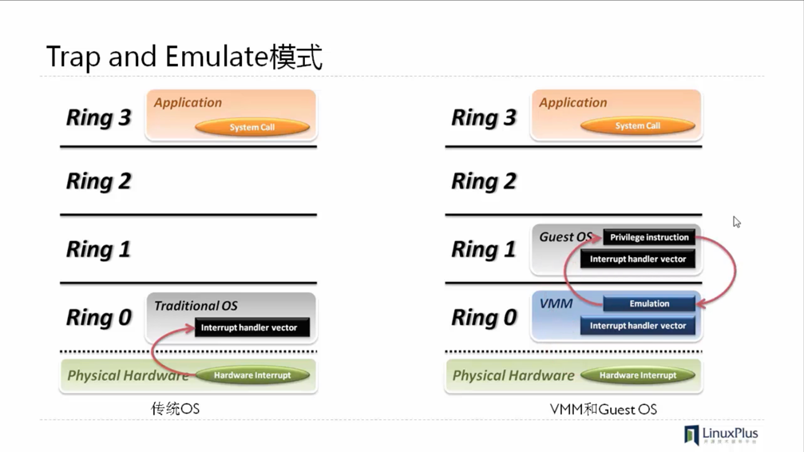
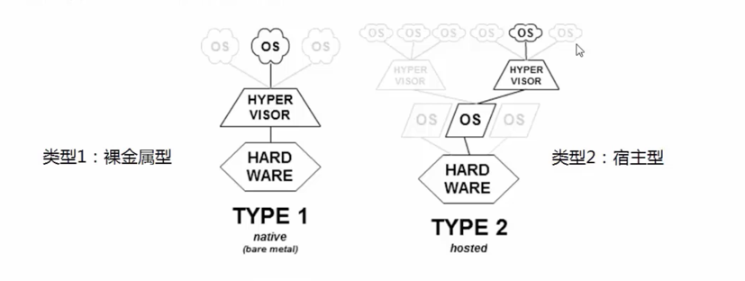

# KVM概述
## 虚拟化的定义
在计算机技术中，虚拟化意味着创建设备或资源的虚拟版本，如服务器，存储设备，网络设备，操作系统等。   

虚拟化技术：
1. 系统虚拟化
2. 存储虚拟化
3. 网络虚拟化
4. GPU虚拟化
5. 软件虚拟化
6. 硬件支持虚拟化

系统虚拟化   
这种虚拟化通常表现为在单一系统上运行多个操作系统。  
这些虚拟操作系统同时运行，每个操作系统又相互独立。  

虚拟化的实现方式有三种：  
1. 纯软件仿真
2. 虚拟化翻译
3. 容器技术

## 纯软件仿真
通过模拟完整的硬件环境来虚拟化来宾平台  
模拟X86,ARM,PowerPC等多种CPU    
效率较低    
产品或方案有： QEMU,Bochs,PearPC

## 虚拟化层翻译
多数的虚拟化采用虚拟机管理程序Hypervisor, 其是一个软件层或子系统，也称为VMM(Virtual Machine Monitor,虚拟机监控器)  
允许多种操作系统在相同的物理系统中运行    
控制硬件并向来宾操作系统提供访问底层硬件的途径，向来宾操作系统提供虚拟化硬件    

     

### 无硬件辅助的全虚拟化  
基于二进制翻译的全虚拟化，Hypervisor运行在Ring0 ,Guest OS 运行在Ring1   
通过异常，捕获，翻译 Guest OS Ring0操作  
示例： 
1. VMware Workstation
2. QEMU
3. Virtual PC

<!--more-->

     

### 半虚拟化    
也称为超虚拟化，操作系统辅助虚拟化    
Hypervisor 运行在Ring0  
Guest OS 不能直接运行在Ring0,需要对其Kernel进行修改，将其运行在Ring0上的指令转为调用Hypervisor   
Guest OS 上的APP运行在Ring3
示例： Xen

### 硬件辅助的全虚拟化   
Intel VT和AMD-V 创建一个新的Ring-1 单独给Hypervisor使用，Guest OS可以直接使用Ring0而无需修改 
示例：
1. VMWare ESXi
2. Microsoft Hyper-v
3. Xen3.0
4. KVM

## LXC和Docker
一种轻量级/操作系统虚拟化方式，由Linux内核支持    
起源： chroot系统调用，对当前程序及其子程序改变根目录   
优势：
1. 更快速的交付和部署
2. 更高效的虚拟化
3. 更轻松的迁移和扩展
4. 更简单的管理

## Hypervisor的分类 
     

