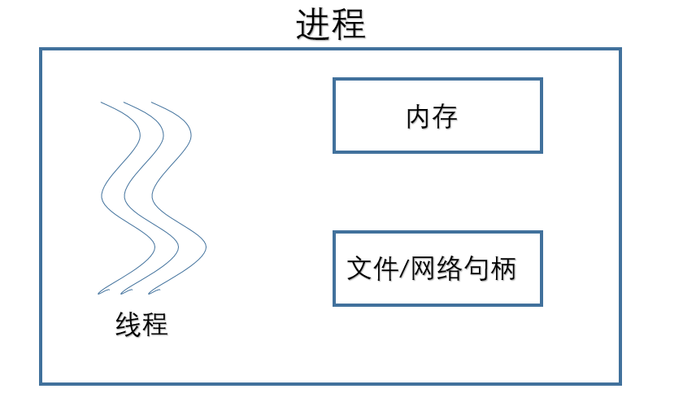
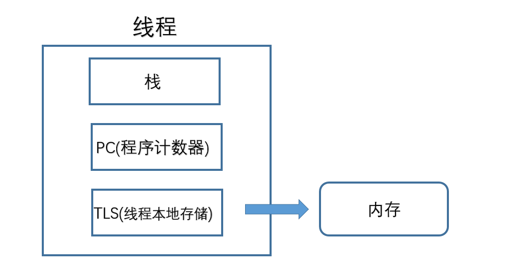

---
categories:
- linux
tags:
- 进程和线程
---

> 百度百科:

**进程（Process）** 是计算机中的程序关于某数据集合上的一次运行活动，是系统进行资源分配和调度的基本单位，是操作系统结构的基础。 在当代面向线程设计的计算机结构中，进程是线程的容器。程序是指令、数据及其组织形式的描述，进程是程序的实体

**线程（thread）** 是操作系统能够进行运算调度的最小单位。它被包含在进程之中，是进程中的实际运作单位。一条线程指的是进程中一个单一顺序的控制流，一个进程中可以并发多个线程，每条线程并行执行不同的任务。

<!--more-->

# 深入理解

## 进程(线程+内存+文件/网络句柄)
### 内存
我们通常所理解的内存是我们所见到的(2G/4G/8G/16G)物理内存,它为什么会在进程之中呢？ 
实际上，这里的内存是逻辑内存。指的是内存的寻址空间。每个进程的内存是相互独立的。  

### 文件/网络句柄
它们是所有的进程所共有的，例如打开同一个文件，去抢同一个网络的端口这样的操作是被允许的。  

### 线程(栈+PC+TLS)

#### 栈
我们通常都是说调用堆栈，其实这里的堆是没有含义的，调用堆栈就是调用栈的意思。  
那么我们的栈里面有什么呢？  
我们从主线程的入口main函数，会不断的进行函数调用，  
每次调用的时候，会把所有的参数和返回地址压入到栈中。  

#### PC (Program Counter)
程序计数器，操作系统真正运行的是一个个的线程，  
而我们的进程只是它的一个容器。PC就是指向当前的指令，而这个指令是放在内存中。  
每个线程都有一串自己的指针，去指向自己当前所在内存的指针。  
计算机绝大部分是存储程序性的，说的就是我们的数据和程序是存储在同一片内存里的  
这个内存中既有我们的数据变量又有我们的程序。所以我们的PC指针就是指向我们的内存的。  

缓冲区溢出   

例如：我们有个地方要输入用户名，本来是用来存数据的地方。  
然后黑客把数据输入的特别长。这个长度超出了我们给数据存储的内存区，这时候跑到了  
我们给程序分配的一部分内存中。黑客就可以通过这种办法将他所要运行的代码  
写入到用户名框中，来植入进来。  

#### TLS(thread local storage)
之前我们看到每个进程都有自己独立的内存，这时候我们想，我们的线程有没有一块独立的内存呢?答案是有的，就是TLS。
可以用来存储我们线程所独有的数据。  
可以看到：线程才是我们操作系统所真正去运行的，而进程呢，则是像容器一样他把需要的一些东西放在了一起，而把不需要的东西做了一层隔离，进行隔离开来。  

# 计算机执行程序的过程
## 背景
CPU+RAM+各种资源（比如显卡，光驱，键盘，GPS, 等等外设）构成我们的电脑，但是电脑的运行，实际就是CPU和相关寄存器以及RAM之间的事情  
## 一个最最基础的事实
CPU太快，太快，太快了，寄存器仅仅能够追的上他的脚步，RAM和别的挂在各总线上的设备则难以望其项背。那当多个任务要执行的时候怎么办呢？轮流着来?
或者谁优先级高谁来？不管怎么样的策略，一句话就是在CPU看来就是轮流着来。而且因为速度差异，CPU实际的执行时间和等待执行的时间是数量级的差异。
比如工作1秒钟，休息一个月。所以多个任务，轮流着来，让CPU不那么无聊，给流逝的时间增加再多一点点的意义。这些任务，在外在表现上就仿佛是同时在执行。

## 一个必须知道的事实  
执行一段程序代码，实现一个功能的过程之前 ，当得到CPU的时候，相关的资源必须也已经就位，就是万事俱备只欠CPU这个东风。所有这些任务都处于就绪队列 ，
然后由操作系统的调度算法，选出某个任务，让CPU来执行。然后就是PC指针指向该任务的代码开始，由CPU开始取指令，然后执行。

除了CPU以外所有的执行环境，主要是寄存器的一些内容，就构成了的进程的上下文环境。进程的上下文是进程执行的环境。当这个程序执行完了，
或者分配给他的CPU时间片用完了，那它就要被切换出去，等待下一次CPU的临幸。在被切换出去做的主要工作就是保存程序上下文，因为这个是下次他被CPU临幸的运行环境，必须保存。

## 串联起来的事实
前面讲过在CPU看来所有的任务都是一个一个的轮流执行的，具体的轮流方法就是：先加载进程A的上下文，然后开始执行A，保存进程A的上下文，
调入下一个要执行的进程B的进程上下文，然后开始执行B,保存进程B的上下文。。。。

进程和线程就是这样的背景出来的，两个名词不过是对应的CPU时间段的描述，名词就是这样的功能。  
* 进程就是上下文切换之间的程序执行的部分。是运行中的程序的描述，也是对应于该段CPU执行时间的描述。
* 在软件编码方面，我们说的进程，其实是稍不同的，编程语言中创建的进程是一个无限loop，对应的是tcb块。这个是操作系统进行调度的单位。所以和上面的cpu执行时间段还是不同的。  
* 进程，与之相关的东东有寻址空间，寄存器组，堆栈空间等。即不同的进程，这些东东都不同，从而能相互区别。

## 线程是什么呢？
进程的颗粒度太大，每次的执行都要进行进程上下文的切换。如果我们把进程比喻为一个运行在电脑上的软件，那么一个软件的执行不可能是一条逻辑执行的，
必定有多个分支和多个程序段，就好比要实现程序A，实际分成 a，b，c等多个块组合而成。那么这里具体的执行就可能变成

程序A得到CPU =》CPU加载上下文，开始执行程序A的a小段，然后执行A的b小段，然后再执行A的c小段，最后CPU保存A的上下文。

这里a，b，c的执行是共享了A进程的上下文，CPU在执行的时候仅仅切换线程的上下文，而没有进行进程上下文切换的。进程的上下文切换的时间开销是远远大于线程上下文时间的开销。
这样就让CPU的有效使用率得到提高。这里的a，b，c就是线程，也就是说线程是共享了进程的上下文环境，的更为细小的CPU时间段。线程主要共享的是进程的地址空间。

# 进程和线程的类比
* 线程在进程下行进（单纯的车厢无法运行）
* 一个进程可以包含多个线程（一辆火车可以有多个车厢）
* 不同进程间数据很难共享（一辆火车上的乘客很难换到另外一辆火车，比如站点换乘）
* 同一进程下不同线程间数据很易共享（A车厢换到B车厢很容易）
* 进程要比线程消耗更多的计算机资源（采用多列火车相比多个车厢更耗资源）
* 进程间不会相互影响，一个线程挂掉将导致整个进程挂掉（一列火车不会影响到另外一列火车，但是如果一列火车上中间的一节车厢着火了，将影响到所有车厢）
* 进程可以拓展到多机，进程最多适合多核（不同火车可以开在多个轨道上，同一火车的车厢不能在行进的不同的轨道上）
* 进程使用的内存地址可以上锁，即一个线程使用某些共享内存时，其他线程必须等它结束，才能使用这一块内存。（比如火车上的洗手间）－"互斥锁"
* 进程使用的内存地址可以限定使用量（比如火车上的餐厅，最多只允许多少人进入，如果满了需要在门口等，等有人出来了才能进去）－“信号量”

# 摘录自
* https://www.cnblogs.com/coder-programming/p/10595804.html
* https://www.zhihu.com/question/25532384/answer/81152571

