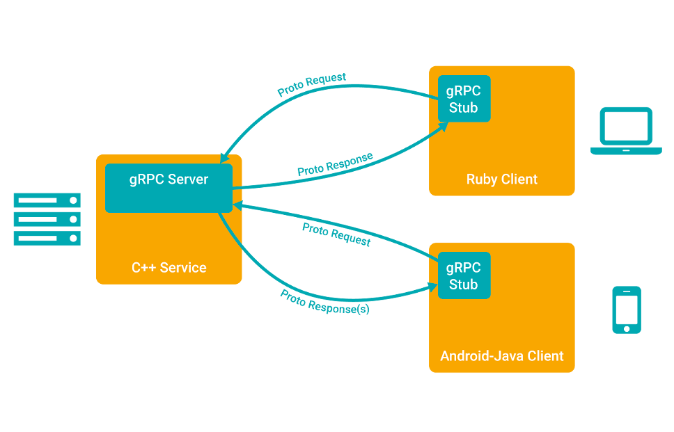

# 简介
gRPC  是一个高性能、开源和通用的 RPC 框架，面向移动和 HTTP/2 设计。目前提供 C、Java 和 Go 语言版本，分别是：grpc, grpc-java, grpc-go. 
其中 C 版本支持 C, C++, Node.js, Python, Ruby, Objective-C, PHP 和 C# 支持.

<!--more-->

## gRPC 是什么？
在 gRPC 里客户端应用可以像调用本地对象一样直接调用另一台不同的机器上服务端应用的方法，使得您能够更容易地创建分布式应用和服务。与许多 RPC 系统
类似，gRPC 也是基于以下理念：定义一个服务，指定其能够被远程调用的方法（包含参数和返回类型）。在服务端实现这个接口，并运行一个 gRPC 服务器来处理客户端调用。在客户端拥有一个存根能够像服务端一样的方法

## protocol buffers
gRPC 默认使用 protocol buffers，这是 Google 开源的一套成熟的结构数据序列化机制（当然也可以使用其他数据格式如 JSON）。

## 使用 API 接口
gRPC 提供 protocol buffer 编译插件，能够从一个服务定义的 .proto 文件生成客户端和服务端代码。通常 gRPC 用户可以在服务端实现这些API，并从客户端调用它们。
* 在服务侧，服务端实现服务接口，运行一个 gRPC 服务器来处理客户端调用。gRPC 底层架构会解码传入的请求，执行服务方法，编码服务应答。
* 在客户侧，客户端有一个存根实现了服务端同样的方法。客户端可以在本地存根调用这些方法，用合适的 protocol buffer 消息类型封装这些参数— gRPC 来负责发送请求给服务端并返回服务端 protocol buffer 响应。

## 同步 vs 异步
同步 RPC 调用一直会阻塞直到从服务端获得一个应答，这与 RPC 希望的抽象最为接近。另一方面网络内部是异步的，并且在许多场景下能够在不阻塞当前线程的情况下启动 RPC 是非常有用的。

在多数语言里，gRPC 编程接口同时支持同步和异步的特点。

## RPC 生命周期
### 单项 RPC
客户端发出单个请求，获得单个响应。  
* 一旦客户端通过桩调用一个方法，服务端会得到相关通知 ，通知包括客户端的元数据，方法名，允许的响应期限（如果可以的话）
* 服务端既可以在任何响应之前直接发送回初始的元数据，也可以等待客户端的请求信息，到底哪个先发生，取决于具体的应用。
* 一旦服务端获得客户端的请求信息，就会做所需的任何工作来创建或组装对应的响应。如果成功的话，这个响应会和包含状态码以及可选的状态信息等状态明细及可选的追踪信息返回给客户端 。
* 假如状态是 OK 的话，客户端会得到应答，这将结束客户端的调用。

### 服务端流式 RPC
服务端流式 RPC 除了在得到客户端请求信息后发送回一个应答流之外，与我们的简单例子一样。在发送完所有应答后，服务端的状态详情(状态码和可选的状态信息)和可选的跟踪元数据被发送回客户端，以此来完成服务端的工作。客户端在接收到所有服务端的应答后也完成了工作。

### 客户端流式 RPC
客户端流式 RPC 也基本与我们的简单例子一样，区别在于客户端通过发送一个请求流给服务端，取代了原先发送的单个请求。服务端通常（但并不必须）会在接收到客户端所有的请求后发送回一个应答，其中附带有它的状态详情和可选的跟踪数据。

### 双向流式 RPC
双向流式 RPC ，调用由客户端调用方法来初始化，而服务端则接收到客户端的元数据，方法名和截止时间。服务端可以选择发送回它的初始元数据或等待客户端发送请求。  
下一步怎样发展取决于应用，因为客户端和服务端能在任意顺序上读写 - 这些流的操作是完全独立的。例如服务端可以一直等直到它接收到所有客户端的消息才写应答，或者服务端和客户端可以像"乒乓球"一样：服务端后得到一个请求就回送一个应答，接着客户端根据应答来发送另一个请求，以此类推。

### 截止时间
gRPC 允许客户端在调用一个远程方法前指定一个最后期限值。这个值指定了在客户端可以等待服务端多长时间来应答，超过这个时间值 RPC 将结束并返回DEADLINE_EXCEEDED错误。在服务端可以查询这个期限值来看是否一个特定的方法已经过期，或者还剩多长时间来完成这个方法。  
各语言来指定一个截止时间的方式是不同的 - 比如在 Python 里一个截止时间值总是必须的，但并不是所有语言都有一个默认的截止时间。  

### RPC 终止
在 gRPC 里，客户端和服务端对调用成功的判断是独立的、本地的，他们的结论可能不一致。这意味着，比如你有一个 RPC 在服务端成功结束("我已经返回了所有应答!")，到那时在客户端可能是失败的("应答在最后期限后才来到!")。也可能在客户端把所有请求发送完前，服务端却判断调用已经完成了。

### 取消 RPC
无论客户端还是服务端均可以再任何时间取消一个 RPC 。一个取消会立即终止 RPC 这样可以避免更多操作被执行。它不是一个"撤销"， 在取消前已经完成的不会被回滚。当然，通过同步调用的 RPC 不能被取消，因为直到 RPC 结束前，程序控制权还没有交还给应用。  

### 元数据集
元数据是一个特殊 RPC 调用对应的信息(授权详情]) ，这些信息以键值对的形式存在，一般键的类型是字符串，值的类型一般也是字符串(当然也可以是二进制数据)。元数据对 gRPC 本事来说是不透明的 - 它让客户端提供调用相关的信息给服务端，反之亦然。

# 安全认证
## 认证
gRPC 被设计成可以利用插件的形式支持多种授权机制。   

## 支持的授权机制
### SSL/TLS
Grpc 集成 SSL/TLS 并对服务端授权所使用的 SSL/TLS 进行了改良，对客户端和服务端交换的所有数据进行了加密。对客户端来讲提供了可选的机制提供凭证来获得共同的授权

### OAuth 2.0

gRPC 提供通用的机制（后续进行描述）来对请求和应答附加基于元数据的凭证。当通过 gRPC 访问 Google API 时，会为一定的授权流程提供额外的获取访问令牌的支持，这将通过以下代码例子进行展示。

警告：Google OAuth2 凭证应该仅用于连接 Google 的服务。把 Google 对应的 OAuth2 令牌发往非 Google 的服务会导致令牌被窃取用作冒充客户端来访问 Google 的服务。

### API
为了减少复杂性和将混乱最小化， gRPC 以一个统一的凭证对象来进行工作。
凭证可以是以下两类：
* 频道凭证, 被附加在 频道上， 比如 SSL 凭证。
* 调用凭证, 被附加在调用上(或者 C++ 里的 客户端上下文)。 凭证可以用组合频道凭证来进行组合。一个组合频道凭证可以将一个频道凭证和一个调用凭证关联创建一个新的频道凭证。结果在这个频道上的每次调用会发送组合的调用凭证来作为授权数据。 例如，一各频道凭证可以由一个Ssl 凭证和一个访问令牌凭证生成。结果是在这个频道上的每次调用都会发送对应的访问令牌。 调用凭证可以用 组合凭证来组装。组装后的 调用凭证应用到一个客户端上下文里，将触发发送这两个调用凭证的授权数据。