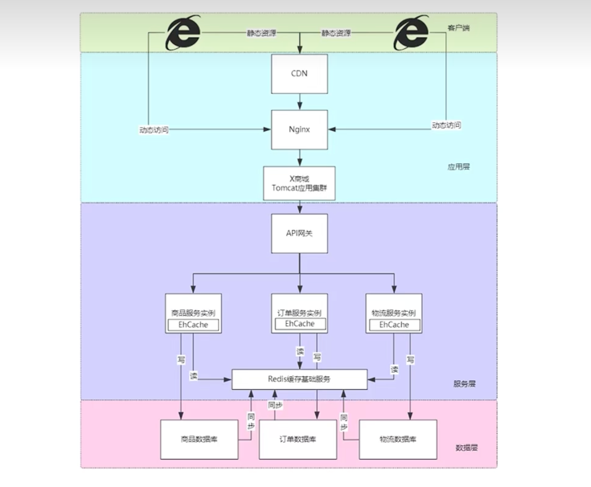
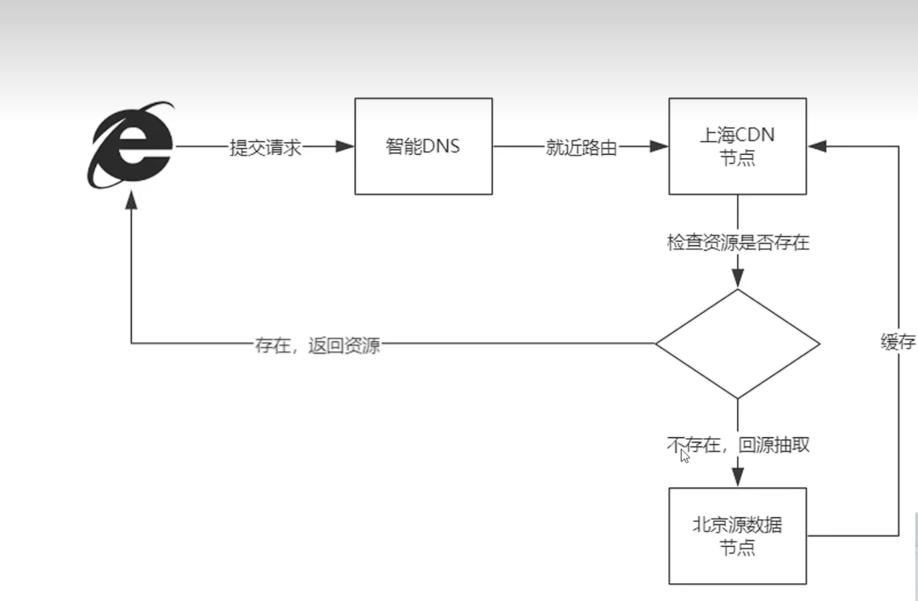

# 架构简介
架构的类型：
1. 单体架构模式
2. 分布式架构
3. 微服务架构
4. 服务网格模式

不谈场景的架构设计都是耍流氓。
架构没有对不对，只有合不合适。 

单体架构：
   

## 假设单体架构由于大量文件读取产生高磁盘IO,导致数据库查询慢，如何解决？
### 加入新组件 redis
将非事务请求的数据缓存在redis中，利用内存，解决这个问题。  

带来的问题：
1. 架构的复杂度增加
2. 新的数据一致性问题

### 在架构不变的情况下解决问题
1. Web容器层面增加拦截器阻挡垃圾重复无效的请求穿透到数据库
2. 分析业务代码中SQL是否存在全表扫描以及索引选择性问题
3. 增加InnoDB引擎的Buffer_Pool让查询拥有更多的缓存命中率
4. 在操作系统层面，增加文件系统缓存，减少文件10次数

## 架构和框架的区别
架构指的是软件目标的宏观设计。  
框架是具体实现的规则。  

架构需要阐述的是：
1. 服务器如何部署
2. 模块如何切分
3. 数据如何流转
4. 带宽需要多少
5. 人员组织，数据库集群选型是什么

<!--more-->
<!--more-->

# Mysql集群模式与应用场景
## 单库模式
简单粗暴，适合数据量千万以下小型应用，企业网站，创业公司首选。  
不具备可用性和并发性  

## 读写分离
 

### 缺点
1. 架构复杂度提升，成本提高
2. 所有节点数据均保持同步
3. 适用于读多写少，单表不过干万的互联网应用
4. 配合MHA中间件方案实现高可用性

## 分库分表（分片）集群模式
 

### 缺点
1. 架构复杂度提升，成本提高
2. 每个节点数据是所有数据的子集
3. 适用于十亿级数据总量大型应用
4. 不具备高可用特性

对于超过10亿级别的数据，应该选择非关系型数据库的解决方案。   

### 分片算法
1. 范围法，对主键（即为分片键进行划分。如id），mysql默认提供的特性（分区表为典型的范围法），易扩展，适用范围检索，但数据不均匀，局部负载大，适用流水账应用。
2. HASH法，对id取模。取模和一致性Hash（独特的环形算法）。数据分布均匀。扩展复杂，数据迁移大。建议提前部署。

## 主流模式
读写分离和分片的组合运用
 

# 为什么大厂要做数据垂直分表
一张表的字段太多需要做垂直分表。   

什么是水平分表？
以行为单位对数据进行拆分（范围法，hash法）。特点：所有的表结构完全相同。用于解决数据量大的存储问题。

什么是垂直分表？
将表按列拆分成2张以上的小表，通过主外键关联获取数据。

为什么要这么做？
需要了解mysql的InnoDB处理引擎。
行数据称为：row
管理数据基本单位称为页：page；每一页的默认大小：16k
保存页的单位称为区：Extent。
关系：区由连续页组成，页由连续行组成。1024/16=64(即：一个1M的区有64个页)

InnoDB1.0后新特性，压缩页。
压缩页：对数据底层进行压缩，使实际大小小于逻辑大小。
在跨页检索数据的过程中，压缩和解压缩的效率低。在表设计时，尽可能在页内多存储行数据，减少跨页检索，增加页内检索。

分析：
1行数据为1K，1页16K，即1页16条数据，1亿的数据需要625万页
垂直分页后，1行数据为64字节（1K=1024字节），即1页256条数据，1亿的数据需要39万页。分页后的数据根据id等关系进行快速提取。
通过将重要字段单独剥离成小表，让每页容纳更多行数据，页减少后，缩小数据扫描范围，达到提高执行效率的目的。

垂直分表条件：
1.单表数据达千万
2.字段超20个，且包含vachar，CLOB,BLOB等字段

字段放大小表的依据：
小表：数据查询、排序时需要的字段；高频访问的小字段
大表：低频访问字段；大字段

# 为什么架构师对多级缓存架构情有独钟
缓存是提升性能最直接的方法
多级缓存分为：客户端，应用层，服务层，数据层
 

## 客户端缓存
主要对浏览器的静态资源进行缓存
通过在浏览器设置Expires，时间段内以文件形式把图片保存在本地，减少多次请求静态资源带来的带宽损耗（解决并发手段）

## 应用层缓存：
浏览器只负责读取Expires，Expires在CDN内容分发网络和Nginx进行设置

### CDN的核心技术：
CDN内容分发网络是静态资源分发的主要技术手段，有效解决带宽集中占用以及数据分发问
 
根据请求访问DNS节点， 自动转发到上海CDN节点，检查资源是否被缓存，若已缓存则返回资源否则回源北京提取到并缓存到上海CDN节点，再由上海CDN节点进行返回。

响应头Expires和Cache-control的区别：
1.均为通知浏览器进行文件缓存
2.Expires指在这个时间点缓存就到期
3.Cache-control指缓存时间有多长
即：你明天还钱给我Expires，时间是一天Cache-control

### Nginx缓存管理：
Nginx对Tomcat集群做软负载均衡，提供高可用性。有静态资源缓存和压缩功能（在本地缓存文件）

## 服务层缓存 
### 进程内缓存

进程内缓存：即数据运行时载入程序开辟的缓存中JAVA框架的运用（hibernate，mybatis一二级缓存，springmvc页面缓存）
开源实现：ehcache，Caffeine

### 进程外缓存
即为分布式缓存（redis）
常见的加缓存是直接加redis是不严谨
需要按照：先近到远，先快后慢逐级访问
场景：商品秒杀，若无本地缓存，都保存在redis 每完成一笔交易，局域网会进行若干网络通信，可能存在网络异常不稳定因素
且redis会承担所有节点的压力，当突发流量若超过容载上限redis会崩溃
所有java的应用端也需要设计多级缓存

一般会通过进程内缓存和进程外缓存（分布式缓存）组合分担压力
ehcache（进程内缓存）可以在缓存不存在时去redis进程外缓存进行读取，redis没有读取数据库 数据库再对ehcache，redis进行更新

缓存一致性处理：

场景：修改商品价格为80，如何保证缓存也进行更新
处理方法：引入消息队列（MQ）的主动推送功能，对服务实例推送变更实例
即：修改商品价格为80，向MQ发送变更消息，MQ将消息推送到服务实例服务实例将原缓存数据删除，再创建缓存

什么情况适用多级缓存架构   
1. 缓存数据稳定
2. 可能产生高并发场景（12306）应用启动时进行预热处理，访问前将热点数据先缓存，减少后端压力
3. 一定程度上允许数据不一致不重要的信息更新处理方式：T+1,ETL日中处理（处理方式这块不懂）

# 为什么大厂在大表做水平分表时严禁使用自增主键
自增主键在分布式环境下不适用。
由于自增主键必须连续，所以按范围法进行分片，ID的数量已固定。无法进行动态扩展。会产生“尾部热点”效应。
尾部热点：即按范围法进行分片后，前面的分片已储存数据，最后一个分片的压力很大。
Hash分片的效率更高。

使用UUID替代自增主键吗？不可以、
涉及数据库底层机制：
1.uuid，唯一无序。无序导致索引重排。主键有序的情况下，B+树只需要在原有的数据后面追加即可。

怎么解决？分布式且有序的主键生成算法？
雪花算法（SnowFlake），推特公司。
结构：符号位（1bit）+时间戳（41bit）+机器ID（10bit）+序列（12bit）
使用方法：直接调用JAR包

雪花算法需要注意时间回拨带来的影响。可能出现id重复的可能。

## 如何解决雪花算法的时钟回拨问题
大多数场景：短暂回拨等待 + 持久化时间戳 + 报警机制。
短暂的时钟回拨可休眠等待，长时间回拨需要停止ID生成，人工干预。      

高要求场景：逻辑时钟补偿 + Worker ID动态切换 + 分布式协调。  
当物理时钟回拨时，使用逻辑递增的虚拟时间戳替代    

# 布隆过滤器在亿级流量电商系统的应用
布隆过滤器（Bloom Filter）是一种高效的空间概率型数据结构，主要用于快速判断元素是否存在集合中。尽管存在一定的误判率（假阳性），但其极低的内存占用和常数级查询速度使其在多个领域广泛应用 

java代码示例

## 可能遇到的问题
不支持删除操作：标准布隆过滤器无法直接删除元素（需改用Counting Bloom Filter或者定时重建）。   
预热成本：初始化需预加载全量数据，不适合频繁更新的场景。   
哈希函数选择：需使用高散列性的哈希函数（如MurmurHash、SHA-1）。  

## 应用场景
### 数据库查询优化
场景：避免对不存在的Key查询数据库。     
实现：   
将数据库中所有记录的Key预先存入布隆过滤器。    
查询时先检查布隆过滤器：若返回“不存在”，直接终止查询；若返回“可能存在”，再执行数据库查询。   
优势：减少磁盘I/O压力，尤其适合高并发场景（如电商商品查询）。 

### 缓存穿透防护
场景：防止恶意请求攻击（如频繁查询不存在的缓存Key）。   
实现：  
缓存击穿时，大量请求绕过缓存直接访问数据库。
在缓存前加布隆过滤器层，拦截明确不存在的Key。

### 网络爬虫去重
场景：判断URL是否已被抓取，避免重复爬取。   
实现： 
爬虫启动时加载已抓取的URL到布隆过滤器。
新URL抓取前检查过滤器，若“可能存在”则跳过。

### 分布式系统协同
场景：分布式数据库/缓存中快速过滤无效请求。    
案例：    
Apache Cassandra：使用布隆过滤器判断某行数据是否在指定SSTable中，减少磁盘扫描。
CDN节点：边缘节点同步资源指纹的布隆过滤器，快速判断资源是否缓存。 

### 安全与黑名单过滤
场景：快速判断用户请求是否属于黑名单（如垃圾邮件、恶意IP）。   
实现：   
将黑名单数据（如IP哈希、邮件域名）存入布隆过滤器。
新请求到达时，先通过过滤器拦截高风险请求。    
优点：内存占用远低于哈希表（适合亿级数据）。

# 为啥京东开发要禁用IP直连

IP直连有什么问题？（存在强耦合问题）    
jdbc:mysql//192.168.3.21:3306:db（写法没问题，但存在强耦合问题）   
线上建议用域名代替ip地址，因为在架构设计中需要考虑解耦问题。    

场景：原代码连接数据库地址是192.168.3.21，现在业务需要连接到另一台数据库192.168.3.31，则可能存在代码修改，编译，部署，走流程等。    
所以ip直连不可取。  

## 引入内部DNS，即建立一个域名解析服务器。
jdbc:mysql//域名:3306:db，直接访问数据库ip对应的域名，域名解析服务器根据配置解析该域名对应的IP返回。   
优点：IP地址迁移变得灵活，后续直接修改域名解析服务器域名对应的IP地址即可。   
缺点：1.没有故障发现和转移，2.一个域名绑定多个ip，负载均衡只有轮询规则。      

## 加入注册中心（Nacos/Eureka/Consul）
弥补没有故障发现和转移。     
多个数据库IP，在注册中心进行配置，注册中心通过多种负载均衡，选取某个IP进行返回（跟内部DNS类似）    
如果发现故障和故障转移。    
数据库注册到注册中心，两者之间通过注册保持连续，注册相当于一个心跳包，服务器节点定时向注册中心发送信息，告知服务器正常。   
若某节点异常，异常服务器会被注册中心移除。   

优点：支持故障发现和转移。具有多种负载均衡策略。     
缺点：架构复杂度增加。 （注册中心需要维护节点的状态，并且定时监听心跳包。一般会部署成集群，比内部DNS复杂，还需考虑高可用）   

# 什么是CAP定理

分布式架构的基本理论，指的是在一个分布式系统中，一致性（Consistency）、可用性（Availability）、分区容错性（Partition tolerance）。  
C：更新操作成功后，所有节点在同一时间的数据完全一致。(复习：事务的一致性：事务前后的数据完整性保持一致)  
A：用户访问数据时，系统能否在正常响应时间返回预期结果。（复习：事务的原子性：事务是一个不可分割的工作单位，事务要么发生要么不发生）    
P：分布式系统遇到某节点或网络分区故障的时候，仍能对外提供一致性和可用性的服务。   

CAP这三个要素最多只能同时实现两点，不可能三者兼顾。   
所有只有CP,AP,AC    

当前场景：订单系统下单买了1瓶酒，库存系统酒的数量-1。分布式系统中，系统之间需要网络通信等各种问题。无法实现买了1瓶酒，库存即时-1。   
CP：订单创建后，等待库存减少后才返回结果。保证数据一致，强一致性表现，用户体验差。（类似银行存钱）   
AP：订单创建后，不等待库存减少后就返回结果。那库存数据怎么办？（异步处理后通知订单系统，若异步处理失败，有补偿机制（重新发请求，补录，校对程序）保证数据一致）。（类似淘宝）   
AC：不拆分数据库系统，在一个数据库的一个事务中完成操作，即单体应用。下单，减库存在一个事务。缺点：不能做分区， 分区涉及网络，进而涉及分区容错性，进而选CP,AP。   

银行金融大多使用CP模式，强调数据一致性    
互联网应用大多使用AP模式，强调用户体验   

# 负载均衡器
负载均衡的种类：

1、硬件负载均衡（F5），软件负载均衡   
2、网络层面：    
4层代理（指网络7层模型（OSI）的传输层，TCP），举例：Linux的LVS    
7层代理（指网络7层模型（OSI）的应用层，HTTP），举例：Nginx  

Nginx：内置负载均衡策略有哪些？  
轮询策略（默认）、权重策略、IP_HASH、URL_HASH(第三方模块)、FAIR（第三方模块）   

# 阿里开发规范解读：为啥禁用外键约束

阿里规范：不得使用外键与级联，一切外键概念必须在应用层（代码层面）解决。

不喜欢外键约束的理由：测试人员和开发人员，在做delete或update受到外键约束，需要处理外键约束涉及的其他表的数据。   
拥护外键约束的理由：保证数据的一致性和完整性，级联操作方便，数据一致性交给数据库，代码量少。   

场景：订单表跟订单明细表。这时订单id主外键关联。   
1.性能问题，额外的数据一致性校验查询。往订单明细表添加一条数据，会强制查询对应订单表中的订单id是否存在。   
2.并发问题：外键约束会启用行级锁，主表写入会进入阻塞。  
并发环境下，往订单明细表添加一条数据，会强制查询对应订单表中的订单id是否存在，所以订单表开启共享锁（共享锁【S锁】，又称为读锁，可以查看但无法修改和删除的一种数据锁）。   
某种情况下对订单id进行更新操作，这时该数据开启排它锁（排他锁【X锁】，又称写锁）。若写锁不被释放，订单明细表处于被锁定的状态。会造成线层积压，系统崩溃。   
3.级联删除问题：多层级联删除会让数据变得不可控，触发器严禁使用。  
4.数据耦合：数据库层面数据关系产生耦合，数据迁移维护困难。   
场景：订单明细表数据增长，数据量10亿后，需要迁移到Hbase。这时数据不在同一个库，没有了主外键约束，代码上无校验，就会产生属于一致性问题。   

# 使用阿里Canal实现MySQL异构数据同步
Canal:阿里巴巴的，基于db增量日志解析，提供增量数据订阅和消费

# 18.Redis Sentinel高可用架构

## Redis主从复制过程
1. slave执行命令向master建立连接
2. master执行bgsave（后台存储），生成rdb快照（redis备份方式，data以二进制方式保存在本地），发送到slave上
3. slave获取快照后读取，对data还原，保证初始化数据一致
4. master接受命令发送到salve，salve执行保证后续数据一致 

## Redis Sentinel集群
1. 建立sentinel集群，有一个leader角色
2. 一般需要6个节点，3个sentinel，3个主从。
3. sentinel安装在节点上，根据配置信息监听redis的健康状态。
（每个sentinel 1次/秒频率向master，salve及其他sentinel实例发送ping命令）

## 下线判定
主观下线：sentinel 与master连接超时，则当前sentinel认为master已下线
客观下线：超过半数的sentinel 主观下线

## sentinel选主过程
1. 剔除主观下线、已断线、或者最后一次回复PING命令的时间大于五秒钟的Slave
2. 剔除与失效主服务器连接断开的时长超过down-after选项指定的时长十倍的Slave
3. 按同步数据的偏移量选出数据最完整的Slave
4. 如果偏称量相同，选中ID最小的Slave

## 故障转移
1. 向被选中的从服务器发送SLAVEOF NO ONE命令，让它转变为主服务器。
2. 通过发布与订阅功能，将更新后的配置传播给所有其他Sentinel，其他Sentinel对它们自2的配置进行更新。
3. 向所有Slave下达SLAVEOF命令，指向新的主
4. redis-slave向master重新建立连接，重放rdb保持数据同步
5. 在上述转移过程中，伴随着Redis本地配置文件的自动重写，这样即使是实例重启配置也不会丢失
6. 原有的master在恢复后降级为slave与新master全量同步

## Sentinel高可用
1. sentinel自动故障迁移使用raft算法来选举领头(leader) sentinel
2. 超过半数投票选出leader, sentinel Leader用于下达故障转移的指令
3. 如果某个Leader挂了，则使用Raft从剩余的Sentinel中选出leader

Sentinel如何知道彼此的存在？  
Sentinel的信息在redis的master进行注册，master持有Sentinel的信息。

总的来说 sentinel的作用,就是选master，包括自身master和redismaster

# 19.Seata分布式事务解决方案

# 20.如何保障接口幂等性
幂等指多次操作产生的影响只会跟一次执行的结果相同

1. 唯一主键索引实现幂等性
2. 乐观锁实现幂等性
   * 它的心态就是很乐观，每次去拿数据的时候都认为别人不会修改，所以不会上锁
   * 一般使用版本号控制 version，即为数据增加一个版本标识
3. 悲观锁实现幂等性
   * 悲观锁它是一种悲观的心里状态，对应于生活中悲观的人总是想着事情往坏的方向发展
   * select * from update
4. Token 令牌如何实现幂等性
   * 客户端每次进入表单页面可以优先申请一个唯一令牌存储本地，服务端存储令牌 token 值(redis,文件，memcache 都可)
   * 每次发送请求时可以在 Headers 头部中带上当前这个 token 令牌
   * 服务端验证 token 是否存在，存在则删除 token，执行后续业务逻辑；不存在则响应客户端重复提交提示语

# 21.通过乐观锁解决并发数据冲突
它的心态就是很乐观，每次去拿数据的时候都认为别人不会修改，所以不会上锁   
一般使用版本号控制 version，即为数据增加一个版本标识  
在更新数据的时候，需要在where条件中带上这个version   

如果由于version问题更新出错如何处理？  
1. 直接接口报错，让调用断重试
2. 在接口的位置，判定是由于version问题导致的，可以重试，降低接口出错的概率。

# 22.阿里开发规范解读，为啥禁止三表Join关联
【强制】超过三个表禁止join,需要join的字段，数据类型必须绝对一致，多表关联查询时，保证被关联的字段需要有索引   
即使双表join 也要注意表索引，SQL性能。  

早期的版本如mysql5.7使用的 Loop Join, 连表的时候如果右边的表数据量很大，则会很慢时间复杂度为 N*M (N:左边表的行数，M：右边表的行数)。  
最新的pgsql,mysql8 会自动选择算法，如果内存足够会优先使用 Hash join，其时间复杂度为 N+M

# 24.前后端分离架构下jwt认证该如何设计？
Json Web Token(jwt)     
jwt是一个经过加密的，包含用户信息的且具有时效性的固定格式字符串  
结构： header.paylod.sign 

## 网关统一校验
    
jwt校验无感知，验证过程无入侵   
执行效率低，适用于低并发企业级应用    

## 应用认证方案
    
控制更加灵活，有一定代码入侵，代码可以灵活控制，适用于追求性能的互联网应用   

# 25.无状态的jwt令牌如何实现续签功能  
JWT 不建议设置长时间有效期，有安全风险    
续签JWT必须有退出机制    

## 不允许改变Token令牌实现续签   
    
为什么加入Redis后JWT中的过期时间可以去掉？   
因为过期时间被放到后端Redis存储，可以灵活控制    
同时在生产MD5时加入环境特征，尽量避免人为盗取，但这也意味着JWT是有状态的了。 

## 允许前端改变token实现续签
    

为什么必须要两个jwt,为什么不直接设置一个token一个小时过期，判断还有10分钟过期的时候，生成新的token进行替换？    
这两个token的职责不一样，两个token的情况下 认证中心是不关心 “还有10分钟数过期的”，只关心token是否有效  
虽然同样可以实现，但给整个认证系统多加了一个“还有10分钟数过期的” 逻辑    

这个方案的问题，客户端要处理大量的jwt工作： 
1. 需要由原先的一个jwt变成了两个jwt
2. 需要观察header并刷新本地jwt    

存在重复生成JWT（多线程情况下） 解决方案：
* 认证中心记录过去n秒内的原始jwt 刷新所生成的新的jwt数据
* n秒内同样的jwt再次请求刷新，就返回相同的新jwt数据

# 26.公共表在分布式架构下如何进行访问
什么事公共表 ？ 
被其他业务模块共享的基础数据表，被称为公共表，比如：系统用户表，行政区域，组织结构，系统配置  

通过微服务解耦     

# 27.一套经典的web高可用架构
     

通过nginx 对后端web服务做负载均衡。   
通过 Virtual IP + keepalived组件的主备的方式，解决nginx单点问题  
此时备nginx 并不工作    

如何让备nginx也用起来？    
DNS轮询与多VIP组合解决利用率问题   
DNS-server 配置两个VitrualIP, 分别指向两台nginx形成互备机制    
     

# 28.Redis Cluster 集群模式
Cluster模式是Redis3.0开始推出  
* 采用无中心结构，每个节点保存数据和整个集群状态，每个节点都和其他所有节点连接  
* 官方要求：至少6个节点才可以保证高可用，即3主3从；扩展性强，更好做高可用
* 各个节点会相互通信，采用gossip协议交换节点元数据信息
* 数据分散存储到各个节点上     
     

**Redis Clouster集群如何将数据分散存储？** 
集群采用 Hash Slot(哈希槽) 分配    
Redis集群预分好16384个槽，初始化集群时平均规划给每一台Redis Master   
      

集群存储槽的分配信息采用的是bitmap存储，16384/8(bit)=2k ，也就是说存储一个节点持有的槽位信息需要2K   
2k的数据需要在各个节点间通过gossip协议交换数据，过大会占用网络带宽    
redis官方推荐不要超过1000个节点，16384完全够用    

**故障转移过程**
master节点挂掉后，会被标记为fail,其对应的slave会成为新的master   
当新的slave（包括原有的master）连上后,会重新对master进行全量同步    
如果 master,slave都挂了，那么整个集群将不可用  

**节点扩容缩容，后redis key 如何迁移**
集群通过 重新分配槽 来扩容缩容，使用 MIGRATE 原子迁移槽内的每个 Key，并在迁移过程中用 -ASK 临时重定向 保证客户端访问正确。迁移完成后，槽的所有权正式转移。

# 29.MySql脏读，幻读，不可重复读
脏读： 是指事务中读取到其他事务没提交的数据    
不可重复读： 同一事务中前后查询不一致的情况（读的别的事务已提交的结果）   
幻读： 一次事务中前后数据量发生变化，范围查询的时候，两次查询结果不一致，MVCC机制解决不了范围查询

## 事务隔离机制
1. 读未提交（Read Uncommitted）：这是最低的隔离级别，允许读取尚未提交的数据变更，可能会导致脏读、不可重复读和幻读。
2. 读已提交（Read Committed）：只允许读取已提交的数据，可以避免脏读，但是可能会出现不可重复读和幻读。
3. 可重复读（Repeatable Read）：在同一事务内，多次读取同一数据返回的结果是一致的，可以避免脏读和不可重复读，但是可能出现幻读。
4. 串行化（Serializable）：这是最严格的隔离级别，完全遵循ACID特性，所有的事务依次逐个执行，可以避免脏读、不可重复读和幻读。

| 隔离级别 | 脏读 | 不可以重复读 | 幻读           | 加锁读 |
|------|----|--------|--------------|-----|
| 读未提交 | ✓  | ✓      | ✓            | x   |
| 读以提交 | x  | ✓      | ✓            | x   |
| 可重复读 | x  | x      | ✓ (InnoDb除外) | x   |
| 串行化  | x  | x      | x            | ✓   |

MVCC多版本并发控制，保证的是“读已提交”和“可重复读”

幻读：范围查询的时候，两次查询结果不一致，MVCC机制解决不了范围查询
MySQL默认为可重复读    

# 30.MySQL MVCC机制

MVCC（乐观锁）多版本并发控制，保证的是“读已提交”和“可重复读”

版本链：
InnoDB 引擎的数据行中有 两个额外的字段trx_id(事务ID)和roll_pointer(回滚指针),    
undolog 当事务对数据进行修改时，先将修改前旧值写入undolog，形成一个旧版本,将当前事务id写入trx_id，将旧版记录的指针写入当前和roll_pointer  
这样基于 undolog的数据版本以及字段roll_pointer就形成了一个版本链

ReadView:  
事务在使用MVCC机制时产生的一致性视图，包含4个字段：
1. creator_trx_id: 创建readView的事务的事务ID
2. m_ids: 创建视图时当前数据库中活跃且为提交的事务ID列表，在这个列表里面的事务版本不可读
3. min_trx_id: 创建ReadView时，最小活跃事务ID，用于在版本链中找出已经提交过的数据
4. max_trx_id: 全局事务ID最大值+1

MVCC 通过ReadView以及undo日志形成的版本来控制多版本并发读，查询记录时，先判定页记录的trx_id是否在当前ReadView的m_ids列表中，如果不在说明事务已提交，如果在表明
当前当前数据行是在，查询开始后提交的，就需要根据版本链找出小于min_trx_id的记录

读已提交和可重复读的实现区别在于，读已提交每次读的时候都会重新生成ReadView，这样已提交的事务就不在m_ids中，实现读到提交的记录

MVCC没有解决幻读的问题，Innodb 默认的隔离级别是“可重复读”，通过行锁和间隙锁(next-key Lock)来解决幻读的问题,在查询时使用 SELECT ... FOR UPDATE开启行锁或间隙锁  

# 31.从宜信架构演化理解微服务
## 单体架构
    

* 紧耦合
* 系统复杂，牵一发动全局，发布周期长
* 所有模块耦合在一个进程中
* 完全封闭架构
* 业务发展初期，快速满足客户需求     

## 垂直拆封阶段

* 紧耦合 
* 垂直拆分系统，竖井式架构，子系统之间没有直接关联，重复造轮子：OS,DB,Midderware
* 存在大量的重复代码拷贝
* 完全封闭架构
* 快速增长时，以应用系统为中心的架构模式

## RPC通信阶段
   

数据库由各个子系统共享改为独享。   
* 紧耦合（共享分布式对象实现远程方法调用）
* 系统交互采用RPC或者私有TCP协议
* 服务生产者消费者存在强代码依赖
* 异构系统（不同子系统之间编程语言不同）集成不友好
* 高并发场景，性能比较好。

## ESB服务总线阶段
 
* 松耦合
* ESB消息总线技术实现异构系统集成集中式管理
* 基于WebService技术，重量级消息通讯机制    
* 业务功能重用，粒度粗
* 面向服务架构，团队规模大时，集成异构系统，提供统一服务解决方案    
* ESB服务总线，因为是集中式的线路，容易出现瓶颈

ESB服务总线有两个职责： 
1. 存储服务在什么位置
2. 统一调用端的api,ESB负责不同消息协议的转换，例如：Grpc，Dobble

## 微服务
微服务架构风格是一种将单个应用程序开发为一组小型服务的方法，每个服务运行在自己的进程中，并以轻量级的机制（通常是HTTP RESTful API）的方式进行通信，
这些服务围绕着业务能力所建立的，并且可以完全自动化的部署机构独立部署，这些服务的集中管理只有最低限度，可以用不同的编程语言编写并使用不同的数据库存储技术   

 

# 32.为什么互联网公司离不开Docker?
容器化技术的应用场景： 
1. 标准的迁移方式
2. 统一的参数配置
3. 自动化部署
4. 应用集群监控
5. 开发和运维之间的沟通桥梁

容器与镜像    
1. 镜像：镜像是文件，只读，提供了运行程序完整的数据，是应用程序的“集装箱” 
2. 容器：镜像的运行环境，迷你的“Linux操作系统”，由Docker负责创建，容器之间彼此隔离    

# 35.红黑，灰度发布
红黑属于全量发布   
灰度属于增量发布    

灰度发布具有局限性，对于新旧版本无法协同作业的情况，需要放弃灰度发布，采用红黑发布    

# 36.MySQL索引选择性问题
当索引列的值区分度不高的时候 例如sex字段，这时候筛选的数据结果集太大，比全表扫描还慢的时候，优化器会选择走全表扫描，从而不会用到索引。    

解决办法：
* 通过组合索引提高选择性
* 引入搜索引擎(针对于模糊搜索) 例如：Es
* sql语句中强制使用索引 "force index(字段)"
* 增加缓存，提高全表扫描的速度（钞能力）

# 38.MQ中间件是如何实现可靠性投递的
ack确认机制    
 

1. 发送阶段：遇到高延迟，Producer会多次重发消息，直到Broker ack确认，过程中Broker会自动去重。超时Producer产生异常，应用进行捕获提示  
2. 存储阶段：Broker先刷盘再ack确认，即便ack失败消息不会丢失，多次重试直到Producer接收，会有消息积压的情况
3. 消费阶段：Broker向Consumer发数据，一段时间未接收，自动重发，直到Consumer Ack确认，Consumer注意幂等处理   

可靠性设置：
* MQ异步刷盘(NSYNC_FLUSH),改为同步刷盘
* 存储介质损坏，建议采用RAID10或分布式存储
* 不要启用自动ACK,RabbitMQ默认会自动ACK

# 39.应用持续集成与发布 CI/CD
   
* CI: 应用编译打包,推送镜像的过程
* CD: 应用自动部署的过程

# 40.为什么表的主键要使用代理主键（自增编号），不建议使用业务主键？
1. 业务主键更浪费空间
2. 业务主键无顺序，可能会造成写入数据时需要更长的时间组织索引  
3. 业务主键如果是字符串，在分库分表时，无法直接取模运算，需要先转换为数字。

# 44.sql优化过程 190ms将到2ms
1. 使用explain 查看sql执行计划
2. 为where条件中的字段建立索引
3. 使用explain 查看执行计划，如果索引未被使用到，可以使用explain extend，show warnings 获取详细的未使用到索引的原因,例如是否有隐式转换发生
4. 跟warnings分析，修复对应情况。

# 45.RabbitMQ六种工作模式

   
基本构成：
* Producer: 生产者
* Consumer: 消费者
* Broker: MQ服务器，管理队列，消息以及相关信息
* Message: 消息，程序间的通信数据
* Queue: 队列，消息存放的容器，消息先进先出
* Exchange: 交换机，用于分发消息

   

## 简单模式
消息直接投递到队列，不经过交换机，且队列只有一个消费者

## 工作队列模式
消息直接投递到队列，不经过交换机，队列有多个消费者，负载均衡的消费消息

## 发布订阅
rabbitMQ队列，一个队列有多个消费者时，队列消息会被负载均衡的分发  
要实现，多个消费者消费相同的消息，就要借助交换机，将消息分发到不同的队列    

消息通过交换机，进入不同队列， 不同队列绑定的消费者，可以消费到相同的消息。   

## 路由模式
type=direct    
交换机根据不同的 routing key 将消息分发到不同的队列中，路由模式下 routing key是一种精准匹配模式   

## 主题模式
type=topic   
交换机根据key 模糊匹配，以投递到不同的队列中  

## RPC远程同步调用   
client到server之间是一种阻塞模式的调用   
RPC 通信通常会选用专有的RPC框架，这种模式用的很少

# 46.利用Rabbitmq死信队列解决消息积压问题
解决消息积压可以从两个方面入手  

**消费者端**
* 增加消费者数量
* 提升单个消费者消费消息的能力，例如优化代码

**生产者端**
* 对消息的生产进行限流和降级
* 延迟发送， 例如：利用rabbitmq的死信队列，将多余的消息发回生产者端，暂时存起来，等一段时间再进行发送（流量削峰填谷）
   

什么是死信？   
过期或者无法处理的消息称为死信

死信是怎么产生的？   
* 消费者拒绝接受，且没有重新入列的消息
* 队列满了，无法入列的消息
* 消息设置了TTL过期时间，超过有效期后的消息
* 队列设置了TTL过期时间，超过有效期后的消息
> 消息设置了TTL,队列也设置了TTL，以小的TTL为准

# 47.平台使用UUID作为主键导致磁盘IO过高，从而产生高延迟
UUID: Universally Unique Identifier  
    
除开-线，一共32位  

UUID生成的方法：   
1. 基于时间的UUID
   * 能保证不同设备UUID唯一
   * 同一设备上生成的UUID可能重复
2. DEC安全的UUID
   * DCE(身份验证和安全服务)
   * 涉及侵犯用户隐私
3. 基于命名空间的UUID (MD5/SH1)
   * 在相同的命名空间下可能会出现UUID冲突
4. 随机生成的UUID （目前主流做法）
   * 完全随机生成，会存在极小概率重复的情况
   * 与外部环境无关，不涉及环境信息
   * 生成内容无序无规律
   

UUID是无序的，当UUID可能在索引中间某一页插入数据时，新记录所在的数据页已满，数据库就需要申请一个新的数据页存储数据，这种现象叫**页分裂**   

> 页分裂即原一页的数据，需要拆分成2页，这个过程需要将原页数据迁移到新的页上面，增加磁盘IO

页分裂需要确保后一个数据页中的所有ID值一定要比数据页中的ID值大    
在大并发环境下怎么了磁盘的压力，无序ID才是罪魁祸首     

解决办法： 改为有序的数字主键生成策略就可以了。   
例如：美团Leaf/推特Snowflake     

# 48.为什么Kafka这么快？

## 磁盘顺序读写

磁盘的顺序读写甚至比内存随机读写要快     

kafka的分区，新消息会追加到partition的末尾实现顺序写
## 页缓存
kafka避免使用JVM,直接使用操作系统的页缓存特性提高处理速度，进而避免了 JVM GC带来的性能损耗    
采用字节紧密存储，避免产生对象，这样可进一步提高空间利用率

## 零拷贝
sendfile系统调用，减少了内核态到用户态之间的拷贝
## 批量操作
kafka提供了大量批处理的api，可以让使用者对数据进行统一的压缩合并 

   

# 49.列式数据库介绍
列式数据库是以列相关存储架构进行数据存储的数据库     
应用场景：批量处理，超大规模即时查询   

列式数据库一般使用顺序读写 

高效新增：多个列族，并发写磁盘    
高效更新：添加一个新版本号    
高效删除：删除只是标记而非物理删除，会等待负载低的时候清理磁盘

列式数据库有：
1. HBase
2. cassandra
3. clickhouse

# 50.CPU,内存,硬盘 MySQL服务器如何选择
## CPU
* 64位cpu一定要工作在64位的系统下
* 对于高并发的场景CPU数量比频率重要
* 对于CPU密集型场景和复杂SQL则频率越高越好  

## 内存
* 理想的选择是服务器内存大于数据总量
* 内存频率越高处理速度越快
* 内存总量小，要合理组织热点数据，保证内存覆盖
* 内存对于写操作也有重要的性能影响

## 硬盘
硬盘主要有三类：SSD,混合硬盘，机械硬盘HDD

