# 微服务与分布式

## 什么是分布式？
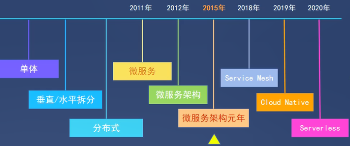
首先，我们对上图提到的部分关键词进行讲解。  

单体，是指一个进程完成全部的后端处理；水平拆分，是同一个后端多环境部署，他们都处理相同的内容，使用反向代理来均衡负载，这种也叫集群；垂直拆分，
则是把不同业务拆分为各个节点，反向代理通过路由将请求分发给每个业务节点上

分布式，就是不同的组件或者同一个组件在多个机器节点上部署，关键在于是否通过交换信息的方式进行协作，也就是说，分布式是指通过网络连接的多个组件，
通过交换信息协作而形成的系统。而集群，是指同一种组件的多个实例，形成的逻辑上的整体，它们之间不会互相通信。  
<!--more-->

## 分布式和微服务有何不同？

简单来说，微服务是很小的服务，一个服务可能负责几个功能或者一个业务，是一种面向SOA(Service Oriented Architecture)架构的，服务之间也是
通过RPC来交互或者是webservice来交互的，这个服务可以单独部署运行，每个微服务都是由独立的小团队开发，测试，部署，上线，负责它的整个生命周期

再说分布式系统，其是由一组通过网络进行通信、为了完成共同的任务而协调工作的计算机节点组成的系统分布式服务顾名思义服务是分散部署在不同的机器
上的，微服务架构是面向逻辑的架构。逻辑架构设计完后就该做物理架构设计，系统应用部署在超过一台服务器或虚拟机上，且各分开部署的部分彼此通过各
种通讯协议交互信息，就可算作分布式部署，生产环境下的微服务肯定是分布式部署的，分布式部署的应用不一定是微服务架构的，比如集群部署，它是把相
同应用复制到不同服务器上，但是逻辑功能上还是单体应用。

分布式和微服的架构很相似，只是部署的方式不一样。假设去大饭店吃饭就是一个完整的业务的话， 饭店的厨师、洗碗阿姨、服务员就是分布式，特点是各
司其职。厨师、洗碗阿姨和服务员都不止一个人，这就是集群。分布式就是微服务的一种表现形式，分布式是部署层面，微服务是设计层面。

## 为什么要分布式部署？

### 分布式部署优点
#### 高性能
分布式计算可以把大型计算分布到多台计算机上进行，它可以根据不同的任务和场景来配置不同数量的计算资源，满足所需要的快速响应时间，提供更高的性能。
#### 高可扩展性
分布式计算系统可以根据需要，增加更多的计算机来满足技术需求  
#### 高可靠性(容错性)
分布式计算因为采用很多计算机来完成计算，一台服务器的崩溃并不影响到其余的服务器，失败的任务也会被调度到其他服务器上重新执行，不影响总体任务的完成

## 分布式部署缺点
### 故障诊断和调试
而要定位具体的故障机器及原因，并进行故障调试就存在着很多的问题。引起故障的原因也是多方面的，可能是网络问题、硬件问题、权限问题、同步问题等，
要进行问题的重现和跟踪诊断远不如一台服务器或是一个集中的运行环境来得方便。
### 网络开销
经常会遇到网络基础设施的问题，如传输问题、网络拥堵、信息丢失等，需要在应用层面处理所有这些故障，造成比较大的开销
### 增加开发难度
开发过程中需要考虑到分布式可能带来的数据，安全等的问题，需要开发来解决，增加工作难度。

# 分布式系统挑战

## 挑战
分布式系统需要大量机器协作，面临诸多的挑战

### 异构的机器与网络
分布式系统中的机器，配置不一样，其上运行的服务也可能由不同的语言、架构实现，因此处理能力也不一样；节点间通过网络连接，而不同网络运营商提供
的网络的带宽、延时、丢包率又不一样。怎么保证大家齐头并进，共同完成目标，这是个不小的挑战

### 普遍的节点故障
虽然单个节点的故障概率较低，但节点数目达到一定规模，出故障的概率就变高了。分布式系统需要保证故障发生的时候，系统仍然是可用的，这就需要监控
节点的状态，在节点故障的情况下将该节点负责的计算、存储任务转移到其他节点

### 不可靠的网络
节点间通过网络通信，而网络是不可靠的。可能的网络问题包括：网络分割、延时、丢包、乱序  

相比单机过程调用，网络通信最让人头疼的是超时：节点 A 向节点 B 发出请求，在约定的时间内没有收到节点 B 的响应，那么 B 是否处理了请求，这个
是不确定的，这个不确定会带来诸多问题，最简单的，是否要重试请求，节点 B 会不会多次处理同一个请求

## 分布式系统CAP+Base
CAP原则又称CAP定理，指的是在一个分布式系统中，一致性（Consistency）、可用性（Availability）、分区容错性（Partition tolerance）  

在分布式系统的设计中，没有一种设计可以同时满足一致性，可用性，分区容错性 3个特性:
* 一致性（C）：又叫做强一致性，指的是所有节点在同一时间的数据完全一致。
* 可用性（A）：可用性指服务一直可用，而且是正常响应时间，不会出现响应错误。
* 分区容忍性（P）：分区容错性指在遇到某节点或网络分区故障的时候，仍然能够对外提供服务，保证整个系统的运行。

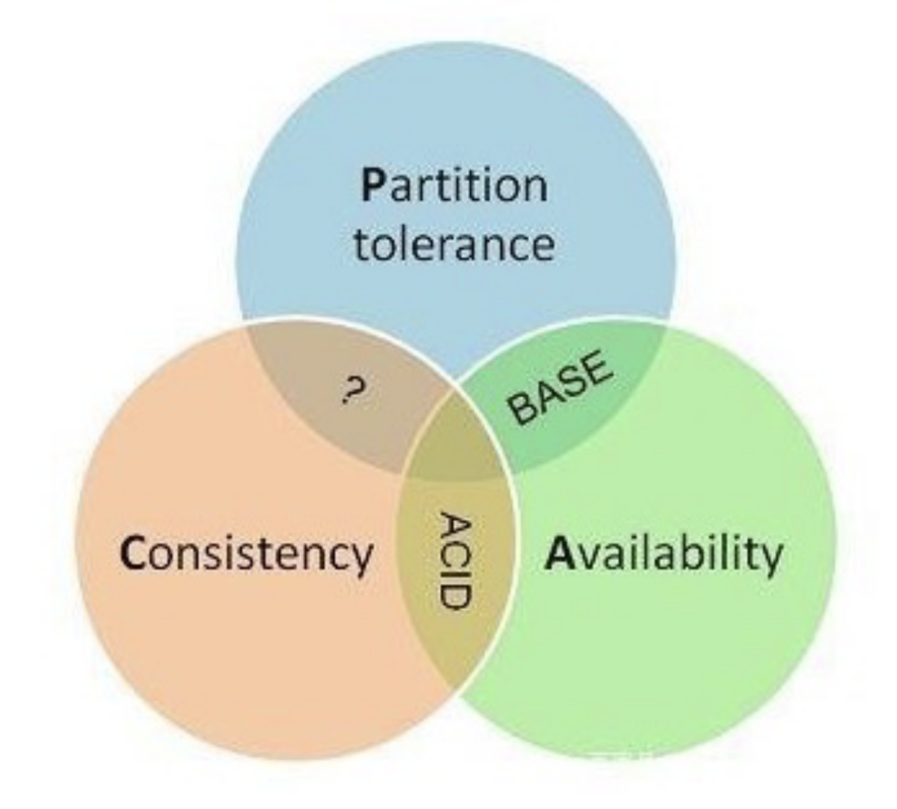

为什么在分布式系统的设计中，没有一种设计可以同时满足一致性，可用性，分区容错性 3个特性？  
1. 分布式系统中P是必须要存在的，否则其中一台机器挂掉了，整个系统都不可使用了。
2. AP: 高可用，某一时刻AB之前网络出现问题，系统依旧可以对外提供服务，数据可能会不一致。
3. CP：强一致性,如果数据没有同步，整个系统将不能够对外提供服务，牺牲系统的可用性。

### 分布式系统CP案例 (保证强一致性zookeeper)
知识点预热（ZooKeeper 集群中的角色简介）：  
* Leader：负责发起投票和决议，更新系统状态。
* Follower：用于接收客户端请求并向客户端返回结果，在选主过程 中参与投票。
* Observer：可以接收客户端连接，将写请求转发给 Leader 节点，但不会参与 Leader 发起的投票，也不会被选举为 Leader，Observer 的目的是 为了扩展系统，提高读取速度。

当Follower发现Leader节点挂了之后，Follower会拒绝现有的客户端连接，参与主从选举，在成功选举出leader之前，zk将不可用；这个时候如果ZK作为注册中心，注册中心将不可用。

### 分布式系统AP案例 (保证高可用性)
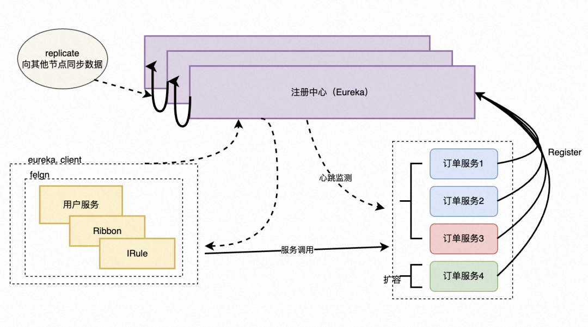

从上图中可看出，Eureka注册中心采用集群部署，满足高可用的特性，当订单服务在扩容的时候，新增订单服务实例4，数据注册到Eureka A节点，在其余的
两个节点没有订单服务4这个实例信息。这种情况下，用户服务获取服务列表，可能获取不到订单实例4，这就是最简单的数据不一致情况。但是对于Eureka集群本身，
各个节点都处于平等的地位，完全是为了冗余，这时有其中一个节点挂掉并不影响Eureka的使用，从这个角度来说保证了分布式的高可用。

### 分布式系统BASE理论
BASE 理论中的最终一致性，是指分布式系统中所有的数据副本在经过一段时间的同步后，最终都会达到一个一致的状态。也就是说，在数据副本在达到一致之前，会存在一段延迟。
* 场景一：比如我们浏览淘宝时商品的评价，当你点赞评价之后，我们刷新页面不一定能马上看到，类似于这样的场景都可以是弱一致性，只要我们最终数据达到一致就可以。
* 场景二：当我们发起请假审批时，请假系系统通过之后，考勤系统需要对我们的考勤进行计算，但在早高峰时，我们考勤打卡系统并发比较大，资源比较紧张，可能这个时候处理请假的考勤计算就会比较慢，但最终会给你计算完成。

# 实战案例

## websocket实现分布式方案
问题描述：websocket相关简介  

1. 在Spring所集成的WebSocket里面，每个ws连接都有一个对应的session，每台服务器都存有各自的session。 
2. 目前没websocket session共享的方案，因此走redis websocket session共享这条路是行不通的。  
3. 因此在集群中，我们无法将所有WebSocketSession都缓存到redis进行session共享 

业务场景：前端发起流水线执行的HTTP请求，点击执行日志与后端建立WS链接，后端能够实时的把日志主动推送到前端页面。
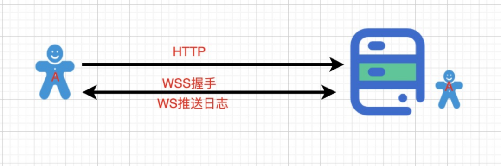
问题描述：websocket分布式会遇到的问题  
当后端服务器有多台时，用户A发起流水线执行的HTTP请求发送到B服务器，点击查看实时日志与服务器A建立WS长链接，无法接收到实时日志的推送，而B用户刷新当前流水线可以看到实时日志。

期待效果：  
用户A发起流水线执行的HTTP请求发送到B服务器。用户A、用户B点击实时日志查看，均可以查看到流水线执行的情况。  
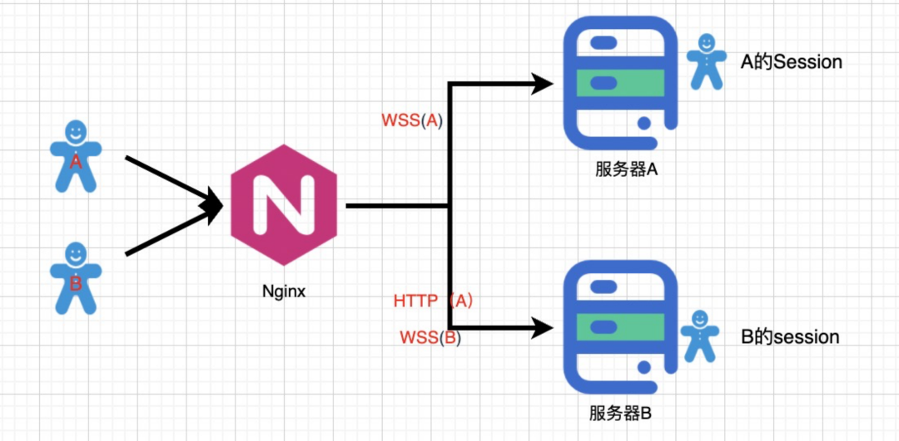

解决方案:  
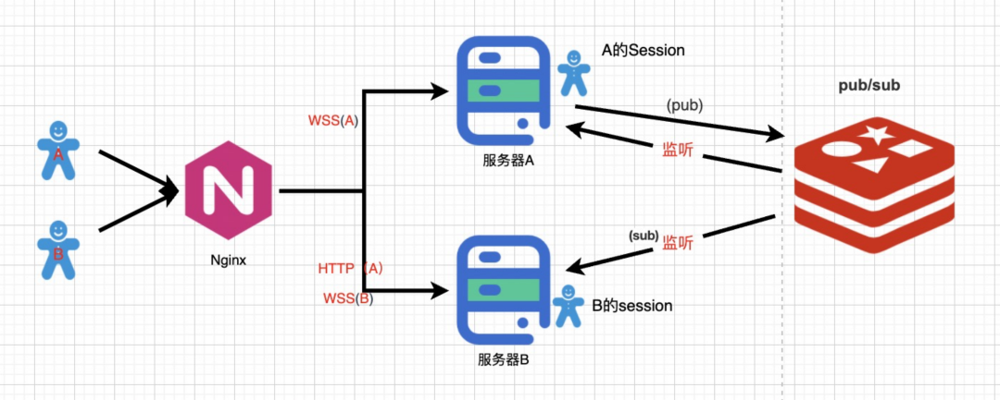
用户A发起流水线执行的HTTP请求发送到B服务器。B服务器把流水线执行日志实时推送到Redis中，服务器A和B监听订阅Redis的日志数据，一旦监听到数据，
服务器A、B通过WS长链接把日志推送给与当前服务器建立长链接的用户A、用户B。这样就起到了解耦的作用，无论用户的请求发送到哪一台服务器上，无论用
户的长链接是与哪一台服务器建立连接，都可以查看实时日志。

## 定时线程池分布式问题
问题描述 :  
在项目中我们经常会使用定时线程池来实现一个定时的异步任务，线程池的创建和销毁也是JVM层面的，如果分布式多机器部署的场景使用到定时线程池又会
遇到什么问题，又要怎么去解决？

问题一：用户在A服务器创建了一个任务加入到A服务器的线程池中，然后用户B负载到B服务器上去取消这个定时任务？无法取消？  

思考：是不是可以对创建的任务做一个Hash，有关某个任务的所有的操作都负载到同一个服务器上  

结合问题及思考进行如下改造：  
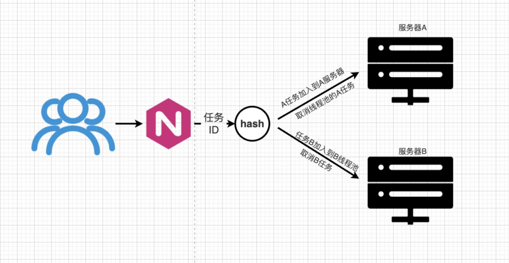

问题二：如果突然A服务器挂了，这时候A服务器上面定时线程池中所存的任务就会消失？该怎么办？  

思考：这里和上面websocket场景还不一样，上面实时查看日志，如果服务器挂掉用户刷新一下页面，用户可以重新负载到其他服务器继续查看日志。这里
我创建完成一个任务之后，就完全交给JVM线程池了，服务器挂掉之后任务用户自己创建的任务就消失了。怎么解决？

结合问题及思考进行如下改造：  
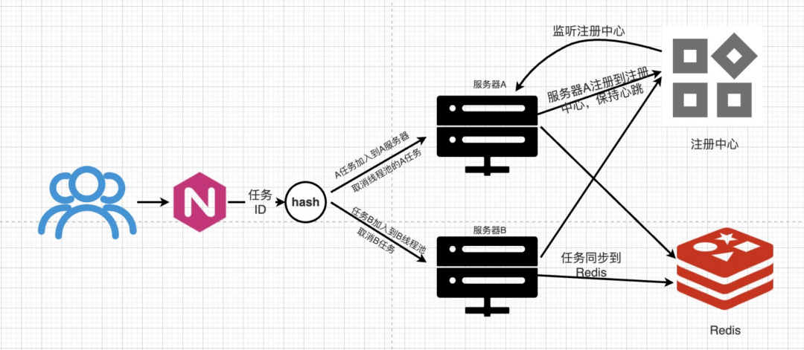

方案：我们把任务放在线程池中，并且缓存在Redis中做缓存备份，借鉴微服务注册中心的概念，我们把服务注册到注册中心，当注册中心检测到B服务器挂掉了，
就通知A服务器就把挂掉的B服务器线程池中的任务同步到A服务器中同步创建一份继续执行。 

细节考虑：如果有一台C服务器挂掉了，A和B同时监听到，会不会A和B分别在本地都创建了C的任务，那同一时刻A和B分别会执行C的任务，同一时刻任务会执行两遍？

深度思考：分布式带来了什么问题？系统的复杂度是不是大大的增加了。维护起来变得更复杂了。  

## 案例总结
* 以上的两个案例都有一个问题，就是他们的数据/或者是执行都过度依赖服务器节点，没有好的办法把数据抽离出来
* 分布式部署，需要考虑到服务器单点故障的问题，如果服务器挂了，数据怎么转移到其他的服务器继续执行。  
* 结合我们的CAP+Base的理论来看，websocket是属于数据不一致的问题。我们引入redis的发布订阅使每个服务器的数据最终达成一致。
* 定时线程池属于高可用的问题，当一个节点挂了，其他服务器的节点无法感知。我们引入服务注册的概念，由注册节点来对任务进行调度。  

# 分布式常见方案
## 分布式事物
本地事物的ACID：  
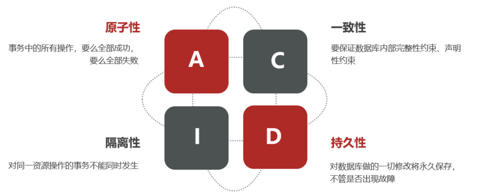
分布式事务，就是指不是在单个服务或单个数据库架构下，产生的事务，例如：在数据库水平拆分、服务垂直拆分之后，一个业务操作通常要跨多个数据库、
服务才能完成。例如电商行业中比较常见的下单付款案例，包括下面几个行为：
1. 创建新订单
2. 扣减商品库存
3. 从用户账户余额扣除金额

完成上面的操作需要访问三个不同的微服务和三个不同的数据库。订单的创建、库存的扣减、账户扣款在每一个服务和数据库内是一个本地事务，可以保证ACID原则。
但是当我们把三件事情看做一个"业务"，要满足保证“业务”的原子性，要么所有操作全部成功，要么全部失败，不允许出现部分成功部分失败的现象，这就是分布式系统下的事务。
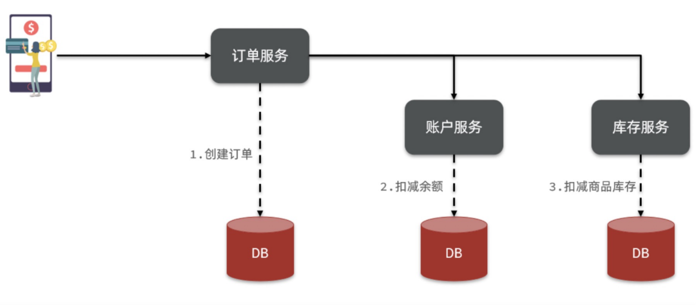

### 分布式事物解决方案 Seata
Seata事务管理中有三个重要的角色：  
* TC (Transaction Coordinator) - **事务协调者：**维护全局和分支事务的状态，协调全局事务提交或回滚。
* TM (Transaction Manager) - **事务管理器：**定义全局事务的范围、开始全局事务、提交或回滚全局事务。
* RM (Resource Manager) - **资源管理器：**管理分支事务处理的资源，与TC交谈以注册分支事务和报告分支事务的状态，并驱动分支事务提交或回滚。
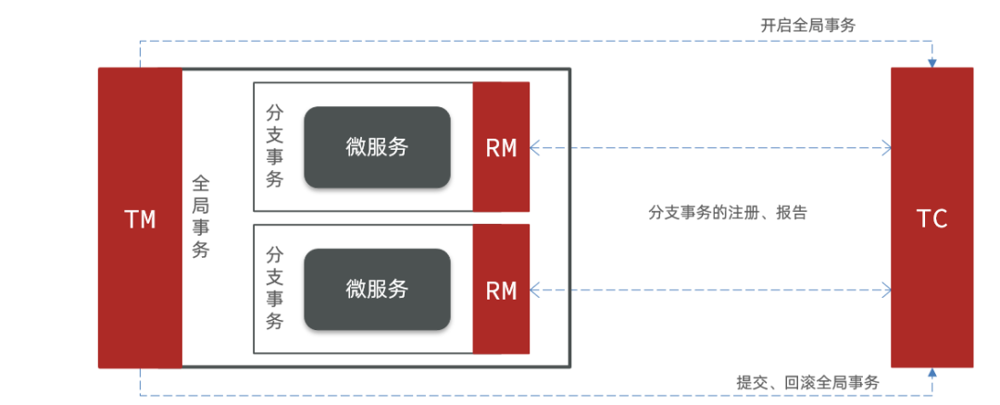

## 分布式锁
什么情况下需要使用锁？  
1. 有并发，多线程（这里指的是资源的使用者多，多个任务想同时使用一个资源才有竞争的可能）
2. 有写操作（如果是多个任务都是读请求的话，不同任务来读取的结果都是一样的，也就没有必要去控制谁先读谁后读）
3. 有竞争关系（这里指的是对资源的访问方式是互斥的，我们这个资源虽然是共享的，同但一时刻只能有一个任务占用它不能同时共用，这个时候我们需要给它上锁）

### 分布式锁解决方案：Redis

### 基于数据库实现的分布式锁。
实现逻辑：在数据库中创建一个表，表中包含方法名、类名等字段，并在方法名字段上创建唯一索引，当执行某个方法时，就使用这个方法名向表中插入数据，
插入成功就相当于获取了锁，执行完成后删除对应的行数据释放锁。

但是要注意以下几点要求：  
* 数据库的可用性和性能将直接影响分布式锁的可用性及性能。
* 锁的可重入性。同一个线程在释放锁之前，数据会一直存在，无法再次成功插入，需要在表中新增一列，用于记录当前获取到锁的服务节点和线程信息，再 次获取锁的时候，先查询数据库表中服务节点和线程信息是否和当前服务节点和线程信息相同，若相同则直接获取锁。
* 锁的阻塞性。当获取不到锁，需要循环多次去获取。并设置一个超时时间，如果超过这个时间还没有获取到锁，则返回失败。

### 基于redis实现的分布式锁 
实现逻辑：获取锁的时候，使用setnx加锁，并使用expire命令为锁添加一个超时时间，超过该时间则自动释放锁，锁的value值为一个随机生成的UUID，
通过此在释放锁的时候进行判断。获取锁的时候还设置一个获取的超时时间，若超过这个时间则放弃获取锁  

#### Redission基于redis实现的分布式锁RedLock。
Redission是基于redis实现的用于解决分布式问题的框架，其中RedLock是用来解决分布式锁的常见方案。使用也比较简单。  

### 基于ETCD 事务操作实现分布式锁
TODO..

## 分布式ID
是分布式系统下的 ID。例如：单机 MySQL 需要进行分库分表。在分库之后， 数据遍布在不同服务器上的数据库，数据库的自增主键已经没办法满
足生成的主键唯一了。分布式ID就是为不同的数据节点生成全局唯一主键ID  

分布式 ID 需要满足哪些要求?  
* 全局唯一 ：ID 的全局唯一性肯定是首先要满足的！
* 高性能 ：分布式 ID 的生成速度要快，对本地资源消耗要小。
* 高可用 ：生成分布式 ID 的服务要保证可用性无限接近于 100%。
* 方便易用 ：拿来即用，使用方便，快速接入
 
分布式 ID 常见的方案
### Redis的Incr
NoSQL 方案使用 Redis 多一些。我们通过 Redis 的 incr 命令即可实现对 id 原子顺序递增。  
* 优点：性能不错并且生成的 ID 是有序递增的。
* 缺点：存在数据库单点问题（可以使用数据库集群解决，不过增加了复杂度）。

### UUID
UUID 可以保证唯一性，因为其生成规则包括 MAC 地址、时间戳、名字空间（Namespace）、随机或伪随机数、时序等元素，计算机基于这些规则生成的 UUID 是肯定不会重复的。

* 优点：生成速度比较快、简单易用
* 缺点：比如使用 UUID 作为 MySQL 数据库主键的时候就非常不合适：数据库主键要尽量越短越好，而 UUID 的消耗的存储空间比较大（32 个字符串，128 位）。 UUID 是无顺序的，InnoDB 引擎下，数据库主键的无序性会严重影响数据库性能。（UUID当机器时间不对的情况下，可能导致会产生重复 ID）

### 雪花算法
Snowflake 是 Twitter 开源的分布式 ID 生成算法。Snowflake 由 64 bit 的二进制数字组成，这 64bit 的二进制被分成了几部分，每一部分存储的数据都有特定的含义:
* 第 0 位：符号位（标识正负），始终为 0，没有用，不用管。
* 第 1~41 位 ：一共 41 位，用来表示时间戳，单位是毫秒，可以支撑 2 ^41 毫秒（约 69 年）
* 第 42~52 位 ：一共 10 位，一般来说，前 5 位表示机房 ID，后 5 位表示机器 ID（实际项目中可以根据实际情况调整）。这样就可以区分不同集群/机房的节点。
* 第 53~64 位 ：一共 12 位，用来表示序列号。序列号为自增值，代表单台机器每毫秒能够产生的最大 ID 数(2^12 = 4096),也就是说单台机器每毫秒最多可以生成 4096 个 唯一 ID。
* 优点 ：生成速度比较快、生成的 ID 有序递增、比较灵活（可以对 Snowflake 算法进行简单的改造比如加入业务 ID）
* 缺点 ：需要解决重复 ID 问题（依赖时间，当机器时间不对的情况下，可能导致会产生重复 ID）

## 分布式调度

分布式调度定义（分布式任务调度有两层含义）： 
* 运行在分布式集群环境下的调度任务（同一个定时任务部署多分，只应该有一个定时任务在执行）  
* 分布式调度–> 定时任务的分布式 --> 定时任务的拆分 （把一个大的作业任务拆分为多个小的作业）

### Elastic-Job
Elastic_Job 是当当网开源的一个分布式调度解决方案，基于 Quartz 二次开发的，功能非常丰富强大，采用 zookeeper 实现分布式调度，实现任务分片以及高可用。
目前由两个相互独立的子项目 Elatstic-Job-Lite 和 Elastic-Job-Cloud 组成。目前说的是 Elastic-Job-Lite 的轻量级解决方案，使用 jar 的形式提供分布式任务的调度服务，而 Elastic-Job-Cloud 是结合 Mesos 以及 Docker 在云环境下使用。

### XXL-JOB
XXL-JOB是一个轻量级分布式任务调度平台，有以下特性：  
* 简单：支持通过Web页面对任务进行CRUD操作，操作简单，一分钟上手；
* 动态：支持动态修改任务状态、启动/停止任务，以及终止运行中任务，即时生效
* 注册中心: 执行器会周期性自动注册任务, 调度中心将会自动发现注册的任务并触发执行，每30秒清理一次注册表中的无效机器。同时，也支持手动录入执行器地址；
* 失败处理策略：每10秒检测失败任务，报警和重试；
* 一致性：“调度中心”通过DB锁保证集群分布式调度的一致性, 一次任务调度只会触发一次执行
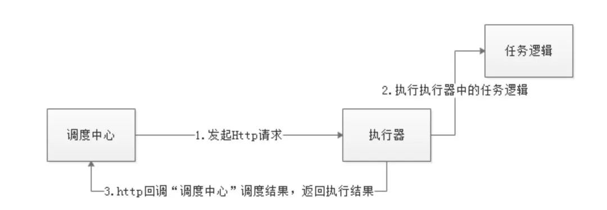  

# 转载
[谐云课堂 | 一文详解分布式改造理论与实战](https://www.toutiao.com/article/7156486159370158628/?app=news_article&timestamp=1668158533&use_new_style=1&req_id=202211111722130101330280501311EB97&group_id=7156486159370158628&wxshare_count=1&tt_from=weixin&utm_source=weixin&utm_medium=toutiao_android&utm_campaign=client_share&share_token=ef9f327c-0cd6-4bd0-a13f-906654210231&source=m_redirect&wid=1668158574046)