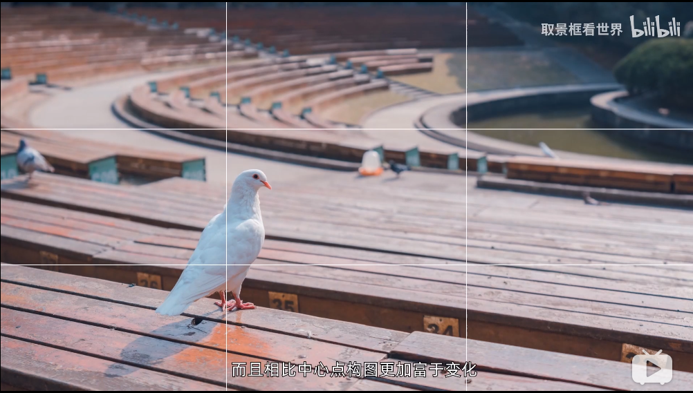
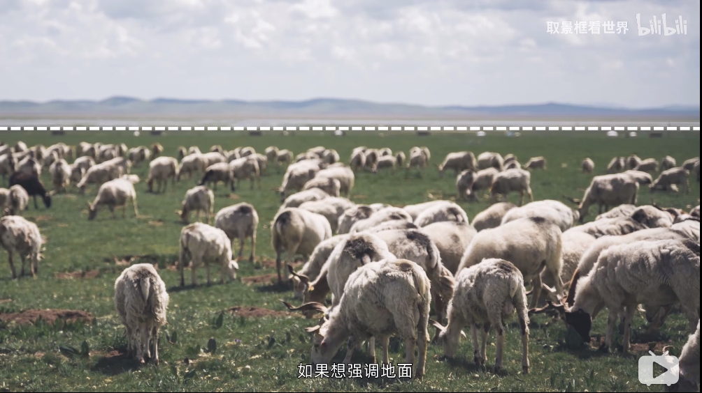
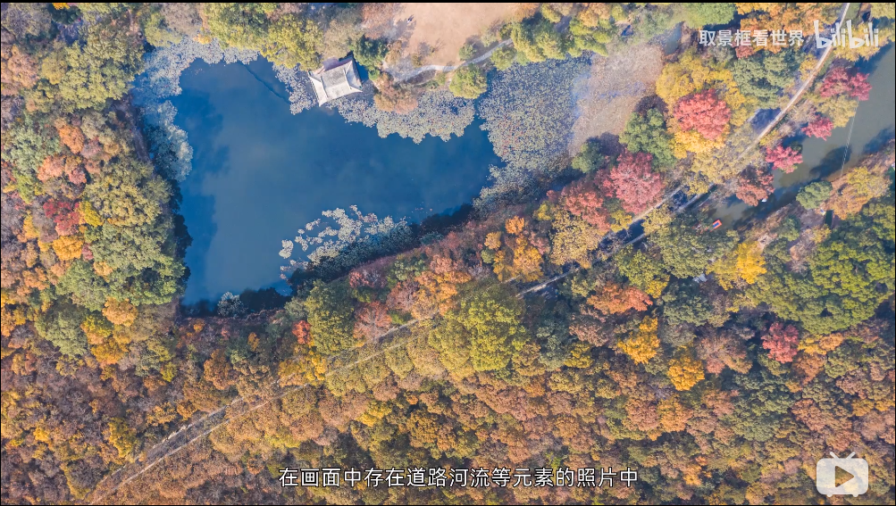
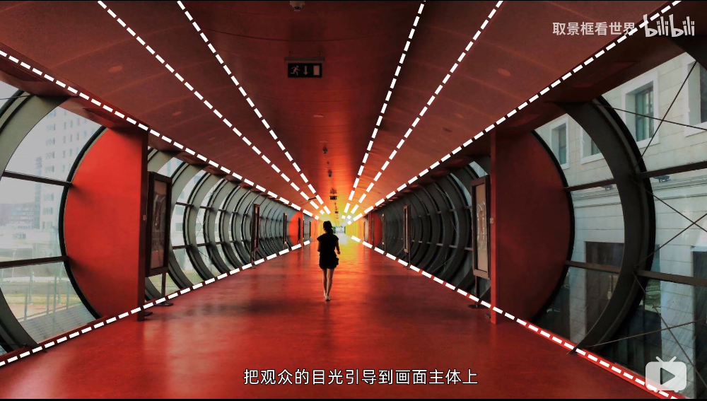
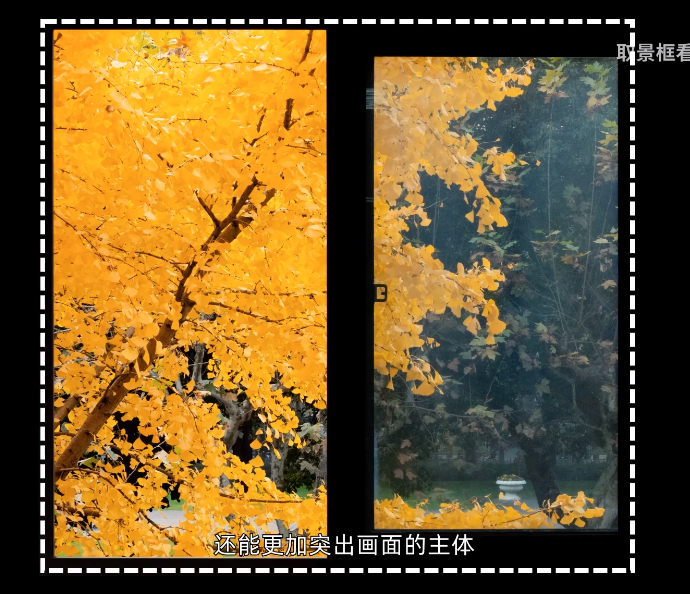

# 点构图
## 中心点构图
画面主体放在中心点

## 三分点构图
画面主体放在三分点  
注意事项：有时会让画面不平衡，可以平衡画面

# 线构图
## 对称线构图
沿画面的水平或垂直居中线构图  
常用于对称的物体，水面，对称建筑等

## 三分线构图
画面的水平或垂直元素，安排在三分线上  
注意事项：水平三分线构图要留意强调的部分，垂直三分线构图拍摄人像注意人物朝向

## 对角线构图
利用照片对角线进行构图  
注意事项：建议把画面主体聚焦在三分点上

## 曲线构图
利用自然存在的曲线或者人为制造的曲线进行构图

## 引导线构图
利用画面中的线条，把观众的目光引导到画面主体上  
注意事项：引导到的主体建议处于画面中心点或者三分点

  
## 黄金分割构图

# 面构图
## 前景构图
在画面中加入前景  
注意事项：前景和画面主题有一定联系

## 框架构图
把例如门、窗等框架作为了一种前景

## 填充构图
让画面主体尽量填充满整个画面
## 留白构图
在画面中尽可能留白，做画面减法
## 重复构图
当画面中有比较多重复元素时，把画面中的元素进行重复排列
注意事项：重复构图中的元素排列最好基于某一种排列逻辑
## 对比构图
在重复的元素中运用某一种方式（颜色、动静、光影等）突出其中的某一个元素