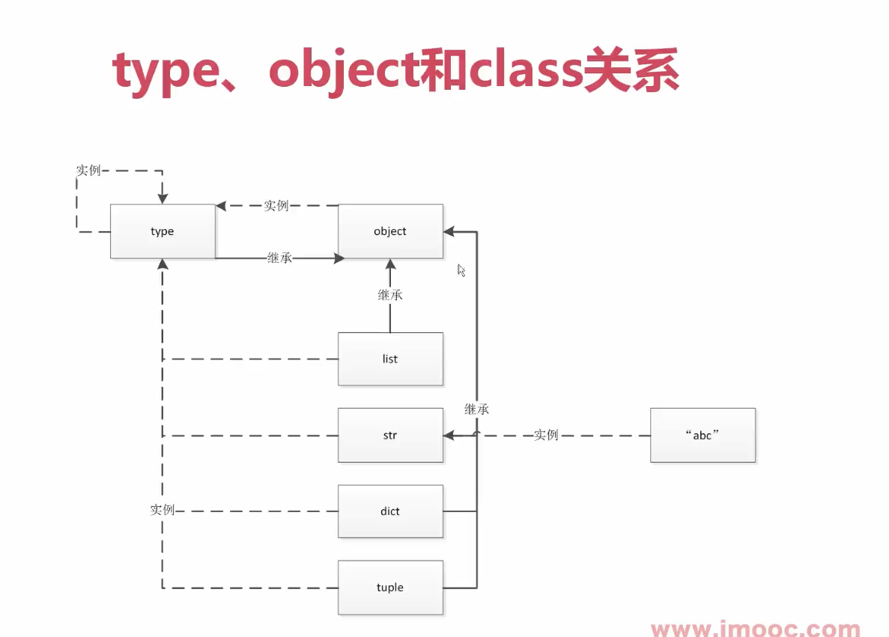
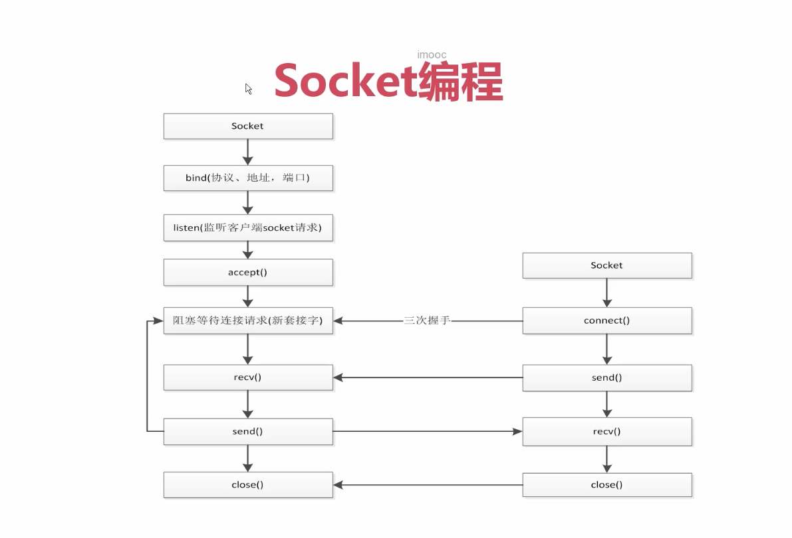

# python一切皆对象

## python一切皆对象
python的面向对象更加彻底  
函数和类也是对象，属于python的一等公民

## type,object和class的关系
1. type->class->obj
2. object是顶层基类
3. type的基类也是object



## python常见内置类型
对象的三个特征：身份（内存地址），类型，值  

* None 全局只有一个
* 数值 int,float,complex,bool
* 迭代类型
* 序列类型：list,bytes(bytearray,memoryview),range,tuple,str,array
* 映射 dict
* 集合 set,frozenset
* 上下文管理类型 with
* 其它
    * 模块类型
    * class和实例
    * 函数类型
    * 方法类型
    * 代码类型
    * object对象
    * type类型
    * ellipsis类型（省略号）
    * notimplemented类型


# 魔法函数
## 什么是魔法函数
魔法函数用于扩展类的特性  

## 魔法函数一览
### 非数学运算
* 字符串表示 __repr__,__str__
* 集合序列相关 __len__,__getitem__,__setitem__,__delitem__,__contains__  
* 迭代相关 __iter__,__next__
* 可调用 __call__
* with上下文管理器  __enter__,__exit__
* 数值转换 __abs__,__bool__,__int__,__float__,__hash__,__index__
* 元类相关 __new__,__init__
* 属性相关 __getattr__,__setattr__,__getattribute__,__setattribute__,__dir__
* 属性描述符 __get__,__set__,__delete__
* 协程 __await__,__aiter__,__anext__,__aenter__,__aexit__

### 数学运算
。。。


# 深入python类和对象
## 鸭子类型和多态
一个东西，看起来像鸭子，比如会游泳，那就可以这个东西认为是鸭子。  
python 本身是属于动态语言，一个变量可以存储不同的类型，即一个变量的类型只有在执行到当前位置的时候才能知道他的类型。  

## 抽象基类
抽象基类的两个作用：  
1. 使用isinstance进行判定
2. 强制限制子类实现某些方法   

抽象基类在python中主要不是用来集成的，我们在使用的时候可以使用python的鸭子类型来替换抽象基类的使用场景。  

相关模块：abc

## isinstance和type的区别  
* isinstance 用于判定类型，包括继承关系
* type 用于判定类型，不包括继承关系

关键词 is 和 ==的区别， is 用于取类型的id（python中，每个对象都有对应的id，class这些类型属于全局对象,只有一个id）, == 用于判定值是否相等  

> 注意使用isinstance 判定类型，而不是type

## 类变量和实例变量  
实例共享类变量

## 类属性和实例属性以及查找顺序
C3算法  
* 非菱形继承，深度优先
* 菱形继承，广度优先

通过 类.__mro__ 可以查询查找中顺序

> python2中如果类不显示继承object，那么就不会继承，而python3中会默认的继承object, 分别叫做经典类和新式类


## 静态方法，类方法，实例方法
* staticmethod 静态方法，无需类参数
* classmethod 类方法，第一个参数是类
* 实例方法的第一个参数是实例


## 数据封装和私有属性
私有属性通过__开头   
python中没有绝对的私有属性，可以通过类似以下的方式访问到私有属性  
```python
class User:
    def __init__(self):
        self.__a=1

user=User()
print(user._User__a)
```

## python对象的自省机制  
自省是通过一定的机制查询到对象的内部结构  
* __dict__ 以k,v的方式展示对象的属性以及属性值,不包括方法
* dir 函数返回对象的所有属性，包含方法。

## super函数
super函数用于调用父类的函数  
super函数的调用顺序为当前类的__mro__顺序   

## django rest framework 中多继承的使用经验  

### mixin 模式
1. mixin类功能单一
2. 不和基类关联，可以和任意组合关联
3. 在mixin中不要使用super这种用法

## python with语句

## contextlib简化上下文管理器
```python
import contextlib

@contextlib.contextmanager
def file_open(name):
  print("a")
  yield 
  print("b")

with file_open("") as f:
  print("c")
```

# 自定义序列类
## python中的序列类型
### 是否能够存储不同数据类型
* 容器序列：list,tuple,deque
* 扁平序列：str,bytes,bytearray,array.array

### 序列是否可变
* 可变序列：list,deque,bytearray,array
* 不可变序列：str,tuple,bytes

## 序列的abc继承关系
abc模块定义了可变序列以及不可变序列的协议（类必须实现的方法）

## 序列的+，+=和extend的区别
* + 号的两边都必须是list
* extend 接受一个迭代类型，将其一一放入列表中
* += 本质上是嗲用extend 

> append 是加入一个元素到到列表，和extend不同


## 可切片的对象

## bisect维护已排序序列
用于向列表插入数据，并且维护列表的顺序性

## 什么时候我们不应该使用列表
* array和list的区别，array只能存储指定类型的值
* dqueue

## 列表推导式，生成器表达式，字典推导式
### 列表推导式
```python
# 提取1-20之间的奇数
odd_list=[i for i in range(21) if i%2==1]

# 复杂情况
def handle_item(item):
    return item*item

odd_list=[handle_item(i) for i in range(21) if i%2==1]
```
逻辑简单可以用列表生产式，如果逻辑过于复杂不建议用列表生成式  

### 生成器表达式
```python
odd_gen=(i for i in range(21) if i%2==1)
odd_list=list(odd_gen)

```

### 字典推导式
```python
# 字典推导式
my_dict={"a":1,"b":2,"c":3}
reversed_dict={value:key for key,value in my_dict.items()}
```

### 集合推导式
```python
my_dict={"a":1,"b":2,"c":3}
my_set={key for key,value in my_dict.items()}
```


# 深入python的set和dict
## dict 常用方法
* dict.copy 浅拷贝，copy.deepcopy 深拷贝
* dict.fromkeys 将可迭代的对象转换成dict
* dict.get 可以避免KeyError错误
* dict.item 返回，key,value 用于迭代中
* dict.setdefault 获取值，如果不存在则会设置
* dict.update 接受可迭代对象

## dict 子类
* collections.UserDict
* collections.defaultdict

## set和frozenset
set 集合，frozenset 不可变集合    
不重复，无序  
### set
* set.update 合并两个
* set.difference 求差集
* ｜ & -  集合运算
* set 用C语言实现，性能很高，hash实现，查找元素时间复杂度为O(1)
* set.issubset 判定是否为另外一个set的子集
### frozenset 
其不可变性，可以作为dict的key  


## dict和set的实现原理


# 对象引用，可变性和垃圾回收
## python中的变量是什么？
python的变量实质上是一个指针 int str,便利贴

## ==和is 的区别
* == 是用于判定值是否等
* is 判定是否为同一个对象

## del和垃圾回收
cpython中的垃圾回收算法是 引用计数

## 一个经典的错误
* list,dict 为引用类型，作为参数传递时，函数内部对变量的操作，会影响外部
* 当list作为 class的参数时，所有class对于list的默认值会使用同一个list，位于 $class.__init__.__defaults__ 下


# 元类编程
## property 动态属性
* @property 标明动态属性
* @age.setter 设置动态属性

## __getattr__,__getattribute__ 魔法函数
*  __getattr__ 查找不到属性的时候的钩子函数
* __getattribute__  属性存不存在，都会执行这个钩子函数，很少使用。

## 属性描述符和属性的查找过程
* 属性描述符可以限制属性的类型，但感觉在py中没有必要，使用属性描述符的场景不如换强类型语言
* 属性描述符在框架的ORM，Model的位置用的比较多。

## __new__,__init__的区别
* __new__ 是用来控制对象的生成过程
* __init__ 是用来完善对象的，是对象生成之后

子类对象__new__ 中需要 return super().__new__(cls) 否则不会调用__init__   
__init__ 中的参数需要和初始化对象时的参数一致，否则会报错。


## 自定义元类
元类是可以动态创建类的类  
type-> class(对象) -> 对象    

MetaClass元类，本质也是一个类，但和普通类的用法不同，它可以对类内部的定义（包括类属性和类方法）进行动态的修改。可以这么说，使用元类的主要目的就是为了实现在创建类时，能够动态地改变类中定义的属性或者方法。
如果想把一个类设计成 MetaClass 元类，其必须符合以下条件：  
1. 必须显式继承自 type 类；
2. 类中需要定义并实现 __new__() 方法，该方法一定要返回该类的一个实例对象，因为在使用元类创建类时，该 __new__() 方法会自动被执行，用来修改新建的类。

```python
#定义一个元类
class FirstMetaClass(type):
    # cls代表动态修改的类
    # name代表动态修改的类名
    # bases代表被动态修改的类的所有父类
    # attr代表被动态修改的类的所有属性、方法组成的字典
    def __new__(cls, name, bases, attrs):
        # 动态为该类添加一个name属性
        attrs['name'] = "C语言中文网"
        attrs['say'] = lambda self: print("调用 say() 实例方法")
        return super().__new__(cls,name,bases,attrs)
```

元类相比类继承的方式，侧重于类的创建过程，类的创建有如下方式：  
1. type函数
2. class 关键字
3. meteclass 元类

# python中的迭代协议
## python中的迭代器和迭代协议
迭代是一种重复访问集合元素的方式，而迭代器和迭代协议是实现这一功能的核心机制。   
迭代器是一个可以记住遍历的位置的对象，而迭代协议则是一种约定，规定了迭代器应该如何工作。  


## 迭代器（Iterator）
迭代器是一个实现了迭代器协议的对象，它必须包含__iter__()和__next__()这两个方法。其中，__iter__()方法返回迭代器对象本身，如果类定义了__iter__()，那么它的实例对象就是一个迭代器；__next__()方法返回容器的下一个值，如果容器中没有更多元素了，那么抛出StopIteration异常。

## 可迭代对象（Iterable）
实现了__iter__方法，能够循环取值的对象即为可迭代对象，与迭代器的区别是，迭代器会存储当前迭代的位置，可迭代对象不会，例如 list   
当一个对象很大的时候,所占用的内存需要1G,那要对这个对象进行迭代，不能吧1G的数据直接载入内存中，而是通过迭代器的方式去访问数据  

## iter 函数
iter函数，会尝试将一个对象转化为一个迭代器。如果对象实现了__iter__函数，会有限调用这个，如果不存在，就是尝试调用__getitem__函数，来完成迭代器的创建


## 生成器
生成器函数，函数里只要有yield关键字  
具有yield关键字的函数，返回的是genreate对象   

## 生成器的原理
python的函数栈桢对象是分配在堆内存中的，即不会自动释放内存
每次遇到yield 函数就会停止执行，下一次执行的时候，在停止的地方继续执行  
生成器可以被next函数调用  

## 生成器在UserList中的应用

## 生成器如何读取大文件
```python
def read_big_file(f,splitStr):
    buf=""
    while True:
        while splitStr in buf:
            pos= buf.index(splitStr)
            yield buf[:pos]
            buf=buf[pos+len(splitStr):]
        chunk=f.read(2)

        if not chunk:
            #已经读到了最后
            yield buf
            break
        buf+=chunk


if __name__=="__main__":
    with open('bigfile.txt') as f:
        for chunk in read_big_file(f,","):
            print(chunk)
```


# python socket编程
## HTTP,Socket,TCP 
* HTTP 应用层协议基于TCP
* TCP 传输层协议
* Socket 建立连接的工具

## socket编程中 client与server实现通信



## socket实现聊天和多用户连接

## socket发送http请求


# 多线程，多进程和线程池编程
## python GIL锁 
gil global interpreter lock (cpython)  
python中一个线程对应c语言中的一个线程   
gil 使得同一个时刻只有一个线程在一个cpu上执行字节码，无法将多线程映射到多个cpu上，无法利用多核

### 什么时候 GIL锁会释放
* 根据执行的字节码行数以及时间片到了
* 遇到有io操作

## 多线程编程-threading
多线程编程的几种方式
### import threading
对于io操作来说，多线程和多进程性能差别不大    
* thread.setDaemon 守护线程，设置守护线程后，主线程不会等待线程，直接会退出
* thread.join 等待线程执行完成后，才会继续往下执行

### 通过集成Thread来实现多线程

## 线程间通信
### 共享变量
共享变量通信的方式，是非线程安全的，需要加锁
### Queue
线程间通信推荐方式，类比 golang中的 channel     
golang 中推行的Communicating Sequential Processes（CSP）模型，并发编程的推荐通信方式（1978年推出）  
CSP模型的核心是“不要通过共享内存来通信，而是通过通信来共享内存”  


## 线程同步
### Lock 
互斥锁，golang中为Mutex  
锁带来的问题：  
1. 用锁会影响性能
2. 可能有死锁问题，死锁问题在golang编译过程中会报错
```
# 相互等待，导致的死锁
A acquire(a), acquire(b)
B acquire(b), acquire(a)

# 重复调用导致的锁
A acquire(a), acquire(a)

# A调用B
A acquire(a)
B acquire(a)
```
### RLock
为解决 A调用B,或重复调用导致的锁问题 ,设计出可重入的锁  RLock   
在相同的线程中，可以连续多次调用acquire, acquire的次数要和release的次数相同 （内部应该有一个计数器，以及线程ID）  
golang中没有可重入的锁，原因应该是和GMP模型有关，golang中的协程与线程是M:N的关系，

### Condition 
条件变量，复杂的线程同步  
在调用with cond之后才能调用wait或notify 方法  
condition有两层锁，一把底层RLock锁，在线程调用了wait方法的时候释放   
每次调用wait时会分配一把锁放入到cond的等待队列中，等待notify方法的唤醒  

### Semaphore
用于控制并发数量  
基于Condition


## ThreadPoolExector 线程池
concurrent  
频繁的创建以及销毁线程，会消耗资源，所以需要线程池    
主线程中可以获取某一个线程的状态或者某一个任务的状态，以及返回值  

### Futuer
未来对象，task的容器   
Futuer里面包含了workItem,workItem是线程执行的单元，执行结果会保存到futuer容器中  
ThreadPoolExector 会根据实例化时的线程数量，拉起线程，执行workItem  


## 多进程和多线程对比
python多线程编程由于GIL锁的存在，无法使用多核cpu，所以对于耗cpu的程序来说，使用python，需要使用多进程，才能提高程序性能  

concurrent.futures 提供了多进程与多线程统一抽象


### multiprocessing 多进程编程

### 进程间的通信-Queue,Pipe,Manager
1. 多进程的Queue和线程的Queue不是同一个
2. 共享全局变量不适用多进程
3. multiprocessing中的Queue,不能用于进程池
4. multiprocessing.pool 中的进程间通信需要使用manager中的Queue,manager需要实例化
5. python中有3个Queue,threading.Queue,multiprocessing.Queue,multiprocessing.manager.Queue
6. pipe只能适用于两个进程间通信,pipe性能高于queue

### 进程间共享变量
通过multiprocessing.manager.dict实现  

