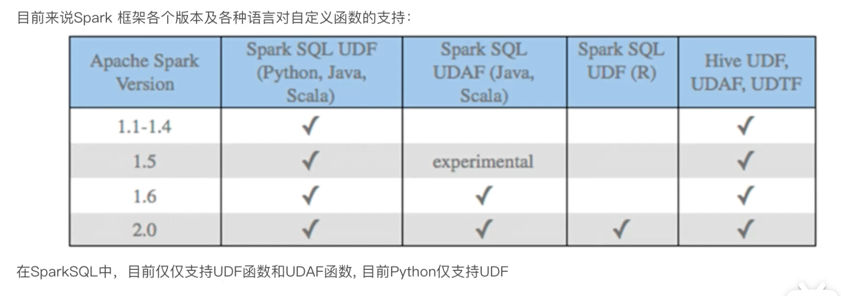
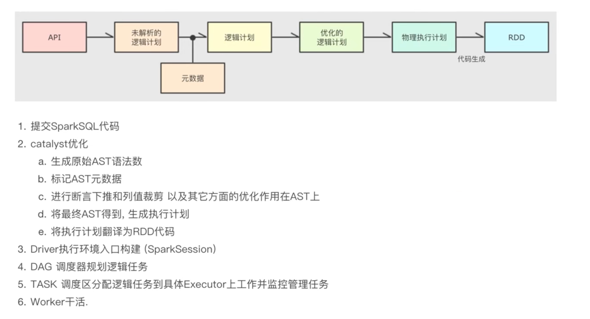

# 基础
## Spark解决的问题
基于内存式的计算的分布式计算引擎。 
海量数据的计算，可以进行离线以及流处理    
主要用来做离线数仓。 


## Spark模块
* SparkCore
* SparkSQL  集成Hive实现数据分析。
* SparkStreaming 流计算
* Graphx 图计算
* MLlib 机器学习

## Spark 特点
速度快，使用简单，通用性强，多种运行模式  
由Scala 实现。  
Scala是基于java语言写的，底层也需要虚拟机

## spark运行模式
### 本地模式 
一个独立的进程，通过内部多线程来模拟整个spark运行时环境 一般用于测试

### 集群模式
Standalone(集群)    
Spark自带的分布式资源平台，功能类似于yarn。Spark中的各个角色以独立进程的形式存在，并组成Spark集群环境

Hadoop YARN(集群)   
Spark各个角色运行在YARN容器内部，组成Spark集群环境 工作中主要使用的模式。

Spark是一个分布式计算引擎，所以它的部署是分布式的，有主节点，从节点这些。  

### K8s模式 
各个角色运行在k8s容器中，组成spark集群环境

云服务模式

## spark架构
* Master,管理整个集群资源
* Worker,管理单个服务器的资源
* Driver,管理单个Spark在运行的时候的工作
* Executor,工作者

## Python on Spark 执行原理
PySpark宗旨在不破坏已有的运行架构，在Spark架构外层包装一层Python API,借助Py4j实现Python和java交互，进而实现Python编写Spark应用程序，其
运行时架构如下：  


Python On Spark Driver端由JVM执行，Executor端由JVM命令转发，底层由Python解释器进行工作。  


## 分布式代码执行的流程
代码在集群上运行，是被分布式执行的。    
在Spark中，非任务处理部分由Driver执行（非RDD代码）。  
任务处理部分由Executor执行（RDD代码）  
Executor的数量可以很多，所以任务的计算是分布式运行的。  


# spark使用遇到的问题问题
## java账号
oracle_test@fexbox.org Java001@@@

## py4j.protocol.Py4JError: org.apache.spark.api.python.PythonUtils.isEncryptionEnabled does not exist in the JVM
pyspark版本高了当前是3.0.3 降级为2.3.2 

## java.net.BindException: Can't assign requested address: Service 'sparkDriver' failed after 16 retries
切换vpn后报错。 vim /opt/spark/conf/spark-env.sh
```
export SPARK_LOCAL_IP="127.0.0.1"
```

## py4j.Py4JException: Constructor org.apache.spark.api.python.PythonRDD([class org.apache.spark.rdd.MapPartitionsRDD, class org.apache.spark.api.python.PythonFunction, class java.lang.Boolean]) does not exist
pyspark版本与spark版本不匹配。  spark版本为2.4.4， pyspark版本为2.3.2 ，解决方案安装与spark匹配到pypark模块。 
```
pip install pyspark==2.4.4
```


# SparkSQL 基础入门
SparkSQL 非常成熟的海量结构化数据处理框架。应用场景包括：
* 离线开发
* 数仓搭建
* 科学计算
* 数据分析

什么是spark sql?   
sparkSQL 是Spark的一个模块，用于处理海量的结构化数据。  


Spark SQL 特点  
1. 融合性 SQL可以无缝集成在代码中，随时用SQL处理数据
2. 统一数据访问，一套标准API可以读写不同数据源。
3. Hive兼容，可以使用SparkSQL 直接计算并生成Hive数据表
4. 标准化链接，支持标准JDBC/ODBC连接，方便和各种数据库进行交互


# Spark SQL 概述
## Spark SQL 和Hive的异同。  


## SparkSQL 数据抽象


## SparkSession对象
在RDD阶段，程序的执行入口对象是：SparkContext   
在Spark2.0后，推出了SparkSession对象，作为Spark编程的统一入口对象。 
Spark对象可以：  
1. 用于SparkSQL编程作为入口对象
2. 用于SparkCore编程，可以通过SparkSession对象中获取到SparkContext  


# DataFrame入门
## DataFrame组成 
DataFrame是一个二维表结构    
结构层面：   
1. StructType对象描述整个DataFrame的表结构
2. StructField对象描述一个列的信息

数据层面：   
1. Row对象记录一行数据
2. Column对象记录一列数据并包含列信息   


## DataFrame 构建
### 将RDD对象转换为DataFrame
```
# coding=utf-8
from pyspark.sql import SparkSession


if __name__ == "__main__":
    spark = SparkSession.builder.appName("create_dataframe").getOrCreate()

    #基于RDD转换为DataFrame
    sc=spark.sparkContext
    rdd=sc.textFile("../data/people.csv").map(lambda line: line.split(",")).map(lambda x: (x[0], x[1]))

    #创建DataFrame
    df=spark.createDataFrame(rdd,schema=["name","age"])
    df.printSchema()


    df.show()

    #注册为临时表可供sql查询
    df.createOrReplaceTempView("people")

    spark.sql("select * from people where age='20'").show()
```

### 通过定义StructType对象定义DataFrame的“表定义”转换
```
# coding=utf-8
from pyspark.sql import SparkSession
from pyspark.sql.types import StructType, StructField, StringType, IntegerType

if __name__ == "__main__":
    spark = SparkSession.builder.appName("create_dataframe").getOrCreate()

    #基于RDD转换为DataFrame
    sc=spark.sparkContext
    rdd=sc.textFile("../data/people.csv").map(lambda line: line.split(",")).map(lambda x: (x[0], int(x[1])))

    #创建DataFrame
    scheme=StructType().add('name', StringType(),nullable=True).add('age', IntegerType(),nullable=False)
    df=spark.createDataFrame(rdd, scheme)

    df.printSchema()
    df.show()

    # 注册为临时表可供sql查询
    df.createOrReplaceTempView("people")

    spark.sql("select * from people where age='20'").show()
```

### 通过RDD对象的toDF方法转换
```
# coding=utf-8
from pyspark.sql import SparkSession

if __name__ == "__main__":
    spark = SparkSession.builder.appName("create_dataframe").getOrCreate()

    #基于RDD转换为DataFrame
    sc=spark.sparkContext
    rdd=sc.textFile("../data/people.csv").map(lambda line: line.split(",")).map(lambda x: (x[0], int(x[1])))


    df=rdd.toDF(["name","age"])

    df.printSchema()
    df.show()

    # 注册为临时表可供sql查询
    df.createOrReplaceTempView("people")

    spark.sql("select * from people where age='20'").show()
```


## SQL风格API
### 注册DataFrame成为表
1. df.createTempView("score")  注册一个临时表
2. df.createOrReplaceTempView("score") 注册一个临时表，如果存在进行替换
3. df.createGlobalTempView("score") 注册一个全局表

全局表：跨SparkSession对象使用，在一个程序内的多个SparkSession均可调用，查询需要带上前缀 global_temp.  
临时表：只能当钱的SparkSession用   


# 电影评分数据分析案例
1. agg GroupedData对象的API，在里面可以写多个集合
2. alias 它是Column对象的API，可以针对一个列进行改名
3. withColumnRenamed DataFrameAPI,可以对DF的列进行改名，一次改一个列，支持链式调用
4. orderBy DataFrame的API，排序
5. first DataFrame的API，取出DF的第一行数据，返回值结果是Row对象
6. Row对象，一个数组，可以通过row['列名'] 取出当前行中某一列的具体数值

# SparkSQL Shuffle 分区数目
spark.sql.shuffle.partitions 参数指的是，在sql计算中，shuffle算子阶段默认的分区数是200   
对于集群模式来说，200一般是合适的 ，一般和整个集群的cpu核心数匹配。 
如果在local模式下运行，200个很多，会带来额外的系统调度消耗，所以在local模式下建议修改比较低，比如2/4/10等。 
这个参数和Spark RDD 中设置的并行度参数是相互独立的，互不影响。  


# SparkSQL 数据清洗API
* dropDuplicates 数据去重
* dropna 缺失值丢弃
* fillna 缺失值补充

# DataFrame 数据写出
SparkSQL 统一API写出DataFrame数据。  
df.write.mode().format().option(K,V).save(PATH)    
* mode 传入模式可选，append/overwrite/ignore/error(重复就报异常,默认)
* format 传入数据格式，text/csv/json/parquet/orc/avro/jdbc, text只支持单列数据导出
* option 设置属性
* save 写出的路径，支持本地文件和HDFS


# DataFrame通过JDBC读写数据库
读取JDBC是需要有驱动的，如果读取的是jdbc:mysql::// 这个协议，也就是读取mysql数据，就需要有mysql的驱动jar包给spark程序用。 
如果不给jar包，会提示：No suitable Driver   

如何让spark找到驱动： 
1. jar包的位置需要放到pypark包的jar目录下，才能给spark找到 路径： 虚拟环境/lib/python2.7/site-packages/pyspark/jars   
2. spark 配置文件 cat /opt/spark/conf/spark-defaults.conf   
```
spark.jars /pitrix/data/warehouse/package/postgresql-42.2.5.jar
spark.driver.extraClassPath /pitrix/data/warehouse/package/postgresql-42.2.5.jar
```


# SparkSQL定义UDF函数
1. UDF(User-Defined-Function) 函数，一对一的关系，输入一个值经过函数后输出一个值
2. UDAF(User-Defined-Aggregation-Function)聚合函数，多对一关系，输入多个值，输出一个值，通用与groupBy联合使用
3. UDTF(User-Defined Table-Generating Functions)函数，一对多关系，输入一个值输出多个值（一行变多行），有点像flatMap



定义方式有两种： 
1. sparksession.udf.register() 注册的UDF可以用于DSL和SQL。  
2. pyspark.sql.functions.udf 仅能用于DSL风格。 

```python 
# -*- coding: utf-8 -*-

from pyspark.sql import SparkSession
from pyspark.sql import functions as F
from pyspark.sql.types import StructType, StringType, IntegerType

if __name__ == "__main__":
    spark = SparkSession.builder.appName("test").config("spark.sql.shuffle.partitions",2).getOrCreate()
    sc = spark.sparkContext


    #构建一个RDD
    rdd=sc.parallelize([1,2,3,4,5]).map(lambda x: [x])
    df=rdd.toDF(["num"])

    def num_ride_10(num):
        return num * 10

    # 通过方式1注册
    # 参数1:注册UDF的名称，这个udf名称，仅可用于SQL风格
    # 参数2:UDF处理逻辑，是一个单独的方法
    # 参数3:声明UDF的返回值，UDF注册的时候，必须声明返回值，并且UDF函数的返回值需要和声明的返回值类型一致
    # 返回值对象：这是一个UDF对象，仅可用于DSL语法
    udf2=spark.udf.register("num_ride_10", num_ride_10,IntegerType())

    # SQL风格使用
    # selectExpr 以select表达式执行，表达式SQL风格的表达式
    # selectExpr 接受普通的字符串字段名，或者返回值是Column对象的计算
    df.selectExpr("num_ride_10(num)").show()

    # DSL风格
    # 返回值是UDF对象，如果作为方法使用，传入的参数一定是Column对象
    df.select(udf2(df['num'])).show()


    # 方式二注册
    udf3=F.udf(num_ride_10,IntegerType())
    df.select(udf3(df['num'])).show()

```


# SparkSQL使用窗口函数
开窗函数的引入是为了显示聚集前的数据，有显示聚集后的数据，即在每一行的最后一列添加聚合的结果。
* AVG
* RANK
* DENSE_RANK
* ROW_NUMBER
* NTILE


# Catalyst优化器
RDD执行流程：代码-> DAG调度器逻辑任务-> Task调度器任务分配和管理监控 -> Worker干活。
* 断言下推，将Filter这种可以减少数据集的操作下推，放在Scan的位置，这样可以减少操作的数据量
* 列值裁剪，在断言下推后执行裁剪，指读取需要的列，减少数据量，对于列式存储例如parquet 非常合适

# SparkSQL执行流程



