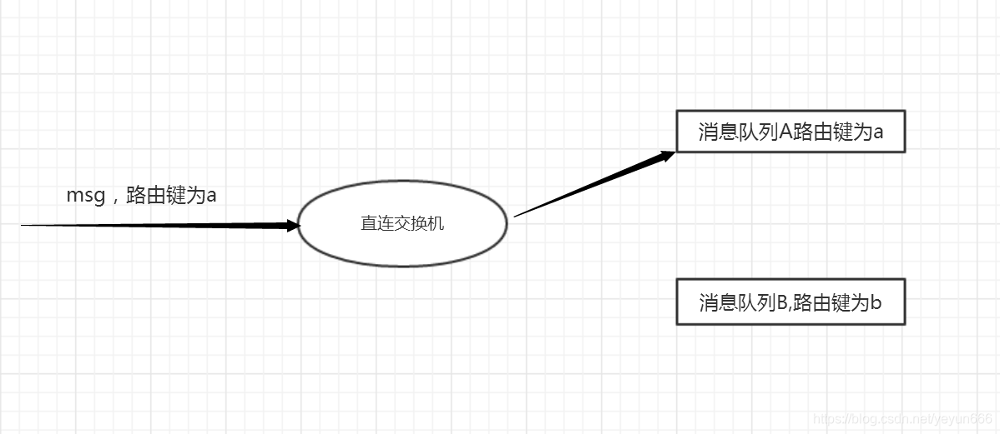
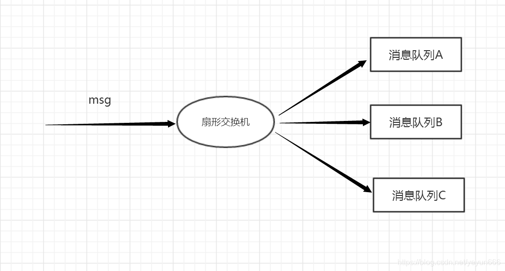

---
categories:

- mq tags:
- rabbitmq
- 消息队列

---

# 什么叫消息队列

消息（Message）是指在应用间传送的数据。消息可以非常简单，比如只包含文本字符串，也可以更复杂，可能包含嵌入对象。

消息队列（Message Queue）是一种应用间的通信方式，消息发送后可以立即返回，由消息系统来确保消息的可靠传递。消息发布者只管把消息发布到 MQ 中而不用管谁来取，消息使用者只管从 MQ
中取消息而不管是谁发布的。这样发布者和使用者都不用知道对方的存在

<!--more-->

# 为何用消息队列

## 异步处理

用户注册后，需要发注册邮件和注册短信。传统的做法有两种：串行的方式和并行方式。

## 应用解耦

以常见的订单系统为例，用户点击【下单】按钮之后的业务逻辑可能包括：扣减库存、生成相应单据、发红包、发短信通知。
在业务发展初期这些逻辑可能放在一起同步执行，随着业务的发展订单量增长，需要提升系统服务的性能，这时可以将一些不需要立即生效的操作拆分出来异步执行， 比如发放红包、发短信通知等。这种场景下就可以用 MQ
，在下单的主流程（比如扣减库存、生成相应单据）完成之后发送一条消息到 MQ 让主流程快速完结， 而由另外的单独线程拉取MQ的消息（或者由 MQ 推送消息），当发现 MQ 中有发红包或发短信之类的消息时，执行相应的业务逻辑。

## 流量削锋

流量削锋也是消息队列中的常用场景，一般在秒杀或团抢活动中使用广泛！  
秒杀活动，一般会因为流量过大，导致流量暴增，应用挂掉。为解决这个问题，一般需要在应用前端加入消息队列。

## 日志处理

日志处理是指将消息队列用在日志处理中，比如Kafka的应用，解决大量日志传输的问题。

## 消息通讯

消息通讯是指，消息队列一般都内置了高效的通信机制，因此也可以用在纯的消息通讯。比如实现点对点消息队列，或者聊天室等。

# RabbitMQ 特点

RabbitMQ 是一个由 Erlang 语言开发的 AMQP 的开源实现。

AMQP ：Advanced Message Queue，高级消息队列协议。它是应用层协议的一个开放标准，为面向消息的中间件设计，基于此协议的客户端与消息中间件可传递消息，并不受产品、开发语言等条件的限制。

RabbitMQ 最初起源于金融系统，用于在分布式系统中存储转发消息，在易用性、扩展性、高可用性等方面表现不俗。具体特点包括：

* 可靠性 RabbitMQ 使用一些机制来保证可靠性，如持久化、传输确认、发布确认。
* 灵活的路由（Flexible Routing）在消息进入队列之前，通过 Exchange 来路由消息的。
* 消息集群 多个 RabbitMQ 服务器可以组成一个集群，形成一个逻辑 Broker 。
* 高可用 队列可以在集群中的机器上进行镜像，使得在部分节点出问题的情况下队列仍然可用。
* 多种协议 RabbitMQ 支持多种消息队列协议，比如 STOMP、MQTT 等等。
* 多语言客户端 RabbitMQ 几乎支持所有常用语言
* 管理界面 RabbitMQ 提供了一个易用的用户界面，使得用户可以监控和管理消息 Broker 的许多方面。
* 跟踪机制 如果消息异常，RabbitMQ 提供了消息跟踪机制，使用者可以找出发生了什么。
* 插件机制 RabbitMQ 提供了许多插件，来从多方面进行扩展，也可以编写自己的插件。

# RabbitMQ 核心概念

主要有10个核心概念

## Message

消息，消息是不具名的，它由消息头和消息体组成。消息体是不透明的，而消息头则由一系列的可选属性组成，
这些属性包括routing-key（路由键）、priority（相对于其他消息的优先权）、delivery-mode（指出该消息可能需要持久性存储）等。

## Publisher

消息的生产者，也是一个向交换器发布消息的客户端应用程序。

## Exchange

交换器，用来接收生产者发送的消息并将这些消息路由给服务器中的队列。

RabbitMQ的交换机类型共有四种，是根据其路由过程的不同而划分成的

分别是Direct Exchange（直连交换机）， Fanout Exchange（扇型交换机）， Topic Exchange（主题交换机）与 Headers Exchange（头交换机）

### Direct Exchange

直连交换机  

> 如果消息队列C的路由绑定键为a ,那么消息也会被分发到队列C上

### Fanout Exchange

扇型交换机  

> 这个模式类似于广播,路由键失效。

### Topic Exchange

主题交换机

主题交换机是一种发布/订阅的模式，结合了直连交换机与扇形交换机的特点，消息队列与主题交换机的绑定也是通过路由键的。
当一个Msg和路由键规则发送到一个主题交换机T时，T会根据路由键规则来筛选出符合规则的绑定到自身消息队列的路由键（可能是1个，也可能是N个，也可能是0个），
根据符合的路由键，将消息发送到其对应的消息队列里。这个模式类似于多播，当消息的路由规则只匹配到一个路由键时，此时主题交换机可以看作是直连交换机， 当路由规则匹配了主题交换机上所有绑定的队列的路由键时，此时主题交换机可以看作是扇形交换机

### Headers Exchange

头交换机  

头交换机类似与主题交换机，但是却和主题交换机有着很大的不同。主题交换机使用路由键来进行消息的路由，而头交换机使用消息属性来进行消息的分发，
通过判断消息头的值能否与指定的绑定相匹配来确立路由规则。在头交换机里有一个特别的参数”x-match”，当”x-match”的值为“any”时，只需要消息头的任意一个值匹配成功即可，
当”x-match”值为“all”时，要求消息头的所有值都需相等才可匹配成功。虽然至今没有遇到过头交换机，但是还是建议各位同学去了解一下。

## Binding

绑定，用于消息队列和交换器之间的关联。一个绑定就是基于路由键将交换器和消息队列连接起来的路由规则，所以可以将交换器理解成一个由绑定构成的路由表。

## Queue

消息队列，用来保存消息直到发送给消费者。它是消息的容器，也是消息的终点。一个消息可投入一个或多个队列。消息一直在队列里面，等待消费者连接到这个队列将其取走。

## Connection

网络连接，比如一个TCP连接。一个Connection 大概可以容纳2048个

> 官方提供的golang版本的客户端包中未实现连接池，推荐做法是一个Connection 多个channel。一个消费者一个channel，对channel进行连接池缓存。

## Channel

信道，多路复用连接中的一条独立的双向数据流通道。信道是建立在真实的TCP连接内地虚拟连接，AMQP 命令都是通过信道发出去的，不管是发布消息、 订阅队列还是接收消息，这些动作都是通过信道完成。因为对于操作系统来说建立和销毁 TCP
都是非常昂贵的开销，所以引入了信道的概念，以复用一条 TCP 连接。

## Consumer

消息的消费者，表示一个从消息队列中取得消息的客户端应用程序。

## Virtual Host

虚拟主机，表示一批交换器、消息队列和相关对象。虚拟主机是共享相同的身份认证和加密环境的独立服务器域。每个 vhost 本质上就是一个 mini 版的 RabbitMQ 服务器，拥有自己的队列、交换器、绑定和权限机制。vhost 是 AMQP
概念的基础，必须在连接时指定，RabbitMQ 默认的 vhost 是 / 。

## Broker

表示消息队列服务器实体。

# 消息分发模式 轮询分发和公平分发

## 轮询分发

一个消费者一条，按均分配  
rabbitmq 默认采用轮询分发。

## 公平分发

根据消费者的消费能力进行公平分发，处理快的处理的多，处理慢的处理的少；按劳分配

使用公平分发需要满足两个条件:

1. 关闭消费者自动应答，改为手动应答
2. 在channel上设置Qos(服务质量), Qos代表允许一个消费者有多少uack的消息数量

# 队列类型

根据实际应用场景和交换机模式，官方总结出6种队列

## 简单队列

不用指定交换机和路由键 , 会使用默认的交换机，路由键会取队列名称

## 工作队列

使用默认交换机，多个消费者绑定一个队列

## 发布订阅

利用Fanout Exchange 实现 ,此时路由键会失效

## 路由

利用Direct Exchange实现，路由键完全匹配

## 主题

利用Topic Exchange实现，路由键模糊匹配

## RPC

利用Headers Exchange实现,支持同步调用

# 常见问题

## rabbitmq如何保证消息不丢失

1. 生产者确认
2. 持久化
3. 手动ACK

### 生产者确认

默认情况下生产者发送消息并不会返回任何状态信息，也就是它并不知道消息有没有正确地到达服务器。   
针对这个问题，RabbitMQ提供了两种解决方案：

1. 事务机制
2. 通过发送方确认机制（publisher confirm）

#### 事务机制

1. channel.txSelect：用于将当前的channel设置成事务模式;
2. channel.txCommit：用于提交事务;
3. channel.txRollback：用于回滚事务.

事务机制是阻塞形式的，一条消息发送之后会使消息端阻塞，以等待RabbitMQ的回应，才能发送下一个消息。 使用事务机制会影响RabbitMQ的性能，因此还是推荐使用发送方确认机制。

#### 发送方确认机制

指生产者将channel设置成confirm模式，所有在该信道上发布的消息都会被指派一个唯一ID(从1开始)，一旦消息被投递到RabbitMQ服务器之后，
RabbitMQ就会发送一个包含了消息唯一ID的确认（Basic.Ack）给生产者，使生产者知道消息已经正确到达了目的地。

如果RabbitMQ因为内部错误导致消息丢失，就会发送一条nack(Basic.Nack)命令，生产者可以在回调方法中处理该nack命令。

发送方确认机制是异步的，一旦发布一条消息，生产者可以在等待信道返回的同时发送下一条消息，当消息确认时，可以在回调方法中处理该确认消息。因此，总体效率会更好。

当然confirm机制也可以分为：普通confirm，批量confirm，异步confirm。  
普通confirm可事务机制差不多，就是发送一条，就调用waitForConfirms确认一次；批量confirm就是发送多条后，再调用waitForConfirms确认一次；
异步confirm就是注册两个回调分别处理Ack和NAck确认。 事务机制和生产者确认机制是互斥的，不能共存！  
发送成功的含义是消息能到达RabbitMQ交换机，并且能有匹配的队列接收。  
总体效率上，异步confirm会更好。

### 持久化

1. 交换机持久化
2. 队列持久化
3. 消息持久化

### 手动ack
消费者关闭自动ack ,对消息消费进行手动确认

