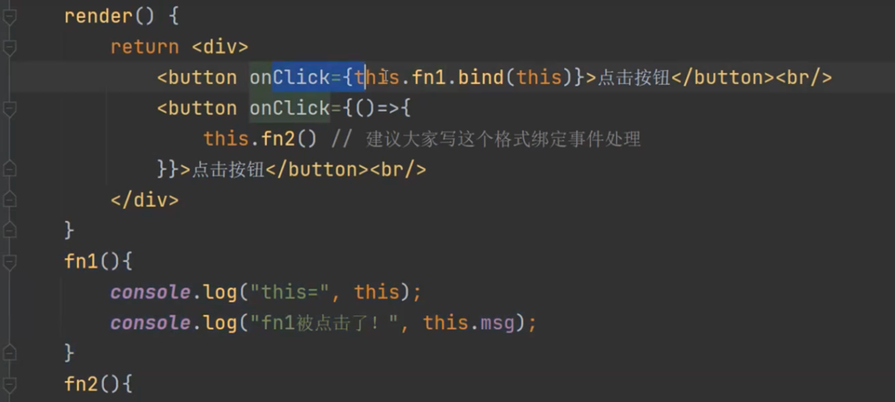
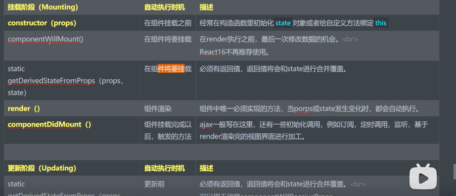

# 前端工程化
模块化：指将一个文件拆分成多个相互依赖的文件，最后进行统一的打包和加载，这样能够很好的保证高效的多人协作。模块化是对文件、对代码和资源拆分。  
组件化：在功能实现的设计层面上，按功能或业务来把UI界面进行拆分一个个包含模板（HTML）+样式（CSS）+逻辑（JS）的功能完备的结构单元。   
规范化：是指在项目开发初期以及开发期间制定的一系列规范，包括文件目录规范，命名规范，代码规范等等。   
自动化：是指代利用自动化工具来完成项目开发过程中的重复性，机械化，简单性的工作。   

# react
React是一个用于构建UI（User Interface，用户界面）的JavaSgript库，也是目前全世界最流行的web前端框架之一，由Facebook在2013年5月开源的前端项目，
因为Facebook对市场上所有Javascript MVC框架都不满意，所以就自己写了一个前端框架用来架设Instagram网站。


React官方并不认可MVC开发模式，所以React不是一个完整的MVC前端框架，只能说是一个轻量级的视图框架（MVC中的View）。
具有如下特点：
1. 声明式设计
React为应用的每一个状态设计简洁的视图，当数据改变时 React 能有效地更新并正确地渲染组件。
2. 高效
React采用Virtual DOM（虚拟DOM），极大的提升了UI渲染（更新）效率。
3.灵活
React 允许你结合其他框架或库一起使用，而且有大量的开发者围绕着React去开发各种各样的工具库。
4. JSX
JSX是React框架基于JavaScript的语法扩展，可以很好地描述 UI 应该呈现出它应有交互的本质形式。
5.组件
通过 React 构建组件，使得代码更加容易得到复用，能够很好的应用在大项目的开发中。
6. 单向响应的数据流
React 采用了单向响应的数据流，使组件状态更容易维护，组件模块化更易于快速开发。

## 关键包
1. react核心包
2. react-dom web开发使用
3. react-native app开发使用

## JSX
JSX （JavaScript Xml）是React框架基于JavaScript+XML实现的语法扩展，类似模板语言，但具有 JavaScript 的全部功能。  
JSX提供了在 JavaScript 代码中写 XML（HTML）代码的功能，让项目中的用户界面代码变得更加直观、结构清晰，从而提升开发效率，所以React推荐开发者使用JSX来声明描述用户界面。  
JSX本质上就是ReactcreateElement（componentprops,children）函数的语法糖，使用babel编译后，JSX会变成虚拟DOM对象。 

需要使用Babel转码器，将JSX代码转换成js代码


<!--more-->


# 脚手架
create-react-app  vite    
yarn、npm就是包管理器，还可以项目进行构建管理。   
React官方为了方便咱们学习React推出了一个脚手架create-react-app（100M），而vite则是另一个前端框架vue的作者尤雨溪发的脚手架vite。    
create-react-app搭建的React项目，默认入口是 public/index.htrl，脚本文件的扩展名是js。   
vite搭建的React，默认入口是 index.html，脚本文件的扩展名是jsx。  

## 安装vite
1. 通过nvm安装指定版本nodejs
```shell
brew install nvm 
nvm install v22.12
nvm use v22.12
```
2. 安装yarn
```
npm install -g yarn
```
3. 安装vite
```
yarn create vite
```

4. 设置yarn代理
```
yarn config set npmRegistryServer https://registry.npmmirror.com
```
5. 进入项目目录下执行 yarn命令会拉取依赖，生成node_modules

6. 终端启动项目 yarn dev

## 开发
pycharm/vscode 快速生成snip代码的快捷键： 
1. rcc 快速生成类组件
2. rsf 快速生成函数组件
3. rsc 快速生成匿名工具函数


## 使用bootstrap4
```
npm install bootstrap@4
```


# 组件化
一般我们会把被导入的小功能组件叫子组件，同理，导入其他组件的当前组件，叫父组件。属于嵌套关系的两个组件之间的关系，就是父子组件。当然，如果两个组件被同一个父组件所调用，则这两个组件则为兄弟组件，属于并列关系。

# 事件处理
React的主要功能是渲染视图，而视图操作中事件的绑定与处理，肯定是必不可少的

绑定事件：


# React三大特性
* ref 用于绑定dom元素，获取里面的值，比如input框
* state 用于渲染页面，React 并不是双向绑定（mmvc）,而是单向绑定 
* props 实现组件接收外部参数的传递

## props
在前面我们已经学习了组件嵌套，所以组件会因为实现业务或者功能的需求，会现嵌套或者并列的情况，甚至有时候会因为多个组件负责的业务是相关联的，此时就需要在多个
组件之间进行数据的传递了。React组件提供了props属性，专门用来实现组件接受外部参数的传递。props是只读的，所以只能获取外部传的数据，但不能修改该数据。
同时Reacf还提供了props数据类型和必要性的约束（React15版本以后，需要单独安装'yarn add prop-types').
* 父组件向子组件传递数据
* 子组件向父组件传递数据？父组件给子组件传递函数的方式实现
* 父组件可以通过ref操作子组件的数据（不推荐）


prop-types可以实现props的类型约束以及属性默认值，需要单独安装
```
yarn add prop-types
```

## jsx语法
1. 使用map 渲染列表
2. 使用短路特性实现判断


# React的受控组件和非受控组件
React中的组件根据是否受外界数据的控制可分为受控组件和非受控组件    
多使用受控组件，少使用非受控组件   

尽量避免子组件中拥有自己的state，尽量通过父组件的props来控制    


# 非父子组件之间的通信-状态提升，发布订阅，Context

状态提升 适合兄弟之间的传参


# React插槽
通过 this.props.children 可以提取父组件传递进来的插槽内容    


# React生命周期



# axios
是实现前后端交互（ajax），发送http请求的一个开源模块,安装
```
yarn add axios@next
npm i axios@next
```

代码片段：   
```
axios.get(url).then(response=>{})
```

可以将mock数据放到public目录下去


# Router
React Router库包含三个不同的npm包
* react-router 核心组件
* react-router-dom 应用于浏览器端的路由库（单独使用包含了react-router的核心部分）
* react-router-native 应用于native端的路由

```
yarn add react-router-dom@next
```

主要钩子函数：
* useRoutes 定义路由
* NavLink/Link 跳转
* useNavigate 函数跳转
* useParams 获取url参数
* useSearchParams 获取url ? 后的参数

## 嵌套路由
定义chrilden,结合Outlet组件使用


# Redux
通用全局状态管理器 

安装
```
yarn add redux
yarn add react-redux
```


# 参考
* https://www.bilibili.com/video/BV1fpANeVEnS/?spm_id_from=333.337.search-card.all.click&vd_source=826416428f883a4b1c119869d5a0983b