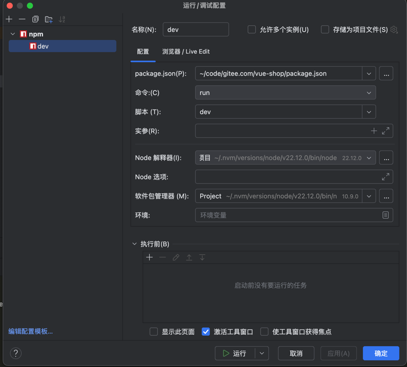

# 安装


## 安装nodejs环境
1. 通过nvm安装指定版本nodejs
```shell
brew install nvm 
nvm install v22.12
nvm use v22.12
```
2. 安装yarn
```
npm install -g yarn
```

3. 设置yarn代理
```
yarn config set npmRegistryServer https://registry.npmmirror.com
```

## 通过vite创建项目
```
yarn create vite
```

创建项目后，拉取依赖
```
yarn
```
webstorm 配置运行参数



## 通过yarn安装其它依赖
### 安装bootstrap4 
```
yarn add bootstrap@4
yarn add -D sass-embedded # 添加sass支持
```


### 安装vue路由   
```
yarn add vue-router@4
yarn add -D @types/node # 解决路径别名类型问题
```
在 tsconfig.json 中添加:
```
{
  "compilerOptions": {
    "baseUrl": ".",
    "paths": {
      "@/*": ["src/*"]
    },
    "types": [
      "vite/client",
      "vue-router"
    ]
  },
  "include": [
    "src/**/*.ts",
    "src/**/*.d.ts",
    "src/**/*.vue"
  ]
}


```

配置路径别名
```
import { defineConfig } from 'vite'
import vue from '@vitejs/plugin-vue'
import path from 'path' // 确保已安装 @types/node

export default defineConfig({
  plugins: [vue()],
  resolve: {
    alias: {
      '@': path.resolve(__dirname, './src'),
    }
  }
})

```

## 安装axios 发送ajax
```
yarn add axios
```

## 安装事件总线 mitt 用于组件之间的通信
```
yarn add mitt
```